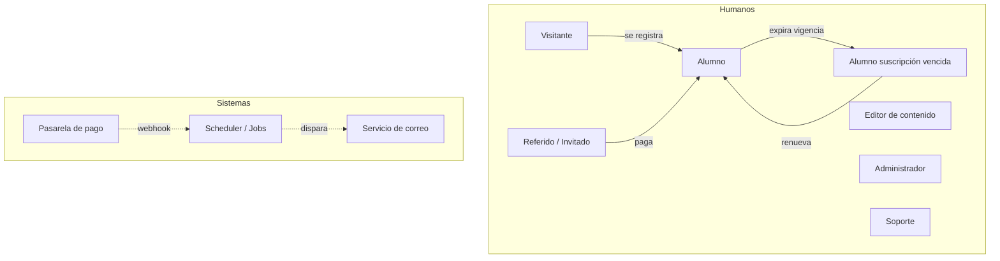
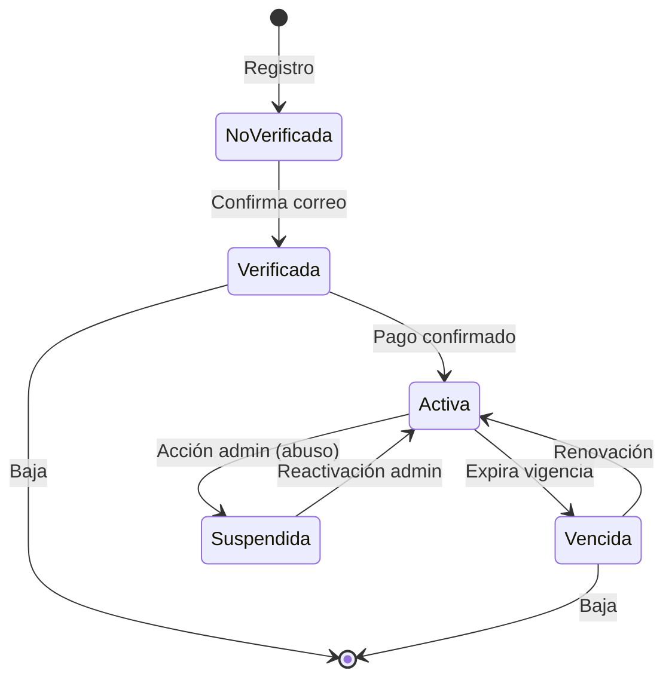

# 03 — Actores, Roles y Permisos

Define quién interactúa con Alexandrya y qué puede hacer. Es la base del control de acceso (RBAC) y de la sección de actores de cada caso de uso.

---

## 1. Mapa de actores

---

## 2. Catálogo de actores

| Actor | Tipo | Autenticado | Descripción |
|-------|------|:-----------:|-------------|
| **Visitante** | Humano | No | Navega la landing pública. No tiene cuenta. |
| **Referido / Invitado** | Humano | No | Visitante que llega con un código de referido. Se convierte en Alumno al registrarse y pagar. |
| **Alumno** | Humano | Sí | Usuario con cuenta y **suscripción activa**. Consume contenido y se evalúa. |
| **Alumno con suscripción vencida** | Humano | Sí | Cuenta válida sin acceso al contenido; solo puede renovar y ver su perfil. |
| **Editor de contenido** | Humano | Sí (panel) | Gestiona el catálogo: materias, módulos, temas, preguntas, carga masiva. Sin acceso a pagos ni usuarios. |
| **Administrador** | Humano | Sí (panel) | Control total: usuarios, contenido, pagos, suscripciones, referidos, reportes, configuración. |
| **Soporte** | Humano | Sí (panel) | Rol acotado de atención: consulta usuarios y suscripciones, reenvía correos; sin editar contenido ni configuración crítica. |
| **Pasarela de pago** | Sistema | API | Confirma cobros vía webhook (Stripe / Mercado Pago / SPEI). |
| **Servicio de correo** | Sistema | API | Entrega notificaciones transaccionales y reportes. |
| **Scheduler / Jobs** | Sistema | Interno | Ejecuta tareas programadas: vencimientos, reporte semanal, limpieza de sesiones. |

---

## 3. Matriz de permisos (RBAC)

Leyenda: ✅ permitido · 🔵 solo propio · ❌ denegado · 👁️ solo lectura.

| Acción | Visitante | Alumno | Vencido | Editor | Soporte | Admin |
|--------|:---------:|:------:|:-------:|:------:|:-------:|:-----:|
| Ver landing pública | ✅ | ✅ | ✅ | ✅ | ✅ | ✅ |
| Registrarse | ✅ | ❌ | ❌ | ❌ | ❌ | ❌ |
| Iniciar/cerrar sesión | ❌ | ✅ | ✅ | ✅ | ✅ | ✅ |
| Pagar / renovar suscripción | ❌ | ✅🔵 | ✅🔵 | ❌ | ❌ | ❌ |
| Realizar evaluaciones | ❌ | ✅ | ❌ | ❌ | ❌ | ❌ |
| Ver material de apoyo | ❌ | ✅ | ❌ | 👁️ | ❌ | ✅ |
| Ver dashboard/historial propio | ❌ | ✅🔵 | ✅🔵 | ❌ | ❌ | ❌ |
| Gestionar referidos propios | ❌ | ✅🔵 | ✅🔵 | ❌ | ❌ | ❌ |
| Crear/editar materias/temas/preguntas | ❌ | ❌ | ❌ | ✅ | ❌ | ✅ |
| Carga masiva por Excel | ❌ | ❌ | ❌ | ✅ | ❌ | ✅ |
| Configurar evaluaciones | ❌ | ❌ | ❌ | ✅ | ❌ | ✅ |
| Configurar beneficios de referido | ❌ | ❌ | ❌ | ❌ | ❌ | ✅ |
| Ver/gestionar usuarios | ❌ | ❌ | ❌ | ❌ | 👁️ | ✅ |
| Ver/gestionar pagos y suscripciones | ❌ | ❌ | ❌ | ❌ | 👁️ | ✅ |
| Reenviar correos transaccionales | ❌ | ❌ | ❌ | ❌ | ✅ | ✅ |
| Ver reportes | ❌ | ❌ | ❌ | 👁️ | 👁️ | ✅ |
| Configuración del sistema / roles | ❌ | ❌ | ❌ | ❌ | ❌ | ✅ |
| Ver auditoría | ❌ | ❌ | ❌ | ❌ | 👁️ | ✅ |

> El detalle técnico de los roles (`ROL.nombre`) está en el [ERD](../09-diagramas/03-modelo-datos-erd.md). El control de sesión única aplica a **todos** los roles humanos.

---

## 4. Estados de la cuenta del alumno

| Estado | Acceso al contenido | Puede pagar | Notas |
|--------|:-------------------:|:-----------:|-------|
| No verificada | ❌ | ❌ | Debe confirmar correo (RF-011). |
| Verificada (sin pago) | ❌ | ✅ | Puede ver landing y comprar. |
| Activa | ✅ | ✅ (renueva) | Suscripción vigente. |
| Vencida | ❌ | ✅ | Perfil/historial conservados (RN-015). |
| Suspendida | ❌ | ❌ | Bloqueo administrativo. |

<!-- FOOTER:ALEXANDRYA -->

---

📄 **Alexandrya** · `docs/03-actores/actores.md` · Versión documental **v0.3.0** · Actualizado **2026-06-19** · 🏠 [Índice](../README.md) · 💬 [Mensajes del sistema](../14-mensajes-sistema/mensajes-sistema.md)
