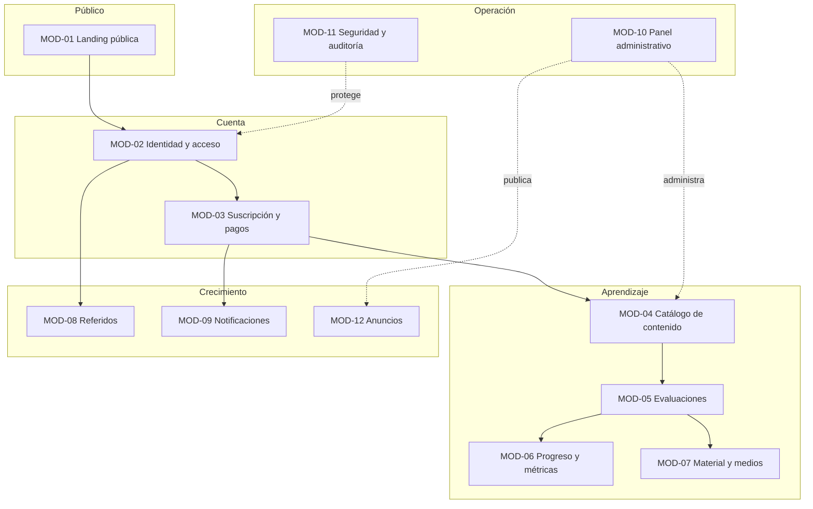

# 04 — Módulos y Secciones

Mapa funcional de la plataforma. Cada **módulo** (`MOD-##`) agrupa secciones y se asocia a requerimientos (`RF`). Sirve de columna vertebral para navegación, backlog y trazabilidad.

---

## 1. Mapa de módulos

---

## 2. Detalle de módulos y secciones

### MOD-01 · Landing pública
| Sección | Descripción | RF | Plataforma |
|---------|-------------|----|------------|
| Inicio / Hero | Propuesta de valor y CTA | RF-001 | Web |
| Beneficios y características | Por qué Alexandrya | RF-001 | Web |
| Cómo funciona | Pasos de uso | RF-001 | Web |
| Materias y modalidades | Catálogo público + tipos de examen | RF-001 | Web |
| Testimonios | Prueba social | RF-001 | Web |
| Planes y precios | Tabla de planes + CTA de compra | RF-002 | Web |
| Legal | Aviso de privacidad, T&C, política de uso | RF-003 | Web |
| Contacto | Formulario, correo, redes | RF-004, RF-005 | Web |

### MOD-02 · Identidad y acceso
| Sección | Descripción | RF | Plataforma |
|---------|-------------|----|------------|
| Registro | Alta con correo/contraseña + verificación | RF-010, RF-011 | Web + App |
| Login | Inicio de sesión + MFA opcional | RF-015, RF-016 | Web + App |
| Recuperación / cambio de contraseña | Reset por correo y cambio autenticado | RF-012, RF-013 | Web + App |
| Sesiones | Sesión única, historial de accesos | RF-080–083 | Web + App |

### MOD-03 · Suscripción y pagos
| Sección | Descripción | RF | Plataforma |
|---------|-------------|----|------------|
| Checkout | Selección de plan y pago | RF-020, RF-022 | Web |
| Estado de suscripción | Vigencia, días restantes | RF-021, RF-025 | Web + App |
| Renovación | Renovar antes/después de vencer | RF-024, RF-027 | Web |
| Validación de pago | Webhooks idempotentes | RF-023 | Backend |

### MOD-04 · Catálogo de contenido
| Sección | Descripción | RF | Plataforma |
|---------|-------------|----|------------|
| Materias | Catálogo configurable (7 iniciales) | RF-030 | App + Admin |
| Estructura | Módulos → temas → subtemas | RF-031 | Admin |
| Banco de preguntas | CRUD de preguntas con metadatos | RF-032–034 | Admin |
| Carga masiva | Importación por Excel con reporte de errores | RF-035, RF-036 | Admin |

### MOD-05 · Evaluaciones
| Sección | Descripción | RF | Plataforma |
|---------|-------------|----|------------|
| Tipos de examen | Tema / módulo / materia / general / simulador | RF-040 | Web + App |
| Motor de evaluación | Armado, ejecución, temporizador | RF-041, RF-042 | Web + App |
| Retroalimentación | Correcto/incorrecto + explicación | RF-043 | Web + App |
| Registro de intento | Persistencia de resultados | RF-044 | Backend |

### MOD-06 · Progreso y métricas
| Sección | Descripción | RF | Plataforma |
|---------|-------------|----|------------|
| Dashboard | Avance general y por materia | RF-050 | Web + App |
| Análisis | Temas débiles/fuertes, áreas de oportunidad | RF-051 | Web + App |
| Recomendaciones | Sugerencias automáticas | RF-052 | Web + App |
| Historial | Intentos previos | RF-053 | Web + App |

### MOD-07 · Material y medios
| Sección | Descripción | RF | Plataforma |
|---------|-------------|----|------------|
| Visor de material | Video/PDF/imagen embebidos, sin descarga | RF-060, RF-061 | Web + App |
| Entrega protegida | URLs firmadas, watermark, FLAG_SECURE | RF-062, RF-110–112 | Backend/App |

### MOD-08 · Referidos
| Sección | Descripción | RF | Plataforma |
|---------|-------------|----|------------|
| Mi código | Código/enlace único + compartir | RF-070 | Web + App |
| Estado de referidos | Hasta 3, beneficios obtenidos | RF-071, RF-073 | Web + App |
| Configuración de beneficios | Beneficio por posición 1/2/3 | RF-072 | Admin |

### MOD-09 · Notificaciones
| Sección | Descripción | RF | Plataforma |
|---------|-------------|----|------------|
| Transaccionales | Registro, login, pago, vencimiento, etc. | RF-090 | Backend |
| Reporte semanal | Avance + estadísticas + recomendaciones | RF-091 | Backend |

### MOD-10 · Panel administrativo
| Sección | Descripción | RF | Plataforma |
|---------|-------------|----|------------|
| Gestión | Usuarios, contenido, pagos, suscripciones, referidos | RF-100 | Admin (web) |
| Roles | Administrador / editor / soporte | RF-101 | Admin (web) |
| Reportes | Uso, pagos, desempeño, exportables | RF-102 | Admin (web) |

### MOD-11 · Seguridad y auditoría
| Sección | Descripción | RF/RNF | Plataforma |
|---------|-------------|--------|------------|
| Autenticación robusta | JWT, refresh, MFA, rate limiting | RF-014–017 | Backend |
| Protección OWASP | Mitigación Top 10 + anti-bots | RNF-002, RNF-003 | Backend |
| Auditoría | Registro inmutable de eventos sensibles | RNF-004 | Backend |

### MOD-12 · Anuncios
| Sección | Descripción | RF | Plataforma |
|---------|-------------|----|------------|
| Centro de anuncios | Comunicados in-app (banner/modal/centro) | RF-120 | Web + App |
| Gestión de anuncios | CRUD, vigencia, audiencia, acuse | RF-120 | Admin |
| Correo de anuncio (opcional) | Difusión por correo NT-013 | RF-120, RF-090 | Backend |

> Los **textos de marco** de los anuncios (vacío, confirmación, modal crítico) viven en el [catálogo de mensajes MSG-12x](../14-mensajes-sistema/mensajes-sistema.md#msg-12x--anuncios-mod-12).

---

## 3. Trazabilidad módulo ↔ documentos

| Módulo | RF principales | Caso de uso | Estados de pantalla |
|--------|----------------|-------------|---------------------|
| MOD-01 | RF-001..005 | CU-010 | EP-001..003 |
| MOD-02 | RF-010..017, RF-080..083 | CU-001, CU-002 | EP-010..014 |
| MOD-03 | RF-020..027 | CU-020 | EP-020..022 |
| MOD-04 | RF-030..036 | CU-030 | EP-030 (admin) |
| MOD-05 | RF-040..045 | CU-040 | EP-040..043 |
| MOD-06 | RF-050..053 | CU-050 | EP-050 |
| MOD-07 | RF-060..062, RF-110..112 | CU-060 | EP-060 |
| MOD-08 | RF-070..073 | CU-070 | EP-070 |
| MOD-09 | RF-090..091 | CU-080 | — |
| MOD-10 | RF-100..102 | CU-090 | EP-090 |
| MOD-11 | RF-014..017, RNF-001..006 | — | — |
| MOD-12 | RF-120 | CU-100 | EP-100 |

<!-- FOOTER:ALEXANDRYA -->

---

📄 **Alexandrya** · `docs/04-modulos/modulos-secciones.md` · Versión documental **v0.3.0** · Actualizado **2026-06-19** · 🏠 [Índice](../README.md) · 💬 [Mensajes del sistema](../14-mensajes-sistema/mensajes-sistema.md)
