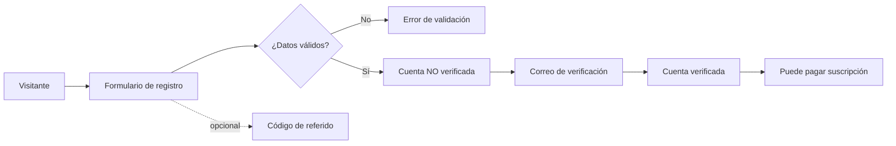
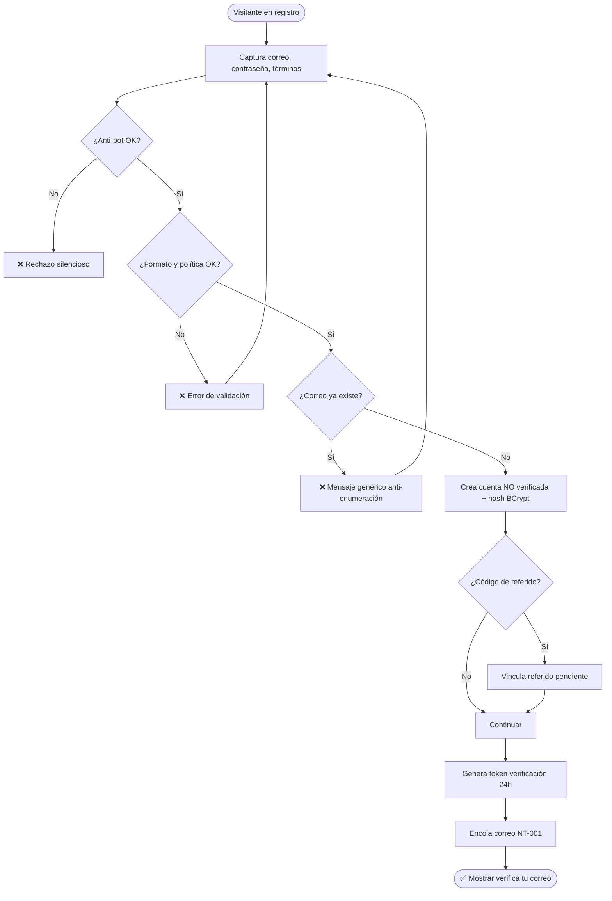
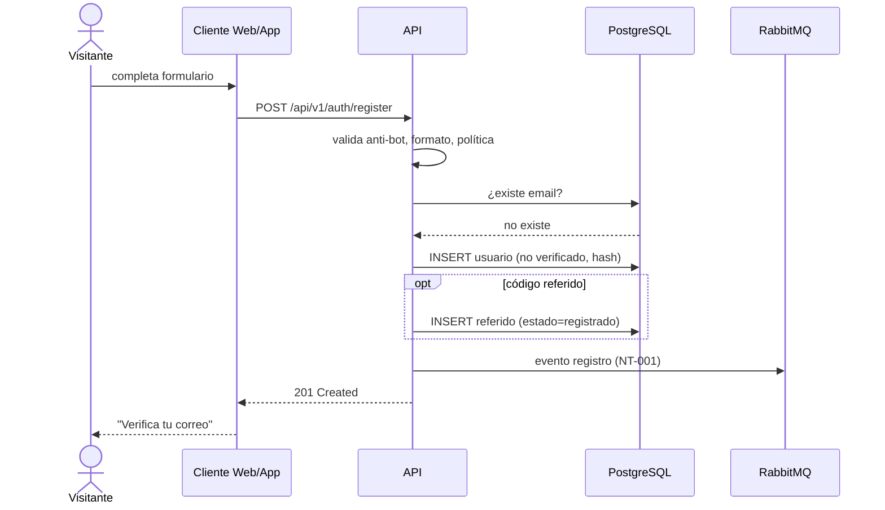
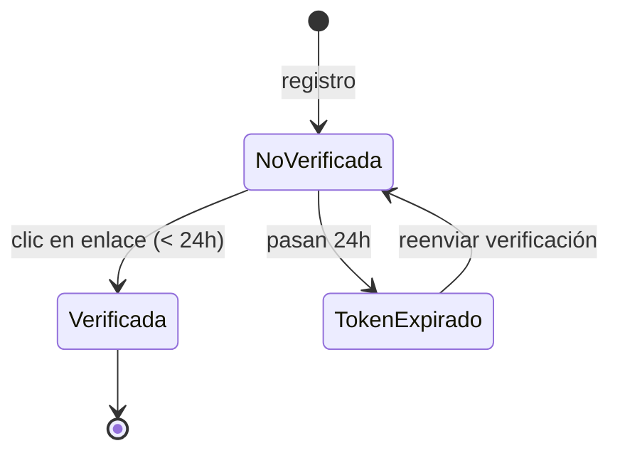
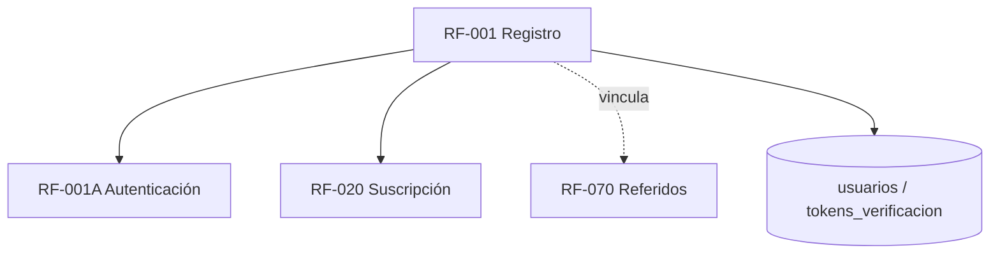

# RF-001: Registro de Usuarios

---

## Índice del Documento
- [1. 📋 Información General](#1--información-general)
- [2. 📜 Histórico de Cambios](#2--histórico-de-cambios)
- [3. 📖 Introducción del Requerimiento](#3--introducción-del-requerimiento)
- [4. 🎯 Objetivo Principal](#4--objetivo-principal)
- [5. 📊 Diagramas del Requerimiento](#5--diagramas-del-requerimiento)
- [6. 📝 Especificación de Datos](#6--especificación-de-datos)
- [7. ✅ Validaciones](#7--validaciones)
- [8. 🔒 Reglas de Negocio](#8--reglas-de-negocio)
- [9. ⚙️ Requerimientos No Funcionales](#9--requerimientos-no-funcionales)
- [10. 🖼️ Mockups / Estados de Pantalla](#10--mockups--estados-de-pantalla)
- [11. ✨ Criterios de Aceptación](#11--criterios-de-aceptación)
- [12. 🛠️ Especificación Técnica](#12--especificación-técnica)
- [13. 🧪 Casos de Prueba](#13--casos-de-prueba)
- [14. 📎 Trazabilidad](#14--trazabilidad)

---

## 1. 📋 Información General

| Campo | Valor |
|-------|-------|
| **ID** | RF-001 |
| **Nombre** | Registro de Usuarios |
| **Módulo** | [MOD-02 Identidad y acceso](../04-modulos/modulos-secciones.md) |
| **Versión** | v1.0.0 |
| **Fecha creación** | 2026-06-18 |
| **Estado** | En análisis |
| **Prioridad** | 🔴 CRÍTICA |
| **Complejidad** | 🟡 Media |
| **Autor** | Equipo de análisis |
| **RF relacionados** | RF-001A (Autenticación) · RF-001B (Contraseña) · RF-020 (Suscripción) · RF-070 (Referidos) |
| **Caso de uso** | CU-002 Registrarse y verificar correo |
| **Cubre** | **RF-010 (Alta de cuenta)** — fusionado aquí: el alta de cuenta es exactamente el flujo de registro de este requerimiento. |

**Avance:** `[████████░░] análisis`

> 🔗 **Nota de fusión:** RF-010 (Alta de cuenta) se documenta en este RF-001. No existe un documento RF-010 separado; toda referencia a "alta de cuenta" se resuelve con este requerimiento.

---

## 2. 📜 Histórico de Cambios

| Versión | Fecha | Autor | Descripción | Tipo |
|---------|-------|-------|-------------|------|
| v1.0.0 | 2026-06-18 | Equipo de análisis | Creación con estructura completa | Nueva |

---

## 3. 📖 Introducción del Requerimiento

### 3.1 Descripción general
Permite que un **visitante** cree una cuenta en Alexandrya con correo y contraseña. La cuenta nace en estado *no verificada* y requiere confirmación por correo (RF-011) para habilitarse. Soporta la captura opcional de un **código de referido** ([RF-070](../05-requerimientos/00-indice-requerimientos.md)). El registro **no** otorga acceso al contenido: este requiere suscripción ([RF-020](../05-requerimientos/00-indice-requerimientos.md)).

### 3.2 Contexto del negocio


### 3.3 Problema que resuelve
| # | Problema | Impacto | Solución |
|---|----------|---------|----------|
| 1 | Sin identidad del usuario | No se puede personalizar ni cobrar | Cuenta con correo único |
| 2 | Correos falsos / typos | Comunicación rota, no entrega de avisos | Verificación obligatoria |
| 3 | Registros masivos por bots | Datos basura, abuso | Anti-bot + rate limiting |
| 4 | Atribución de referidos | Crecimiento no medible | Captura de código en alta |

### 3.4 Beneficios esperados
- ✅ Base de usuarios identificable y contactable.
- ✅ Embudo de conversión registro → pago medible.
- ✅ Atribución de referidos desde el alta.
- ✅ Datos limpios (correos verificados).

---

## 4. 🎯 Objetivo Principal

### 4.1 Objetivo general
> Permitir el alta de cuentas con correo y contraseña, garantizando unicidad del correo, verificación obligatoria y protección anti-abuso.

### 4.2 Objetivos específicos
| # | Objetivo | Métrica | Meta |
|---|----------|---------|------|
| O1 | Crear cuentas con correo único | Duplicados creados | 0 |
| O2 | Verificar correos | % cuentas verificadas | > 90% |
| O3 | Contraseñas seguras | Hash BCrypt | 100% |
| O4 | Bloquear bots | Registros bot detectados | > 95% |
| O5 | Atribuir referidos | Códigos válidos vinculados | 100% |

### 4.3 Alcance funcional

**✅ Incluido**
| Funcionalidad | Descripción |
|---------------|-------------|
| Alta con correo/contraseña | Captura y validación de datos |
| Política de contraseña | Longitud y complejidad mínimas |
| Verificación de correo | Token de un solo uso (24 h) |
| Reenvío de verificación | Si no llegó o caducó |
| Código de referido opcional | Vincula al alumno que invita |
| Anti-bot | CAPTCHA / mecanismo equivalente |
| Aceptación de términos | Checkbox obligatorio (legal) |

**❌ Excluido**
| Funcionalidad | Razón | Referencia |
|---------------|-------|------------|
| Login | Módulo separado | RF-001A |
| Pago/suscripción | Módulo separado | RF-020 |
| Registro social (Google) | Fase posterior | Roadmap Año 2 |

---

## 5. 📊 Diagramas del Requerimiento

### 5.1 Flujo de registro


### 5.2 Secuencia


### 5.3 Estados de la cuenta tras registro


---

## 6. 📝 Especificación de Datos

### 6.1 Campos de entrada
| Campo | Tipo | Obligatorio | Longitud | Validación |
|-------|------|:-----------:|----------|-----------|
| email | string | Sí | 5–100 | RFC 5322, único |
| password | string | Sí | 8–64 | Política (V-001-04) |
| password_confirm | string | Sí | 8–64 | Igual a password |
| acepta_terminos | bool | Sí | — | Debe ser true |
| codigo_referido | string | No | 6–12 | Existe y activo (si se envía) |
| captcha_token | string | Sí | — | Válido ante el proveedor |

### 6.2 Campos internos / generados
| Campo | Tipo | Descripción |
|-------|------|-------------|
| id | UUID | Identificador del usuario |
| password_hash | string | BCrypt (cost ≥ 12) |
| email_verificado | bool | Default false |
| estado | enum | Default `VERIFICADA_PENDIENTE` → `ACTIVA` tras pago |
| token_verificacion_hash | string | Hash del token (24 h) |
| creado_en | timestamp | Alta |

### 6.3 Estructura del request
```json
{
  "email": "alumno@example.com",
  "password": "MiClaveSegura123",
  "password_confirm": "MiClaveSegura123",
  "acepta_terminos": true,
  "codigo_referido": "ALEX-7Q2X",
  "captcha_token": "..."
}
```

### 6.4 Tabla `usuarios` (extracto)
```sql
CREATE TABLE usuarios (
  id UUID PRIMARY KEY DEFAULT gen_random_uuid(),
  email VARCHAR(100) NOT NULL UNIQUE,
  password_hash VARCHAR(128) NOT NULL,
  nombre VARCHAR(120),
  email_verificado BOOLEAN NOT NULL DEFAULT FALSE,
  estado VARCHAR(24) NOT NULL DEFAULT 'VERIFICADA_PENDIENTE',
  rol_id UUID NOT NULL REFERENCES roles(id),
  creado_en TIMESTAMP DEFAULT now(),
  CONSTRAINT chk_estado CHECK (estado IN
    ('VERIFICADA_PENDIENTE','ACTIVA','VENCIDA','SUSPENDIDA'))
);
CREATE UNIQUE INDEX uniq_usuarios_email ON usuarios(lower(email));

CREATE TABLE tokens_verificacion (
  id UUID PRIMARY KEY DEFAULT gen_random_uuid(),
  usuario_id UUID NOT NULL REFERENCES usuarios(id) ON DELETE CASCADE,
  token_hash VARCHAR(128) NOT NULL UNIQUE,
  expira TIMESTAMP NOT NULL,
  usado_en TIMESTAMP
);
```

---

## 7. ✅ Validaciones

| ID | Descripción | Tipo |
|----|-------------|------|
| V-001-01 | El correo cumple formato RFC 5322 | Formato |
| V-001-02 | El correo no existe (case-insensitive) | BD |
| V-001-03 | password == password_confirm | Lógica |
| V-001-04 | Contraseña ≥ 8 caracteres, con mayúscula, minúscula y dígito | Política |
| V-001-05 | acepta_terminos = true | Legal |
| V-001-06 | captcha_token válido | Anti-bot |
| V-001-07 | Si hay código de referido, existe, está activo y no es propio | BD |
| V-001-08 | Rate limit de registro por IP no excedido | Caché |

---

## 8. 🔒 Reglas de Negocio

**RN-001-01 — Correo único.** No pueden existir dos cuentas con el mismo correo (insensible a mayúsculas). Falla → mensaje genérico anti-enumeración ([RNA-001](../06-reglas-negocio/reglas-alternas.md)).

**RN-001-02 — Cuenta nace no verificada.** Sin verificación no puede iniciar sesión ([RF-001A](RF-001A-autenticacion.md)).

**RN-001-03 — Contraseña hasheada.** Nunca en texto plano ni en logs ([RN-071](../06-reglas-negocio/reglas-principales.md)).

**RN-001-04 — Token de verificación de un solo uso, expira en 24 h.** Caducado → permitir reenvío ([RNA-004](../06-reglas-negocio/reglas-alternas.md)).

**RN-001-05 — Referido pendiente.** Si se captura código válido, se crea vínculo en estado *registrado*; se vuelve *efectivo* solo cuando el nuevo usuario paga ([RN-041](../06-reglas-negocio/reglas-principales.md)).

**RN-001-06 — No auto-referido.** El código no puede pertenecer al propio correo registrado ([RN-044](../06-reglas-negocio/reglas-principales.md)).

**RN-001-07 — Aceptación de términos obligatoria.** Sin consentimiento no se crea la cuenta (RNF/legal).

**RN-001-08 — Anti-abuso.** Rate limiting + CAPTCHA en el endpoint público.

---

## 9. ⚙️ Requerimientos No Funcionales

| RNF | Descripción |
|-----|-------------|
| RNF-001-01 | Endpoint sobre TLS/HTTPS |
| RNF-001-02 | Protección anti-bot (CAPTCHA) y rate limiting ([RNF-003](00-catalogo-requerimientos.md)) |
| RNF-001-03 | Mensajes que no revelen existencia de correos (anti-enumeración, OWASP) |
| RNF-001-04 | Datos personales tratados conforme a LFPDPPP ([RNF-005](00-catalogo-requerimientos.md)) |
| RNF-001-05 | BCrypt cost ≥ 12 |

---

## 10. 🖼️ Mockups / Estados de Pantalla

Referencia: [EP-010 Registro](../11-ux-estados-pantalla/estados-pantalla-iniciales.md#ep-010--registro), [EP-012 Verificación enviada](../11-ux-estados-pantalla/estados-pantalla-iniciales.md#ep-012--verificación-de-correo-enviada).

```
┌─────────────────────────────┐
│        Crear cuenta         │
│  Correo  [_______________]  │
│  Contraseña [____________]  │
│  Confirmar  [____________]  │
│  Código referido (opc) [__] │
│  □ Acepto términos          │
│  [ captcha ]                │
│      [ Registrarme ]        │
└─────────────────────────────┘
Estados: Default · Error (correo usado / política) · Success (→ verificación)
```

---

## 11. ✨ Criterios de Aceptación

```gherkin
Scenario: Registro exitoso
  Given un visitante con un correo no registrado
  When envía correo, contraseña válida, confirma y acepta términos
  Then se crea una cuenta en estado no verificada
  And se envía el correo de verificación (NT-001)
  And responde 201 con mensaje "verifica tu correo"

Scenario: Correo duplicado
  Given un correo ya registrado
  When intenta registrarse con ese correo
  Then responde con mensaje genérico sin revelar que existe
  And no se crea una cuenta duplicada

Scenario: Contraseña débil
  Given un visitante
  When envía una contraseña que no cumple la política
  Then responde 422 indicando los requisitos de contraseña

Scenario: Registro con código de referido válido
  Given el código "ALEX-7Q2X" pertenece a otro alumno activo
  When un visitante se registra usando ese código
  Then se crea un vínculo de referido en estado "registrado"

Scenario: Términos no aceptados
  Given un visitante
  When envía el formulario sin aceptar términos
  Then responde 422 y no se crea la cuenta
```

---

## 12. 🛠️ Especificación Técnica

### 12.1 Endpoints

**`POST /api/v1/auth/register`**
```
Request:  { email, password, password_confirm, acepta_terminos, codigo_referido?, captcha_token }
201:      { "id": "uuid", "email": "...", "estado": "VERIFICADA_PENDIENTE",
            "message": "Te enviamos un correo de verificación" }
409/200:  { "message": "Si el correo es válido, recibirás instrucciones" }  // anti-enumeración
422:      { "error": "validacion", "detalles": { "password": "...", "acepta_terminos": "..." } }
429:      { "error": "rate_limited", "retry_after": 600 }
```

**`POST /api/v1/auth/verify`**
```
Request:  { "token": "..." }
200:      { "message": "Cuenta verificada" }
410:      { "error": "token_expirado" }   // ofrece reenvío
```

**`POST /api/v1/auth/verify/resend`**
```
Request:  { "email": "..." }
200:      { "message": "Si el correo existe y no está verificado, reenviamos el enlace" }
```

### 12.2 Servicio de registro (pseudocódigo)
```typescript
async register(dto, ip) {
  await this.antibot(dto.captcha_token);            // V-001-06
  await this.rateLimit(ip);                          // V-001-08
  this.validatePolicy(dto);                          // V-001-03/04/05
  if (await db.usuarios.existsEmail(dto.email))      // V-001-02
    return genericOk();                              // RN-001-01 anti-enumeración
  const hash = await bcrypt.hash(dto.password, 12);  // RN-001-03
  const user = await db.usuarios.create({ email: dto.email, password_hash: hash,
                                          email_verificado: false, estado: 'VERIFICADA_PENDIENTE' });
  if (dto.codigo_referido) await this.linkReferido(user, dto.codigo_referido); // RN-001-05/06
  const token = this.genToken();                     // RN-001-04
  await db.tokens_verificacion.create({ usuario_id: user.id, token_hash: hash(token), expira: now()+24h });
  await mq.publish('registro', { usuarioId: user.id, token });  // NT-001
  return created(user);
}
```

---

## 13. 🧪 Casos de Prueba

| ID | Escenario | Traza | Tipo |
|----|-----------|-------|------|
| TC-001-01 | Registro exitoso crea cuenta no verificada + correo | V-001-01..05, RN-001-02/04 | Positivo |
| TC-001-02 | Correo duplicado → mensaje genérico, sin duplicado | V-001-02, RN-001-01 | Negativo |
| TC-001-03 | Contraseña débil → 422 | V-001-04 | Negativo |
| TC-001-04 | Contraseñas no coinciden → 422 | V-001-03 | Negativo |
| TC-001-05 | Sin aceptar términos → 422 | V-001-05, RN-001-07 | Negativo |
| TC-001-06 | Código de referido válido vincula referido | V-001-07, RN-001-05 | Positivo |
| TC-001-07 | Auto-referido rechazado | RN-001-06 | Negativo |
| TC-001-08 | Verificación con token válido activa la cuenta | RN-001-04 | Positivo |
| TC-001-09 | Token caducado → 410 + reenvío | RNA-004 | Borde |
| TC-001-10 | Exceso de registros por IP → 429 | V-001-08, RN-001-08 | Borde |

---

## 14. 📎 Trazabilidad

### 14.1 Documentos relacionados
| Tipo | Referencia |
|------|------------|
| Reglas | [RN-001..006](../06-reglas-negocio/reglas-principales.md) · [RNA-001/004](../06-reglas-negocio/reglas-alternas.md) |
| Estados de pantalla | [EP-010, EP-012](../11-ux-estados-pantalla/estados-pantalla-iniciales.md) |
| Notificación | [NT-001 / CT-001](../12-notificaciones/notificaciones.md) |
| Modelo de datos | [ERD: usuarios, tokens_verificacion](../09-diagramas/03-modelo-datos-erd.md) |
| Requerimientos | RF-001A (login) · RF-001B (contraseña) · RF-020 (suscripción) · RF-070 (referidos) |

### 14.2 Matriz de trazabilidad
| Regla | Endpoint | Validación | Caso de prueba |
|-------|----------|------------|----------------|
| RN-001-01 | POST /auth/register | V-001-02 | TC-001-02 |
| RN-001-03 | POST /auth/register | — | TC-001-01 |
| RN-001-04 | POST /auth/verify | — | TC-001-08, TC-001-09 |
| RN-001-05 | POST /auth/register | V-001-07 | TC-001-06 |
| RN-001-06 | POST /auth/register | V-001-07 | TC-001-07 |
| RN-001-07 | POST /auth/register | V-001-05 | TC-001-05 |

### 14.3 Dependencias


<!-- FOOTER:ALEXANDRYA -->

---

<sub>📄 **Alexandrya** · `docs/05-requerimientos/RF-001-registro.md` · Versión documental **v0.3.0** · Actualizado **2026-06-19** · 🏠 [Índice](../README.md) · 💬 [Mensajes del sistema](../14-mensajes-sistema/mensajes-sistema.md)</sub>
