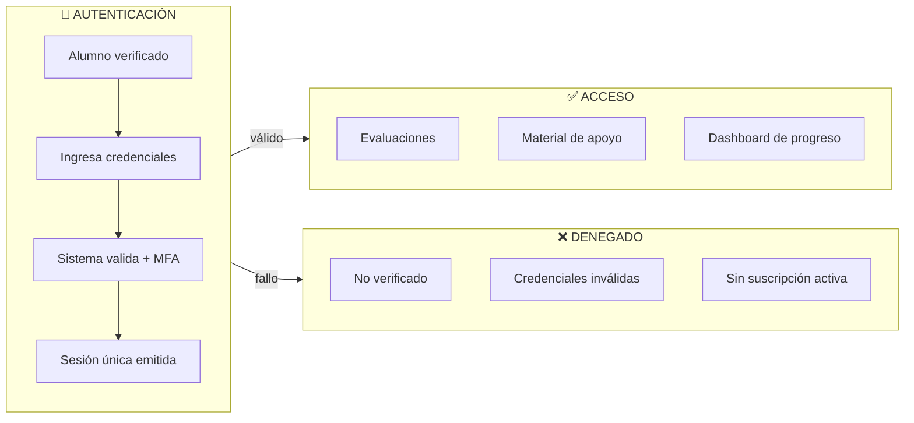
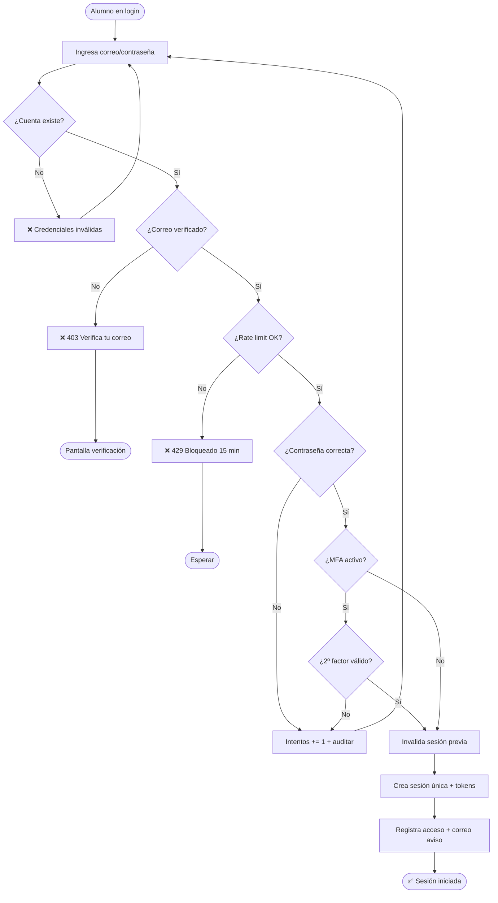
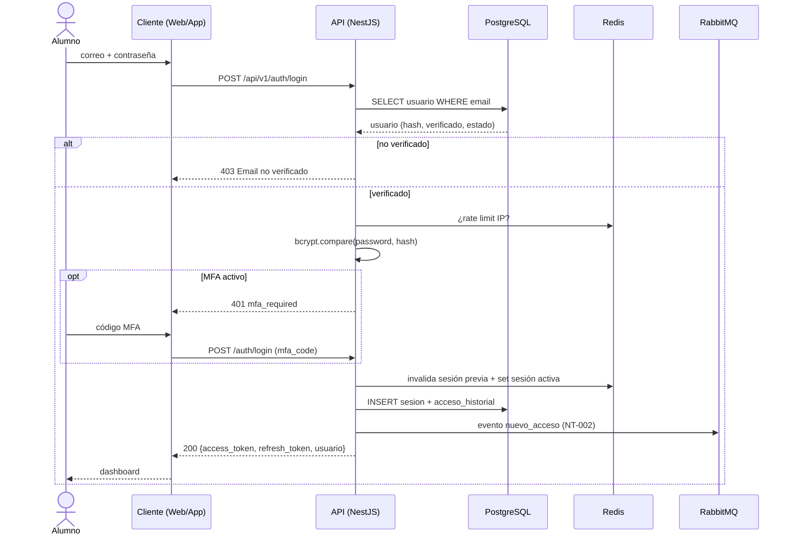
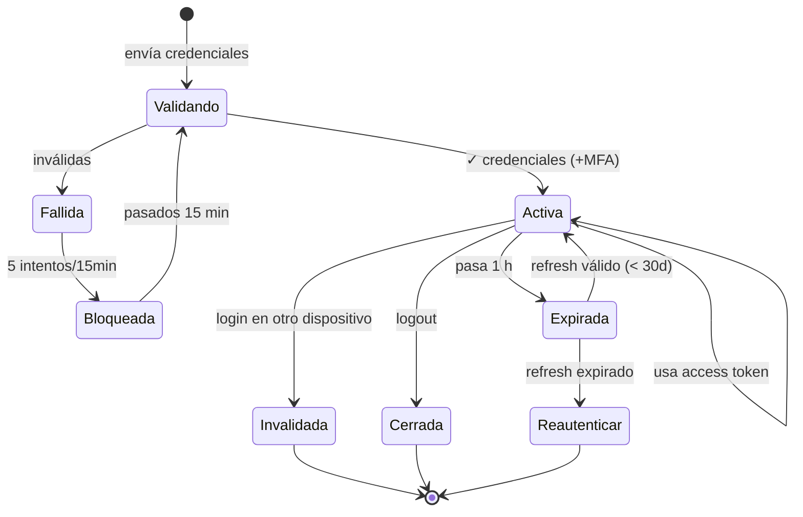
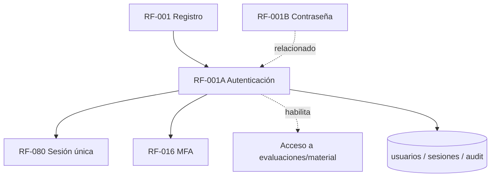

# RF-001A: Autenticación e Inicio de Sesión

---

## Índice del Documento
- [1. 📋 Información General](#1--información-general)
- [2. 📜 Histórico de Cambios](#2--histórico-de-cambios)
- [3. 📖 Introducción del Requerimiento](#3--introducción-del-requerimiento)
- [4. 🎯 Objetivo Principal](#4--objetivo-principal)
- [5. 📊 Diagramas del Requerimiento](#5--diagramas-del-requerimiento)
- [6. 📝 Especificación de Datos](#6--especificación-de-datos)
- [7. ✅ Validaciones](#7--validaciones)
- [8. 🔒 Reglas de Negocio](#8--reglas-de-negocio)
- [9. ⚙️ Requerimientos No Funcionales](#9--requerimientos-no-funcionales)
- [10. 🖼️ Mockups / Estados de Pantalla](#10--mockups--estados-de-pantalla)
- [11. ✨ Criterios de Aceptación](#11--criterios-de-aceptación)
- [12. 🛠️ Especificación Técnica](#12--especificación-técnica)
- [13. 🧪 Casos de Prueba](#13--casos-de-prueba)
- [14. 📎 Trazabilidad](#14--trazabilidad)

---

## 1. 📋 Información General

| Campo | Valor |
|-------|-------|
| **ID** | RF-001A |
| **Nombre** | Autenticación e Inicio de Sesión |
| **Módulo** | [MOD-02 Identidad y acceso](../04-modulos/modulos-secciones.md) |
| **Versión** | v1.0.0 |
| **Fecha creación** | 2026-06-18 |
| **Estado** | En análisis |
| **Prioridad** | 🔴 CRÍTICA |
| **Complejidad** | 🟡 Media |
| **Autor** | Equipo de análisis |
| **RF relacionados** | RF-001 (Registro) · RF-001B (Recuperación de contraseña) · RF-080 (Sesión única) · RF-016 (MFA) |
| **Caso de uso** | [CU-001 Iniciar sesión](../07-casos-uso/CU-001-inicio-sesion.md) |

**Avance:** `[████████░░] análisis`

---

## 2. 📜 Histórico de Cambios

| Versión | Fecha | Autor | Descripción | Tipo |
|---------|-------|-------|-------------|------|
| v1.0.0 | 2026-06-18 | Equipo de análisis | Creación con estructura completa | Nueva |

---

## 3. 📖 Introducción del Requerimiento

### 3.1 Descripción general
Permite que un **alumno** registrado y verificado acceda de forma segura a Alexandrya mediante correo y contraseña, con MFA opcional. Gestiona la emisión de tokens (JWT + refresh), la **sesión única por cuenta**, el registro de accesos y el cierre de sesión.

### 3.2 Contexto del negocio


### 3.3 Problema que resuelve
| # | Problema | Impacto | Solución |
|---|----------|---------|----------|
| 1 | Acceso no autorizado al contenido de pago | Fuga de contenido / pérdida de ingresos | Login obligatorio + suscripción |
| 2 | Cuentas compartidas entre varias personas | Una compra usada por muchos | **Sesión única** ([RN-030](../06-reglas-negocio/reglas-principales.md)) |
| 3 | Sesiones eternas | Riesgo de secuestro de sesión | Tokens con expiración |
| 4 | Fuerza bruta sobre contraseñas | Compromiso de cuentas | Rate limiting + BCrypt |
| 5 | Accesos sin trazabilidad | No se sabe quién entró | Historial + auditoría |

### 3.4 Beneficios esperados
- ✅ Control de acceso centralizado y seguro.
- ✅ Mitigación de cuentas compartidas (clave para el modelo de suscripción).
- ✅ Trazabilidad de accesos (IP, dispositivo, ubicación).
- ✅ Experiencia fluida con renovación silenciosa por refresh token.

---

## 4. 🎯 Objetivo Principal

### 4.1 Objetivo general
> Permitir que alumnos verificados accedan de forma segura mediante autenticación de credenciales y gestión de **sesión única** con tokens criptográficos de duración limitada.

### 4.2 Objetivos específicos
| # | Objetivo | Métrica | Meta |
|---|----------|---------|------|
| O1 | Validar credenciales correctamente | Validaciones correctas | 100% |
| O2 | Garantizar una sola sesión activa | Sesiones simultáneas por cuenta | 1 |
| O3 | Generar tokens seguros | Tokens firmados | 100% |
| O4 | Prevenir fuerza bruta | Rate limiting aplicado | 100% |
| O5 | Auditar accesos | Eventos registrados | 100% |

### 4.3 Alcance funcional

**✅ Incluido**
| Funcionalidad | Descripción |
|---------------|-------------|
| Login email/contraseña | Verificación contra hash BCrypt |
| MFA opcional | Segundo factor si el alumno lo activó |
| JWT access token | TTL 1 h |
| Refresh token | TTL 30 días, ligado a la sesión activa |
| Sesión única | Login nuevo invalida la sesión anterior |
| Historial de acceso | Fecha, hora, IP, dispositivo, ubicación |
| Rate limiting | Máx 5 intentos fallidos / 15 min |
| Logout | Invalida la sesión actual |

**❌ Excluido**
| Funcionalidad | Razón | Referencia |
|---------------|-------|------------|
| Registro | Módulo separado | RF-001 |
| Recuperación/cambio de contraseña | Módulo separado | RF-001B |
| OAuth / SSO | Fase posterior | Roadmap Año 2 |
| Pago dentro de app | Fuera de MVP móvil | [división](../01-vision/division-web-mobile.md) |

> **Nota de diseño:** los TTL (access 1 h / refresh 30 días) priorizan la mitigación de cuentas compartidas, más estricta que un patrón genérico de 24 h/7 días. Es un parámetro de configuración, ajustable por seguridad/UX.

---

## 5. 📊 Diagramas del Requerimiento

### 5.1 Flujo de inicio de sesión


### 5.2 Diagrama de secuencia


### 5.3 Estados de la sesión


---

## 6. 📝 Especificación de Datos

### 6.1 Campos de entrada (login)
| Campo | Tipo | Obligatorio | Longitud | Validación |
|-------|------|:-----------:|----------|-----------|
| email | string | Sí | 5–100 | Formato RFC 5322 |
| password | string | Sí | 8–255 | No vacío |
| mfa_code | string | Condicional | 6 | Solo si MFA activo |
| remember_me | bool | No | — | Default false |

### 6.2 Campos internos / generados
| Campo | Tipo | Generado por | Descripción |
|-------|------|--------------|-------------|
| access_token | JWT | Backend | TTL 1 h |
| refresh_token | JWT | Backend | TTL 30 días |
| session_id | UUID | Backend | Sesión activa única |
| ip_address | inet | Backend | Origen del acceso |
| user_agent | text | Backend | Dispositivo/cliente |
| ubicacion_aprox | string | Backend | Geo-IP aproximada |

### 6.3 Estructura del JWT (access token)
```json
{
  "header": { "alg": "HS256", "typ": "JWT" },
  "payload": {
    "sub": "uuid-usuario",
    "email": "alumno@example.com",
    "rol": "ALUMNO",
    "sid": "uuid-sesion",
    "iat": 1750000000,
    "exp": 1750003600,
    "iss": "alexandrya-api",
    "aud": "alexandrya"
  },
  "signature": "HMACSHA256(base64(header).base64(payload), JWT_SECRET)"
}
```

### 6.4 Tabla `sesiones`
```sql
CREATE TABLE sesiones (
  id UUID PRIMARY KEY DEFAULT gen_random_uuid(),
  usuario_id UUID NOT NULL REFERENCES usuarios(id) ON DELETE CASCADE,
  refresh_token_hash VARCHAR(128) NOT NULL UNIQUE,
  access_token_expira TIMESTAMP NOT NULL,
  refresh_token_expira TIMESTAMP NOT NULL,
  ip_address INET,
  user_agent TEXT,
  ubicacion_aprox VARCHAR(120),
  activa BOOLEAN NOT NULL DEFAULT TRUE,   -- una sola TRUE por usuario
  creada_en TIMESTAMP DEFAULT now(),
  invalidada_en TIMESTAMP
);
-- Garantiza una sola sesión activa por usuario:
CREATE UNIQUE INDEX uniq_sesion_activa ON sesiones(usuario_id) WHERE activa;
CREATE INDEX idx_sesiones_refresh ON sesiones(refresh_token_hash);
```

### 6.5 Tabla `acceso_historial` y `audit_accesos`
```sql
CREATE TABLE acceso_historial (
  id UUID PRIMARY KEY DEFAULT gen_random_uuid(),
  usuario_id UUID NOT NULL REFERENCES usuarios(id) ON DELETE CASCADE,
  ip_address INET NOT NULL,
  user_agent TEXT,
  ubicacion_aprox VARCHAR(120),
  fecha_hora TIMESTAMP DEFAULT now()
);

CREATE TABLE audit_accesos (
  id UUID PRIMARY KEY DEFAULT gen_random_uuid(),
  usuario_id UUID REFERENCES usuarios(id) ON DELETE SET NULL,
  accion VARCHAR(40) NOT NULL,        -- LOGIN, LOGOUT, LOGIN_FALLIDO, TOKEN_REFRESH, MFA_FALLIDO
  resultado VARCHAR(20) NOT NULL,     -- EXITO, FALLO
  razon_fallo VARCHAR(255),
  ip_address INET NOT NULL,
  fecha_hora TIMESTAMP DEFAULT now()
);
```

---

## 7. ✅ Validaciones

| ID | Descripción | Tipo |
|----|-------------|------|
| V-001A-01 | El correo existe en `usuarios` | BD |
| V-001A-02 | La cuenta está en estado ACTIVA o VENCIDA (no suspendida) | BD |
| V-001A-03 | `email_verificado = true` | BD |
| V-001A-04 | El correo cumple formato RFC 5322 | Formato |
| V-001A-05 | La contraseña coincide con el hash BCrypt | Cripto |
| V-001A-06 | Si MFA activo, el código es válido y vigente | Cripto/Tiempo |
| V-001A-07 | ≤ 5 intentos fallidos por IP/cuenta en 15 min | Caché |
| V-001A-08 | El JWT tiene firma válida (HS256) | Cripto |
| V-001A-09 | El token no está expirado | Tiempo |
| V-001A-10 | La sesión existe, está `activa` y no fue invalidada | BD |

> Nota: la **suscripción activa** se valida al acceder al contenido (RF-020), no en el login; un alumno vencido puede iniciar sesión para renovar ([RNA-013](../06-reglas-negocio/reglas-alternas.md)).

---

## 8. 🔒 Reglas de Negocio

**RN-001A-01 — Solo cuentas verificadas y no suspendidas inician sesión.** Falla → 403. (Ref. [RN-010](../06-reglas-negocio/reglas-principales.md), [RNA-002](../06-reglas-negocio/reglas-alternas.md))

**RN-001A-02 — Validación con BCrypt (cost ≥ 12).** `bcrypt.compare(input, hash)`. Falla → 401 genérico.

**RN-001A-03 — Rate limiting 5/15 min.** Excedido → 429 por 15 min; se audita. (Ref. [RNA-003](../06-reglas-negocio/reglas-alternas.md))

**RN-001A-04 — Tokens con TTL definido.** access 1 h, refresh 30 días.

**RN-001A-05 — Sesión única.** Al crear una sesión, se invalida cualquier otra `activa` del mismo usuario. Un único registro `activa=TRUE` por usuario (índice único). (Ref. [RN-030/031](../06-reglas-negocio/reglas-principales.md))

**RN-001A-06 — Registro de acceso + aviso.** Cada login exitoso inserta en `acceso_historial` y dispara NT-002. (Ref. [RN-033/034](../06-reglas-negocio/reglas-principales.md))

**RN-001A-07 — Auditar todos los intentos.** Éxito y fallo en `audit_accesos`.

**RN-001A-08 — Logout invalida la sesión.** `activa=false`, `invalidada_en=now()`; el refresh deja de servir.

**RN-001A-09 — Refresh solo si la sesión sigue activa.** Si fue expulsada/cerrada, el refresh se rechaza. (Ref. [RNA-005](../06-reglas-negocio/reglas-alternas.md))

---

## 9. ⚙️ Requerimientos No Funcionales

| RNF | Descripción |
|-----|-------------|
| RNF-001A-01 | Todo el tráfico sobre TLS/HTTPS ([RNF-001](00-catalogo-requerimientos.md)) |
| RNF-001A-02 | Refresh token en cookie `HttpOnly`+`Secure` (web) / almacenamiento cifrado (Android Keystore) |
| RNF-001A-03 | CORS restringido a dominios autorizados |
| RNF-001A-04 | Nunca registrar contraseñas ni tokens completos en logs ([RN-071](../06-reglas-negocio/reglas-principales.md)) |
| RNF-001A-05 | Validación de token < 200 ms (P95) |
| RNF-001A-06 | Rate limiting en Redis (compartido entre instancias) |
| RNF-001A-07 | Mitigación OWASP Top 10 (incl. enumeración de usuarios) |

---

## 10. 🖼️ Mockups / Estados de Pantalla

Referencia: [EP-011 Login](../11-ux-estados-pantalla/estados-pantalla-iniciales.md#ep-011--login), [EP-013 Bloqueo](../11-ux-estados-pantalla/estados-pantalla-iniciales.md#ep-013--bloqueo-por-intentos-rate-limit), [EP-012 Verificación](../11-ux-estados-pantalla/estados-pantalla-iniciales.md#ep-012--verificación-de-correo-enviada).

```
┌─────────────────────────────┐        ┌─────────────────────────────┐
│       Iniciar sesión        │        │  🔒 Cuenta bloqueada         │
│  Correo  [_______________]  │        │  Demasiados intentos.        │
│  Contraseña [____________]  │        │  Reintenta en 14:59          │
│  □ Recordarme               │        └─────────────────────────────┘
│      [ Entrar ]             │
│  ¿Olvidaste tu contraseña?  │   Estados: Default · Loading · Error · Bloqueo · MFA
└─────────────────────────────┘
```

---

## 11. ✨ Criterios de Aceptación

```gherkin
Scenario: Login exitoso
  Given un alumno con correo verificado y cuenta activa
  When ingresa correo y contraseña correctos
  Then recibe 200 con access_token (1h) y refresh_token (30d)
  And se crea una sesión única activa
  And se registra el acceso y se envía correo de aviso (NT-002)
  And es redirigido al dashboard

Scenario: Sesión única expulsa la anterior
  Given el alumno tiene sesión activa en el dispositivo A
  When inicia sesión correctamente en el dispositivo B
  Then la sesión de A queda invalidada
  And el dispositivo A recibe 401 en su siguiente petición

Scenario: Contraseña incorrecta
  Given un alumno existente y verificado
  When ingresa contraseña incorrecta
  Then recibe 401 "Credenciales inválidas"
  And se incrementa el contador de intentos
  And no se generan tokens

Scenario: Bloqueo por rate limiting
  Given 4 intentos fallidos en los últimos 15 minutos
  When realiza un 5º intento fallido
  Then recibe 429 "Demasiados intentos, intente en 15 minutos"

Scenario: MFA requerido
  Given un alumno con MFA activado
  When ingresa credenciales correctas sin el código
  Then recibe 401 "mfa_required"
  And al reenviar con un código válido recibe 200 y tokens
```

---

## 12. 🛠️ Especificación Técnica

### 12.1 Endpoints

**`POST /api/v1/auth/login`**
```
Request:  { "email": "...", "password": "...", "mfa_code"?: "123456", "remember_me"?: false }

200 OK:   { "access_token": "...", "refresh_token": "...", "expires_in": 3600,
            "token_type": "Bearer", "usuario": { "id", "email", "nombre", "rol" } }
401:      { "error": "credenciales_invalidas", "message": "...", "retry_attempts_left": 3 }
401:      { "error": "mfa_required" }
403:      { "error": "email_no_verificado" }
429:      { "error": "rate_limited", "retry_after": 900 }
```

**`POST /api/v1/auth/refresh`**
```
Request:  { "refresh_token": "..." }   // o cookie HttpOnly
200 OK:   { "access_token": "...", "expires_in": 3600, "token_type": "Bearer" }
401:      { "error": "refresh_invalido" }   // expirado o sesión no activa
```

**`POST /api/v1/auth/logout`**
```
Header:   Authorization: Bearer <access_token>
200 OK:   { "message": "sesión cerrada" }
```

**`GET /api/v1/auth/validate`** → `{ "valid": true, "usuario_id", "exp" }` o 401.

### 12.2 Middleware de autenticación (pseudocódigo)
```typescript
export async function authGuard(req, res, next) {
  const token = extractBearer(req);
  if (!token) return res.status(401).json({ error: 'token_ausente' });
  try {
    const claims = jwt.verify(token, env.JWT_SECRET);          // V-001A-08, V-001A-09
    const sesion = await redis.get(`sesion:${claims.sid}`)     // V-001A-10 (cache)
                 ?? await db.sesiones.findActiva(claims.sid);
    if (!sesion || !sesion.activa) return res.status(401).json({ error: 'sesion_invalida' });
    req.usuario = { id: claims.sub, email: claims.email, rol: claims.rol, sid: claims.sid };
    next();
  } catch (e) {
    return res.status(401).json({ error: e.name === 'TokenExpiredError' ? 'token_expirado' : 'token_invalido' });
  }
}
```

### 12.3 Servicio de login (pseudocódigo)
```typescript
async login(email, password, mfaCode, ip, ua) {
  await this.checkRateLimit(ip, email);                        // RN-001A-03
  const u = await db.usuarios.findByEmail(email);
  if (!u || u.estado === 'SUSPENDIDA') { await this.audit('LOGIN_FALLIDO', ip); throw Unauthorized('credenciales_invalidas'); }
  if (!u.email_verificado) throw Forbidden('email_no_verificado'); // RN-001A-01
  if (!await bcrypt.compare(password, u.password_hash)) {        // RN-001A-02
    await this.incrementAttempts(ip, email); await this.audit('LOGIN_FALLIDO', ip, u.id);
    throw Unauthorized('credenciales_invalidas');
  }
  if (u.mfa_habilitado && !this.verifyMfa(u, mfaCode)) throw Unauthorized('mfa_required'); // RN-001A
  await db.sesiones.invalidarActivas(u.id);                     // RN-001A-05 (sesión única)
  const session = await db.sesiones.crear(u.id, ip, ua);
  const access = this.signAccess(u, session.id);                // RN-001A-04
  const refresh = this.signRefresh(u, session.id);
  await db.acceso_historial.registrar(u.id, ip, ua);            // RN-001A-06
  await mq.publish('nuevo_acceso', { usuarioId: u.id, ip, ua });// NT-002
  await this.audit('LOGIN', ip, u.id, 'EXITO');                 // RN-001A-07
  return { access, refresh };
}
```

---

## 13. 🧪 Casos de Prueba

| ID | Escenario | Traza | Tipo |
|----|-----------|-------|------|
| TC-001A-01 | Login exitoso emite tokens y crea sesión | V-001A-01/05, RN-001A-04/05 | Positivo |
| TC-001A-02 | Contraseña incorrecta → 401 + intento contado | V-001A-05, RN-001A-02 | Negativo |
| TC-001A-03 | Correo no verificado → 403 | V-001A-03, RN-001A-01 | Negativo |
| TC-001A-04 | 5 intentos → 429 bloqueo 15 min | V-001A-07, RN-001A-03 | Borde |
| TC-001A-05 | Login en B expulsa sesión de A | RN-001A-05 | Positivo |
| TC-001A-06 | Refresh de sesión expulsada → 401 | V-001A-10, RN-001A-09 | Negativo |
| TC-001A-07 | Token expirado → 401 token_expirado | V-001A-09 | Negativo |
| TC-001A-08 | Token con firma alterada → 401 | V-001A-08 | Negativo |
| TC-001A-09 | MFA requerido y luego válido | V-001A-06 | Positivo |
| TC-001A-10 | Logout invalida sesión | RN-001A-08 | Positivo |

```gherkin
Scenario: TC-001A-05 - Sesión única
  Given el alumno tiene sesión activa en dispositivo A
  When inicia sesión correctamente en dispositivo B
  Then la sesión de A pasa a activa=false
  And una petición de A con su token responde 401 "sesion_invalida"
```

> Estos TC se reflejan en el catálogo global de [casos de prueba](../10-casos-prueba/00-catalogo-casos-prueba.md) (CP-010, CP-011, CP-012).

---

## 14. 📎 Trazabilidad

### 14.1 Documentos relacionados
| Tipo | Referencia |
|------|------------|
| Caso de uso | [CU-001 Iniciar sesión](../07-casos-uso/CU-001-inicio-sesion.md) |
| Flujos alternos | [FA-001..004](../07-casos-uso/flujos-alternos.md) |
| Reglas | [RN-030..034](../06-reglas-negocio/reglas-principales.md) · [RNA-002/003/005/006](../06-reglas-negocio/reglas-alternas.md) |
| Estados de pantalla | [EP-011..014](../11-ux-estados-pantalla/estados-pantalla-iniciales.md) |
| Notificación | [NT-002 / CT-002](../12-notificaciones/notificaciones.md) |
| Modelo de datos | [ERD: sesiones, acceso_historial](../09-diagramas/03-modelo-datos-erd.md) |
| Diagrama de flujo | [Login con sesión única](../09-diagramas/04-flujos.md) |

### 14.2 Matriz de trazabilidad
| Regla | Endpoint | Validación | Caso de prueba |
|-------|----------|------------|----------------|
| RN-001A-01 | POST /auth/login | V-001A-03 | TC-001A-03 |
| RN-001A-02 | POST /auth/login | V-001A-05 | TC-001A-02 |
| RN-001A-03 | POST /auth/login | V-001A-07 | TC-001A-04 |
| RN-001A-05 | POST /auth/login | V-001A-10 | TC-001A-05 |
| RN-001A-09 | POST /auth/refresh | V-001A-10 | TC-001A-06 |
| RN-001A-08 | POST /auth/logout | V-001A-10 | TC-001A-10 |

### 14.3 Dependencias del módulo


<!-- FOOTER:ALEXANDRYA -->

---

<sub>📄 **Alexandrya** · `docs/05-requerimientos/RF-001A-autenticacion.md` · Versión documental **v0.3.0** · Actualizado **2026-06-19** · 🏠 [Índice](../README.md) · 💬 [Mensajes del sistema](../14-mensajes-sistema/mensajes-sistema.md)</sub>
