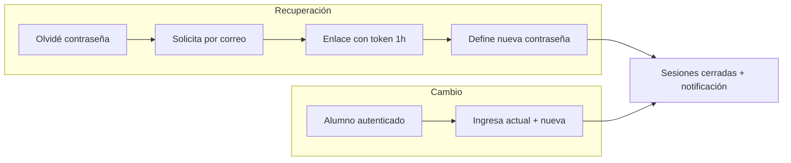
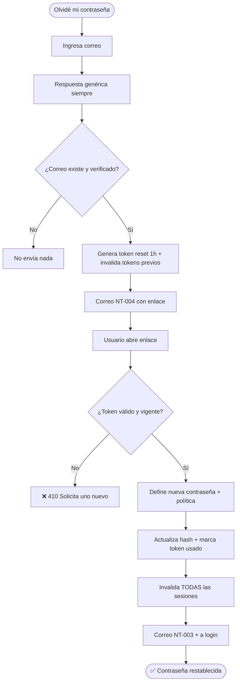
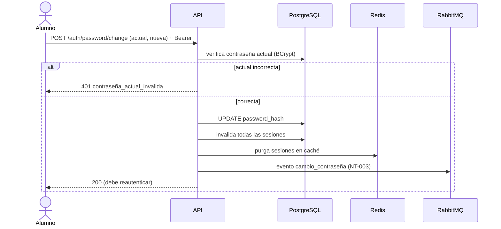
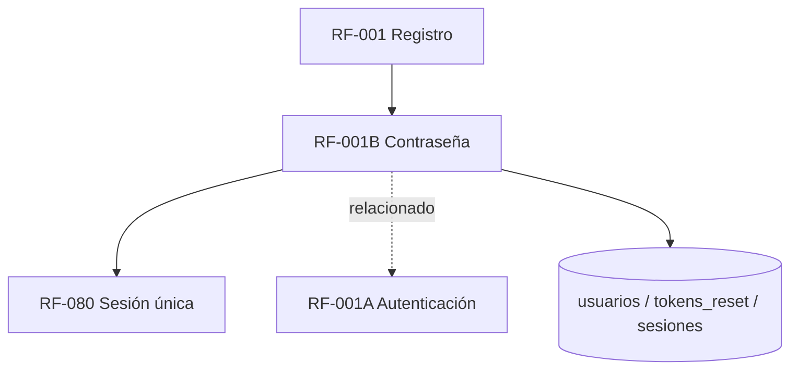

# RF-001B: Recuperación y Cambio de Contraseña

---

## Índice del Documento
- [1. 📋 Información General](#1--información-general)
- [2. 📜 Histórico de Cambios](#2--histórico-de-cambios)
- [3. 📖 Introducción del Requerimiento](#3--introducción-del-requerimiento)
- [4. 🎯 Objetivo Principal](#4--objetivo-principal)
- [5. 📊 Diagramas del Requerimiento](#5--diagramas-del-requerimiento)
- [6. 📝 Especificación de Datos](#6--especificación-de-datos)
- [7. ✅ Validaciones](#7--validaciones)
- [8. 🔒 Reglas de Negocio](#8--reglas-de-negocio)
- [9. ⚙️ Requerimientos No Funcionales](#9--requerimientos-no-funcionales)
- [10. 🖼️ Mockups / Estados de Pantalla](#10--mockups--estados-de-pantalla)
- [11. ✨ Criterios de Aceptación](#11--criterios-de-aceptación)
- [12. 🛠️ Especificación Técnica](#12--especificación-técnica)
- [13. 🧪 Casos de Prueba](#13--casos-de-prueba)
- [14. 📎 Trazabilidad](#14--trazabilidad)

---

## 1. 📋 Información General

| Campo | Valor |
|-------|-------|
| **ID** | RF-001B |
| **Nombre** | Recuperación y Cambio de Contraseña |
| **Módulo** | [MOD-02 Identidad y acceso](../04-modulos/modulos-secciones.md) |
| **Versión** | v1.0.0 |
| **Fecha creación** | 2026-06-18 |
| **Estado** | En análisis |
| **Prioridad** | 🔴 CRÍTICA |
| **Complejidad** | 🟡 Media |
| **Autor** | Equipo de análisis |
| **RF relacionados** | RF-001 (Registro) · RF-001A (Autenticación) · RF-080 (Sesión única) |
| **Caso de uso** | CU-003 Recuperar contraseña |

**Avance:** `[████████░░] análisis`

---

## 2. 📜 Histórico de Cambios

| Versión | Fecha | Autor | Descripción | Tipo |
|---------|-------|-------|-------------|------|
| v1.0.0 | 2026-06-18 | Equipo de análisis | Creación con estructura completa | Nueva |

---

## 3. 📖 Introducción del Requerimiento

### 3.1 Descripción general
Cubre dos flujos: **(a) Recuperación** de contraseña olvidada mediante enlace por correo (usuario no autenticado), y **(b) Cambio** de contraseña por un alumno autenticado que conoce su contraseña actual. Ambos refuerzan la seguridad de la cuenta y, por política, **cierran las sesiones activas** tras el cambio.

### 3.2 Contexto del negocio


### 3.3 Problema que resuelve
| # | Problema | Impacto | Solución |
|---|----------|---------|----------|
| 1 | Usuario pierde acceso por olvido | Abandono / soporte | Auto-recuperación por correo |
| 2 | Credenciales comprometidas | Cuenta secuestrada | Cambio + cierre de sesiones |
| 3 | Enlaces de reset reutilizables | Riesgo de robo de cuenta | Token un solo uso, 1 h |
| 4 | Enumeración de correos | Filtra qué correos existen | Respuesta genérica siempre |

### 3.4 Beneficios esperados
- ✅ Recuperación autónoma sin soporte.
- ✅ Reacción rápida ante compromiso (cambio + logout global).
- ✅ Protección anti-enumeración y anti-fuerza bruta.

---

## 4. 🎯 Objetivo Principal

### 4.1 Objetivo general
> Permitir recuperar y cambiar la contraseña de forma segura, invalidando sesiones y tokens previos tras un cambio efectivo.

### 4.2 Objetivos específicos
| # | Objetivo | Métrica | Meta |
|---|----------|---------|------|
| O1 | Recuperación autónoma | % resueltos sin soporte | > 95% |
| O2 | Tokens de un solo uso | Reusos exitosos | 0 |
| O3 | Cerrar sesiones al cambiar | Sesiones activas tras cambio | 0 |
| O4 | Anti-enumeración | Respuestas que revelan existencia | 0 |

### 4.3 Alcance funcional

**✅ Incluido**
| Funcionalidad | Descripción |
|---------------|-------------|
| Solicitar recuperación | Por correo; respuesta genérica |
| Token de reset | Un solo uso, expira en 1 h |
| Definir nueva contraseña | Aplica política de contraseña |
| Cambio autenticado | Requiere contraseña actual |
| Cierre de sesiones | Invalida todas las sesiones tras el cambio |
| Notificación | Correo de cambio realizado (NT-003) |

**❌ Excluido**
| Funcionalidad | Razón | Referencia |
|---------------|-------|------------|
| Recuperación por SMS | Fase posterior | Roadmap |
| Preguntas de seguridad | Práctica insegura, descartada | — |

---

## 5. 📊 Diagramas del Requerimiento

### 5.1 Flujo de recuperación


### 5.2 Secuencia de cambio autenticado


---

## 6. 📝 Especificación de Datos

### 6.1 Campos de entrada
| Flujo | Campo | Tipo | Obligatorio | Validación |
|-------|-------|------|:-----------:|-----------|
| Recuperar (solicitar) | email | string | Sí | RFC 5322 |
| Recuperar (confirmar) | token | string | Sí | Válido, vigente, no usado |
| Recuperar (confirmar) | nueva_password | string | Sí | Política V-001B-04 |
| Cambio | password_actual | string | Sí | Coincide con hash |
| Cambio | nueva_password | string | Sí | Política + ≠ actual |

### 6.2 Tabla `tokens_reset`
```sql
CREATE TABLE tokens_reset (
  id UUID PRIMARY KEY DEFAULT gen_random_uuid(),
  usuario_id UUID NOT NULL REFERENCES usuarios(id) ON DELETE CASCADE,
  token_hash VARCHAR(128) NOT NULL UNIQUE,
  expira TIMESTAMP NOT NULL,          -- now() + 1h
  usado_en TIMESTAMP,
  creado_en TIMESTAMP DEFAULT now()
);
CREATE INDEX idx_reset_usuario ON tokens_reset(usuario_id) WHERE usado_en IS NULL;
```

---

## 7. ✅ Validaciones

| ID | Descripción | Tipo |
|----|-------------|------|
| V-001B-01 | El correo cumple formato RFC 5322 | Formato |
| V-001B-02 | Respuesta genérica independientemente de si el correo existe | Seguridad |
| V-001B-03 | Token de reset existe, no usado y no expirado (1 h) | BD/Tiempo |
| V-001B-04 | Nueva contraseña cumple política (≥8, may/min/dígito) | Política |
| V-001B-05 | En cambio: la contraseña actual coincide (BCrypt) | Cripto |
| V-001B-06 | La nueva contraseña es distinta de la actual | Lógica |
| V-001B-07 | Rate limit en solicitudes de recuperación por IP/correo | Caché |

---

## 8. 🔒 Reglas de Negocio

**RN-001B-01 — Respuesta genérica.** La solicitud de recuperación siempre responde igual, exista o no el correo (anti-enumeración, OWASP).

**RN-001B-02 — Token de un solo uso, 1 h.** Al usarse o expirar deja de servir; una nueva solicitud invalida las anteriores.

**RN-001B-03 — Cambio cierra todas las sesiones.** Tras un cambio efectivo (recuperación o cambio autenticado), se invalidan **todas** las sesiones del usuario (refuerza [RN-030](../06-reglas-negocio/reglas-principales.md)).

**RN-001B-04 — Notificación obligatoria.** Todo cambio de contraseña dispara NT-003 al titular.

**RN-001B-05 — Política de contraseña.** Igual que en registro ([RF-001](RF-001-registro.md)).

**RN-001B-06 — Nunca en texto plano.** Hash BCrypt; jamás en logs ([RN-071](../06-reglas-negocio/reglas-principales.md)).

**RN-001B-07 — Recuperación solo para cuentas verificadas.** Una cuenta no verificada usa el flujo de reenvío de verificación, no el de reset.

---

## 9. ⚙️ Requerimientos No Funcionales

| RNF | Descripción |
|-----|-------------|
| RNF-001B-01 | TLS/HTTPS en todos los endpoints |
| RNF-001B-02 | Rate limiting en solicitar recuperación ([RNF-003](00-catalogo-requerimientos.md)) |
| RNF-001B-03 | Token de reset con suficiente entropía (≥128 bits) |
| RNF-001B-04 | Mensajes anti-enumeración |
| RNF-001B-05 | BCrypt cost ≥ 12 |

---

## 10. 🖼️ Mockups / Estados de Pantalla

Referencia: [EP-014 Recuperar / cambiar contraseña](../11-ux-estados-pantalla/estados-pantalla-iniciales.md#ep-014--recuperar--cambiar-contraseña).

```
Recuperar:                          Definir nueva:
┌───────────────────────┐           ┌───────────────────────┐
│ Recuperar contraseña  │           │ Nueva contraseña       │
│ Correo [____________] │           │ [__________________]   │
│   [ Enviar enlace ]   │           │ Confirmar [_________]  │
│ "Si el correo existe, │           │   [ Guardar ]          │
│  te enviamos pasos."  │           └───────────────────────┘
└───────────────────────┘
```

---

## 11. ✨ Criterios de Aceptación

```gherkin
Scenario: Solicitud de recuperación (correo existente)
  Given un alumno verificado
  When solicita recuperar su contraseña con su correo
  Then recibe respuesta genérica de éxito
  And se envía un correo con enlace de reset (token 1h)

Scenario: Solicitud con correo inexistente
  Given un correo no registrado
  When solicita recuperación
  Then recibe la misma respuesta genérica
  And no se envía ningún correo

Scenario: Reset con token válido cierra sesiones
  Given un token de reset vigente y no usado
  When define una nueva contraseña válida
  Then la contraseña se actualiza
  And todas las sesiones activas quedan invalidadas
  And se envía la notificación NT-003

Scenario: Token de reset caducado
  Given un token de reset con más de 1 hora
  When intenta usarlo
  Then recibe 410 y opción de solicitar uno nuevo

Scenario: Cambio autenticado con contraseña actual incorrecta
  Given un alumno autenticado
  When envía una contraseña actual incorrecta
  Then recibe 401 y no se cambia nada
```

---

## 12. 🛠️ Especificación Técnica

### 12.1 Endpoints

**`POST /api/v1/auth/password/forgot`**
```
Request:  { "email": "..." }
200:      { "message": "Si el correo existe, te enviamos instrucciones" }   // siempre
429:      { "error": "rate_limited", "retry_after": 600 }
```

**`POST /api/v1/auth/password/reset`**
```
Request:  { "token": "...", "nueva_password": "..." }
200:      { "message": "Contraseña restablecida. Inicia sesión." }
410:      { "error": "token_expirado" }
422:      { "error": "politica_contrasena" }
```

**`POST /api/v1/auth/password/change`** (autenticado)
```
Header:   Authorization: Bearer <access_token>
Request:  { "password_actual": "...", "nueva_password": "..." }
200:      { "message": "Contraseña actualizada. Vuelve a iniciar sesión." }
401:      { "error": "contrasena_actual_invalida" }
422:      { "error": "politica_contrasena" | "misma_contrasena" }
```

### 12.2 Servicio (pseudocódigo)
```typescript
async forgot(email, ip) {
  await this.rateLimit(ip, email);                 // V-001B-07
  const u = await db.usuarios.findByEmail(email);
  if (u && u.email_verificado) {                   // RN-001B-07
    await db.tokens_reset.invalidatePrev(u.id);    // RN-001B-02
    const token = this.genSecureToken();           // RNF-001B-03
    await db.tokens_reset.create({ usuario_id: u.id, token_hash: hash(token), expira: now()+1h });
    await mq.publish('reset_password', { usuarioId: u.id, token });  // NT-004
  }
  return genericOk();                              // RN-001B-01
}

async reset(token, nueva) {
  const t = await db.tokens_reset.findValid(hash(token));   // V-001B-03
  if (!t) throw Gone('token_expirado');
  this.validatePolicy(nueva);                                // V-001B-04
  await db.usuarios.updatePassword(t.usuario_id, await bcrypt.hash(nueva, 12));
  await db.tokens_reset.markUsed(t.id);
  await db.sesiones.invalidarTodas(t.usuario_id);            // RN-001B-03
  await mq.publish('cambio_contrasena', { usuarioId: t.usuario_id });  // NT-003
}
```

---

## 13. 🧪 Casos de Prueba

| ID | Escenario | Traza | Tipo |
|----|-----------|-------|------|
| TC-001B-01 | Solicitud con correo existente envía enlace | V-001B-01/02, RN-001B-02 | Positivo |
| TC-001B-02 | Solicitud con correo inexistente → misma respuesta, sin correo | RN-001B-01 | Negativo |
| TC-001B-03 | Reset con token válido actualiza contraseña | V-001B-03/04 | Positivo |
| TC-001B-04 | Reset cierra todas las sesiones | RN-001B-03 | Positivo |
| TC-001B-05 | Token de reset reutilizado → 410 | RN-001B-02 | Negativo |
| TC-001B-06 | Token de reset caducado → 410 | V-001B-03 | Borde |
| TC-001B-07 | Reset con contraseña débil → 422 | V-001B-04 | Negativo |
| TC-001B-08 | Cambio autenticado con actual correcta | V-001B-05 | Positivo |
| TC-001B-09 | Cambio con actual incorrecta → 401 | V-001B-05 | Negativo |
| TC-001B-10 | Cambio con nueva = actual → 422 | V-001B-06 | Negativo |
| TC-001B-11 | Exceso de solicitudes → 429 | V-001B-07 | Borde |

---

## 14. 📎 Trazabilidad

### 14.1 Documentos relacionados
| Tipo | Referencia |
|------|------------|
| Reglas | [RN-030](../06-reglas-negocio/reglas-principales.md) · [RNA-004](../06-reglas-negocio/reglas-alternas.md) |
| Estados de pantalla | [EP-014](../11-ux-estados-pantalla/estados-pantalla-iniciales.md) |
| Notificaciones | NT-003 (cambio) · NT-004 (recuperación) — ver [notificaciones](../12-notificaciones/notificaciones.md) |
| Modelo de datos | [ERD: usuarios, sesiones](../09-diagramas/03-modelo-datos-erd.md) |
| Requerimientos | RF-001 · RF-001A · RF-080 |

### 14.2 Matriz de trazabilidad
| Regla | Endpoint | Validación | Caso de prueba |
|-------|----------|------------|----------------|
| RN-001B-01 | POST /password/forgot | V-001B-02 | TC-001B-02 |
| RN-001B-02 | POST /password/reset | V-001B-03 | TC-001B-05, TC-001B-06 |
| RN-001B-03 | POST /password/reset, /change | — | TC-001B-04 |
| RN-001B-05 | POST /password/reset, /change | V-001B-04 | TC-001B-07 |

### 14.3 Dependencias


<!-- FOOTER:ALEXANDRYA -->

---

<sub>📄 **Alexandrya** · `docs/05-requerimientos/RF-001B-recuperacion-contrasena.md` · Versión documental **v0.3.0** · Actualizado **2026-06-19** · 🏠 [Índice](../README.md) · 💬 [Mensajes del sistema](../14-mensajes-sistema/mensajes-sistema.md)</sub>
