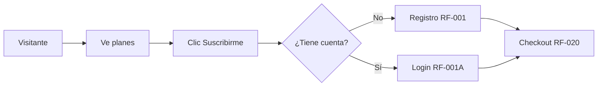
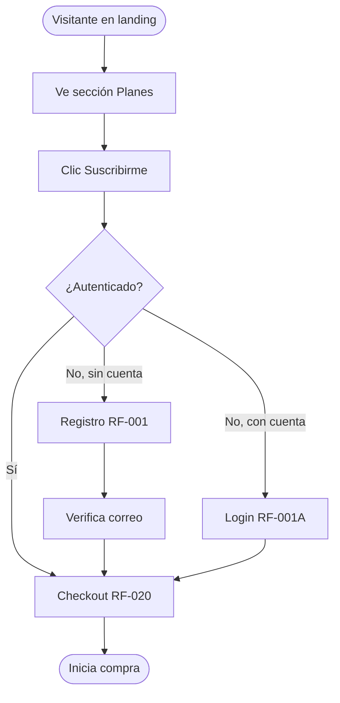
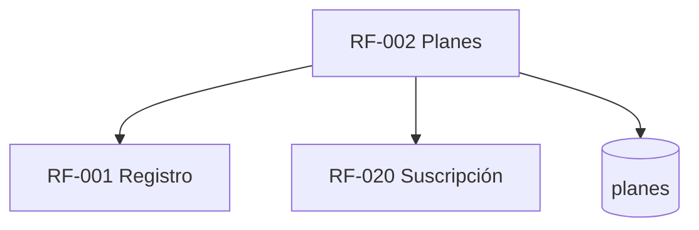

# RF-002: Planes y Compra desde la Landing

---

## Índice del Documento
- [1. 📋 Información General](#1--información-general)
- [2. 📜 Histórico de Cambios](#2--histórico-de-cambios)
- [3. 📖 Introducción del Requerimiento](#3--introducción-del-requerimiento)
- [4. 🎯 Objetivo Principal](#4--objetivo-principal)
- [5. 📊 Diagramas del Requerimiento](#5--diagramas-del-requerimiento)
- [6. 📝 Especificación de Datos](#6--especificación-de-datos)
- [7. ✅ Validaciones](#7--validaciones)
- [8. 🔒 Reglas de Negocio](#8--reglas-de-negocio)
- [9. ⚙️ Requerimientos No Funcionales](#9--requerimientos-no-funcionales)
- [10. 🖼️ Mockups / Estados de Pantalla](#10--mockups--estados-de-pantalla)
- [11. ✨ Criterios de Aceptación](#11--criterios-de-aceptación)
- [12. 🛠️ Especificación Técnica](#12--especificación-técnica)
- [13. 🧪 Casos de Prueba](#13--casos-de-prueba)
- [14. 📎 Trazabilidad](#14--trazabilidad)

---

## 1. 📋 Información General

| Campo | Valor |
|-------|-------|
| **ID** | RF-002 |
| **Nombre** | Planes y Compra desde la Landing |
| **Módulo** | [MOD-01 Landing pública](../04-modulos/modulos-secciones.md) |
| **Versión** | v1.0.0 |
| **Fecha creación** | 2026-06-18 |
| **Estado** | En análisis |
| **Prioridad** | 🔴 CRÍTICA |
| **Complejidad** | 🟡 Media |
| **Autor** | Equipo de análisis |
| **RF relacionados** | RF-001 (Registro) · RF-020 (Suscripción) · RF-070 (Referidos) |
| **Caso de uso** | CU-010 Explorar landing y elegir plan |

**Avance:** `[████████░░] análisis`

---

## 2. 📜 Histórico de Cambios

| Versión | Fecha | Autor | Descripción | Tipo |
|---------|-------|-------|-------------|------|
| v1.0.0 | 2026-06-18 | Equipo de análisis | Creación con estructura completa | Nueva |

---

## 3. 📖 Introducción del Requerimiento

### 3.1 Descripción general
Presenta en la landing pública el/los **planes de suscripción** con su precio en MXN, beneficios y un CTA que inicia el embudo de compra: registro (si no tiene cuenta) → checkout ([RF-020](RF-020-contratacion-suscripcion.md)). Es la principal palanca de conversión del producto.

### 3.2 Contexto del negocio


### 3.3 Problema que resuelve
| # | Problema | Impacto | Solución |
|---|----------|---------|----------|
| 1 | Visitante no entiende qué obtiene | No convierte | Plan con beneficios claros |
| 2 | Precio poco transparente | Desconfianza | Precio visible en MXN |
| 3 | Fricción para comprar | Abandono del embudo | CTA directo a checkout |

### 3.4 Beneficios esperados
- ✅ Conversión medible visitante → pago.
- ✅ Comunicación clara del valor y precio.
- ✅ Base para promociones y descuentos futuros.

---

## 4. 🎯 Objetivo Principal

### 4.1 Objetivo general
> Mostrar los planes vigentes con su precio y conducir al visitante al embudo de compra con la menor fricción posible.

### 4.2 Objetivos específicos
| # | Objetivo | Métrica | Meta |
|---|----------|---------|------|
| O1 | Mostrar plan vigente | Plan configurado activo | 100% |
| O2 | Iniciar embudo de compra | Clics CTA → checkout | medible |
| O3 | Soportar precios configurables | Cambios sin desplegar | 100% |

### 4.3 Alcance funcional

**✅ Incluido**
| Funcionalidad | Descripción |
|---------------|-------------|
| Catálogo de planes | Plan anual con precio MXN, beneficios |
| CTA de compra | Encadena registro/login → checkout |
| Precio configurable | Desde administración (sin deploy) |
| Comparativa de beneficios | Qué incluye la suscripción |

**❌ Excluido**
| Funcionalidad | Razón | Referencia |
|---------------|-------|------------|
| Procesamiento de pago | Otro requerimiento | RF-020 |
| Cupones/descuentos | Fase posterior | Roadmap Año 2 |
| Planes mensuales / por materia | Modelo es anual global | [Visión](../01-vision/vision-producto.md) |

---

## 5. 📊 Diagramas del Requerimiento

### 5.1 Flujo de selección de plan


---

## 6. 📝 Especificación de Datos

### 6.1 Campos de salida (plan)
| Campo | Tipo | Descripción |
|-------|------|-------------|
| id | UUID | Identificador del plan |
| nombre | string | "Plan Anual Alexandrya" |
| precio | decimal | Monto en MXN |
| moneda | string | "MXN" |
| duracion_dias | int | 365 |
| beneficios | string[] | Lista de beneficios |
| activo | bool | Visible en landing |

### 6.2 Tabla `planes`
```sql
CREATE TABLE planes (
  id UUID PRIMARY KEY DEFAULT gen_random_uuid(),
  nombre VARCHAR(120) NOT NULL,
  precio NUMERIC(10,2) NOT NULL CHECK (precio >= 0),
  moneda CHAR(3) NOT NULL DEFAULT 'MXN',
  duracion_dias INT NOT NULL DEFAULT 365,
  beneficios JSONB NOT NULL DEFAULT '[]',
  activo BOOLEAN NOT NULL DEFAULT TRUE,
  orden INT DEFAULT 0
);
```

---

## 7. ✅ Validaciones

| ID | Descripción | Tipo |
|----|-------------|------|
| V-002-01 | Solo se muestran planes con `activo = true` | BD |
| V-002-02 | Precio ≥ 0 y moneda válida (MXN) | Datos |
| V-002-03 | El CTA solo procede si hay un plan activo | Lógica |
| V-002-04 | El plan seleccionado existe al iniciar checkout | BD |

---

## 8. 🔒 Reglas de Negocio

**RN-002-01 — Precio y planes configurables.** Se administran como datos; cambiar el precio no requiere desplegar código.

**RN-002-02 — Compra requiere cuenta.** Si el visitante no tiene cuenta, el CTA lo lleva a registro antes del checkout ([RF-001](RF-001-registro.md)).

**RN-002-03 — Modelo anual global.** Un único tipo de plan: acceso total por 365 días ([RN-011](../06-reglas-negocio/reglas-principales.md)).

**RN-002-04 — Atribución de referido.** Si el visitante llegó con código de referido, se conserva a lo largo del embudo hasta el pago ([RF-070](00-indice-requerimientos.md)).

---

## 9. ⚙️ Requerimientos No Funcionales

| RNF | Descripción |
|-----|-------------|
| RNF-002-01 | Landing indexable (SEO) y rápida (LCP ≤ 2.5 s) ([RNF-015](00-catalogo-requerimientos.md)) |
| RNF-002-02 | Responsiva y accesible (WCAG AA) ([RNF-033](00-catalogo-requerimientos.md)) |
| RNF-002-03 | Precio servido desde caché para alta concurrencia |

---

## 10. 🖼️ Mockups / Estados de Pantalla

Referencia: [EP-002 Planes y precios](../11-ux-estados-pantalla/estados-pantalla-iniciales.md#ep-002--planes-y-precios).

---

## 11. ✨ Criterios de Aceptación

```gherkin
Scenario: Visitante ve el plan vigente
  Given existe un plan activo configurado
  When un visitante abre la sección de planes
  Then ve el nombre, precio en MXN y beneficios

Scenario: CTA inicia el embudo
  Given un visitante sin cuenta
  When hace clic en "Suscribirme"
  Then es dirigido al registro y luego al checkout

Scenario: Cambio de precio sin deploy
  Given un administrador cambia el precio del plan
  When un visitante recarga la landing
  Then ve el nuevo precio sin requerir despliegue
```

---

## 12. 🛠️ Especificación Técnica

### 12.1 Endpoints
```
GET /api/v1/planes            -> [ { id, nombre, precio, moneda, duracion_dias, beneficios } ]  (público, cacheado)
POST /api/v1/admin/planes     -> crear/editar plan (admin)
```

---

## 13. 🧪 Casos de Prueba

| ID | Escenario | Traza | Tipo |
|----|-----------|-------|------|
| TC-002-01 | Landing muestra plan activo con precio MXN | V-002-01/02 | Positivo |
| TC-002-02 | Plan inactivo no se muestra | V-002-01 | Negativo |
| TC-002-03 | CTA sin cuenta → registro → checkout | RN-002-02 | Positivo |
| TC-002-04 | Cambio de precio refleja sin deploy | RN-002-01 | Positivo |
| TC-002-05 | Código de referido se conserva hasta checkout | RN-002-04 | Positivo |

---

## 14. 📎 Trazabilidad

### 14.1 Documentos relacionados
| Tipo | Referencia |
|------|------------|
| Reglas | [RN-011](../06-reglas-negocio/reglas-principales.md) |
| Estados de pantalla | [EP-002](../11-ux-estados-pantalla/estados-pantalla-iniciales.md) |
| Requerimientos | RF-001 · RF-020 · RF-070 |

### 14.2 Matriz de trazabilidad
| Regla | Endpoint | Validación | Caso de prueba |
|-------|----------|------------|----------------|
| RN-002-01 | GET /planes | V-002-01 | TC-002-04 |
| RN-002-02 | CTA | V-002-03 | TC-002-03 |

### 14.3 Dependencias


<!-- FOOTER:ALEXANDRYA -->

---

<sub>📄 **Alexandrya** · `docs/05-requerimientos/RF-002-planes-compra.md` · Versión documental **v0.3.0** · Actualizado **2026-06-19** · 🏠 [Índice](../README.md) · 💬 [Mensajes del sistema](../14-mensajes-sistema/mensajes-sistema.md)</sub>
