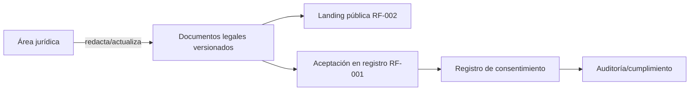
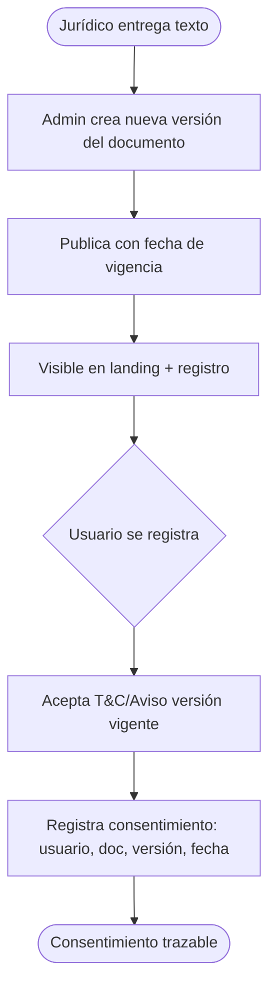
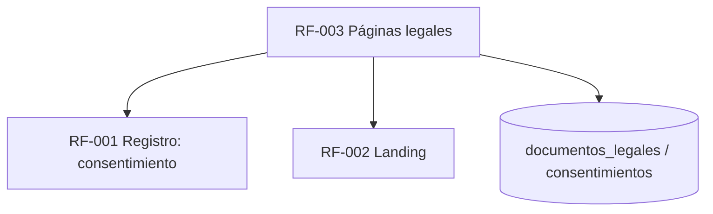

# RF-003: Páginas Legales (Aviso de Privacidad, T&C, Política de Uso)

> 🧾 **Naturaleza del requerimiento:** es principalmente una **tarea de contenido/legal**, no de lógica de negocio. La función del sistema es mostrar, versionar y registrar la aceptación de documentos legales; el **texto legal lo provee el área jurídica**. Por eso las secciones técnicas son ligeras y el foco está en cumplimiento, versionado y consentimiento.

---

## Índice del Documento
- [1. 📋 Información General](#1--información-general)
- [2. 📜 Histórico de Cambios](#2--histórico-de-cambios)
- [3. 📖 Introducción del Requerimiento](#3--introducción-del-requerimiento)
- [4. 🎯 Objetivo Principal](#4--objetivo-principal)
- [5. 📊 Diagramas del Requerimiento](#5--diagramas-del-requerimiento)
- [6. 📝 Especificación de Datos](#6--especificación-de-datos)
- [7. ✅ Validaciones](#7--validaciones)
- [8. 🔒 Reglas de Negocio](#8--reglas-de-negocio)
- [9. ⚙️ Requerimientos No Funcionales](#9--requerimientos-no-funcionales)
- [10. 🖼️ Mockups / Estados de Pantalla](#10--mockups--estados-de-pantalla)
- [11. ✨ Criterios de Aceptación](#11--criterios-de-aceptación)
- [12. 🛠️ Especificación Técnica](#12--especificación-técnica)
- [13. 🧪 Casos de Prueba](#13--casos-de-prueba)
- [14. 📎 Trazabilidad](#14--trazabilidad)
- [15. 📋 Checklist de contenido legal (tarea jurídica)](#15--checklist-de-contenido-legal-tarea-jurídica)

---

## 1. 📋 Información General

| Campo | Valor |
|-------|-------|
| **ID** | RF-003 |
| **Nombre** | Páginas Legales (Aviso de Privacidad, T&C, Política de Uso) |
| **Módulo** | [MOD-01 Landing pública](../04-modulos/modulos-secciones.md) |
| **Versión** | v1.0.0 |
| **Fecha creación** | 2026-06-19 |
| **Estado** | En análisis (contenido legal pendiente de jurídico) |
| **Prioridad** | 🟡 Media (🔴 bloqueante para producción por cumplimiento) |
| **Complejidad** | 🟢 Baja (técnica) / 🟠 Media (legal) |
| **Autor** | Equipo de análisis |
| **RF relacionados** | RF-001 (Registro: consentimiento) · RF-002 (Landing) · RF-070 (Datos personales) |
| **Caso de uso** | Parte de CU-010 Explorar landing |

**Avance:** `[██████░░░░] análisis · contenido legal pendiente`

---

## 2. 📜 Histórico de Cambios

| Versión | Fecha | Autor | Descripción | Tipo |
|---------|-------|-------|-------------|------|
| v1.0.0 | 2026-06-19 | Equipo de análisis | Creación con estructura completa | Nueva |

---

## 3. 📖 Introducción del Requerimiento

### 3.1 Descripción general
Publica y mantiene las páginas legales de Alexandrya: **Aviso de Privacidad**, **Términos y Condiciones** y **Política de Uso**. El sistema debe **versionar** estos documentos, mostrarlos públicamente y **registrar la aceptación** del usuario en el registro (RF-001), conforme a la normativa mexicana de protección de datos (LFPDPPP).

### 3.2 Contexto del negocio


### 3.3 Problema que resuelve
| # | Problema | Impacto | Solución |
|---|----------|---------|----------|
| 1 | Operar sin marco legal | Riesgo legal/sanciones | Publicar documentos obligatorios |
| 2 | No probar consentimiento | Incumplimiento LFPDPPP | Registro de aceptación con versión |
| 3 | Documentos desactualizados | Inconsistencia legal | Versionado y vigencia |

### 3.4 Beneficios esperados
- ✅ Cumplimiento legal para operar en México.
- ✅ Evidencia de consentimiento del usuario (qué versión y cuándo).
- ✅ Transparencia hacia el usuario.

---

## 4. 🎯 Objetivo Principal

### 4.1 Objetivo general
> Publicar y versionar las páginas legales y registrar la aceptación del usuario de forma trazable, cumpliendo la normativa de datos personales.

### 4.2 Objetivos específicos
| # | Objetivo | Métrica | Meta |
|---|----------|---------|------|
| O1 | Documentos publicados | Aviso, T&C y Política disponibles | 3/3 |
| O2 | Versionado | Cambios sin versión | 0 |
| O3 | Consentimiento registrado | Registros sin versión aceptada | 0 |
| O4 | Accesibilidad | Documentos enlazados en landing y registro | 100% |

### 4.3 Alcance funcional

**✅ Incluido**
| Funcionalidad | Descripción |
|---------------|-------------|
| Publicación | Aviso de Privacidad, T&C, Política de Uso |
| Versionado | Cada documento tiene versión y fecha de vigencia |
| Enlaces | Desde footer de landing y desde el registro |
| Registro de aceptación | Qué versión aceptó el usuario y cuándo |
| Edición desde admin | Publicar nueva versión sin desplegar código |

**❌ Excluido**
| Funcionalidad | Razón | Referencia |
|---------------|-------|------------|
| Redacción del texto legal | Responsabilidad de jurídico | Sección 15 |
| Gestión de cookies avanzada (CMP) | Evaluar fase posterior | Roadmap |
| Reconsentimiento masivo automatizado | Fase posterior | — |

---

## 5. 📊 Diagramas del Requerimiento

### 5.1 Publicación y consentimiento


---

## 6. 📝 Especificación de Datos

### 6.1 Tablas
```sql
CREATE TABLE documentos_legales (
  id UUID PRIMARY KEY DEFAULT gen_random_uuid(),
  tipo VARCHAR(20) NOT NULL CHECK (tipo IN ('aviso_privacidad','terminos','politica_uso')),
  version VARCHAR(20) NOT NULL,
  contenido_html TEXT NOT NULL,
  vigente_desde TIMESTAMP NOT NULL,
  vigente BOOLEAN NOT NULL DEFAULT FALSE,
  creado_en TIMESTAMP DEFAULT now(),
  UNIQUE (tipo, version)
);
CREATE UNIQUE INDEX uniq_doc_vigente ON documentos_legales(tipo) WHERE vigente;

CREATE TABLE consentimientos (
  id UUID PRIMARY KEY DEFAULT gen_random_uuid(),
  usuario_id UUID NOT NULL REFERENCES usuarios(id),
  documento_id UUID NOT NULL REFERENCES documentos_legales(id),
  aceptado_en TIMESTAMP DEFAULT now(),
  ip INET
);
CREATE INDEX idx_consent_usuario ON consentimientos(usuario_id);
```

---

## 7. ✅ Validaciones

| ID | Descripción | Tipo |
|----|-------------|------|
| V-003-01 | Existe una versión vigente por cada tipo de documento | BD |
| V-003-02 | Solo un documento vigente por tipo a la vez | BD |
| V-003-03 | El registro (RF-001) exige aceptar la versión vigente de T&C/Aviso | Negocio |
| V-003-04 | El consentimiento guarda usuario, documento, versión y fecha | BD |
| V-003-05 | Publicar nueva versión no borra las anteriores (historial) | BD |
| V-003-06 | Solo administrador publica versiones legales | Auth |

---

## 8. 🔒 Reglas de Negocio

**RN-003-01 — Documentos obligatorios.** Aviso de Privacidad, T&C y Política de Uso deben estar publicados y accesibles para operar.

**RN-003-02 — Versionado e historial.** Cada documento se versiona; las versiones previas se conservan para evidencia ([RN-006 espíritu](../06-reglas-negocio/reglas-principales.md)).

**RN-003-03 — Consentimiento en el registro.** El alta exige aceptar la versión vigente; se registra qué versión y cuándo ([RF-001](RF-001-registro.md) RN-001-07).

**RN-003-04 — Cumplimiento LFPDPPP.** El tratamiento de datos personales se rige por el Aviso de Privacidad ([RN-070](../06-reglas-negocio/reglas-principales.md), [RNF-005](00-catalogo-requerimientos.md)).

**RN-003-05 — Edición sin deploy.** Publicar una nueva versión es operación de administración, no de código ([RN-002-01 análogo](RF-002-planes-compra.md)).

**RN-003-06 — Solo administrador** publica/edita documentos legales ([actores](../03-actores/actores.md)).

> **Nota:** el texto legal es responsabilidad del área jurídica (ver [sección 15](#15--checklist-de-contenido-legal-tarea-jurídica)). El sistema garantiza publicación, versionado y consentimiento, no la suficiencia legal del contenido.

---

## 9. ⚙️ Requerimientos No Funcionales

| RNF | Descripción |
|-----|-------------|
| RNF-003-01 | Páginas indexables y accesibles (WCAG AA) ([RNF-033](00-catalogo-requerimientos.md)) |
| RNF-003-02 | Servidas vía CDN/caché por ser estáticas ([RNF-012](00-catalogo-requerimientos.md)) |
| RNF-003-03 | El registro de consentimiento es inmutable (evidencia) |
| RNF-003-04 | Datos personales conforme a LFPDPPP ([RNF-005](00-catalogo-requerimientos.md)) |

---

## 10. 🖼️ Mockups / Estados de Pantalla

Referencia: footer de [EP-001 Home](../11-ux-estados-pantalla/estados-pantalla-iniciales.md#ep-001--home--hero) y checkbox de [EP-010 Registro](../11-ux-estados-pantalla/estados-pantalla-iniciales.md#ep-010--registro).

```
Footer landing:
  Legal:  Aviso de Privacidad · Términos y Condiciones · Política de Uso

Registro:
  □ Acepto los Términos y el Aviso de Privacidad (v1.0, 19/06/2026)
```

---

## 11. ✨ Criterios de Aceptación

```gherkin
Scenario: Documentos legales accesibles
  Given un visitante en la landing
  When abre el footer
  Then puede ver el Aviso de Privacidad, los T&C y la Política de Uso vigentes

Scenario: Consentimiento en el registro
  Given un visitante que se registra
  When acepta T&C y Aviso de Privacidad
  Then se registra su consentimiento con la versión vigente y la fecha

Scenario: Publicar nueva versión sin deploy
  Given el administrador con texto aprobado por jurídico
  When publica una nueva versión y la marca vigente
  Then los usuarios ven la nueva versión sin desplegar código
  And las versiones anteriores se conservan

Scenario: Una sola versión vigente por tipo
  Given un tipo de documento con una versión vigente
  When se publica una nueva como vigente
  Then la anterior deja de ser vigente automáticamente

Scenario: Solo administrador edita
  Given un usuario sin rol administrador
  When intenta publicar un documento legal
  Then se le deniega el acceso
```

---

## 12. 🛠️ Especificación Técnica

### 12.1 Endpoints
```
GET  /api/v1/legal/{tipo}                 -> documento vigente (público, cacheado)
GET  /api/v1/legal/{tipo}/versiones       -> historial (admin)
POST /api/v1/admin/legal                  -> { tipo, version, contenido_html, vigente_desde } (admin)
PUT  /api/v1/admin/legal/{id}/publicar    -> marca vigente (admin)
# El consentimiento se registra dentro de POST /auth/register (RF-001)
```

### 12.2 Registro de consentimiento (en el registro)
```typescript
// dentro de register() de RF-001
const vigentes = await db.legal.vigentes(['terminos','aviso_privacidad']); // V-003-01
if (!dto.acepta_terminos) throw Unprocessable('acepta_terminos');          // RN-003-03
for (const doc of vigentes)
  await db.consentimientos.crear({ usuario_id: user.id, documento_id: doc.id, ip }); // V-003-04
```

---

## 13. 🧪 Casos de Prueba

| ID | Escenario | Traza | Tipo |
|----|-----------|-------|------|
| TC-003-01 | Landing muestra los 3 documentos vigentes | V-003-01 | Positivo |
| TC-003-02 | Registro guarda consentimiento con versión y fecha | V-003-04, RN-003-03 | Positivo |
| TC-003-03 | Publicar nueva versión desactiva la anterior | V-003-02, RN-003-02 | Positivo |
| TC-003-04 | Versiones anteriores se conservan | V-003-05 | Positivo |
| TC-003-05 | Usuario no admin no publica → 403 | V-003-06, RN-003-06 | Negativo |
| TC-003-06 | Registro sin aceptar términos → 422 | V-003-03, RN-003-03 | Negativo |

---

## 14. 📎 Trazabilidad

### 14.1 Documentos relacionados
| Tipo | Referencia |
|------|------------|
| Reglas | [RN-070](../06-reglas-negocio/reglas-principales.md) |
| Estados de pantalla | [EP-001, EP-010](../11-ux-estados-pantalla/estados-pantalla-iniciales.md) |
| Modelo de datos | [ERD: usuarios](../09-diagramas/03-modelo-datos-erd.md) (+ documentos_legales, consentimientos) |
| Requerimientos | RF-001 (consentimiento) · RF-002 (landing) |
| No funcional | [RNF-005 LFPDPPP](00-catalogo-requerimientos.md) |

### 14.2 Matriz de trazabilidad
| Regla | Endpoint | Validación | Caso de prueba |
|-------|----------|------------|----------------|
| RN-003-02 | PUT /admin/legal/{id}/publicar | V-003-02/05 | TC-003-03, TC-003-04 |
| RN-003-03 | POST /auth/register | V-003-03/04 | TC-003-02, TC-003-06 |
| RN-003-06 | POST /admin/legal | V-003-06 | TC-003-05 |

### 14.3 Dependencias


---

## 15. 📋 Checklist de contenido legal (tarea jurídica)

> Esta lista es la **entrega que debe proveer el área jurídica**. El equipo de desarrollo no redacta este contenido; solo lo publica y versiona.

| # | Entregable | Responsable | Estado |
|---|------------|-------------|:------:|
| 1 | **Aviso de Privacidad** conforme a LFPDPPP: identidad y domicilio del responsable, datos recabados, finalidades, transferencias, medios para ejercer derechos ARCO, mecanismos de revocación del consentimiento | Jurídico | 🔜 Pendiente |
| 2 | **Términos y Condiciones**: objeto del servicio, suscripción y vigencia (1 año), pagos y renovación, política de reembolsos, propiedad intelectual del contenido, uso permitido, sesión única, causales de suspensión, limitación de responsabilidad, ley aplicable y jurisdicción (México) | Jurídico | 🔜 Pendiente |
| 3 | **Política de Uso**: conductas permitidas/prohibidas, prohibición de compartir cuenta y de copiar/redistribuir contenido (alineado a [RF-110](RF-110-proteccion-contenido.md)), consecuencias del incumplimiento | Jurídico | 🔜 Pendiente |
| 4 | **Política de cookies** (si aplica al lanzamiento) | Jurídico | 🔜 Pendiente |
| 5 | Versión y fecha de vigencia de cada documento | Jurídico + Admin | 🔜 Pendiente |
| 6 | Texto del consentimiento mostrado en el registro | Jurídico | 🔜 Pendiente |

**Datos del responsable a confirmar para el Aviso de Privacidad:** razón social, domicilio fiscal, correo de contacto para derechos ARCO.

<!-- FOOTER:ALEXANDRYA -->

---

<sub>📄 **Alexandrya** · `docs/05-requerimientos/RF-003-paginas-legales.md` · Versión documental **v0.3.0** · Actualizado **2026-06-19** · 🏠 [Índice](../README.md) · 💬 [Mensajes del sistema](../14-mensajes-sistema/mensajes-sistema.md)</sub>
