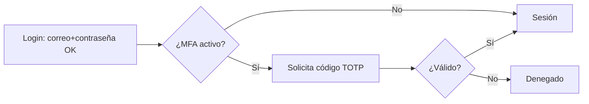
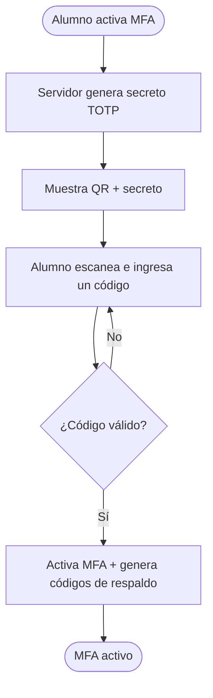
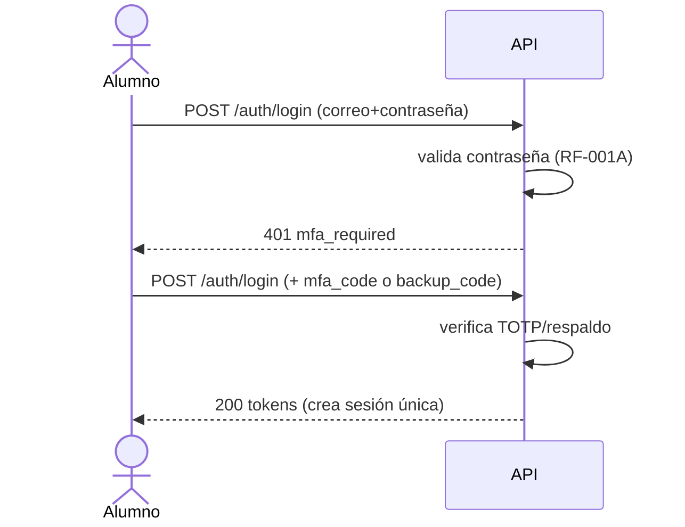
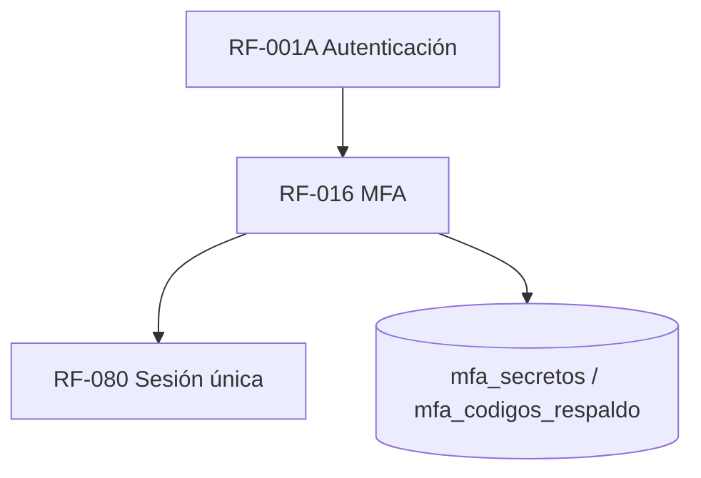

# RF-016: Autenticación Multifactor (MFA) Opcional

---

## Índice del Documento
- [1. 📋 Información General](#1--información-general)
- [2. 📜 Histórico de Cambios](#2--histórico-de-cambios)
- [3. 📖 Introducción del Requerimiento](#3--introducción-del-requerimiento)
- [4. 🎯 Objetivo Principal](#4--objetivo-principal)
- [5. 📊 Diagramas del Requerimiento](#5--diagramas-del-requerimiento)
- [6. 📝 Especificación de Datos](#6--especificación-de-datos)
- [7. ✅ Validaciones](#7--validaciones)
- [8. 🔒 Reglas de Negocio](#8--reglas-de-negocio)
- [9. ⚙️ Requerimientos No Funcionales](#9--requerimientos-no-funcionales)
- [10. 🖼️ Mockups / Estados de Pantalla](#10--mockups--estados-de-pantalla)
- [11. ✨ Criterios de Aceptación](#11--criterios-de-aceptación)
- [12. 🛠️ Especificación Técnica](#12--especificación-técnica)
- [13. 🧪 Casos de Prueba](#13--casos-de-prueba)
- [14. 📎 Trazabilidad](#14--trazabilidad)

---

## 1. 📋 Información General

| Campo | Valor |
|-------|-------|
| **ID** | RF-016 |
| **Nombre** | Autenticación Multifactor (MFA) Opcional |
| **Módulo** | [MOD-02 Identidad y acceso](../04-modulos/modulos-secciones.md) |
| **Versión** | v1.0.0 |
| **Fecha creación** | 2026-06-19 |
| **Estado** | En análisis |
| **Prioridad** | 🟡 Media |
| **Complejidad** | 🟠 Alta |
| **Autor** | Equipo de análisis |
| **RF relacionados** | RF-001A (Autenticación) · RF-001B (Contraseña) · RF-080 (Sesión única) |
| **Caso de uso** | Extiende CU-001 Iniciar sesión |

**Avance:** `[████████░░] análisis`

---

## 2. 📜 Histórico de Cambios

| Versión | Fecha | Autor | Descripción | Tipo |
|---------|-------|-------|-------------|------|
| v1.0.0 | 2026-06-19 | Equipo de análisis | Creación con estructura completa | Nueva |

---

## 3. 📖 Introducción del Requerimiento

### 3.1 Descripción general
Permite al alumno **activar opcionalmente** un segundo factor de autenticación (TOTP, p. ej. Google Authenticator) que se solicita tras validar la contraseña en el login. Incluye activación con verificación, **códigos de respaldo** y desactivación segura.

### 3.2 Contexto del negocio


### 3.3 Problema que resuelve
| # | Problema | Impacto | Solución |
|---|----------|---------|----------|
| 1 | Contraseña comprometida = cuenta tomada | Secuestro | Segundo factor |
| 2 | Usuarios quieren más seguridad | Confianza | MFA opcional |
| 3 | Pérdida del dispositivo MFA | Bloqueo del usuario | Códigos de respaldo |

### 3.4 Beneficios esperados
- ✅ Mayor seguridad de cuentas que lo activen.
- ✅ Confianza para usuarios sensibles.
- ✅ Recuperación de acceso con códigos de respaldo.

---

## 4. 🎯 Objetivo Principal

### 4.1 Objetivo general
> Ofrecer MFA basado en TOTP de forma opcional, integrándolo al login y a la sesión única, con activación verificada y mecanismo de respaldo.

### 4.2 Objetivos específicos
| # | Objetivo | Métrica | Meta |
|---|----------|---------|------|
| O1 | Activación verificada | Activaciones sin verificación | 0 |
| O2 | Login con segundo factor | Accesos sin 2º factor cuando MFA activo | 0 |
| O3 | Respaldo de acceso | Usuarios bloqueados sin recuperación | 0 |
| O4 | Desactivación segura | Desactivaciones sin reautenticación | 0 |

### 4.3 Alcance funcional

**✅ Incluido**
| Funcionalidad | Descripción |
|---------------|-------------|
| Activar MFA (TOTP) | QR/secreto + verificación de un código |
| Solicitar 2º factor en login | Tras validar contraseña |
| Códigos de respaldo | Un solo uso, para recuperación |
| Desactivar MFA | Requiere contraseña o factor válido |

**❌ Excluido**
| Funcionalidad | Razón | Referencia |
|---------------|-------|------------|
| MFA por SMS | Menos seguro / costo | — |
| MFA obligatorio | Es opcional por requerimiento | Visión |
| WebAuthn/llaves físicas | Fase posterior | Roadmap |

---

## 5. 📊 Diagramas del Requerimiento

### 5.1 Activación de MFA


### 5.2 Login con MFA


---

## 6. 📝 Especificación de Datos

### 6.1 Datos MFA
```sql
ALTER TABLE usuarios ADD COLUMN mfa_habilitado BOOLEAN DEFAULT FALSE;
CREATE TABLE mfa_secretos (
  usuario_id UUID PRIMARY KEY REFERENCES usuarios(id) ON DELETE CASCADE,
  secreto_cifrado VARCHAR(255) NOT NULL,   -- TOTP secret cifrado en reposo
  activado_en TIMESTAMP
);
CREATE TABLE mfa_codigos_respaldo (
  id UUID PRIMARY KEY DEFAULT gen_random_uuid(),
  usuario_id UUID NOT NULL REFERENCES usuarios(id) ON DELETE CASCADE,
  codigo_hash VARCHAR(128) NOT NULL,
  usado_en TIMESTAMP
);
```

---

## 7. ✅ Validaciones

| ID | Descripción | Tipo |
|----|-------------|------|
| V-016-01 | La activación exige verificar un código TOTP válido | Cripto |
| V-016-02 | El secreto TOTP se almacena cifrado en reposo | Seguridad |
| V-016-03 | Con MFA activo, el login exige 2º factor válido | Cripto |
| V-016-04 | El código TOTP respeta la ventana de tiempo (±1 paso) | Tiempo |
| V-016-05 | Un código de respaldo es de un solo uso | BD |
| V-016-06 | Desactivar MFA requiere reautenticación (contraseña o factor) | Auth |
| V-016-07 | Rate limiting en verificación de 2º factor | Caché |

---

## 8. 🔒 Reglas de Negocio

**RN-016-01 — MFA es opcional** y lo controla el alumno (activar/desactivar).

**RN-016-02 — Activación verificada.** No se habilita sin validar un primer código ([V-016-01](#7--validaciones)).

**RN-016-03 — Segundo factor obligatorio en login si está activo** ([RF-001A](RF-001A-autenticacion.md), [RNA-006](../06-reglas-negocio/reglas-alternas.md)).

**RN-016-04 — Códigos de respaldo de un solo uso** para no bloquear al usuario que pierde su dispositivo.

**RN-016-05 — Secreto protegido.** El secreto TOTP se cifra en reposo; nunca se expone tras la activación ([RN-071 espíritu](../06-reglas-negocio/reglas-principales.md)).

**RN-016-06 — Desactivación segura.** Requiere reautenticar; al desactivar se invalidan secretos y códigos.

**RN-016-07 — Rate limiting.** Limitar intentos de verificación del 2º factor ([RNF-003](00-catalogo-requerimientos.md)).

---

## 9. ⚙️ Requerimientos No Funcionales

| RNF | Descripción |
|-----|-------------|
| RNF-016-01 | TOTP conforme a RFC 6238 |
| RNF-016-02 | Secreto cifrado con clave en secret manager |
| RNF-016-03 | Verificación de factor < 200 ms |
| RNF-016-04 | Compatibilidad con apps autenticadoras estándar |

---

## 10. 🖼️ Mockups / Estados de Pantalla

Extiende [EP-011 Login](../11-ux-estados-pantalla/estados-pantalla-iniciales.md#ep-011--login) con un paso de código.

```
Activación:                         Login con MFA:
┌───────────────────────┐           ┌───────────────────────┐
│ Activar MFA            │           │ Verificación en 2 pasos│
│ [QR]  secreto: ABCD..  │           │ Código (6 dígitos)     │
│ Código: [______]       │           │ [ _ _ _ _ _ _ ]        │
│   [ Verificar ]        │           │ ¿Perdiste el acceso?   │
│ Códigos de respaldo:   │           │ Usar código de respaldo│
│  1234-5678 ...         │           │   [ Entrar ]           │
└───────────────────────┘           └───────────────────────┘
```

---

## 11. ✨ Criterios de Aceptación

```gherkin
Scenario: Activar MFA con verificación
  Given un alumno autenticado sin MFA
  When activa MFA e ingresa un código TOTP válido
  Then MFA queda habilitado
  And se generan códigos de respaldo

Scenario: Login exige segundo factor
  Given un alumno con MFA activo
  When ingresa correo y contraseña correctos sin el código
  Then recibe "mfa_required"
  And al enviar un código válido obtiene sus tokens

Scenario: Código TOTP inválido
  Given un alumno con MFA activo
  When ingresa un código incorrecto
  Then el acceso es denegado

Scenario: Recuperación con código de respaldo
  Given un alumno que perdió su dispositivo
  When usa un código de respaldo válido
  Then accede y ese código queda inutilizado

Scenario: Desactivar MFA requiere reautenticación
  Given un alumno con MFA activo
  When intenta desactivarlo sin reautenticarse
  Then la operación es rechazada
```

---

## 12. 🛠️ Especificación Técnica

### 12.1 Endpoints
```
POST /api/v1/auth/mfa/setup       (autenticado) -> { qr, secreto } (aún no activo)
POST /api/v1/auth/mfa/activate    { codigo }     -> activa + { codigos_respaldo[] }
POST /api/v1/auth/mfa/disable     { codigo|password } -> desactiva
# Login: POST /auth/login admite { mfa_code } o { backup_code } (RF-001A §12)
```

### 12.2 Verificación (pseudocódigo)
```typescript
function verifyMfa(usuario, code) {
  if (totp.verify(decrypt(usuario.mfa_secreto), code, { window: 1 }))  // V-016-03/04
    return true;
  const backup = db.mfa_respaldo.findValido(usuario.id, hash(code));    // V-016-05
  if (backup) { db.mfa_respaldo.marcarUsado(backup.id); return true; }  // RN-016-04
  return false;
}

async activate(usuario, code) {
  const secreto = db.mfa_secretos.pendiente(usuario.id);
  if (!totp.verify(decrypt(secreto), code)) throw Unauthorized();        // RN-016-02
  await db.usuarios.update(usuario.id, { mfa_habilitado: true });
  return generarCodigosRespaldo(usuario.id);                             // RN-016-04
}
```

---

## 13. 🧪 Casos de Prueba

| ID | Escenario | Traza | Tipo |
|----|-----------|-------|------|
| TC-016-01 | Activación con código válido habilita MFA + respaldo | V-016-01, RN-016-02 | Positivo |
| TC-016-02 | Login con MFA exige y acepta 2º factor | V-016-03, RN-016-03 | Positivo |
| TC-016-03 | Código TOTP inválido → acceso denegado | V-016-03 | Negativo |
| TC-016-04 | Código de respaldo de un solo uso | V-016-05, RN-016-04 | Borde |
| TC-016-05 | Reutilizar código de respaldo falla | V-016-05 | Negativo |
| TC-016-06 | Desactivar sin reautenticar → rechazo | V-016-06, RN-016-06 | Negativo |
| TC-016-07 | Secreto no se expone tras activar | V-016-02, RN-016-05 | Positivo |
| TC-016-08 | Rate limit en verificación de factor | V-016-07, RN-016-07 | Borde |

---

## 14. 📎 Trazabilidad

### 14.1 Documentos relacionados
| Tipo | Referencia |
|------|------------|
| Reglas | [RNA-006](../06-reglas-negocio/reglas-alternas.md) · [RN-071](../06-reglas-negocio/reglas-principales.md) |
| Estados de pantalla | [EP-011](../11-ux-estados-pantalla/estados-pantalla-iniciales.md) |
| Modelo de datos | [ERD: usuarios (mfa)](../09-diagramas/03-modelo-datos-erd.md) |
| Requerimientos | RF-001A · RF-001B · RF-080 |

### 14.2 Matriz de trazabilidad
| Regla | Endpoint | Validación | Caso de prueba |
|-------|----------|------------|----------------|
| RN-016-02 | POST /mfa/activate | V-016-01 | TC-016-01 |
| RN-016-03 | POST /auth/login | V-016-03 | TC-016-02, TC-016-03 |
| RN-016-04 | login con backup | V-016-05 | TC-016-04, TC-016-05 |
| RN-016-06 | POST /mfa/disable | V-016-06 | TC-016-06 |

### 14.3 Dependencias


<!-- FOOTER:ALEXANDRYA -->

---

<sub>📄 **Alexandrya** · `docs/05-requerimientos/RF-016-mfa.md` · Versión documental **v0.3.0** · Actualizado **2026-06-19** · 🏠 [Índice](../README.md) · 💬 [Mensajes del sistema](../14-mensajes-sistema/mensajes-sistema.md)</sub>
