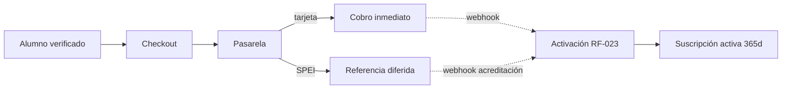
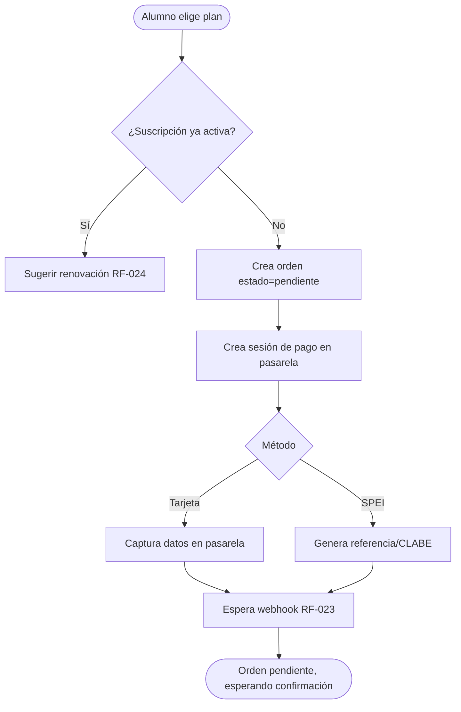
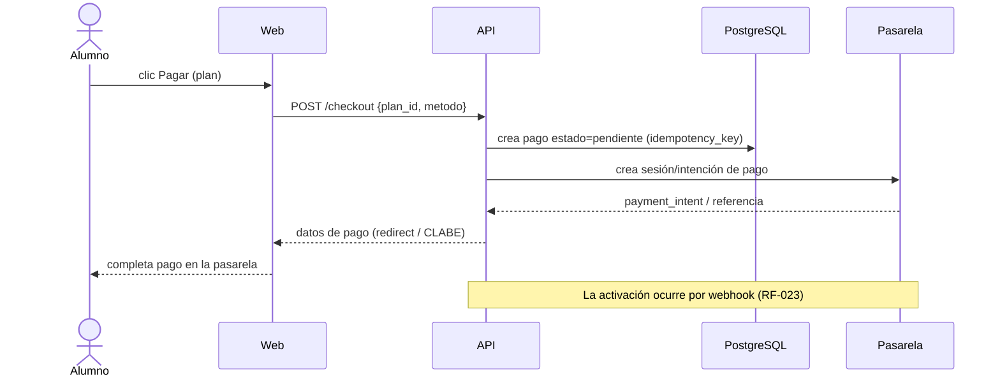
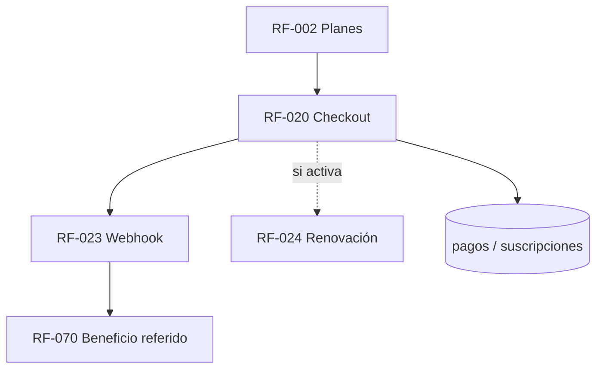

# RF-020: Contratación de Suscripción (Checkout)

---

## Índice del Documento
- [1. 📋 Información General](#1--información-general)
- [2. 📜 Histórico de Cambios](#2--histórico-de-cambios)
- [3. 📖 Introducción del Requerimiento](#3--introducción-del-requerimiento)
- [4. 🎯 Objetivo Principal](#4--objetivo-principal)
- [5. 📊 Diagramas del Requerimiento](#5--diagramas-del-requerimiento)
- [6. 📝 Especificación de Datos](#6--especificación-de-datos)
- [7. ✅ Validaciones](#7--validaciones)
- [8. 🔒 Reglas de Negocio](#8--reglas-de-negocio)
- [9. ⚙️ Requerimientos No Funcionales](#9--requerimientos-no-funcionales)
- [10. 🖼️ Mockups / Estados de Pantalla](#10--mockups--estados-de-pantalla)
- [11. ✨ Criterios de Aceptación](#11--criterios-de-aceptación)
- [12. 🛠️ Especificación Técnica](#12--especificación-técnica)
- [13. 🧪 Casos de Prueba](#13--casos-de-prueba)
- [14. 📎 Trazabilidad](#14--trazabilidad)

---

## 1. 📋 Información General

| Campo | Valor |
|-------|-------|
| **ID** | RF-020 |
| **Nombre** | Contratación de Suscripción (Checkout) |
| **Módulo** | [MOD-03 Suscripción y pagos](../04-modulos/modulos-secciones.md) |
| **Versión** | v1.0.0 |
| **Fecha creación** | 2026-06-18 |
| **Estado** | En análisis |
| **Prioridad** | 🔴 CRÍTICA |
| **Complejidad** | 🟠 Alta |
| **Autor** | Equipo de análisis |
| **RF relacionados** | RF-002 (Planes) · RF-023 (Webhook) · RF-024 (Renovación) · RF-070 (Referidos) |
| **Caso de uso** | CU-020 Contratar suscripción |

**Avance:** `[████████░░] análisis`

---

## 2. 📜 Histórico de Cambios

| Versión | Fecha | Autor | Descripción | Tipo |
|---------|-------|-------|-------------|------|
| v1.0.0 | 2026-06-18 | Equipo de análisis | Creación con estructura completa | Nueva |

---

## 3. 📖 Introducción del Requerimiento

### 3.1 Descripción general
Permite a un alumno verificado **iniciar y completar el pago** de la suscripción anual. Crea una orden de pago contra la pasarela (tarjeta o SPEI), pero la **activación de la vigencia ocurre solo al confirmarse el pago** vía webhook ([RF-023](RF-023-webhook-pago.md)). En MVP el checkout vive en **web** ([decisión de alcance](../01-vision/division-web-mobile.md)).

### 3.2 Contexto del negocio


### 3.3 Problema que resuelve
| # | Problema | Impacto | Solución |
|---|----------|---------|----------|
| 1 | Acceso al contenido sin pago | Sin ingresos | Pago obligatorio antes de activar |
| 2 | Activar sin confirmación real | Fraude/impagos | Activación solo por webhook |
| 3 | Métodos limitados en México | Menos conversión | Tarjeta + SPEI |

### 3.4 Beneficios esperados
- ✅ Monetización confiable (sin activaciones sin cobro).
- ✅ Cobertura de métodos de pago de México.
- ✅ Disparador del beneficio de referido al pagar.

---

## 4. 🎯 Objetivo Principal

### 4.1 Objetivo general
> Permitir contratar la suscripción anual de forma segura, dejando la activación condicionada a la confirmación del pago.

### 4.2 Objetivos específicos
| # | Objetivo | Métrica | Meta |
|---|----------|---------|------|
| O1 | Crear orden de pago | Órdenes generadas correctamente | 100% |
| O2 | No activar sin confirmación | Activaciones sin webhook | 0 |
| O3 | Soportar tarjeta y SPEI | Métodos disponibles | ≥ 2 |
| O4 | Idempotencia de checkout | Cobros duplicados | 0 |

### 4.3 Alcance funcional

**✅ Incluido**
| Funcionalidad | Descripción |
|---------------|-------------|
| Iniciar checkout | Crea sesión/orden contra la pasarela |
| Tarjeta | Cobro inmediato |
| SPEI | Referencia con acreditación diferida |
| Estado de orden | Pendiente / confirmada / fallida |
| Idempotencia | Clave por orden para evitar doble cobro |

**❌ Excluido**
| Funcionalidad | Razón | Referencia |
|---------------|-------|------------|
| Confirmación/activación | Otro requerimiento | RF-023 |
| Renovación | Otro requerimiento | RF-024 |
| Pago dentro de app Android | Fuera de MVP móvil | [división](../01-vision/division-web-mobile.md) |

---

## 5. 📊 Diagramas del Requerimiento

### 5.1 Flujo de checkout


### 5.2 Secuencia


---

## 6. 📝 Especificación de Datos

### 6.1 Campos de entrada
| Campo | Tipo | Obligatorio | Validación |
|-------|------|:-----------:|-----------|
| plan_id | UUID | Sí | Plan activo existente |
| metodo | enum | Sí | tarjeta \| spei |
| idempotency_key | string | Sí | Único por intento de orden |

### 6.2 Tabla `pagos`
```sql
CREATE TABLE pagos (
  id UUID PRIMARY KEY DEFAULT gen_random_uuid(),
  usuario_id UUID NOT NULL REFERENCES usuarios(id),
  plan_id UUID NOT NULL REFERENCES planes(id),
  suscripcion_id UUID REFERENCES suscripciones(id),
  metodo VARCHAR(16) NOT NULL CHECK (metodo IN ('tarjeta','spei')),
  monto NUMERIC(10,2) NOT NULL,
  moneda CHAR(3) NOT NULL DEFAULT 'MXN',
  estado VARCHAR(16) NOT NULL DEFAULT 'pendiente'
    CHECK (estado IN ('pendiente','confirmado','fallido','reembolsado')),
  ref_pasarela VARCHAR(120) UNIQUE,
  idempotency_key VARCHAR(80) NOT NULL UNIQUE,
  creado_en TIMESTAMP DEFAULT now()
);
```

---

## 7. ✅ Validaciones

| ID | Descripción | Tipo |
|----|-------------|------|
| V-020-01 | El alumno está autenticado y verificado | Auth |
| V-020-02 | El plan existe y está activo | BD |
| V-020-03 | El método es tarjeta o spei | Datos |
| V-020-04 | `idempotency_key` no repetida → no duplica orden | BD |
| V-020-05 | Si ya hay suscripción activa, se redirige a renovación | Lógica |
| V-020-06 | El monto corresponde al precio vigente del plan (server-side) | Seguridad |

---

## 8. 🔒 Reglas de Negocio

**RN-020-01 — La activación NO ocurre en el checkout.** Solo crea una orden `pendiente`; la vigencia se otorga al confirmarse el pago ([RN-020](../06-reglas-negocio/reglas-principales.md), [RF-023](RF-023-webhook-pago.md)).

**RN-020-02 — Monto autoritativo en servidor.** El precio se toma del plan en BD, nunca del cliente ([RNA-010](../06-reglas-negocio/reglas-alternas.md) ante manipulación).

**RN-020-03 — Idempotencia de orden.** Una `idempotency_key` repetida devuelve la orden existente, no crea otra.

**RN-020-04 — SPEI es diferido.** Generar la referencia no liquida; la suscripción sigue inactiva hasta acreditación ([RN-022](../06-reglas-negocio/reglas-principales.md), [RNA-012](../06-reglas-negocio/reglas-alternas.md)).

**RN-020-05 — Suscripción activa → renovación.** Si el alumno ya tiene vigencia, el checkout deriva a [RF-024](RF-024-renovacion.md).

**RN-020-06 — Auditoría.** Toda orden y cambio de estado se audita ([RN-023](../06-reglas-negocio/reglas-principales.md)).

---

## 9. ⚙️ Requerimientos No Funcionales

| RNF | Descripción |
|-----|-------------|
| RNF-020-01 | TLS/HTTPS; datos de tarjeta los maneja la pasarela (no tocan el backend) |
| RNF-020-02 | Cumplimiento PCI delegado a la pasarela (no se almacenan PANs) |
| RNF-020-03 | Secretos de la pasarela en secret manager ([RNF-006](00-catalogo-requerimientos.md)) |
| RNF-020-04 | Disponibilidad del checkout ≥ 99.9% |

---

## 10. 🖼️ Mockups / Estados de Pantalla

Referencia: [EP-020 Checkout](../11-ux-estados-pantalla/estados-pantalla-iniciales.md#ep-020--checkout). Estados: Default, Loading (procesando), Error (rechazado → [FA-010](../07-casos-uso/flujos-alternos.md#fa-010--pago-rechazado)), Pendiente SPEI ([FA-011](../07-casos-uso/flujos-alternos.md#fa-011--spei-pendiente-de-acreditación)).

---

## 11. ✨ Criterios de Aceptación

```gherkin
Scenario: Iniciar checkout con tarjeta
  Given un alumno verificado sin suscripción activa
  When inicia el checkout del plan con método tarjeta
  Then se crea una orden en estado "pendiente"
  And se obtiene la sesión de pago de la pasarela
  And la suscripción permanece inactiva hasta la confirmación

Scenario: Checkout con SPEI genera referencia
  Given un alumno verificado
  When elige SPEI
  Then recibe una referencia/CLABE
  And la suscripción no se activa hasta la acreditación

Scenario: Idempotencia evita doble orden
  Given un checkout con una idempotency_key
  When se reenvía la misma solicitud
  Then se devuelve la misma orden, sin crear una segunda

Scenario: Alumno con suscripción activa
  Given un alumno con vigencia activa
  When intenta contratar de nuevo
  Then es derivado al flujo de renovación (RF-024)

Scenario: Manipulación de monto
  Given un cliente que envía un monto distinto al del plan
  When inicia el checkout
  Then el servidor usa el precio del plan, ignorando el del cliente
```

---

## 12. 🛠️ Especificación Técnica

### 12.1 Endpoints
```
POST /api/v1/checkout
Header: Authorization: Bearer <token>, Idempotency-Key: <key>
Request:  { "plan_id": "uuid", "metodo": "tarjeta" | "spei" }
201:      { "pago_id", "estado": "pendiente",
            "pasarela": { "checkout_url" | "clabe", "ref" } }
409:      { "error": "suscripcion_activa", "accion": "renovar" }
422:      { "error": "plan_invalido" | "metodo_invalido" }
```

### 12.2 Servicio (pseudocódigo)
```typescript
async checkout(usuario, dto, idemKey) {
  const existing = await db.pagos.findByIdem(idemKey);     // RN-020-03
  if (existing) return existing;
  if (await subs.hasActive(usuario.id)) throw Conflict('suscripcion_activa'); // RN-020-05
  const plan = await db.planes.findActive(dto.plan_id);    // V-020-02
  if (!plan) throw Unprocessable('plan_invalido');
  const pago = await db.pagos.create({
    usuario_id: usuario.id, plan_id: plan.id, metodo: dto.metodo,
    monto: plan.precio, moneda: plan.moneda,               // RN-020-02 (monto server-side)
    estado: 'pendiente', idempotency_key: idemKey,
  });
  const intent = await gateway.createIntent({ amount: plan.precio, method: dto.metodo, ref: pago.id });
  await db.pagos.setRef(pago.id, intent.ref);
  await audit('CHECKOUT_INICIADO', usuario.id, pago.id);   // RN-020-06
  return { pago, pasarela: intent };
}
```

---

## 13. 🧪 Casos de Prueba

| ID | Escenario | Traza | Tipo |
|----|-----------|-------|------|
| TC-020-01 | Checkout tarjeta crea orden pendiente | V-020-02, RN-020-01 | Positivo |
| TC-020-02 | Checkout SPEI genera referencia, sin activar | RN-020-04 | Positivo |
| TC-020-03 | Idempotencia no duplica orden | V-020-04, RN-020-03 | Borde |
| TC-020-04 | Suscripción activa → 409 renovar | V-020-05, RN-020-05 | Negativo |
| TC-020-05 | Plan inactivo/inexistente → 422 | V-020-02 | Negativo |
| TC-020-06 | Monto manipulado se ignora (server-side) | V-020-06, RN-020-02 | Negativo |
| TC-020-07 | No autenticado → 401 | V-020-01 | Negativo |

---

## 14. 📎 Trazabilidad

### 14.1 Documentos relacionados
| Tipo | Referencia |
|------|------------|
| Reglas | [RN-010..016, RN-020..023](../06-reglas-negocio/reglas-principales.md) · [RNA-010..012](../06-reglas-negocio/reglas-alternas.md) |
| Flujos alternos | [FA-010, FA-011](../07-casos-uso/flujos-alternos.md) |
| Estados de pantalla | [EP-020](../11-ux-estados-pantalla/estados-pantalla-iniciales.md) |
| Modelo de datos | [ERD: pagos, suscripciones, planes](../09-diagramas/03-modelo-datos-erd.md) |
| Requerimientos | RF-002 · RF-023 · RF-024 · RF-070 |

### 14.2 Matriz de trazabilidad
| Regla | Endpoint | Validación | Caso de prueba |
|-------|----------|------------|----------------|
| RN-020-01 | POST /checkout | — | TC-020-01 |
| RN-020-02 | POST /checkout | V-020-06 | TC-020-06 |
| RN-020-03 | POST /checkout | V-020-04 | TC-020-03 |
| RN-020-05 | POST /checkout | V-020-05 | TC-020-04 |

### 14.3 Dependencias


<!-- FOOTER:ALEXANDRYA -->

---

<sub>📄 **Alexandrya** · `docs/05-requerimientos/RF-020-contratacion-suscripcion.md` · Versión documental **v0.3.0** · Actualizado **2026-06-19** · 🏠 [Índice](../README.md) · 💬 [Mensajes del sistema](../14-mensajes-sistema/mensajes-sistema.md)</sub>
