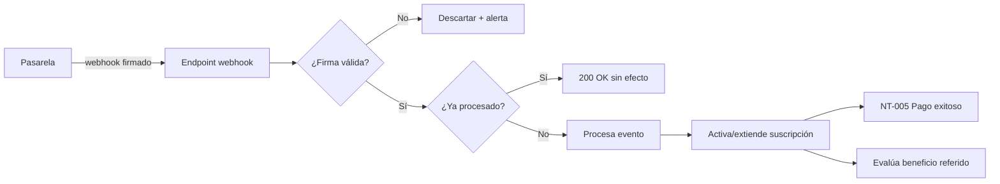
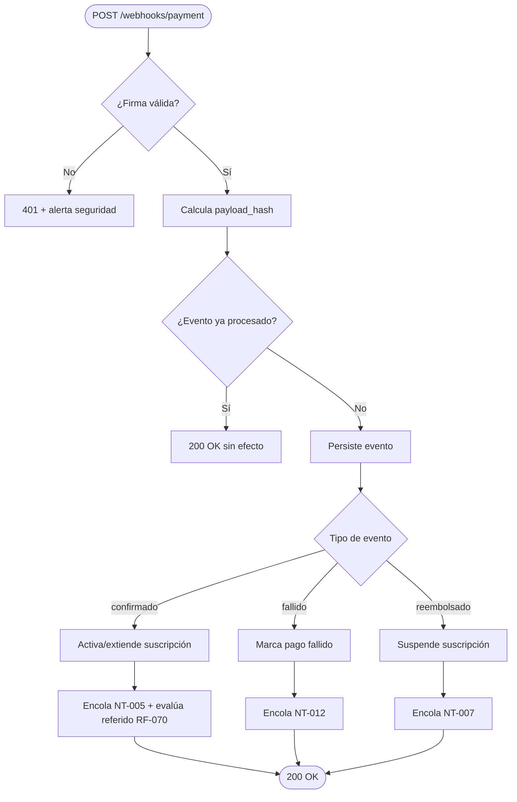
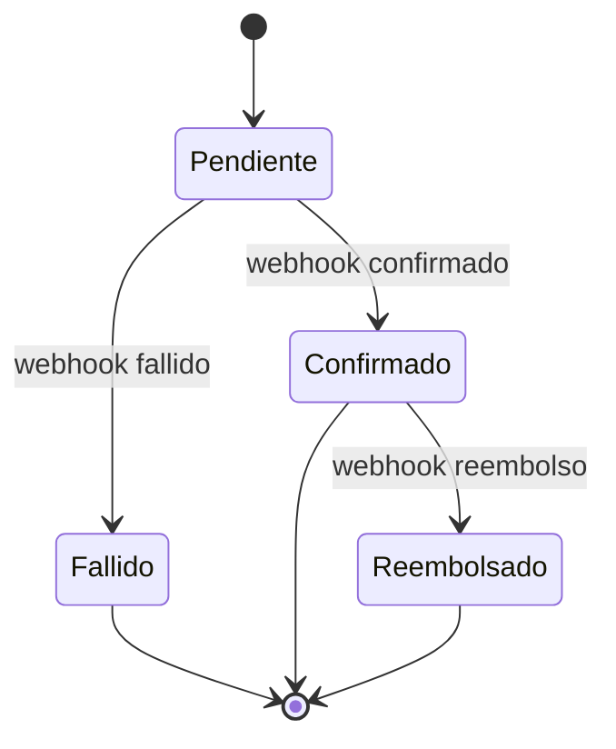
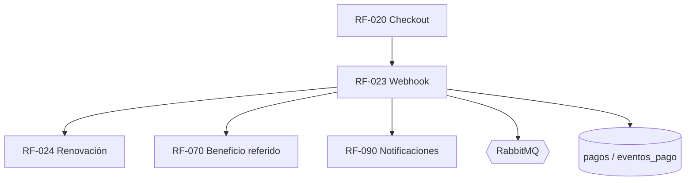

# RF-023: Validación de Pago por Webhook

---

## Índice del Documento
- [1. 📋 Información General](#1--información-general)
- [2. 📜 Histórico de Cambios](#2--histórico-de-cambios)
- [3. 📖 Introducción del Requerimiento](#3--introducción-del-requerimiento)
- [4. 🎯 Objetivo Principal](#4--objetivo-principal)
- [5. 📊 Diagramas del Requerimiento](#5--diagramas-del-requerimiento)
- [6. 📝 Especificación de Datos](#6--especificación-de-datos)
- [7. ✅ Validaciones](#7--validaciones)
- [8. 🔒 Reglas de Negocio](#8--reglas-de-negocio)
- [9. ⚙️ Requerimientos No Funcionales](#9--requerimientos-no-funcionales)
- [10. 🖼️ Mockups / Estados de Pantalla](#10--mockups--estados-de-pantalla)
- [11. ✨ Criterios de Aceptación](#11--criterios-de-aceptación)
- [12. 🛠️ Especificación Técnica](#12--especificación-técnica)
- [13. 🧪 Casos de Prueba](#13--casos-de-prueba)
- [14. 📎 Trazabilidad](#14--trazabilidad)

---

## 1. 📋 Información General

| Campo | Valor |
|-------|-------|
| **ID** | RF-023 |
| **Nombre** | Validación de Pago por Webhook |
| **Módulo** | [MOD-03 Suscripción y pagos](../04-modulos/modulos-secciones.md) |
| **Versión** | v1.0.0 |
| **Fecha creación** | 2026-06-18 |
| **Estado** | En análisis |
| **Prioridad** | 🔴 CRÍTICA |
| **Complejidad** | 🔴 Alta |
| **Autor** | Equipo de análisis |
| **RF relacionados** | RF-020 (Checkout) · RF-024 (Renovación) · RF-070 (Referidos) · RF-090 (Notificaciones) |
| **Caso de uso** | CU-020 Contratar suscripción (paso de confirmación) |

**Avance:** `[████████░░] análisis`

---

## 2. 📜 Histórico de Cambios

| Versión | Fecha | Autor | Descripción | Tipo |
|---------|-------|-------|-------------|------|
| v1.0.0 | 2026-06-18 | Equipo de análisis | Creación con estructura completa | Nueva |

---

## 3. 📖 Introducción del Requerimiento

### 3.1 Descripción general
Recibe y procesa los **webhooks** de la pasarela que confirman, rechazan o reembolsan un pago. Es el **único** mecanismo que activa o extiende la vigencia de la suscripción. Debe ser **idempotente**, verificar la **firma** del webhook y manejar eventos fuera de orden.

### 3.2 Contexto del negocio


### 3.3 Problema que resuelve
| # | Problema | Impacto | Solución |
|---|----------|---------|----------|
| 1 | Activar sin cobro real | Fraude | Activar solo con webhook confirmado |
| 2 | Webhooks duplicados | Doble vigencia/beneficio | Idempotencia por evento |
| 3 | Webhooks falsificados | Activaciones ilegítimas | Verificación de firma |
| 4 | Eventos fuera de orden | Estado inconsistente | Resolución por timestamp |

### 3.4 Beneficios esperados
- ✅ Activación confiable y automática ([RF-021/025](00-catalogo-requerimientos.md)).
- ✅ Integridad financiera (sin dobles cobros de vigencia).
- ✅ Disparo automático de beneficios de referido y notificaciones.

---

## 4. 🎯 Objetivo Principal

### 4.1 Objetivo general
> Procesar de forma segura e idempotente las confirmaciones de pago, activando/extendiendo la suscripción solo ante eventos legítimos y confirmados.

### 4.2 Objetivos específicos
| # | Objetivo | Métrica | Meta |
|---|----------|---------|------|
| O1 | Verificar firma del webhook | Webhooks no verificados procesados | 0 |
| O2 | Idempotencia | Efectos duplicados | 0 |
| O3 | Activación automática | Latencia confirmación→activa | < 5 s |
| O4 | Resiliencia a reintentos | Reintentos manejados | 100% |

### 4.3 Alcance funcional

**✅ Incluido**
| Funcionalidad | Descripción |
|---------------|-------------|
| Recepción de webhook | Endpoint público dedicado |
| Verificación de firma | Secreto de la pasarela |
| Idempotencia | `payload_hash`/event_id único |
| Activación/extensión | Crea o extiende suscripción |
| Manejo de fallido/reembolso | Cambia estado, suspende si aplica |
| Disparo de eventos | Notificación + beneficio referido |

**❌ Excluido**
| Funcionalidad | Razón | Referencia |
|---------------|-------|------------|
| Iniciar el pago | Otro requerimiento | RF-020 |
| Lógica de renovación de fechas | Otro requerimiento | RF-024 |

---

## 5. 📊 Diagramas del Requerimiento

### 5.1 Procesamiento del webhook


### 5.2 Estados del pago (referencia)


---

## 6. 📝 Especificación de Datos

### 6.1 Entrada (webhook)
| Campo | Tipo | Descripción |
|-------|------|-------------|
| event_id | string | Identificador del evento en la pasarela |
| type | string | confirmado \| fallido \| reembolsado |
| payment_ref | string | Referencia del pago (= `pagos.ref_pasarela`) |
| amount | decimal | Monto |
| signature | header | Firma HMAC del payload |
| occurred_at | timestamp | Momento del evento (orden) |

### 6.2 Tabla `eventos_pago`
```sql
CREATE TABLE eventos_pago (
  id UUID PRIMARY KEY DEFAULT gen_random_uuid(),
  pago_id UUID REFERENCES pagos(id),
  event_id VARCHAR(120),
  tipo VARCHAR(20) NOT NULL,
  payload_hash VARCHAR(128) NOT NULL UNIQUE,   -- idempotencia
  occurred_at TIMESTAMP,
  recibido_en TIMESTAMP DEFAULT now()
);
CREATE INDEX idx_eventos_pago_pago ON eventos_pago(pago_id);
```

---

## 7. ✅ Validaciones

| ID | Descripción | Tipo |
|----|-------------|------|
| V-023-01 | La firma HMAC del webhook es válida | Cripto |
| V-023-02 | `payload_hash`/`event_id` no fue procesado antes | BD |
| V-023-03 | El `payment_ref` corresponde a un pago existente | BD |
| V-023-04 | El monto del evento coincide con el de la orden | Datos |
| V-023-05 | El tipo de evento es soportado | Datos |
| V-023-06 | Eventos fuera de orden se resuelven por `occurred_at` | Lógica |

---

## 8. 🔒 Reglas de Negocio

**RN-023-01 — Activación solo por webhook confirmado.** Ningún otro flujo activa la vigencia ([RN-020](../06-reglas-negocio/reglas-principales.md)).

**RN-023-02 — Idempotencia estricta.** Un `payload_hash` ya registrado no produce efectos nuevos; responde 200 ([RN-021](../06-reglas-negocio/reglas-principales.md), [RNA-011](../06-reglas-negocio/reglas-alternas.md)).

**RN-023-03 — Verificación de firma obligatoria.** Webhook sin firma válida se descarta y se alerta (seguridad).

**RN-023-04 — Confirmado → activa/extiende; reembolsado → suspende.** El estado final respeta el `occurred_at` más reciente ([RNA-014](../06-reglas-negocio/reglas-alternas.md)).

**RN-023-05 — Disparo de efectos posteriores.** Tras confirmar: NT-005 (pago exitoso) y evaluación de beneficio de referido ([RF-070](00-indice-requerimientos.md), [RN-041](../06-reglas-negocio/reglas-principales.md)).

**RN-023-06 — Auditoría.** Todo evento (incluido descartado) se audita ([RN-023](../06-reglas-negocio/reglas-principales.md)).

**RN-023-07 — Responder rápido y procesar async.** Se acepta el webhook (200) y el procesamiento pesado se hace vía cola para tolerar reintentos.

---

## 9. ⚙️ Requerimientos No Funcionales

| RNF | Descripción |
|-----|-------------|
| RNF-023-01 | Endpoint sobre TLS; verificación de firma con secreto en secret manager |
| RNF-023-02 | Idempotencia consistente bajo concurrencia (índice único) |
| RNF-023-03 | Tolera reintentos de la pasarela (at-least-once delivery) |
| RNF-023-04 | Procesamiento desacoplado vía RabbitMQ ([arquitectura](../09-diagramas/01-arquitectura.md)) |
| RNF-023-05 | Tiempo de respuesta del ACK < 1 s |

---

## 10. 🖼️ Mockups / Estados de Pantalla

No tiene UI (es servidor-a-servidor). Su efecto se refleja en [EP-021 Suscripción activa](../11-ux-estados-pantalla/estados-pantalla-iniciales.md#ep-021--suscripción-activa--estado) y en el correo [CT-005](../12-notificaciones/plantillas-correo/CT-005-pago-exitoso.md).

---

## 11. ✨ Criterios de Aceptación

```gherkin
Scenario: Webhook confirmado activa la suscripción
  Given un pago en estado pendiente con firma válida
  When llega un webhook "confirmado" con monto correcto
  Then el pago pasa a "confirmado"
  And la suscripción se activa/extiende 365 días
  And se encola NT-005 y se evalúa el beneficio de referido

Scenario: Webhook duplicado no duplica efectos
  Given un webhook ya procesado (mismo payload_hash)
  When la pasarela lo reenvía
  Then se responde 200 sin alterar la vigencia ni los beneficios

Scenario: Firma inválida
  Given un webhook con firma incorrecta
  When se recibe
  Then se descarta con 401 y se genera una alerta de seguridad

Scenario: Webhook de reembolso suspende
  Given una suscripción activa
  When llega un webhook "reembolsado"
  Then la suscripción se suspende y se notifica (NT-007)

Scenario: Eventos fuera de orden
  Given llega "reembolsado" y luego un "confirmado" más antiguo
  When se procesan
  Then prevalece el estado del evento con occurred_at más reciente
```

---

## 12. 🛠️ Especificación Técnica

### 12.1 Endpoint
```
POST /api/v1/webhooks/payment
Header: X-Signature: <hmac>
Body:   evento de la pasarela (JSON)
200:    { "received": true }     // siempre que firma+idempotencia OK
401:    firma inválida
```

### 12.2 Handler (pseudocódigo)
```typescript
async handleWebhook(rawBody, signature) {
  if (!verifyHmac(rawBody, signature, env.WEBHOOK_SECRET))  // V-023-01 / RN-023-03
    { await audit('WEBHOOK_FIRMA_INVALIDA'); throw Unauthorized(); }
  const hash = sha256(rawBody);
  if (await db.eventos_pago.exists(hash)) return ok();        // V-023-02 / RN-023-02
  const evt = parse(rawBody);
  const pago = await db.pagos.findByRef(evt.payment_ref);     // V-023-03
  if (!pago || pago.monto !== evt.amount) { await audit('WEBHOOK_INCONSISTENTE'); return ok(); } // V-023-04
  await db.eventos_pago.insert({ pago_id: pago.id, event_id: evt.event_id, tipo: evt.type, payload_hash: hash, occurred_at: evt.occurred_at });
  await mq.publish('procesar_evento_pago', { pagoId: pago.id, tipo: evt.type, occurredAt: evt.occurred_at }); // RN-023-07
  return ok();
}

// worker
async procesarEvento({ pagoId, tipo, occurredAt }) {
  if (tipo === 'confirmado') {
    await subs.activarOExtender(pagoId);          // RF-024 calcula fechas
    await mq.publish('pago_exitoso', { pagoId }); // NT-005
    await referidos.evaluarBeneficio(pagoId);     // RN-023-05
  } else if (tipo === 'reembolsado') {
    await subs.suspender(pagoId, occurredAt);      // RN-023-04
    await mq.publish('suscripcion_suspendida', { pagoId }); // NT-007
  } else {
    await db.pagos.setEstado(pagoId, 'fallido');
    await mq.publish('pago_fallido', { pagoId }); // NT-012
  }
}
```

---

## 13. 🧪 Casos de Prueba

| ID | Escenario | Traza | Tipo |
|----|-----------|-------|------|
| TC-023-01 | Webhook confirmado activa suscripción + NT-005 | V-023-01/03, RN-023-01 | Positivo |
| TC-023-02 | Webhook duplicado no duplica vigencia/beneficio | V-023-02, RN-023-02 | Borde |
| TC-023-03 | Firma inválida → 401 + alerta | V-023-01, RN-023-03 | Negativo |
| TC-023-04 | Webhook de reembolso suspende | RN-023-04 | Positivo |
| TC-023-05 | Monto inconsistente se ignora + audita | V-023-04 | Negativo |
| TC-023-06 | Evento fuera de orden resuelto por timestamp | V-023-06, RN-023-04 | Borde |
| TC-023-07 | Confirmado dispara beneficio de referido | RN-023-05 | Positivo |
| TC-023-08 | Reintento de la pasarela tolerado | RNF-023-03 | Borde |

---

## 14. 📎 Trazabilidad

### 14.1 Documentos relacionados
| Tipo | Referencia |
|------|------------|
| Reglas | [RN-020..023](../06-reglas-negocio/reglas-principales.md) · [RNA-011, RNA-014, RNA-015](../06-reglas-negocio/reglas-alternas.md) |
| Flujos alternos | [FA-012 Webhook duplicado](../07-casos-uso/flujos-alternos.md#fa-012--webhook-duplicado) |
| Notificaciones | NT-005, NT-007, NT-012 — ver [notificaciones](../12-notificaciones/notificaciones.md) |
| Modelo de datos | [ERD: pagos, eventos_pago, suscripciones](../09-diagramas/03-modelo-datos-erd.md) |
| Arquitectura | [Flujo registro+pago](../09-diagramas/04-flujos.md) · [ADR-006](../08-especificaciones-tecnicas/00-indice-especificaciones.md) |
| Requerimientos | RF-020 · RF-024 · RF-070 · RF-090 |

### 14.2 Matriz de trazabilidad
| Regla | Endpoint | Validación | Caso de prueba |
|-------|----------|------------|----------------|
| RN-023-01 | POST /webhooks/payment | V-023-03 | TC-023-01 |
| RN-023-02 | POST /webhooks/payment | V-023-02 | TC-023-02 |
| RN-023-03 | POST /webhooks/payment | V-023-01 | TC-023-03 |
| RN-023-04 | worker | V-023-06 | TC-023-04, TC-023-06 |
| RN-023-05 | worker | — | TC-023-07 |

### 14.3 Dependencias


<!-- FOOTER:ALEXANDRYA -->

---

<sub>📄 **Alexandrya** · `docs/05-requerimientos/RF-023-webhook-pago.md` · Versión documental **v0.3.0** · Actualizado **2026-06-19** · 🏠 [Índice](../README.md) · 💬 [Mensajes del sistema](../14-mensajes-sistema/mensajes-sistema.md)</sub>
