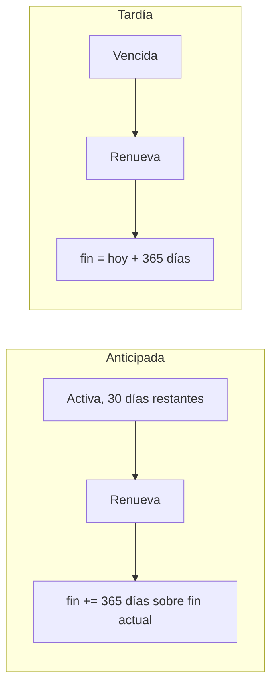
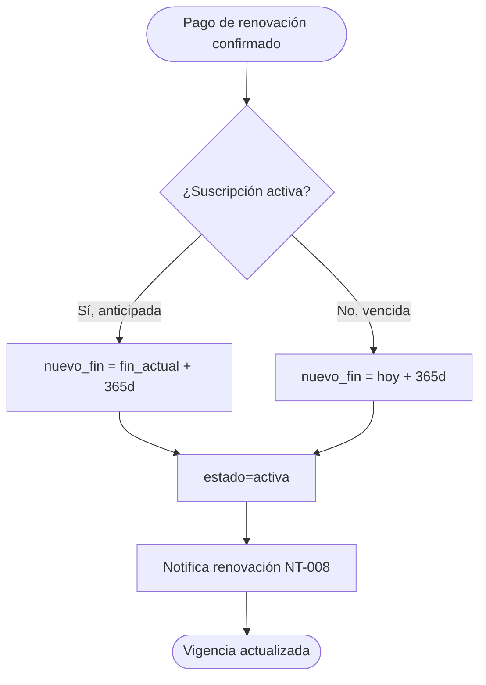
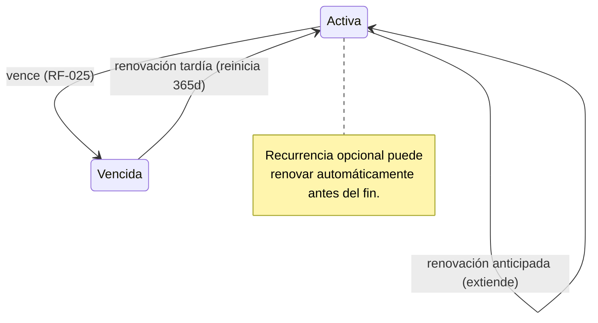
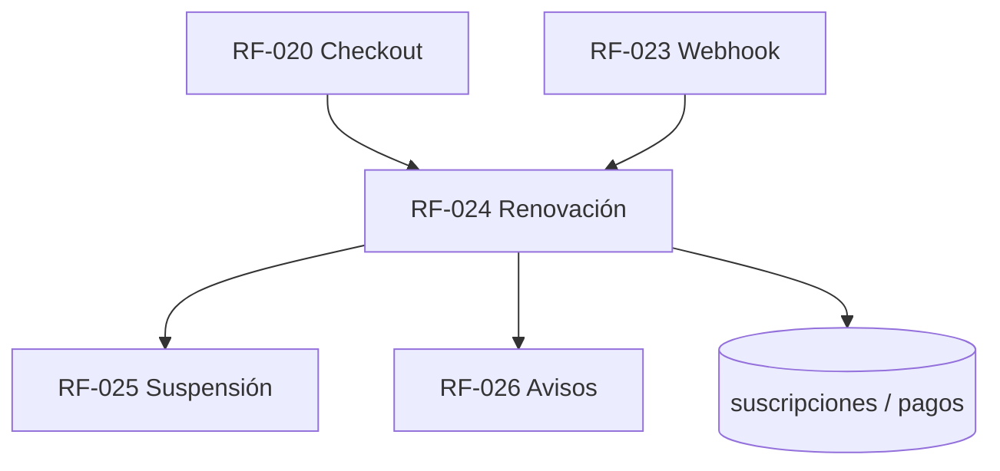

# RF-024: Pagos Recurrentes y Renovación

---

## Índice del Documento
- [1. 📋 Información General](#1--información-general)
- [2. 📜 Histórico de Cambios](#2--histórico-de-cambios)
- [3. 📖 Introducción del Requerimiento](#3--introducción-del-requerimiento)
- [4. 🎯 Objetivo Principal](#4--objetivo-principal)
- [5. 📊 Diagramas del Requerimiento](#5--diagramas-del-requerimiento)
- [6. 📝 Especificación de Datos](#6--especificación-de-datos)
- [7. ✅ Validaciones](#7--validaciones)
- [8. 🔒 Reglas de Negocio](#8--reglas-de-negocio)
- [9. ⚙️ Requerimientos No Funcionales](#9--requerimientos-no-funcionales)
- [10. 🖼️ Mockups / Estados de Pantalla](#10--mockups--estados-de-pantalla)
- [11. ✨ Criterios de Aceptación](#11--criterios-de-aceptación)
- [12. 🛠️ Especificación Técnica](#12--especificación-técnica)
- [13. 🧪 Casos de Prueba](#13--casos-de-prueba)
- [14. 📎 Trazabilidad](#14--trazabilidad)

---

## 1. 📋 Información General

| Campo | Valor |
|-------|-------|
| **ID** | RF-024 |
| **Nombre** | Pagos Recurrentes y Renovación |
| **Módulo** | [MOD-03 Suscripción y pagos](../04-modulos/modulos-secciones.md) |
| **Versión** | v1.0.0 |
| **Fecha creación** | 2026-06-18 |
| **Estado** | En análisis |
| **Prioridad** | 🔴 CRÍTICA |
| **Complejidad** | 🟠 Alta |
| **Autor** | Equipo de análisis |
| **RF relacionados** | RF-020 (Checkout) · RF-023 (Webhook) · RF-025 (Suspensión) · RF-026 (Avisos) |
| **Caso de uso** | CU-021 Renovar suscripción |

**Avance:** `[████████░░] análisis`

---

## 2. 📜 Histórico de Cambios

| Versión | Fecha | Autor | Descripción | Tipo |
|---------|-------|-------|-------------|------|
| v1.0.0 | 2026-06-18 | Equipo de análisis | Creación con estructura completa | Nueva |

---

## 3. 📖 Introducción del Requerimiento

### 3.1 Descripción general
Gestiona la **renovación** de la suscripción anual y, opcionalmente, el **cobro recurrente automático**. Define cómo se calcula la nueva vigencia: una renovación **anticipada** extiende desde la fecha de fin vigente (sin perder días); una renovación **tardía** (ya vencida) inicia un nuevo año desde la confirmación del pago.

### 3.2 Contexto del negocio


### 3.3 Problema que resuelve
| # | Problema | Impacto | Solución |
|---|----------|---------|----------|
| 1 | Pérdida de acceso al vencer | Churn | Renovación fácil + recurrencia opcional |
| 2 | Renovar antes castiga al usuario | Desincentivo | Extensión sin perder días |
| 3 | Olvido de renovar | Churn involuntario | Cobro recurrente + avisos (RF-026) |

### 3.4 Beneficios esperados
- ✅ Mayor retención y LTV.
- ✅ Renovación justa (no se pierden días).
- ✅ Ingreso predecible con recurrencia.

---

## 4. 🎯 Objetivo Principal

### 4.1 Objetivo general
> Permitir renovar la suscripción de forma justa y, opcionalmente, automática, calculando correctamente la nueva vigencia según el momento de la renovación.

### 4.2 Objetivos específicos
| # | Objetivo | Métrica | Meta |
|---|----------|---------|------|
| O1 | Renovación anticipada sin perder días | Días perdidos al renovar antes | 0 |
| O2 | Renovación tardía correcta | Vigencias mal calculadas | 0 |
| O3 | Recurrencia opcional | Cobros automáticos exitosos | medible |
| O4 | Idempotencia | Doble extensión | 0 |

### 4.3 Alcance funcional

**✅ Incluido**
| Funcionalidad | Descripción |
|---------------|-------------|
| Renovación manual | Anticipada o tardía |
| Cálculo de vigencia | Extiende vs reinicia según estado |
| Cobro recurrente opcional | Auto-renovación con consentimiento |
| Activar/desactivar recurrencia | Control del alumno |
| Confirmación por webhook | Reutiliza RF-023 |

**❌ Excluido**
| Funcionalidad | Razón | Referencia |
|---------------|-------|------------|
| Primer pago | Otro requerimiento | RF-020 |
| Suspensión por vencimiento | Otro requerimiento | RF-025 |
| Avisos de vencimiento | Otro requerimiento | RF-026 |

---

## 5. 📊 Diagramas del Requerimiento

### 5.1 Cálculo de nueva vigencia


### 5.2 Estados de la suscripción (renovación)


---

## 6. 📝 Especificación de Datos

### 6.1 Tabla `suscripciones`
```sql
CREATE TABLE suscripciones (
  id UUID PRIMARY KEY DEFAULT gen_random_uuid(),
  usuario_id UUID NOT NULL REFERENCES usuarios(id),
  plan_id UUID NOT NULL REFERENCES planes(id),
  estado VARCHAR(16) NOT NULL DEFAULT 'activa'
    CHECK (estado IN ('activa','vencida','cancelada')),
  inicio_vigencia TIMESTAMP NOT NULL,
  fin_vigencia TIMESTAMP NOT NULL,
  auto_renovacion BOOLEAN NOT NULL DEFAULT FALSE,
  metodo_recurrente_ref VARCHAR(120),   -- token de la pasarela (no datos de tarjeta)
  creada_en TIMESTAMP DEFAULT now()
);
CREATE INDEX idx_subs_usuario_estado ON suscripciones(usuario_id, estado);
CREATE INDEX idx_subs_fin ON suscripciones(fin_vigencia);
```

### 6.2 Campos clave
| Campo | Descripción |
|-------|-------------|
| auto_renovacion | Si el alumno activó cobro recurrente |
| metodo_recurrente_ref | Referencia tokenizada de la pasarela |
| fin_vigencia | Fecha de expiración (base del cálculo) |

---

## 7. ✅ Validaciones

| ID | Descripción | Tipo |
|----|-------------|------|
| V-024-01 | El alumno está autenticado | Auth |
| V-024-02 | Renovación anticipada: `nuevo_fin = fin_actual + duracion` | Lógica |
| V-024-03 | Renovación tardía: `nuevo_fin = now() + duracion` | Lógica |
| V-024-04 | El pago de renovación está confirmado por webhook | RF-023 |
| V-024-05 | Idempotencia: un mismo pago no extiende dos veces | BD |
| V-024-06 | Para recurrencia, existe consentimiento y token de método | Legal/BD |

---

## 8. 🔒 Reglas de Negocio

**RN-024-01 — Renovación anticipada extiende sin perder días.** Se suma la duración a `fin_vigencia` vigente ([RN-013](../06-reglas-negocio/reglas-principales.md)).

**RN-024-02 — Renovación tardía reinicia.** Nueva vigencia desde la confirmación ([RN-014](../06-reglas-negocio/reglas-principales.md)).

**RN-024-03 — Activación solo por pago confirmado.** Reutiliza el webhook ([RF-023](RF-023-webhook-pago.md), [RN-020](../06-reglas-negocio/reglas-principales.md)).

**RN-024-04 — Idempotencia.** El procesamiento del pago de renovación no extiende dos veces ([RN-021](../06-reglas-negocio/reglas-principales.md)).

**RN-024-05 — Recurrencia con consentimiento.** El cobro automático requiere que el alumno lo active y un método tokenizado; es desactivable en cualquier momento.

**RN-024-06 — Recurrencia se intenta antes del fin.** Un job intenta el cobro automático en ventana previa al vencimiento; si falla, cae al flujo de aviso/renovación manual ([RF-026](00-indice-requerimientos.md)).

**RN-024-07 — Auditoría.** Renovaciones y cambios de recurrencia se auditan.

---

## 9. ⚙️ Requerimientos No Funcionales

| RNF | Descripción |
|-----|-------------|
| RNF-024-01 | El token de método recurrente lo gestiona la pasarela (no se almacenan tarjetas) |
| RNF-024-02 | Cálculo de fechas en UTC, presentación en zona MX |
| RNF-024-03 | Job de recurrencia idempotente y reintentable |
| RNF-024-04 | Consentimiento de recurrencia registrado (auditoría/legal) |

---

## 10. 🖼️ Mockups / Estados de Pantalla

Referencia: [EP-021 Suscripción activa](../11-ux-estados-pantalla/estados-pantalla-iniciales.md#ep-021--suscripción-activa--estado) y [EP-022 vencida](../11-ux-estados-pantalla/estados-pantalla-iniciales.md). Incluye toggle de auto-renovación.

---

## 11. ✨ Criterios de Aceptación

```gherkin
Scenario: Renovación anticipada extiende sin perder días
  Given una suscripción activa con 30 días restantes
  When el alumno renueva y el pago se confirma
  Then la nueva fin_vigencia = fin actual + 365 días

Scenario: Renovación tardía reinicia la vigencia
  Given una suscripción vencida
  When el alumno renueva y el pago se confirma
  Then la nueva fin_vigencia = hoy + 365 días

Scenario: Idempotencia de renovación
  Given un pago de renovación ya procesado
  When su webhook se reprocesa
  Then la vigencia no se extiende por segunda vez

Scenario: Activar auto-renovación
  Given un alumno con suscripción activa
  When activa el cobro recurrente y autoriza el método
  Then se guarda el consentimiento y el token del método

Scenario: Cobro recurrente fallido cae a manual
  Given auto-renovación activa
  When el cobro automático previo al vencimiento falla
  Then se notifica al alumno para renovar manualmente
```

---

## 12. 🛠️ Especificación Técnica

### 12.1 Endpoints
```
POST /api/v1/subscription/renew      (autenticado) -> inicia checkout de renovación (reusa RF-020)
POST /api/v1/subscription/auto-renew  { "activar": true|false, "metodo_token"?: "..." }
GET  /api/v1/subscription             -> { estado, fin_vigencia, dias_restantes, auto_renovacion }
```

### 12.2 Cálculo de vigencia (pseudocódigo)
```typescript
async activarOExtender(pagoId) {
  const pago = await db.pagos.find(pagoId);
  if (pago.aplicado) return;                                  // RN-024-04 idempotencia
  const sub = await db.suscripciones.findByUsuario(pago.usuario_id);
  const dur = (await db.planes.find(pago.plan_id)).duracion_dias;
  let nuevoFin;
  if (sub && sub.estado === 'activa' && sub.fin_vigencia > now())
    nuevoFin = addDays(sub.fin_vigencia, dur);                // RN-024-01 anticipada
  else
    nuevoFin = addDays(now(), dur);                           // RN-024-02 tardía
  await db.suscripciones.upsert({ usuario_id: pago.usuario_id, plan_id: pago.plan_id,
    estado: 'activa', inicio_vigencia: sub?.inicio_vigencia ?? now(), fin_vigencia: nuevoFin });
  await db.pagos.marcarAplicado(pagoId);
  await mq.publish('renovacion_exitosa', { usuarioId: pago.usuario_id }); // NT-008
}
```

### 12.3 Job de recurrencia
```typescript
// diario: alumnos con auto_renovacion y fin próximo
for (const sub of await db.suscripciones.proximasAVencer(ventana)) {
  if (!sub.auto_renovacion) continue;
  const r = await gateway.cobrarConToken(sub.metodo_recurrente_ref, plan.precio); // RN-024-06
  // El resultado se confirma vía webhook (RF-023); si falla -> NT-006/aviso manual
}
```

---

## 13. 🧪 Casos de Prueba

| ID | Escenario | Traza | Tipo |
|----|-----------|-------|------|
| TC-024-01 | Renovación anticipada extiende +365 sobre fin actual | V-024-02, RN-024-01 | Positivo |
| TC-024-02 | Renovación tardía reinicia desde hoy | V-024-03, RN-024-02 | Positivo |
| TC-024-03 | Idempotencia: no doble extensión | V-024-05, RN-024-04 | Borde |
| TC-024-04 | Activar auto-renovación guarda consentimiento+token | V-024-06, RN-024-05 | Positivo |
| TC-024-05 | Desactivar auto-renovación | RN-024-05 | Positivo |
| TC-024-06 | Cobro recurrente fallido → aviso manual | RN-024-06 | Negativo |
| TC-024-07 | Renovación sin pago confirmado no extiende | V-024-04, RN-024-03 | Negativo |

---

## 14. 📎 Trazabilidad

### 14.1 Documentos relacionados
| Tipo | Referencia |
|------|------------|
| Reglas | [RN-011..016](../06-reglas-negocio/reglas-principales.md) · [RNA-010..012](../06-reglas-negocio/reglas-alternas.md) |
| Estados de pantalla | [EP-021, EP-022](../11-ux-estados-pantalla/estados-pantalla-iniciales.md) |
| Notificaciones | NT-006 (por vencer), NT-008 (renovación) — ver [notificaciones](../12-notificaciones/notificaciones.md) |
| Modelo de datos | [ERD: suscripciones, pagos](../09-diagramas/03-modelo-datos-erd.md) |
| Flujos | [Estados de la suscripción](../09-diagramas/04-flujos.md) |
| Requerimientos | RF-020 · RF-023 · RF-025 · RF-026 |

### 14.2 Matriz de trazabilidad
| Regla | Endpoint/Job | Validación | Caso de prueba |
|-------|--------------|------------|----------------|
| RN-024-01 | worker activarOExtender | V-024-02 | TC-024-01 |
| RN-024-02 | worker activarOExtender | V-024-03 | TC-024-02 |
| RN-024-04 | worker activarOExtender | V-024-05 | TC-024-03 |
| RN-024-05 | POST /auto-renew | V-024-06 | TC-024-04, TC-024-05 |
| RN-024-06 | job recurrencia | — | TC-024-06 |

### 14.3 Dependencias


<!-- FOOTER:ALEXANDRYA -->

---

<sub>📄 **Alexandrya** · `docs/05-requerimientos/RF-024-renovacion.md` · Versión documental **v0.3.0** · Actualizado **2026-06-19** · 🏠 [Índice](../README.md) · 💬 [Mensajes del sistema](../14-mensajes-sistema/mensajes-sistema.md)</sub>
