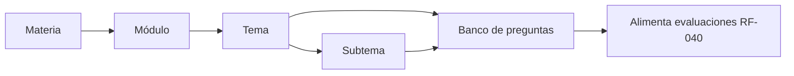
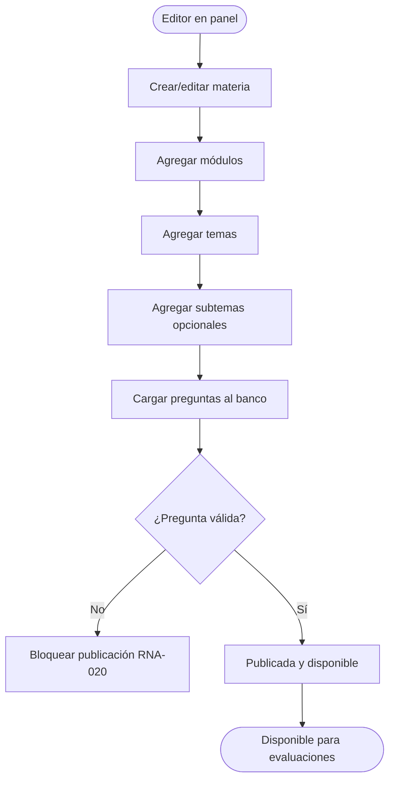
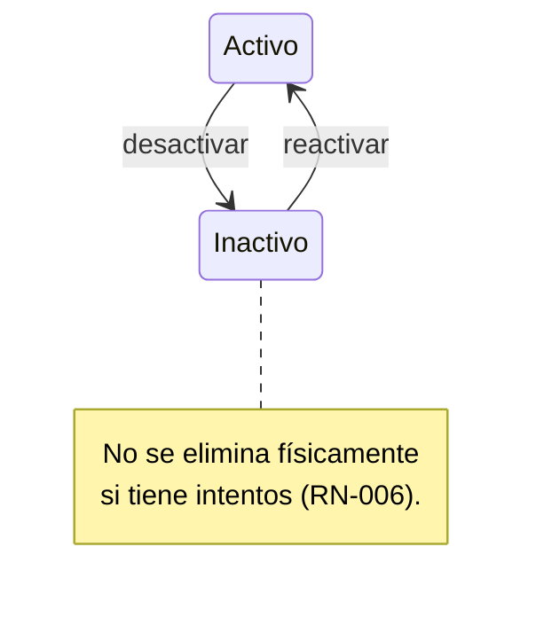
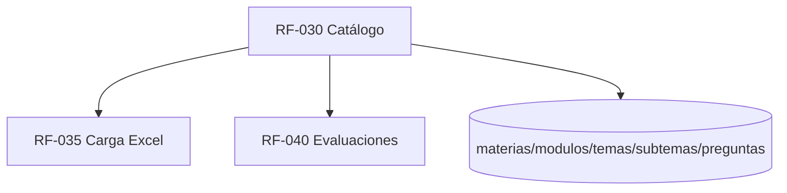

# RF-030: Catálogo de Contenido Configurable

---

## Índice del Documento
- [1. 📋 Información General](#1--información-general)
- [2. 📜 Histórico de Cambios](#2--histórico-de-cambios)
- [3. 📖 Introducción del Requerimiento](#3--introducción-del-requerimiento)
- [4. 🎯 Objetivo Principal](#4--objetivo-principal)
- [5. 📊 Diagramas del Requerimiento](#5--diagramas-del-requerimiento)
- [6. 📝 Especificación de Datos](#6--especificación-de-datos)
- [7. ✅ Validaciones](#7--validaciones)
- [8. 🔒 Reglas de Negocio](#8--reglas-de-negocio)
- [9. ⚙️ Requerimientos No Funcionales](#9--requerimientos-no-funcionales)
- [10. 🖼️ Mockups / Estados de Pantalla](#10--mockups--estados-de-pantalla)
- [11. ✨ Criterios de Aceptación](#11--criterios-de-aceptación)
- [12. 🛠️ Especificación Técnica](#12--especificación-técnica)
- [13. 🧪 Casos de Prueba](#13--casos-de-prueba)
- [14. 📎 Trazabilidad](#14--trazabilidad)

---

## 1. 📋 Información General

| Campo | Valor |
|-------|-------|
| **ID** | RF-030 |
| **Nombre** | Catálogo de Contenido Configurable |
| **Módulo** | [MOD-04 Catálogo de contenido](../04-modulos/modulos-secciones.md) |
| **Versión** | v1.1.0 |
| **Fecha creación** | 2026-06-19 |
| **Estado** | En análisis |
| **Prioridad** | 🔴 CRÍTICA |
| **Complejidad** | 🟠 Alta |
| **Autor** | Equipo de análisis |
| **RF relacionados** | RF-031..034 (estructura/preguntas) · RF-035 (carga Excel) · RF-040 (evaluaciones) |
| **Caso de uso** | CU-030 Administrar catálogo de contenido |

**Avance:** `[████████░░] análisis`

---

## 2. 📜 Histórico de Cambios

| Versión | Fecha | Autor | Descripción | Tipo |
|---------|-------|-------|-------------|------|
| v1.0.0 | 2026-06-19 | Equipo de análisis | Creación con estructura completa | Nueva |
| v1.1.0 | 2026-06-19 | Equipo de análisis | Se añade DDL base de `preguntas` y `opciones` (§6.3); antes solo se referían vía FK/ALTER en RF-033 | Cambio |

---

## 3. 📖 Introducción del Requerimiento

### 3.1 Descripción general
Permite definir y administrar el contenido académico como **datos**, no como código: materias → módulos → temas → subtemas → banco de preguntas. Agregar una materia nueva (p. ej. una doceava) debe ser una operación de configuración desde el panel, sin desplegar. Las 11 materias iniciales son: Química, Matemáticas, Competencias escritas, Biología, Competencia lectora, Historia, Física, Español / Literatura, Filosofía, Geografía e Historia Universal.

### 3.2 Contexto del negocio


### 3.3 Problema que resuelve
| # | Problema | Impacto | Solución |
|---|----------|---------|----------|
| 1 | Agregar materias requiere desarrollo | Lentitud, costo | Catálogo data-driven |
| 2 | Contenido desorganizado | Mala experiencia | Jerarquía estricta |
| 3 | Borrar contenido rompe historial | Pérdida de métricas | Borrado lógico |

### 3.4 Beneficios esperados
- ✅ Escalabilidad de contenido sin tocar código ([RNF-030](00-catalogo-requerimientos.md)).
- ✅ Estructura navegable y consistente para evaluaciones y progreso.
- ✅ Integridad del historial del alumno.

---

## 4. 🎯 Objetivo Principal

### 4.1 Objetivo general
> Gestionar un catálogo jerárquico y configurable de contenido que permita agregar materias y contenido sin cambios de código y preservando el historial.

### 4.2 Objetivos específicos
| # | Objetivo | Métrica | Meta |
|---|----------|---------|------|
| O1 | Materias configurables | Materias agregadas sin deploy | 100% |
| O2 | Jerarquía consistente | Violaciones de jerarquía | 0 |
| O3 | Preservar historial | Intentos perdidos por borrado | 0 |
| O4 | Orden y visibilidad | Control de orden y activo | 100% |

### 4.3 Alcance funcional

**✅ Incluido**
| Funcionalidad | Descripción |
|---------------|-------------|
| CRUD de materias/módulos/temas/subtemas | Con orden y estado activo |
| CRUD de preguntas | Con metadatos y **contenido enriquecido** ([RF-033](RF-033-contenido-reactivo.md)) |
| CRUD de **estímulos** | Lecturas/casos que agrupan reactivos ([RF-033](RF-033-contenido-reactivo.md)) |
| Borrado lógico | `activo=false` preserva historial |
| Validación de jerarquía | Pertenencia estricta |
| Activación/desactivación | Sin eliminar físicamente |

**❌ Excluido**
| Funcionalidad | Razón | Referencia |
|---------------|-------|------------|
| Carga masiva por Excel | Otro requerimiento | RF-035 |
| Armado de evaluaciones | Otro requerimiento | RF-040 |
| Visor de material | Otro requerimiento | RF-060 |

---

## 5. 📊 Diagramas del Requerimiento

### 5.1 Alta de contenido


### 5.2 Borrado lógico


---

## 6. 📝 Especificación de Datos

### 6.1 Entidades (extracto, ver ERD)
| Entidad | Campos clave |
|---------|--------------|
| materias | id, nombre, activa, orden |
| modulos | id, materia_id, nombre, activa, orden |
| temas | id, modulo_id, nombre, activa, orden |
| subtemas | id, tema_id, nombre, activa, orden |
| estimulos | id, tema_id, tipo, contenido, formato, activo (RF-033) |
| preguntas | id, tema_id, subtema_id?, estimulo_id?, …metadatos y contenido enriquecido (RF-033) |
| opciones | id, pregunta_id, letra (A–D), texto/contenido, es_correcta (extendida en RF-033) |

### 6.2 DDL (jerarquía)
```sql
CREATE TABLE materias (
  id UUID PRIMARY KEY DEFAULT gen_random_uuid(),
  nombre VARCHAR(120) NOT NULL,
  activa BOOLEAN NOT NULL DEFAULT TRUE,
  orden INT DEFAULT 0
);
CREATE TABLE modulos (
  id UUID PRIMARY KEY DEFAULT gen_random_uuid(),
  materia_id UUID NOT NULL REFERENCES materias(id),
  nombre VARCHAR(120) NOT NULL, activa BOOLEAN DEFAULT TRUE, orden INT DEFAULT 0
);
CREATE TABLE temas (
  id UUID PRIMARY KEY DEFAULT gen_random_uuid(),
  modulo_id UUID NOT NULL REFERENCES modulos(id),
  nombre VARCHAR(120) NOT NULL, activa BOOLEAN DEFAULT TRUE, orden INT DEFAULT 0
);
CREATE TABLE subtemas (
  id UUID PRIMARY KEY DEFAULT gen_random_uuid(),
  tema_id UUID NOT NULL REFERENCES temas(id),
  nombre VARCHAR(120) NOT NULL, activa BOOLEAN DEFAULT TRUE, orden INT DEFAULT 0
);
```

### 6.3 DDL (banco de preguntas — base)

> Estado **base** del banco de preguntas. [RF-033](RF-033-contenido-reactivo.md#62-extensión-de-preguntas-y-opciones) lo **extiende** (estímulos, formatos enriquecidos, `orden`). El esquema final consolidado está en [15-base-datos](../15-base-datos/00-indice-base-datos.md).

```sql
-- Banco de preguntas (RF-032/034 · RN-003/004). Borrado lógico vía 'activa' (RN-006).
CREATE TABLE preguntas (
  id UUID PRIMARY KEY DEFAULT gen_random_uuid(),
  tema_id UUID REFERENCES temas(id),
  subtema_id UUID REFERENCES subtemas(id),
  enunciado TEXT NOT NULL,
  descripcion TEXT,
  explicacion TEXT,
  tip TEXT,
  dificultad VARCHAR(10) CHECK (dificultad IN ('facil','media','dificil')),
  tiempo_estimado_seg INT,
  activa BOOLEAN NOT NULL DEFAULT TRUE,
  creado_en TIMESTAMP DEFAULT now()
);
CREATE INDEX idx_preguntas_tema ON preguntas(tema_id, activa);

-- Opciones: exactamente 4 (A–D), una correcta (RN-003). RF-033 renombra texto->contenido
-- y añade formato/imagen_url.
CREATE TABLE opciones (
  id UUID PRIMARY KEY DEFAULT gen_random_uuid(),
  pregunta_id UUID NOT NULL REFERENCES preguntas(id) ON DELETE CASCADE,
  letra CHAR(1) CHECK (letra IN ('A','B','C','D')),
  texto VARCHAR(255) NOT NULL,
  es_correcta BOOLEAN NOT NULL DEFAULT FALSE
);
CREATE INDEX idx_opciones_pregunta ON opciones(pregunta_id);
```

---

## 7. ✅ Validaciones

| ID | Descripción | Tipo |
|----|-------------|------|
| V-030-01 | Una materia nueva queda disponible sin desplegar código | Lógica |
| V-030-02 | Cada nivel referencia un padre existente y activo | BD |
| V-030-03 | Nombre obligatorio y no vacío por nivel | Datos |
| V-030-04 | No se elimina físicamente contenido con intentos | BD |
| V-030-05 | Desactivar un padre oculta su descendencia en consumo | Lógica |
| V-030-06 | `orden` define el orden de presentación | Datos |

---

## 8. 🔒 Reglas de Negocio

**RN-030-01 — Catálogo data-driven.** Agregar materias es configuración, no código ([RN-001](../06-reglas-negocio/reglas-principales.md)).

**RN-030-02 — Jerarquía estricta.** Materia→módulo→tema→subtema, con pertenencia única por nivel ([RN-002](../06-reglas-negocio/reglas-principales.md)).

**RN-030-03 — Borrado lógico.** Contenido con historial se desactiva, no se borra ([RN-006](../06-reglas-negocio/reglas-principales.md), [RNA-023](../06-reglas-negocio/reglas-alternas.md)).

**RN-030-04 — Visibilidad en consumo.** El alumno solo ve contenido activo cuyos ancestros estén activos.

**RN-030-05 — Permisos.** Solo administrador/editor gestionan el catálogo ([actores](../03-actores/actores.md)).

**RN-030-06 — Pregunta válida para publicar.** 4 opciones + 1 correcta + dificultad ([RN-003/004](../06-reglas-negocio/reglas-principales.md), detalle en RF-033/034).

---

## 9. ⚙️ Requerimientos No Funcionales

| RNF | Descripción |
|-----|-------------|
| RNF-030-01 | Catálogo cacheado en Redis para lectura de alta concurrencia ([RNF-013](00-catalogo-requerimientos.md)) |
| RNF-030-02 | Cambios de catálogo invalidan caché de forma consistente |
| RNF-030-03 | Auditoría de cambios de contenido ([RNF-004](00-catalogo-requerimientos.md)) |

---

## 10. 🖼️ Mockups / Estados de Pantalla

Gestión en panel admin ([EP-090](../11-ux-estados-pantalla/estados-pantalla-iniciales.md#mod-10--panel-administrativo)); en consumo se refleja en [EP-040 Selección de evaluación](../11-ux-estados-pantalla/estados-pantalla-iniciales.md#ep-040--selección-de-evaluación).

```
Árbol de contenido (panel):
  Química
   └ Módulo 1: Materia y energía
      └ Tema: Estequiometría
         └ Subtema: Mol y masa molar  [12 preguntas]
```

---

## 11. ✨ Criterios de Aceptación

```gherkin
Scenario: Agregar materia sin deploy
  Given un administrador en el panel
  When crea la materia "Geografía" y la activa
  Then queda disponible para los alumnos sin desplegar código

Scenario: Jerarquía consistente
  Given un tema
  When se crea un subtema
  Then el subtema pertenece a un único tema existente y activo

Scenario: Borrado lógico preserva historial
  Given un tema con intentos históricos
  When el editor lo desactiva
  Then deja de ofrecerse pero el historial permanece intacto

Scenario: Desactivar materia oculta su contenido
  Given una materia con módulos y temas activos
  When se desactiva la materia
  Then su contenido no aparece en el consumo del alumno
```

---

## 12. 🛠️ Especificación Técnica

### 12.1 Endpoints
```
GET    /api/v1/materias?activas=true            (consumo, cacheado)
GET    /api/v1/materias/{id}/arbol               (módulos→temas→subtemas)
POST   /api/v1/admin/materias|modulos|temas|subtemas
PUT    /api/v1/admin/{entidad}/{id}              (editar / activar / desactivar)
DELETE /api/v1/admin/{entidad}/{id}              -> 409 si tiene historial (usar desactivar)
```

### 12.2 Reglas de borrado (pseudocódigo)
```typescript
async eliminar(entidad, id) {
  if (await db.intentos.existenPara(entidad, id))   // RN-030-03 / V-030-04
    throw Conflict('tiene_historial_usar_desactivar');
  await db[entidad].deleteFisico(id);
}
async desactivar(entidad, id) {
  await db[entidad].update(id, { activa: false });
  await cache.invalidarCatalogo();                   // RNF-030-02
  await audit('CONTENIDO_DESACTIVADO', entidad, id);
}
```

---

## 13. 🧪 Casos de Prueba

| ID | Escenario | Traza | Tipo |
|----|-----------|-------|------|
| TC-030-01 | Crear materia disponible sin deploy | V-030-01, RN-030-01 | Positivo |
| TC-030-02 | Crear subtema con tema inexistente → error | V-030-02 | Negativo |
| TC-030-03 | Eliminar tema con historial → 409 | V-030-04, RN-030-03 | Negativo |
| TC-030-04 | Desactivar materia oculta contenido | V-030-05, RN-030-04 | Positivo |
| TC-030-05 | Editor sin permiso de pagos no afecta catálogo de otros | RN-030-05 | Negativo |
| TC-030-06 | Orden de presentación respeta `orden` | V-030-06 | Positivo |

---

## 14. 📎 Trazabilidad

### 14.1 Documentos relacionados
| Tipo | Referencia |
|------|------------|
| Reglas | [RN-001..006](../06-reglas-negocio/reglas-principales.md) · [RNA-020, RNA-023](../06-reglas-negocio/reglas-alternas.md) |
| Modelo de datos | [ERD: materias, modulos, temas, subtemas, preguntas](../09-diagramas/03-modelo-datos-erd.md) |
| Estados de pantalla | [EP-040, EP-090](../11-ux-estados-pantalla/estados-pantalla-iniciales.md) |
| Requerimientos | RF-031..035 · RF-040 |

### 14.2 Matriz de trazabilidad
| Regla | Endpoint | Validación | Caso de prueba |
|-------|----------|------------|----------------|
| RN-030-01 | POST /admin/materias | V-030-01 | TC-030-01 |
| RN-030-02 | POST /admin/{entidad} | V-030-02 | TC-030-02 |
| RN-030-03 | DELETE /admin/{entidad} | V-030-04 | TC-030-03 |
| RN-030-04 | GET /materias | V-030-05 | TC-030-04 |

### 14.3 Dependencias


<!-- FOOTER:ALEXANDRYA -->

---

<sub>📄 **Alexandrya** · `docs/05-requerimientos/RF-030-catalogo-contenido.md` · Versión documental **v0.3.0** · Actualizado **2026-06-19** · 🏠 [Índice](../README.md) · 💬 [Mensajes del sistema](../14-mensajes-sistema/mensajes-sistema.md)</sub>
