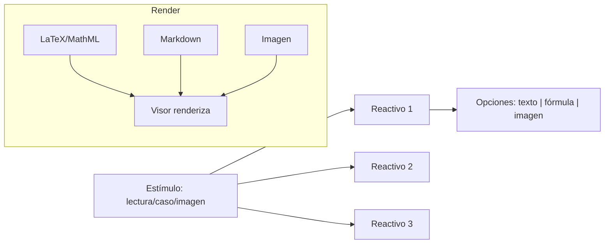
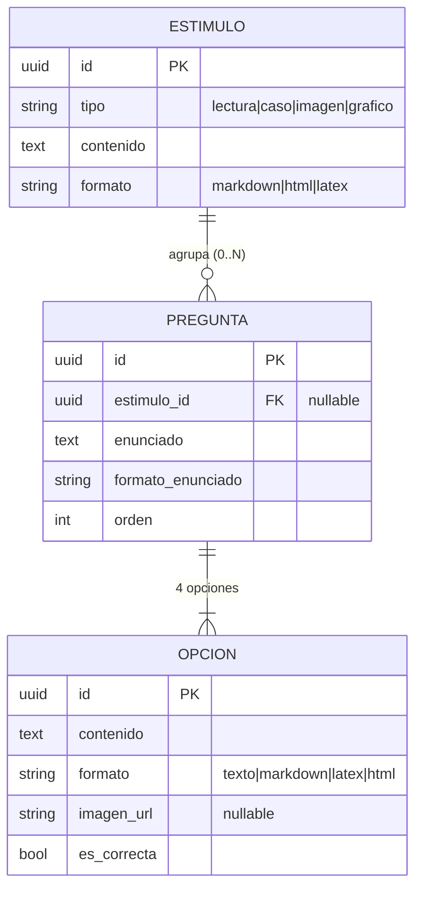
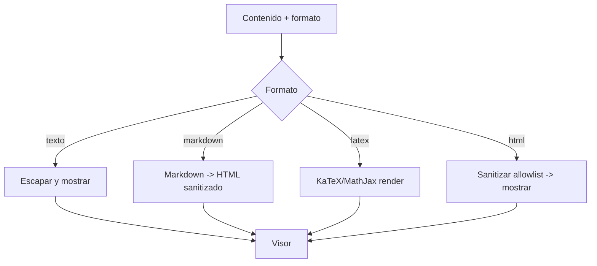
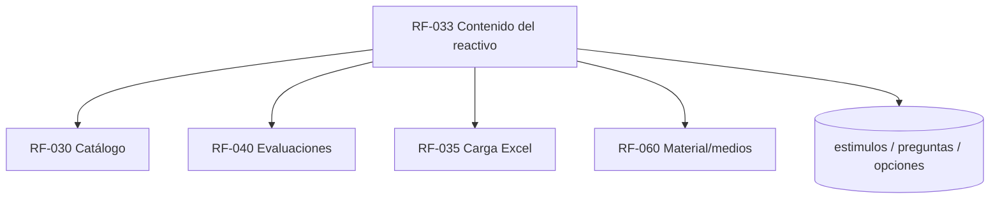

# RF-033: Contenido del Reactivo (Enriquecido y Estímulos Compartidos)

> 🧩 Este requerimiento surge del **análisis de reactivos reales** (Física, Matemáticas, Química, Biología y Competencia lectora) que mostraron que un reactivo no es solo "texto + 4 opciones de texto": necesita **fórmulas (LaTeX/MathML)**, **imágenes en opciones** y, sobre todo, **estímulos/lecturas compartidas** por varios reactivos.

---

## Índice del Documento
- [1. 📋 Información General](#1--información-general)
- [2. 📜 Histórico de Cambios](#2--histórico-de-cambios)
- [3. 📖 Introducción del Requerimiento](#3--introducción-del-requerimiento)
- [4. 🎯 Objetivo Principal](#4--objetivo-principal)
- [5. 📊 Diagramas del Requerimiento](#5--diagramas-del-requerimiento)
- [6. 📝 Especificación de Datos](#6--especificación-de-datos)
- [7. ✅ Validaciones](#7--validaciones)
- [8. 🔒 Reglas de Negocio](#8--reglas-de-negocio)
- [9. ⚙️ Requerimientos No Funcionales](#9--requerimientos-no-funcionales)
- [10. 🖼️ Mockups / Estados de Pantalla](#10--mockups--estados-de-pantalla)
- [11. ✨ Criterios de Aceptación](#11--criterios-de-aceptación)
- [12. 🛠️ Especificación Técnica](#12--especificación-técnica)
- [13. 🧪 Casos de Prueba](#13--casos-de-prueba)
- [14. 📎 Trazabilidad](#14--trazabilidad)

---

## 1. 📋 Información General

| Campo | Valor |
|-------|-------|
| **ID** | RF-033 |
| **Nombre** | Contenido del Reactivo (Enriquecido y Estímulos Compartidos) |
| **Módulo** | [MOD-04 Catálogo de contenido](../04-modulos/modulos-secciones.md) |
| **Versión** | v1.0.0 |
| **Fecha creación** | 2026-06-19 |
| **Estado** | En análisis |
| **Prioridad** | 🔴 CRÍTICA |
| **Complejidad** | 🔴 Alta |
| **Autor** | Equipo de análisis |
| **RF relacionados** | RF-030 (Catálogo) · RF-035 (Carga Excel) · RF-040 (Evaluaciones) · RF-060 (Material) |
| **Origen** | Análisis de reactivos reales (comprensión lectora, fórmulas, imágenes) |

**Avance:** `[████████░░] análisis`

---

## 2. 📜 Histórico de Cambios

| Versión | Fecha | Autor | Descripción | Tipo |
|---------|-------|-------|-------------|------|
| v1.0.0 | 2026-06-19 | Equipo de análisis | Creación a partir de adecuaciones por reactivos reales | Nueva |

---

## 3. 📖 Introducción del Requerimiento

### 3.1 Descripción general
Define **cómo se compone el contenido de un reactivo** más allá del texto plano. Cubre tres capacidades:
1. **Contenido enriquecido**: enunciado, opciones y explicación pueden ser texto, **markdown**, **LaTeX/MathML** (fórmulas) o HTML controlado.
2. **Opciones enriquecidas**: cada opción A–D puede contener fórmula o imagen, no solo texto.
3. **Estímulo compartido**: una **lectura/caso/imagen** sirve de base a **varios reactivos** (típico en comprensión lectora y casos).

### 3.2 Contexto del negocio


### 3.3 Problema que resuelve (evidencia de los reactivos)
| # | Reactivo de ejemplo | Limitación del modelo plano | Adecuación |
|---|---------------------|-----------------------------|-----------|
| 1 | Física: `v=[2g(H−h)]^½` | Opción como texto plano no renderiza la fórmula | `OPCION.formato = latex` |
| 2 | Matemáticas: `⅓ cos(x/3)` | Fracciones/funciones ilegibles en texto | `formato = latex` en enunciado y opciones |
| 3 | Química/Biología: imagen en el enunciado | Soportado, pero faltaba imagen **en opciones** | `OPCION.imagen_url` |
| 4 | Comprensión lectora "Carlomagno" | Texto largo compartido por varias preguntas no existía | Entidad `ESTIMULO` + `PREGUNTA.estimulo_id` |
| 5 | Párrafos `[1] [2]`, nota `gestas⁽¹⁾` | Texto plano sin estructura | `ESTIMULO.contenido` con markdown/HTML (párrafos y notas) |

### 3.4 Beneficios esperados
- ✅ Cubrir **todas las materias** (incluidas las de fórmulas y lectura) con un solo modelo.
- ✅ Reactivos fieles al examen real.
- ✅ Reutilización de lecturas/casos por múltiples reactivos.

---

## 4. 🎯 Objetivo Principal

### 4.1 Objetivo general
> Permitir reactivos con contenido enriquecido (fórmulas, markdown, imágenes) y estímulos compartidos por varios reactivos, renderizados fielmente y de forma segura.

### 4.2 Objetivos específicos
| # | Objetivo | Métrica | Meta |
|---|----------|---------|------|
| O1 | Render de fórmulas | Fórmulas mal renderizadas | 0 |
| O2 | Opciones con imagen/fórmula | Soporte por opción | 100% |
| O3 | Estímulos compartidos | Reactivos por estímulo | 1..N |
| O4 | Seguridad de HTML | XSS por contenido | 0 |

### 4.3 Alcance funcional

**✅ Incluido**
| Funcionalidad | Descripción |
|---------------|-------------|
| Formato por campo | `texto \| markdown \| latex \| html` en enunciado, opciones, explicación, estímulo |
| Render LaTeX/MathML | Fórmulas matemáticas y químicas |
| Imagen por opción | `OPCION.imagen_url` |
| Estímulo | Lectura/caso/imagen que agrupa N reactivos |
| Orden de reactivos en estímulo | `PREGUNTA.orden` |
| Saneamiento | Sanitizar HTML/markdown (anti-XSS) |

**❌ Excluido**
| Funcionalidad | Razón | Referencia |
|---------------|-------|------------|
| Editor WYSIWYG avanzado | UX de fase posterior | Roadmap |
| Reactivos de respuesta abierta | Modelo es opción única A–D | RF-040 |
| Multi-respuesta correcta | Fuera de alcance | RN-003/004 |

---

## 5. 📊 Diagramas del Requerimiento

### 5.1 Modelo de contenido


### 5.2 Renderizado seguro


---

## 6. 📝 Especificación de Datos

### 6.1 Tabla `estimulos`
```sql
CREATE TABLE estimulos (
  id UUID PRIMARY KEY DEFAULT gen_random_uuid(),
  tema_id UUID NOT NULL REFERENCES temas(id),
  tipo VARCHAR(12) NOT NULL CHECK (tipo IN ('lectura','caso','imagen','grafico')),
  titulo VARCHAR(200),
  contenido TEXT,                 -- párrafos numerados, notas al pie, etc.
  formato VARCHAR(10) NOT NULL DEFAULT 'markdown' CHECK (formato IN ('markdown','html','latex')),
  imagen_url VARCHAR(255),
  activo BOOLEAN NOT NULL DEFAULT TRUE,
  creado_en TIMESTAMP DEFAULT now()
);
CREATE INDEX idx_estimulos_tema ON estimulos(tema_id, activo);
```

### 6.2 Extensión de `preguntas` y `opciones`

> Tablas **base** (`preguntas`, `opciones`) definidas en [RF-030 §6.3](RF-030-catalogo-contenido.md#63-ddl-banco-de-preguntas--base). Aquí se **extienden** para estímulos y contenido enriquecido. Estado final consolidado en [15-base-datos](../15-base-datos/00-indice-base-datos.md).

```sql
ALTER TABLE preguntas
  ADD COLUMN estimulo_id UUID REFERENCES estimulos(id),
  ADD COLUMN formato_enunciado VARCHAR(10) NOT NULL DEFAULT 'texto'
    CHECK (formato_enunciado IN ('texto','markdown','latex','html')),
  ADD COLUMN formato_explicacion VARCHAR(10) NOT NULL DEFAULT 'texto',
  ADD COLUMN orden INT DEFAULT 0;          -- orden dentro del estímulo
-- enunciado, descripcion, explicacion, tip pasan a TEXT (contenido largo)

ALTER TABLE opciones
  RENAME COLUMN texto TO contenido;
ALTER TABLE opciones
  ALTER COLUMN contenido TYPE TEXT,
  ADD COLUMN formato VARCHAR(10) NOT NULL DEFAULT 'texto'
    CHECK (formato IN ('texto','markdown','latex','html')),
  ADD COLUMN imagen_url VARCHAR(255);
```

### 6.3 Ejemplo (Física, Reactivo 5)
```json
{
  "enunciado": "Un objeto se suelta desde el reposo a una altura $H$... rapidez al caer una distancia $h$.",
  "formato_enunciado": "latex",
  "opciones": [
    { "letra": "A", "contenido": "v=(2gh)^{1/2}", "formato": "latex", "es_correcta": false },
    { "letra": "B", "contenido": "v=[2g(H-h)]^{1/2}", "formato": "latex", "es_correcta": true },
    { "letra": "C", "contenido": "v=(2gH)^{1/2}", "formato": "latex", "es_correcta": false },
    { "letra": "D", "contenido": "v=[2g(h-H)]^{1/2}", "formato": "latex", "es_correcta": false }
  ]
}
```

### 6.4 Ejemplo (Comprensión lectora — estímulo compartido)
```json
{
  "estimulo": { "tipo": "lectura", "titulo": "Carlomagno y los países bajos",
                "formato": "markdown",
                "contenido": "[1] A mediados del siglo VIII...\n\n[2] Durante esta época... gestas[^1]...\n\n[^1]: Conjunto de hazañas..." },
  "preguntas": [ { "orden": 1, "enunciado": "Según el texto, ¿quién conquistó Utrecht?", "...": "..." } ]
}
```

---

## 7. ✅ Validaciones

| ID | Descripción | Tipo |
|----|-------------|------|
| V-033-01 | `formato` ∈ {texto, markdown, latex, html} por campo | Datos |
| V-033-02 | El LaTeX es válido (compila en el renderizador) | Render |
| V-033-03 | El HTML/markdown se sanitiza (allowlist, sin scripts) | Seguridad |
| V-033-04 | Una opción tiene **contenido o imagen** (no ambos vacíos) | Datos |
| V-033-05 | Un reactivo sigue teniendo exactamente 4 opciones y 1 correcta | Datos |
| V-033-06 | Si `estimulo_id` existe, el estímulo está activo y es del mismo tema | BD |
| V-033-07 | `orden` define la secuencia de reactivos dentro del estímulo | Datos |

---

## 8. 🔒 Reglas de Negocio

**RN-033-01 — Contenido enriquecido por formato.** Cada campo de contenido (enunciado, opción, explicación, estímulo) declara su `formato`; el visor lo renderiza acorde ([glosario: contenido enriquecido](../02-glosario/glosario.md)).

**RN-033-02 — Fórmulas con LaTeX/MathML.** Las materias con notación (Matemáticas, Física, Química) usan `formato=latex`. El render es del lado cliente con una librería estándar (KaTeX/MathJax).

**RN-033-03 — Opciones enriquecidas.** Una opción puede ser texto, fórmula o **imagen** (`imagen_url`); mantiene letra A–D y la regla de una sola correcta ([RN-003/004](../06-reglas-negocio/reglas-principales.md)).

**RN-033-04 — Estímulo compartido.** Un `estimulo` agrupa 1..N reactivos; el contenido base se muestra **una vez** y se reutiliza para todas sus preguntas ([RN-008](../06-reglas-negocio/reglas-principales.md)).

**RN-033-05 — Saneamiento obligatorio.** Todo markdown/HTML se sanitiza contra XSS antes de renderizar ([RNF-002 OWASP](00-catalogo-requerimientos.md)).

**RN-033-06 — Contenido largo.** Enunciados, opciones, explicaciones y estímulos admiten texto largo (`TEXT`), no limitado a cadenas cortas.

**RN-033-07 — Integridad del estímulo en el armado.** Si una evaluación incluye un reactivo con estímulo, debe presentar también su estímulo ([RF-040](RF-040-motor-evaluaciones.md)).

---

## 9. ⚙️ Requerimientos No Funcionales

| RNF | Descripción |
|-----|-------------|
| RNF-033-01 | Render de fórmulas determinista y accesible (texto alternativo/MathML) |
| RNF-033-02 | Sanitización server-side y client-side (defensa en profundidad) |
| RNF-033-03 | Imágenes de contenido servidas con las mismas reglas de medios ([RF-060](RF-060-visor-material.md)) |
| RNF-033-04 | Render de estímulos largos sin degradar la carga (lazy/scroll) |

---

## 10. 🖼️ Mockups / Estados de Pantalla

Ver [EP-041 Pregunta en curso](../11-ux-estados-pantalla/estados-pantalla-iniciales.md#ep-041--pregunta-en-curso) (incluye **panel de estímulo** para lectura y render de fórmulas).

```
Comprensión lectora (estímulo + reactivo):
┌──────────────── Lectura ────────────────┐  ┌──────── Reactivo 2/5 ────────┐
│ Carlomagno y los países bajos            │  │ Según [2], ¿quién conquistó  │
│ [1] A mediados del siglo VIII...         │  │ Utrecht?                     │
│ [2] ...las gestas¹ de Países Bajos...    │  │ A) Roland                    │
│ ¹ Conjunto de hazañas.                   │  │ B) Adalardo                  │
│ (scroll)                                 │  │ C) Guillermo  D) Carlomagno  │
└──────────────────────────────────────────┘  └──────────────────────────────┘

Matemáticas (fórmula renderizada):
  Enunciado: f(x) = 9·cos(x/3)   →   A) f''(x)= -cos(x/3)  (render LaTeX)
```

---

## 11. ✨ Criterios de Aceptación

```gherkin
Scenario: Opciones con fórmula se renderizan
  Given un reactivo de física con opciones en LaTeX
  When el alumno lo visualiza
  Then las cuatro opciones se muestran como fórmulas legibles, no como código

Scenario: Comprensión lectora con estímulo compartido
  Given una lectura con 5 reactivos asociados
  When el alumno responde la lectura
  Then el texto base se muestra junto a cada uno de sus reactivos
  And los reactivos respetan su orden

Scenario: Opción con imagen
  Given un reactivo cuya opción C es un diagrama
  When se presenta
  Then la opción C muestra la imagen

Scenario: Saneamiento de contenido
  Given un contenido HTML con un script malicioso
  When se renderiza
  Then el script se elimina (sanitizado) y no se ejecuta

Scenario: Reactivo conserva 4 opciones y 1 correcta
  Given cualquier reactivo enriquecido
  When se valida para publicar
  Then tiene exactamente 4 opciones y una sola correcta
```

---

## 12. 🛠️ Especificación Técnica

### 12.1 Render (cliente)
```
- LaTeX/MathML: KaTeX (preferido por rendimiento) o MathJax.
- Markdown: parser con sanitizador (allowlist) -> HTML.
- HTML: sanitizado por allowlist (sin <script>, sin handlers on*).
- Imágenes: vía URL firmada (RF-060) cuando son privadas.
```

### 12.2 Endpoints (extiende RF-030/RF-040)
```
POST /api/v1/admin/estimulos            -> crea estímulo (admin/editor)
POST /api/v1/admin/preguntas            -> acepta estimulo_id, formato_*, opciones con formato/imagen
GET  /api/v1/evaluaciones/.../reactivos -> entrega reactivos + su estímulo (sin marcar correcta)
```

### 12.3 Saneamiento (pseudocódigo)
```typescript
function renderContenido(campo) {
  switch (campo.formato) {
    case 'texto':    return escapeHtml(campo.valor);
    case 'markdown': return sanitize(md.render(campo.valor));   // RN-033-05
    case 'latex':    return katex.renderToString(campo.valor, { throwOnError: false }); // V-033-02
    case 'html':     return sanitize(campo.valor);              // allowlist
  }
}
```

---

## 13. 🧪 Casos de Prueba

| ID | Escenario | Traza | Tipo |
|----|-----------|-------|------|
| TC-033-01 | Opciones LaTeX se renderizan como fórmula | V-033-02, RN-033-02 | Positivo |
| TC-033-02 | Estímulo compartido se muestra con cada reactivo | V-033-06, RN-033-04/07 | Positivo |
| TC-033-03 | Opción con imagen se muestra | V-033-04, RN-033-03 | Positivo |
| TC-033-04 | HTML con script se sanitiza | V-033-03, RN-033-05 | Negativo |
| TC-033-05 | Reactivo enriquecido conserva 4 opciones/1 correcta | V-033-05 | Positivo |
| TC-033-06 | LaTeX inválido no rompe el visor (fallback) | V-033-02 | Borde |
| TC-033-07 | Orden de reactivos del estímulo respetado | V-033-07 | Positivo |
| TC-033-08 | Texto largo (lectura) se muestra completo con scroll | RN-033-06 | Borde |

---

## 14. 📎 Trazabilidad

### 14.1 Documentos relacionados
| Tipo | Referencia |
|------|------------|
| Reglas | [RN-003, RN-004, RN-007, RN-008](../06-reglas-negocio/reglas-principales.md) |
| Glosario | [Reactivo, Estímulo, Contenido enriquecido](../02-glosario/glosario.md) |
| Modelo de datos | [ERD: estimulos, preguntas, opciones](../09-diagramas/03-modelo-datos-erd.md) |
| Estados de pantalla | [EP-041](../11-ux-estados-pantalla/estados-pantalla-iniciales.md) |
| Requerimientos | RF-030 · RF-035 · RF-040 · RF-060 |

### 14.2 Matriz de trazabilidad
| Regla | Mecanismo | Validación | Caso de prueba |
|-------|-----------|------------|----------------|
| RN-033-02 | render LaTeX | V-033-02 | TC-033-01, TC-033-06 |
| RN-033-03 | opción imagen/fórmula | V-033-04 | TC-033-03 |
| RN-033-04 | estímulo compartido | V-033-06 | TC-033-02 |
| RN-033-05 | sanitización | V-033-03 | TC-033-04 |

### 14.3 Dependencias


<!-- FOOTER:ALEXANDRYA -->

---

<sub>📄 **Alexandrya** · `docs/05-requerimientos/RF-033-contenido-reactivo.md` · Versión documental **v0.3.0** · Actualizado **2026-06-19** · 🏠 [Índice](../README.md) · 💬 [Mensajes del sistema](../14-mensajes-sistema/mensajes-sistema.md)</sub>
