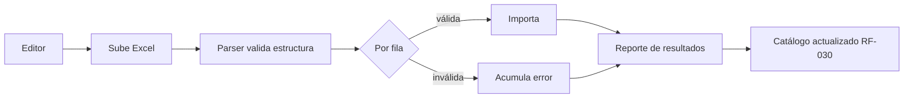
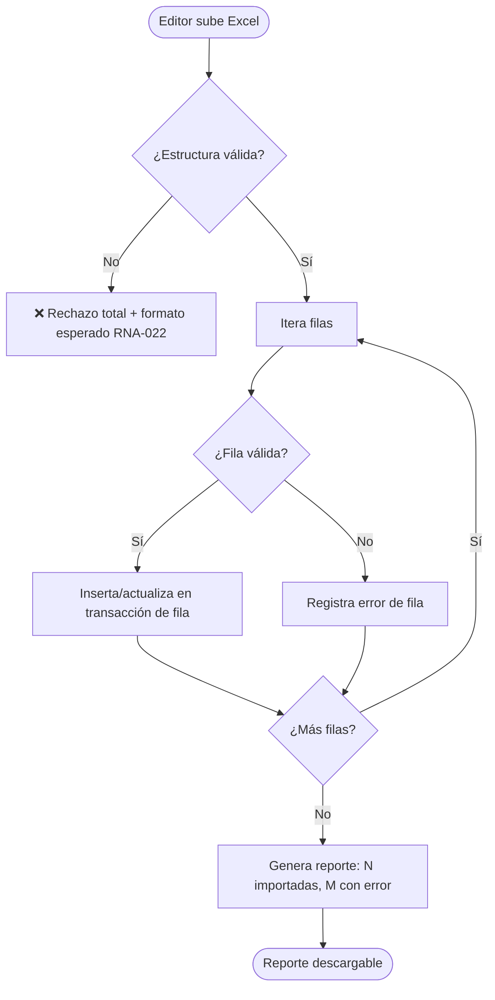
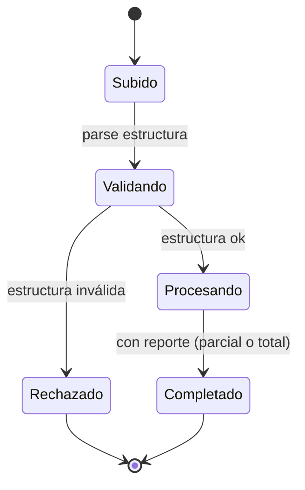
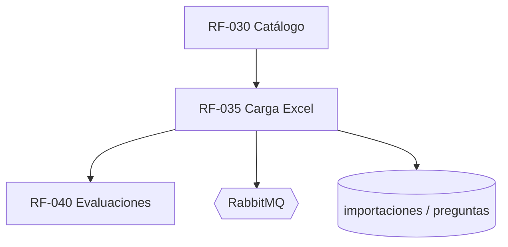

# RF-035: Carga Masiva por Excel

---

## Índice del Documento
- [1. 📋 Información General](#1--información-general)
- [2. 📜 Histórico de Cambios](#2--histórico-de-cambios)
- [3. 📖 Introducción del Requerimiento](#3--introducción-del-requerimiento)
- [4. 🎯 Objetivo Principal](#4--objetivo-principal)
- [5. 📊 Diagramas del Requerimiento](#5--diagramas-del-requerimiento)
- [6. 📝 Especificación de Datos](#6--especificación-de-datos)
- [7. ✅ Validaciones](#7--validaciones)
- [8. 🔒 Reglas de Negocio](#8--reglas-de-negocio)
- [9. ⚙️ Requerimientos No Funcionales](#9--requerimientos-no-funcionales)
- [10. 🖼️ Mockups / Estados de Pantalla](#10--mockups--estados-de-pantalla)
- [11. ✨ Criterios de Aceptación](#11--criterios-de-aceptación)
- [12. 🛠️ Especificación Técnica](#12--especificación-técnica)
- [13. 🧪 Casos de Prueba](#13--casos-de-prueba)
- [14. 📎 Trazabilidad](#14--trazabilidad)

---

## 1. 📋 Información General

| Campo | Valor |
|-------|-------|
| **ID** | RF-035 |
| **Nombre** | Carga Masiva por Excel |
| **Módulo** | [MOD-04 Catálogo de contenido](../04-modulos/modulos-secciones.md) |
| **Versión** | v1.0.0 |
| **Fecha creación** | 2026-06-19 |
| **Estado** | En análisis |
| **Prioridad** | 🟠 Alta |
| **Complejidad** | 🟠 Alta |
| **Autor** | Equipo de análisis |
| **RF relacionados** | RF-030 (Catálogo) · RF-033/034 (Preguntas) · RF-040 (Evaluaciones) |
| **Caso de uso** | CU-031 Carga masiva por Excel |

**Avance:** `[████████░░] análisis`

---

## 2. 📜 Histórico de Cambios

| Versión | Fecha | Autor | Descripción | Tipo |
|---------|-------|-------|-------------|------|
| v1.0.0 | 2026-06-19 | Equipo de análisis | Creación con estructura completa | Nueva |

---

## 3. 📖 Introducción del Requerimiento

### 3.1 Descripción general
Permite a administradores/editores **importar masivamente** materias, módulos, temas, subtemas y preguntas (con sus opciones y metadatos) desde un archivo Excel. La importación es **tolerante a errores por fila**: procesa las filas válidas y entrega un reporte detallado de las inválidas sin abortar todo el lote.

### 3.2 Contexto del negocio


### 3.3 Problema que resuelve
| # | Problema | Impacto | Solución |
|---|----------|---------|----------|
| 1 | Carga manual pregunta por pregunta | Lentísimo a escala | Importación masiva |
| 2 | Un error aborta todo el lote | Reproceso completo | Tolerancia por fila + reporte |
| 3 | Datos inconsistentes | Contenido roto | Validación previa por fila |

### 3.4 Beneficios esperados
- ✅ Poblar el banco de preguntas rápido (clave para el valor del MVP).
- ✅ Operación autónoma del equipo de contenido.
- ✅ Trazabilidad de qué se importó y qué falló.

---

## 4. 🎯 Objetivo Principal

### 4.1 Objetivo general
> Importar contenido en lote desde Excel validando por fila, importando lo válido y reportando con precisión lo inválido.

### 4.2 Objetivos específicos
| # | Objetivo | Métrica | Meta |
|---|----------|---------|------|
| O1 | Importar filas válidas | Filas válidas perdidas | 0 |
| O2 | No abortar por errores parciales | Lotes abortados por 1 error | 0 |
| O3 | Reporte preciso por fila | Errores sin localizar | 0 |
| O4 | Idempotencia/seguridad | Duplicados por reintento | 0 |

### 4.3 Alcance funcional

**✅ Incluido**
| Funcionalidad | Descripción |
|---------------|-------------|
| Plantilla Excel | Formato y columnas definidas |
| Validación de estructura | Hojas/columnas requeridas |
| Validación por fila | Datos de cada pregunta/nivel |
| Importación parcial | Solo filas válidas |
| Reporte de errores | Por número de fila y motivo |
| Vista previa (dry-run) | Validar sin escribir |

**❌ Excluido**
| Funcionalidad | Razón | Referencia |
|---------------|-------|------------|
| CRUD individual | Otro requerimiento | RF-030 |
| Carga de medios (video/PDF) | Se referencian por URL; gestión aparte | RF-060 |

---

## 5. 📊 Diagramas del Requerimiento

### 5.1 Flujo de importación


### 5.2 Estados de la importación


---

## 6. 📝 Especificación de Datos

### 6.1 Formato de la plantilla (hoja "preguntas")
| Columna | Obligatorio | Descripción |
|---------|:-----------:|-------------|
| materia | Sí | Nombre de materia (se crea o referencia) |
| modulo | Sí | Módulo dentro de la materia |
| tema | Sí | Tema dentro del módulo |
| subtema | No | Subtema opcional |
| estimulo_id | No | Referencia a una fila de la hoja "estimulos" (lectura/caso compartido) |
| orden | No | Orden del reactivo dentro del estímulo |
| enunciado | Sí | Texto de la pregunta |
| formato_enunciado | No | `texto` (def.) \| `markdown` \| `latex` \| `html` |
| opcion_a..opcion_d | Sí | Las 4 opciones (texto o fórmula según `formato_opciones`) |
| formato_opciones | No | Formato de las 4 opciones (def. `texto`); `latex` para fórmulas |
| opcion_a_img..opcion_d_img | No | URL de imagen por opción (opciones con diagrama) |
| correcta | Sí | A \| B \| C \| D |
| dificultad | Sí | facil \| media \| dificil |
| explicacion / formato_explicacion | No | Explicación posterior y su formato |
| tip | No | Sugerencia |
| tiempo_estimado_seg | No | Entero |
| imagen_url / video_url / material_url | No | Referencias a medios del enunciado |

### 6.1.1 Hoja "estimulos" (lecturas / casos compartidos)
| Columna | Obligatorio | Descripción |
|---------|:-----------:|-------------|
| estimulo_id | Sí | Clave local del archivo para enlazar con la hoja "preguntas" |
| materia / modulo / tema | Sí | Ubicación en el catálogo |
| tipo | Sí | lectura \| caso \| imagen \| grafico |
| titulo | No | Título del estímulo (ej.: "Carlomagno y los países bajos") |
| contenido | Sí (si no es imagen) | Texto base; admite markdown (párrafos, notas al pie) |
| formato | No | `markdown` (def.) \| `html` \| `latex` |
| imagen_url | No | Para estímulos tipo imagen/grafico |

> **Límite documentado:** Excel es adecuado para reactivos y lecturas **breves/medianas**. Para **lecturas largas con formato rico** (varios párrafos, notas al pie, tablas) se recomienda el **editor del panel** ([RF-033](RF-033-contenido-reactivo.md)); la celda de Excel admite el texto pero el formato fino se edita mejor en el editor. Esta limitación se comunica en la plantilla.

### 6.2 Estructura del reporte de resultados
```json
{
  "import_id": "uuid",
  "total_filas": 100,
  "importadas": 95,
  "con_error": 5,
  "errores": [
    { "fila": 12, "motivo": "correcta inválida (esperado A-D)" },
    { "fila": 27, "motivo": "faltan opciones (se requieren 4)" }
  ]
}
```

### 6.3 Tabla `importaciones`
```sql
CREATE TABLE importaciones (
  id UUID PRIMARY KEY DEFAULT gen_random_uuid(),
  usuario_id UUID NOT NULL REFERENCES usuarios(id),
  archivo_nombre VARCHAR(255),
  total_filas INT, importadas INT, con_error INT,
  reporte JSONB,
  estado VARCHAR(16) DEFAULT 'procesando',
  creada_en TIMESTAMP DEFAULT now()
);
```

---

## 7. ✅ Validaciones

| ID | Descripción | Tipo |
|----|-------------|------|
| V-035-01 | El archivo es Excel válido con las hojas/columnas requeridas | Formato |
| V-035-02 | Cada pregunta tiene 4 opciones y `correcta` ∈ {A,B,C,D} | Datos |
| V-035-03 | `dificultad` ∈ valores permitidos | Datos |
| V-035-04 | La jerarquía (materia/módulo/tema) es coherente | Lógica |
| V-035-05 | Filas inválidas no detienen el lote | Lógica |
| V-035-06 | El reporte indica fila y motivo de cada error | Datos |
| V-035-07 | Solo administrador/editor puede importar | Auth |
| V-035-08 | Reimportar el mismo archivo no duplica (clave de deduplicación) | BD |

---

## 8. 🔒 Reglas de Negocio

**RN-035-01 — Tolerancia por fila.** Importa válidas, reporta inválidas, no aborta el lote ([RN-006](../06-reglas-negocio/reglas-principales.md) borrado lógico, [RNA-021](../06-reglas-negocio/reglas-alternas.md)).

**RN-035-02 — Estructura inválida = rechazo total.** Si faltan hojas/columnas, no se procesa nada ([RNA-022](../06-reglas-negocio/reglas-alternas.md)).

**RN-035-03 — Pregunta válida.** 4 opciones + 1 correcta + dificultad ([RN-003/004](../06-reglas-negocio/reglas-principales.md)).

**RN-035-04 — Creación jerárquica.** Materias/módulos/temas referenciados por nombre se crean si no existen, respetando la jerarquía ([RN-030-02](RF-030-catalogo-contenido.md)).

**RN-035-05 — Permisos.** Solo administrador/editor ([actores](../03-actores/actores.md)).

**RN-035-06 — Idempotencia.** Reimportar el mismo contenido no genera duplicados (hash de fila / clave natural).

**RN-035-07 — Auditoría.** Cada importación se audita con su reporte ([RNF-004](00-catalogo-requerimientos.md)).

**RN-035-08 — Contenido enriquecido y estímulos.** La importación crea/enlaza estímulos (hoja "estimulos") y respeta el `formato` declarado por celda (texto/markdown/latex/html), saneando el contenido ([RF-033](RF-033-contenido-reactivo.md), [RN-007/RN-008](../06-reglas-negocio/reglas-principales.md)). Un `estimulo_id` referenciado debe existir en el archivo o en el catálogo.

---

## 9. ⚙️ Requerimientos No Funcionales

| RNF | Descripción |
|-----|-------------|
| RNF-035-01 | Procesamiento asíncrono (cola) para archivos grandes ([arquitectura](../09-diagramas/01-arquitectura.md)) |
| RNF-035-02 | Límite de tamaño de archivo y de filas configurable |
| RNF-035-03 | Reporte descargable y persistido |
| RNF-035-04 | Validación previa (dry-run) sin escribir |
| RNF-035-05 | Antivirus/validación del archivo subido |

---

## 10. 🖼️ Mockups / Estados de Pantalla

Panel admin ([EP-090](../11-ux-estados-pantalla/estados-pantalla-iniciales.md#mod-10--panel-administrativo)).

```
┌───────────────────────────────────────┐
│  Carga masiva de preguntas             │
│  [ Descargar plantilla ]               │
│  Archivo: [ preguntas.xlsx ]  [Subir]  │
│  ☑ Solo validar (dry-run)              │
│  ── Resultado ──                       │
│  Importadas: 95 / 100                  │
│  Errores: fila 12 (correcta inválida)  │
│           fila 27 (faltan opciones)    │
│  [ Descargar reporte ]                 │
└───────────────────────────────────────┘
```

---

## 11. ✨ Criterios de Aceptación

```gherkin
Scenario: Importación parcial con filas inválidas
  Given un Excel con 100 filas, 5 inválidas
  When el editor lo importa
  Then se importan las 95 válidas
  And el reporte detalla las 5 con su fila y motivo
  And el lote no se aborta

Scenario: Estructura inválida rechaza todo
  Given un Excel sin las columnas requeridas
  When se sube
  Then se rechaza por completo indicando el formato esperado

Scenario: Dry-run no escribe
  Given un Excel válido
  When el editor activa "solo validar"
  Then se genera el reporte sin modificar el catálogo

Scenario: Reimportación no duplica
  Given un Excel ya importado
  When se vuelve a importar igual
  Then no se crean preguntas duplicadas

Scenario: Permiso requerido
  Given un usuario sin rol de editor/admin
  When intenta importar
  Then se le deniega el acceso
```

---

## 12. 🛠️ Especificación Técnica

### 12.1 Endpoints
```
GET  /api/v1/admin/import/plantilla            -> descarga plantilla .xlsx
POST /api/v1/admin/import/preguntas            (multipart) { archivo, dry_run? }
     202 Accepted -> { import_id, estado: "procesando" }
GET  /api/v1/admin/import/{import_id}          -> { estado, total, importadas, con_error, errores[] }
```

### 12.2 Procesamiento (pseudocódigo)
```typescript
async procesarImport(importId, buffer, dryRun) {
  const wb = parseExcel(buffer);
  if (!validarEstructura(wb)) {                          // V-035-01 / RN-035-02
    return db.importaciones.rechazar(importId, 'estructura_invalida');
  }
  const errores = [];
  let importadas = 0;
  for (const [i, fila] of wb.rows.entries()) {
    const v = validarFila(fila);                         // V-035-02/03/04
    if (!v.ok) { errores.push({ fila: i + 2, motivo: v.motivo }); continue; } // RN-035-01
    if (!dryRun) await catalogo.upsertDesdeFila(fila);   // RN-035-04 / RN-035-06 (clave natural)
    importadas++;
  }
  await db.importaciones.completar(importId, { total: wb.rows.length, importadas, con_error: errores.length, reporte: { errores } });
  await audit('IMPORT_EXCEL', importId);                 // RN-035-07
}
```

---

## 13. 🧪 Casos de Prueba

| ID | Escenario | Traza | Tipo |
|----|-----------|-------|------|
| TC-035-01 | 95/100 válidas importan, reporte de 5 errores | V-035-05/06, RN-035-01 | Borde |
| TC-035-02 | Estructura inválida → rechazo total | V-035-01, RN-035-02 | Negativo |
| TC-035-03 | Pregunta con 3 opciones → error de fila | V-035-02, RN-035-03 | Negativo |
| TC-035-04 | Dry-run no escribe en catálogo | RNF-035-04 | Positivo |
| TC-035-05 | Reimportación no duplica | V-035-08, RN-035-06 | Borde |
| TC-035-06 | Crea jerarquía faltante (materia/módulo/tema) | V-035-04, RN-035-04 | Positivo |
| TC-035-07 | Usuario sin permiso → 403 | V-035-07, RN-035-05 | Negativo |
| TC-035-08 | Archivo grande procesa async | RNF-035-01 | Positivo |

---

## 14. 📎 Trazabilidad

### 14.1 Documentos relacionados
| Tipo | Referencia |
|------|------------|
| Reglas | [RN-001..006](../06-reglas-negocio/reglas-principales.md) · [RNA-021, RNA-022](../06-reglas-negocio/reglas-alternas.md) |
| Estados de pantalla | [EP-090](../11-ux-estados-pantalla/estados-pantalla-iniciales.md) |
| Flujo alterno | [FA-020 Excel con filas inválidas](../07-casos-uso/flujos-alternos.md#fa-020--excel-con-filas-inválidas) |
| Modelo de datos | [ERD: materias…preguntas](../09-diagramas/03-modelo-datos-erd.md) |
| Requerimientos | RF-030 · RF-033 · RF-034 · RF-040 |

### 14.2 Matriz de trazabilidad
| Regla | Endpoint | Validación | Caso de prueba |
|-------|----------|------------|----------------|
| RN-035-01 | POST /import/preguntas | V-035-05 | TC-035-01 |
| RN-035-02 | POST /import/preguntas | V-035-01 | TC-035-02 |
| RN-035-03 | POST /import/preguntas | V-035-02 | TC-035-03 |
| RN-035-06 | POST /import/preguntas | V-035-08 | TC-035-05 |

### 14.3 Dependencias


<!-- FOOTER:ALEXANDRYA -->

---

<sub>📄 **Alexandrya** · `docs/05-requerimientos/RF-035-carga-masiva-excel.md` · Versión documental **v0.3.0** · Actualizado **2026-06-19** · 🏠 [Índice](../README.md) · 💬 [Mensajes del sistema](../14-mensajes-sistema/mensajes-sistema.md)</sub>
