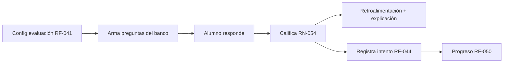
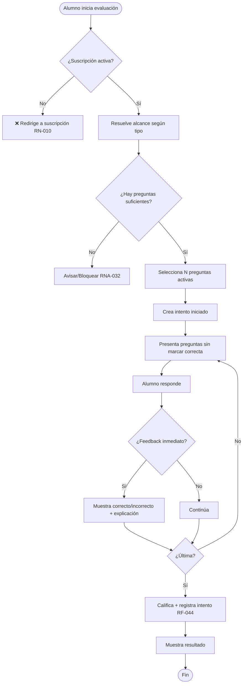
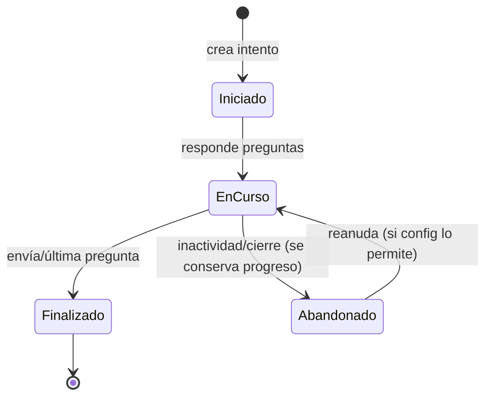
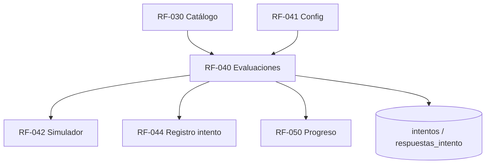

# RF-040: Motor de Evaluaciones

---

## Índice del Documento
- [1. 📋 Información General](#1--información-general)
- [2. 📜 Histórico de Cambios](#2--histórico-de-cambios)
- [3. 📖 Introducción del Requerimiento](#3--introducción-del-requerimiento)
- [4. 🎯 Objetivo Principal](#4--objetivo-principal)
- [5. 📊 Diagramas del Requerimiento](#5--diagramas-del-requerimiento)
- [6. 📝 Especificación de Datos](#6--especificación-de-datos)
- [7. ✅ Validaciones](#7--validaciones)
- [8. 🔒 Reglas de Negocio](#8--reglas-de-negocio)
- [9. ⚙️ Requerimientos No Funcionales](#9--requerimientos-no-funcionales)
- [10. 🖼️ Mockups / Estados de Pantalla](#10--mockups--estados-de-pantalla)
- [11. ✨ Criterios de Aceptación](#11--criterios-de-aceptación)
- [12. 🛠️ Especificación Técnica](#12--especificación-técnica)
- [13. 🧪 Casos de Prueba](#13--casos-de-prueba)
- [14. 📎 Trazabilidad](#14--trazabilidad)

---

## 1. 📋 Información General

| Campo | Valor |
|-------|-------|
| **ID** | RF-040 |
| **Nombre** | Motor de Evaluaciones |
| **Módulo** | [MOD-05 Evaluaciones](../04-modulos/modulos-secciones.md) |
| **Versión** | v1.1.0 |
| **Fecha creación** | 2026-06-19 |
| **Estado** | En análisis |
| **Prioridad** | 🔴 CRÍTICA |
| **Complejidad** | 🔴 Alta |
| **Autor** | Equipo de análisis |
| **RF relacionados** | RF-030 (Catálogo) · RF-041 (Config) · RF-042 (Simulador) · RF-044 (Registro intento) · RF-050 (Progreso) |
| **Caso de uso** | CU-040 Realizar una evaluación |

**Avance:** `[████████░░] análisis`

---

## 2. 📜 Histórico de Cambios

| Versión | Fecha | Autor | Descripción | Tipo |
|---------|-------|-------|-------------|------|
| v1.0.0 | 2026-06-19 | Equipo de análisis | Creación con estructura completa | Nueva |
| v1.1.0 | 2026-06-19 | Equipo de análisis | Se añade DDL de `evaluacion_config` (§6.2); antes solo se refería vía FK en `intentos` | Cambio |

---

## 3. 📖 Introducción del Requerimiento

### 3.1 Descripción general
Arma y ejecuta evaluaciones de cinco tipos (por **tema**, **módulo**, **materia**, **general** y **simulador**) a partir del banco de preguntas, las califica y entrega retroalimentación con explicación. Cada ejecución es un **intento** que se registra ([RF-044](00-indice-requerimientos.md)) y alimenta el progreso ([RF-050](RF-050-dashboard-progreso.md)). Requiere **suscripción activa**.

### 3.2 Contexto del negocio


### 3.3 Problema que resuelve
| # | Problema | Impacto | Solución |
|---|----------|---------|----------|
| 1 | Practicar de forma desestructurada | Bajo aprendizaje | Evaluaciones por nivel de jerarquía |
| 2 | No saber por qué se falla | Sin mejora | Retroalimentación + explicación |
| 3 | Sin medición objetiva | Sin diagnóstico | Registro de intentos y aciertos |

### 3.4 Beneficios esperados
- ✅ Práctica estructurada y medible.
- ✅ Aprendizaje activo con explicación inmediata.
- ✅ Datos base para fortalezas/debilidades y recomendaciones.

---

## 4. 🎯 Objetivo Principal

### 4.1 Objetivo general
> Permitir realizar evaluaciones configurables a partir del banco de preguntas, calificarlas y dar retroalimentación, registrando cada intento.

### 4.2 Objetivos específicos
| # | Objetivo | Métrica | Meta |
|---|----------|---------|------|
| O1 | Soportar 5 tipos de evaluación | Tipos disponibles | 5 |
| O2 | Calificación correcta | Errores de calificación | 0 |
| O3 | Registrar todo intento | Intentos sin registrar | 0 |
| O4 | Retroalimentación con explicación | Preguntas sin explicación mostrada | tendencia a 0 |

### 4.3 Alcance funcional

**✅ Incluido**
| Funcionalidad | Descripción |
|---------------|-------------|
| Armado por tipo | Tema / módulo / materia / general / simulador |
| Ejecución | Presentación de preguntas y captura de respuestas |
| **Reactivos con estímulo** | Si un reactivo pertenece a un estímulo (lectura/caso), se presenta el estímulo junto a sus reactivos, en orden ([RF-033](RF-033-contenido-reactivo.md), [RN-008](../06-reglas-negocio/reglas-principales.md)) |
| **Contenido enriquecido** | Renderiza enunciado/opciones con fórmulas (LaTeX), imágenes o markdown ([RF-033](RF-033-contenido-reactivo.md), [RN-007](../06-reglas-negocio/reglas-principales.md)) |
| Calificación | Binaria por pregunta (opción única) |
| Retroalimentación | Correcto/incorrecto + explicación + tip |
| Modo de feedback | Inmediato o al final (según config) |
| Registro de intento | Calificación, tiempo, alcance |

**❌ Excluido**
| Funcionalidad | Razón | Referencia |
|---------------|-------|------------|
| Temporizador del simulador | Otro requerimiento | RF-042 |
| Configuración admin | Otro requerimiento | RF-041 |
| Dashboard | Otro requerimiento | RF-050 |

---

## 5. 📊 Diagramas del Requerimiento

### 5.1 Flujo de evaluación


### 5.2 Estados del intento


---

## 6. 📝 Especificación de Datos

### 6.1 Entrada (iniciar / responder)
| Campo | Tipo | Descripción |
|-------|------|-------------|
| evaluacion_config_id | UUID | Configuración a instanciar |
| alcance_ref | UUID | Tema/módulo/materia según tipo |
| respuestas[] | {pregunta_id, opcion_id} | Respuestas del alumno |

### 6.2 Tablas (extracto)
```sql
-- Configuración de evaluación definida en administración (RF-041 · RN-050).
-- El simulador (RF-042) exige tiempo_limite_seg NOT NULL.
CREATE TABLE evaluacion_config (
  id UUID PRIMARY KEY DEFAULT gen_random_uuid(),
  nombre VARCHAR(120),
  tipo VARCHAR(16) NOT NULL
    CHECK (tipo IN ('tema','modulo','materia','general','simulador')),
  alcance_id UUID,                    -- id de materia/módulo/tema según 'tipo'
  num_preguntas INT NOT NULL,
  tiempo_limite_seg INT,              -- obligatorio para 'simulador'
  modo_feedback VARCHAR(16) NOT NULL DEFAULT 'al_final'
    CHECK (modo_feedback IN ('inmediato','al_final')),
  activa BOOLEAN NOT NULL DEFAULT TRUE,
  creada_en TIMESTAMP DEFAULT now()
);

CREATE TABLE intentos (
  id UUID PRIMARY KEY DEFAULT gen_random_uuid(),
  usuario_id UUID NOT NULL REFERENCES usuarios(id),
  evaluacion_config_id UUID NOT NULL REFERENCES evaluacion_config(id),
  calificacion NUMERIC(5,2),
  tiempo_invertido_seg INT,
  estado VARCHAR(16) DEFAULT 'iniciado'
    CHECK (estado IN ('iniciado','en_curso','finalizado','abandonado')),
  iniciado_en TIMESTAMP DEFAULT now(),
  finalizado_en TIMESTAMP
);
CREATE TABLE respuestas_intento (
  id UUID PRIMARY KEY DEFAULT gen_random_uuid(),
  intento_id UUID NOT NULL REFERENCES intentos(id) ON DELETE CASCADE,
  pregunta_id UUID NOT NULL REFERENCES preguntas(id),
  opcion_id UUID REFERENCES opciones(id),
  correcta BOOLEAN
);
CREATE INDEX idx_intentos_usuario ON intentos(usuario_id, finalizado_en);
```

---

## 7. ✅ Validaciones

| ID | Descripción | Tipo |
|----|-------------|------|
| V-040-01 | El alumno tiene suscripción activa | Negocio |
| V-040-02 | El tipo y alcance son coherentes (tema∈módulo∈materia) | Lógica |
| V-040-03 | Hay preguntas activas suficientes para la config | BD |
| V-040-04 | Las preguntas se envían sin revelar la respuesta correcta | Seguridad |
| V-040-05 | Cada respuesta referencia una opción de su pregunta | BD |
| V-040-06 | Calificación = aciertos/total; binaria por pregunta | Lógica |
| V-040-07 | Un intento finalizado no se recalifica ni sobrescribe | BD |

---

## 8. 🔒 Reglas de Negocio

**RN-040-01 — Acceso requiere suscripción activa** ([RN-010](../06-reglas-negocio/reglas-principales.md)).

**RN-040-02 — Configuración la define administración**, no el alumno ([RN-050](../06-reglas-negocio/reglas-principales.md)).

**RN-040-03 — Calificación binaria** por pregunta (opción única, sin parcial) ([RN-054](../06-reglas-negocio/reglas-principales.md)).

**RN-040-04 — Intentos independientes.** Cada intento se conserva; no sobrescribe previos ([RN-052](../06-reglas-negocio/reglas-principales.md), [RNA-033](../06-reglas-negocio/reglas-alternas.md) idempotencia de envío).

**RN-040-05 — No filtrar la respuesta correcta** al cliente antes de responder ([V-040-04](#7--validaciones)).

**RN-040-06 — Preguntas insuficientes.** Si la config pide N > disponibles, se arma con las disponibles avisando, o se bloquea según política ([RNA-032](../06-reglas-negocio/reglas-alternas.md)).

**RN-040-07 — Retroalimentación.** Muestra correcto/incorrecto, explicación y tip según el modo de feedback ([RF-043](00-catalogo-requerimientos.md)).

**RN-040-08 — Integridad del estímulo.** Si un reactivo seleccionado pertenece a un estímulo, la evaluación debe presentar ese estímulo y, cuando aplique (p. ej. comprensión lectora), mantener juntos sus reactivos en orden ([RN-008](../06-reglas-negocio/reglas-principales.md), [RF-033](RF-033-contenido-reactivo.md)).

**RN-040-09 — Render de contenido enriquecido.** El cliente renderiza enunciado y opciones según su `formato` (texto/markdown/latex/html), saneando el contenido ([RN-007](../06-reglas-negocio/reglas-principales.md), [RF-033](RF-033-contenido-reactivo.md)).

---

## 9. ⚙️ Requerimientos No Funcionales

| RNF | Descripción |
|-----|-------------|
| RNF-040-01 | Armado de evaluación con P95 ≤ 400 ms ([RNF-014](00-catalogo-requerimientos.md)) |
| RNF-040-02 | Banco/árbol cacheado (Redis) para selección rápida |
| RNF-040-03 | Selección de preguntas reproducible/auditada por intento |
| RNF-040-04 | Idempotencia en el envío del intento |

---

## 10. 🖼️ Mockups / Estados de Pantalla

Referencia: [EP-040 Selección](../11-ux-estados-pantalla/estados-pantalla-iniciales.md#ep-040--selección-de-evaluación), [EP-041 Pregunta](../11-ux-estados-pantalla/estados-pantalla-iniciales.md#ep-041--pregunta-en-curso), [EP-042 Feedback](../11-ux-estados-pantalla/estados-pantalla-iniciales.md#ep-042--retroalimentación-de-pregunta), [EP-043 Resultado](../11-ux-estados-pantalla/estados-pantalla-iniciales.md#ep-043--resultado-del-intento).

---

## 11. ✨ Criterios de Aceptación

```gherkin
Scenario: Examen por tema con retroalimentación final
  Given un alumno con suscripción activa
  When realiza un examen por tema y responde todas las preguntas
  Then se califica como aciertos/total
  And al finalizar se muestra correcto/incorrecto y explicación por pregunta
  And el intento se registra con su alcance y tiempo

Scenario: No se filtra la respuesta correcta
  Given una evaluación en curso
  When el cliente recibe las preguntas
  Then ninguna opción viene marcada como correcta

Scenario: Sin suscripción activa
  Given un alumno con suscripción vencida
  When intenta iniciar una evaluación
  Then se le bloquea y se le invita a renovar

Scenario: Preguntas insuficientes
  Given un tema con menos preguntas que las pedidas por la config
  When el alumno inicia la evaluación
  Then se arma con las disponibles avisando, o se bloquea según la política

Scenario: Intento no se recalifica
  Given un intento ya finalizado
  When se reenvía
  Then no se sobrescribe ni se recalifica (idempotente)
```

---

## 12. 🛠️ Especificación Técnica

### 12.1 Endpoints
```
GET  /api/v1/evaluaciones/config?tipo=tema&ref={temaId}   -> config aplicable
POST /api/v1/intentos                                      -> inicia intento (devuelve preguntas sin correcta)
     { evaluacion_config_id, alcance_ref }
POST /api/v1/intentos/{id}/responder                       -> { respuestas:[{pregunta_id, opcion_id}] }
POST /api/v1/intentos/{id}/finalizar                       -> califica y devuelve resultado + explicaciones
GET  /api/v1/intentos/{id}                                 -> detalle del intento
```

### 12.2 Armado y calificación (pseudocódigo)
```typescript
async iniciar(usuario, cfgId, alcanceRef) {
  if (!await subs.activa(usuario.id)) throw Forbidden('sin_suscripcion');  // RN-040-01
  const cfg = await db.evaluacion_config.find(cfgId);
  const pool = await catalogo.preguntasActivas(cfg.tipo, alcanceRef);      // V-040-02/03
  if (pool.length < cfg.num_preguntas) return this.handleInsuficientes(cfg, pool); // RN-040-06
  const seleccion = sample(pool, cfg.num_preguntas);
  const intento = await db.intentos.crear({ usuario_id: usuario.id, evaluacion_config_id: cfgId, estado: 'iniciado' });
  await db.intentos.guardarSeleccion(intento.id, seleccion);               // RNF-040-03
  return { intento, preguntas: stripCorrecta(seleccion) };                 // RN-040-05 / V-040-04
}

async finalizar(intentoId) {
  const intento = await db.intentos.find(intentoId);
  if (intento.estado === 'finalizado') return intento;                     // RN-040-04 idempotente
  const r = await db.respuestas_intento.byIntento(intentoId);
  const aciertos = r.filter(x => x.correcta).length;                       // RN-040-03 binaria
  const calif = (aciertos / r.length) * 100;
  await db.intentos.finalizar(intentoId, { calificacion: calif, finalizado_en: now() });
  return this.resultadoConExplicaciones(intentoId);                        // RN-040-07
}
```

---

## 13. 🧪 Casos de Prueba

| ID | Escenario | Traza | Tipo |
|----|-----------|-------|------|
| TC-040-01 | Examen por tema califica y registra intento | V-040-06, RN-040-03 | Positivo |
| TC-040-02 | Preguntas enviadas sin respuesta correcta | V-040-04, RN-040-05 | Positivo |
| TC-040-03 | Sin suscripción activa → bloqueo | V-040-01, RN-040-01 | Negativo |
| TC-040-04 | Preguntas insuficientes → aviso/bloqueo | V-040-03, RN-040-06 | Borde |
| TC-040-05 | Intento finalizado no se recalifica | V-040-07, RN-040-04 | Borde |
| TC-040-06 | Respuesta a opción ajena a la pregunta → rechazo | V-040-05 | Negativo |
| TC-040-07 | Retroalimentación muestra explicación y tip | RN-040-07 | Positivo |
| TC-040-08 | Examen general mezcla varias materias | V-040-02 | Positivo |

---

## 14. 📎 Trazabilidad

### 14.1 Documentos relacionados
| Tipo | Referencia |
|------|------------|
| Reglas | [RN-050..054](../06-reglas-negocio/reglas-principales.md) · [RNA-030..033](../06-reglas-negocio/reglas-alternas.md) |
| Estados de pantalla | [EP-040..043](../11-ux-estados-pantalla/estados-pantalla-iniciales.md) |
| Modelo de datos | [ERD: intentos, respuestas_intento, evaluacion_config](../09-diagramas/03-modelo-datos-erd.md) |
| Flujos | [Realizar una evaluación](../09-diagramas/04-flujos.md) |
| Requerimientos | RF-030 · RF-041 · RF-042 · RF-044 · RF-050 |

### 14.2 Matriz de trazabilidad
| Regla | Endpoint | Validación | Caso de prueba |
|-------|----------|------------|----------------|
| RN-040-01 | POST /intentos | V-040-01 | TC-040-03 |
| RN-040-03 | POST /intentos/{id}/finalizar | V-040-06 | TC-040-01 |
| RN-040-04 | POST /intentos/{id}/finalizar | V-040-07 | TC-040-05 |
| RN-040-05 | POST /intentos | V-040-04 | TC-040-02 |
| RN-040-06 | POST /intentos | V-040-03 | TC-040-04 |

### 14.3 Dependencias


<!-- FOOTER:ALEXANDRYA -->

---

<sub>📄 **Alexandrya** · `docs/05-requerimientos/RF-040-motor-evaluaciones.md` · Versión documental **v0.3.0** · Actualizado **2026-06-19** · 🏠 [Índice](../README.md) · 💬 [Mensajes del sistema](../14-mensajes-sistema/mensajes-sistema.md)</sub>
