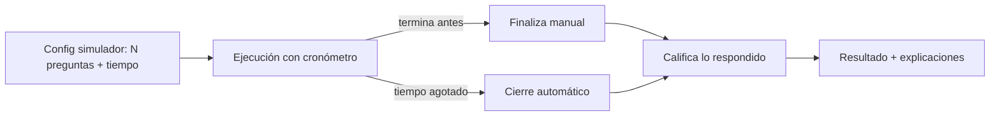
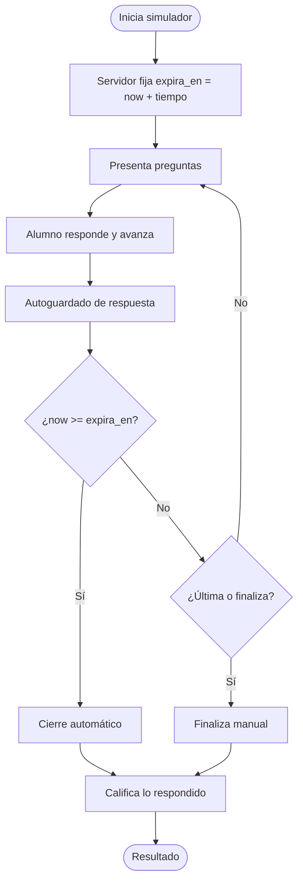
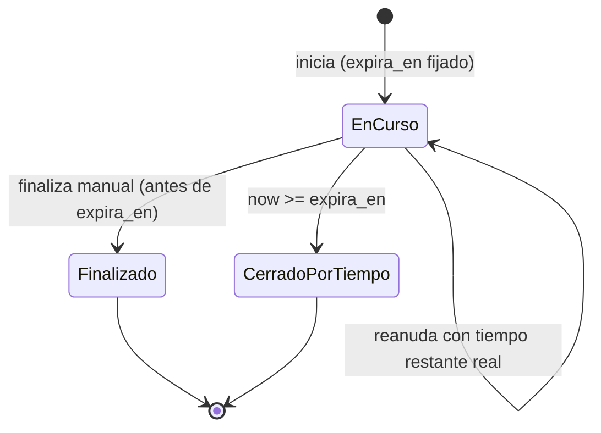
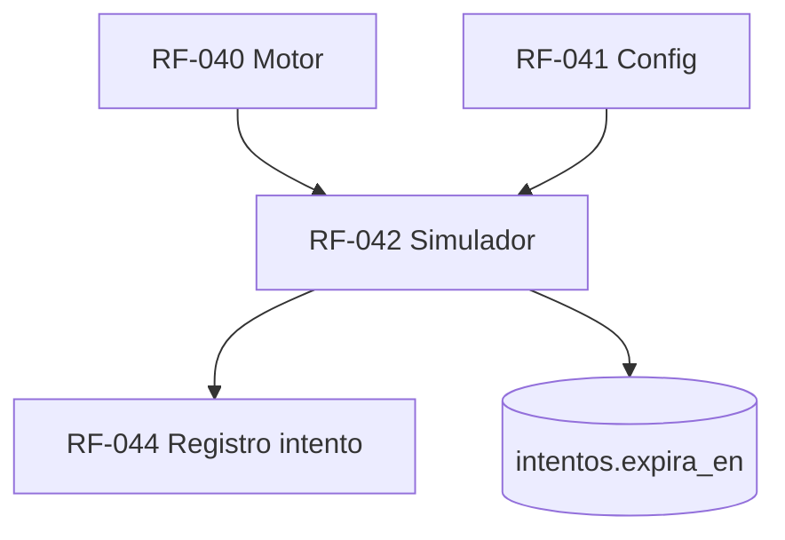

# RF-042: Simulador con Tiempo

---

## Índice del Documento
- [1. 📋 Información General](#1--información-general)
- [2. 📜 Histórico de Cambios](#2--histórico-de-cambios)
- [3. 📖 Introducción del Requerimiento](#3--introducción-del-requerimiento)
- [4. 🎯 Objetivo Principal](#4--objetivo-principal)
- [5. 📊 Diagramas del Requerimiento](#5--diagramas-del-requerimiento)
- [6. 📝 Especificación de Datos](#6--especificación-de-datos)
- [7. ✅ Validaciones](#7--validaciones)
- [8. 🔒 Reglas de Negocio](#8--reglas-de-negocio)
- [9. ⚙️ Requerimientos No Funcionales](#9--requerimientos-no-funcionales)
- [10. 🖼️ Mockups / Estados de Pantalla](#10--mockups--estados-de-pantalla)
- [11. ✨ Criterios de Aceptación](#11--criterios-de-aceptación)
- [12. 🛠️ Especificación Técnica](#12--especificación-técnica)
- [13. 🧪 Casos de Prueba](#13--casos-de-prueba)
- [14. 📎 Trazabilidad](#14--trazabilidad)

---

## 1. 📋 Información General

| Campo | Valor |
|-------|-------|
| **ID** | RF-042 |
| **Nombre** | Simulador con Tiempo |
| **Módulo** | [MOD-05 Evaluaciones](../04-modulos/modulos-secciones.md) |
| **Versión** | v1.0.0 |
| **Fecha creación** | 2026-06-19 |
| **Estado** | En análisis |
| **Prioridad** | 🟠 Alta |
| **Complejidad** | 🟠 Alta |
| **Autor** | Equipo de análisis |
| **RF relacionados** | RF-040 (Motor) · RF-041 (Config) · RF-044 (Registro intento) |
| **Caso de uso** | CU-041 Realizar un simulador con tiempo |

**Avance:** `[████████░░] análisis`

---

## 2. 📜 Histórico de Cambios

| Versión | Fecha | Autor | Descripción | Tipo |
|---------|-------|-------|-------------|------|
| v1.0.0 | 2026-06-19 | Equipo de análisis | Creación con estructura completa | Nueva |

---

## 3. 📖 Introducción del Requerimiento

### 3.1 Descripción general
Variante del motor de evaluaciones ([RF-040](RF-040-motor-evaluaciones.md)) que **replica el examen real**: número de preguntas, estructura por materias y **tiempo límite**. Al agotarse el tiempo, el intento se cierra automáticamente y se califica con lo respondido. El feedback típicamente es **al final** (no inmediato), para simular condiciones reales.

### 3.2 Contexto del negocio


### 3.3 Problema que resuelve
| # | Problema | Impacto | Solución |
|---|----------|---------|----------|
| 1 | El alumno no entrena bajo presión de tiempo | Mal desempeño real | Cronómetro y cierre automático |
| 2 | Manipulación del temporizador en cliente | Trampa | Tiempo autoritativo en servidor |
| 3 | Pérdida de respuestas al agotarse | Frustración | Autoguardado + calificación parcial |

### 3.4 Beneficios esperados
- ✅ Entrenamiento realista para el examen objetivo.
- ✅ Métrica de desempeño bajo tiempo.
- ✅ Integridad del tiempo (server-side).

---

## 4. 🎯 Objetivo Principal

### 4.1 Objetivo general
> Ofrecer simuladores con tiempo límite que repliquen el examen real, cerrando y calificando automáticamente al agotarse el tiempo.

### 4.2 Objetivos específicos
| # | Objetivo | Métrica | Meta |
|---|----------|---------|------|
| O1 | Tiempo autoritativo en servidor | Desfases por reloj de cliente | 0 |
| O2 | Cierre automático correcto | Intentos no cerrados al vencer | 0 |
| O3 | Calificación parcial fiel | Respuestas perdidas al cierre | 0 |
| O4 | Reanudación controlada | Reinicios de cronómetro indebidos | 0 |

### 4.3 Alcance funcional

**✅ Incluido**
| Funcionalidad | Descripción |
|---------------|-------------|
| Tiempo límite | Definido por config; cuenta regresiva |
| Reloj server-side | `expira_en` calculado al iniciar |
| Autoguardado | Respuestas persistidas al avanzar |
| Cierre automático | Al vencer, califica lo respondido |
| Reanudación | Tras desconexión, con el tiempo restante real |

**❌ Excluido**
| Funcionalidad | Razón | Referencia |
|---------------|-------|------------|
| Calificación base / armado | Reusa el motor | RF-040 |
| Config del simulador | Otro requerimiento | RF-041 |

---

## 5. 📊 Diagramas del Requerimiento

### 5.1 Flujo con temporizador


### 5.2 Estados del intento de simulador


---

## 6. 📝 Especificación de Datos

### 6.1 Campos específicos del simulador
| Campo | Tipo | Descripción |
|-------|------|-------------|
| tiempo_limite_seg | int | De la config (RF-041) |
| expira_en | timestamp | Calculado al iniciar (server) |
| cerrado_por_tiempo | bool | Marca el cierre automático |

### 6.2 Extensión de `intentos`
```sql
ALTER TABLE intentos
  ADD COLUMN expira_en TIMESTAMP,
  ADD COLUMN cerrado_por_tiempo BOOLEAN DEFAULT FALSE;
-- evaluacion_config.tipo = 'simulador' y tiempo_limite_seg NOT NULL
```

---

## 7. ✅ Validaciones

| ID | Descripción | Tipo |
|----|-------------|------|
| V-042-01 | La config es de tipo simulador con `tiempo_limite_seg` > 0 | Datos |
| V-042-02 | `expira_en` se fija en el servidor al iniciar | Seguridad |
| V-042-03 | Respuestas recibidas después de `expira_en` se ignoran | Lógica |
| V-042-04 | Al vencer, el intento se cierra y califica lo respondido | Lógica |
| V-042-05 | La reanudación usa el tiempo restante real (no reinicia) | Lógica |
| V-042-06 | No se permite extender el tiempo desde el cliente | Seguridad |

---

## 8. 🔒 Reglas de Negocio

**RN-042-01 — Tiempo autoritativo en servidor.** El cronómetro del cliente es solo visual; la verdad es `expira_en` del backend ([RN-051](../06-reglas-negocio/reglas-principales.md)).

**RN-042-02 — Cierre automático al agotar el tiempo**, calificando lo respondido ([RN-051](../06-reglas-negocio/reglas-principales.md), [RNA-030](../06-reglas-negocio/reglas-alternas.md)).

**RN-042-03 — Respuestas tardías se descartan.** Lo enviado tras `expira_en` no cuenta.

**RN-042-04 — Reanudación sin reiniciar el reloj.** Tras desconexión, continúa con el tiempo restante real ([RNA-031](../06-reglas-negocio/reglas-alternas.md)).

**RN-042-05 — Feedback al final por defecto** en simuladores (configurable), para condiciones realistas.

**RN-042-06 — Hereda reglas del motor** (suscripción activa, calificación binaria, intento independiente) de [RF-040](RF-040-motor-evaluaciones.md).

---

## 9. ⚙️ Requerimientos No Funcionales

| RNF | Descripción |
|-----|-------------|
| RNF-042-01 | Deriva del reloj del servidor (UTC); cliente solo muestra |
| RNF-042-02 | Autoguardado resiliente a desconexión (reintentos) |
| RNF-042-03 | Job/verificación que cierra intentos vencidos no finalizados |
| RNF-042-04 | Sincronización de tiempo restante en cada petición |

---

## 10. 🖼️ Mockups / Estados de Pantalla

Reusa [EP-041 Pregunta en curso](../11-ux-estados-pantalla/estados-pantalla-iniciales.md#ep-041--pregunta-en-curso) con el cronómetro visible (⏱), y [EP-043 Resultado](../11-ux-estados-pantalla/estados-pantalla-iniciales.md#ep-043--resultado-del-intento). Estado adicional: "Tiempo agotado — calificando lo respondido".

---

## 11. ✨ Criterios de Aceptación

```gherkin
Scenario: Simulador finaliza por tiempo
  Given un simulador con tiempo límite configurado
  When el alumno deja correr el tiempo sin terminar
  Then al llegar a expira_en el intento se cierra automáticamente
  And se califica solo lo respondido

Scenario: Tiempo autoritativo en servidor
  Given un alumno que altera el reloj de su dispositivo
  When responde después de expira_en del servidor
  Then esas respuestas se ignoran

Scenario: Reanudación tras desconexión
  Given un simulador en curso que pierde conexión a los 5 min
  When el alumno reconecta a los 7 min
  Then continúa con el tiempo restante real (no se reinicia)

Scenario: Finalización manual antes del tiempo
  Given un simulador en curso
  When el alumno finaliza antes de expira_en
  Then se califica con todas sus respuestas
```

---

## 12. 🛠️ Especificación Técnica

### 12.1 Endpoints (extiende RF-040)
```
POST /api/v1/intentos                 (tipo=simulador) -> { intento, expira_en, preguntas }
POST /api/v1/intentos/{id}/responder  -> 200 si now < expira_en; 409 "tiempo_agotado" si venció
POST /api/v1/intentos/{id}/finalizar  -> califica (manual o por tiempo)
GET  /api/v1/intentos/{id}/tiempo      -> { restante_seg }
```

### 12.2 Lógica de tiempo (pseudocódigo)
```typescript
async iniciarSimulador(usuario, cfgId) {
  const base = await motor.iniciar(usuario, cfgId);          // RN-042-06
  const expira = addSeconds(now(), cfg.tiempo_limite_seg);   // RN-042-01 / V-042-02
  await db.intentos.update(base.intento.id, { expira_en: expira });
  return { ...base, expira_en: expira };
}

async responder(intentoId, respuesta) {
  const it = await db.intentos.find(intentoId);
  if (now() >= it.expira_en) {                                // V-042-03 / RN-042-03
    await this.cerrarPorTiempo(intentoId);
    throw Conflict('tiempo_agotado');
  }
  await db.respuestas_intento.upsert(intentoId, respuesta);   // autoguardado
}

async cerrarPorTiempo(intentoId) {                            // RN-042-02
  const it = await db.intentos.find(intentoId);
  if (it.estado === 'finalizado') return;
  await db.intentos.update(intentoId, { cerrado_por_tiempo: true });
  await motor.finalizar(intentoId);                           // califica lo respondido
}
// Job periódico: cerrar intentos simulador con now >= expira_en y no finalizados (RNF-042-03)
```

---

## 13. 🧪 Casos de Prueba

| ID | Escenario | Traza | Tipo |
|----|-----------|-------|------|
| TC-042-01 | Cierre automático al agotar tiempo, califica parcial | V-042-04, RN-042-02 | Borde |
| TC-042-02 | Respuesta tras expira_en se ignora (409) | V-042-03, RN-042-03 | Negativo |
| TC-042-03 | Reloj de cliente alterado no afecta | V-042-02/06, RN-042-01 | Negativo |
| TC-042-04 | Reanudación usa tiempo restante real | V-042-05, RN-042-04 | Borde |
| TC-042-05 | Finalización manual antes del tiempo | RN-042-06 | Positivo |
| TC-042-06 | Job cierra intentos vencidos huérfanos | RNF-042-03 | Borde |
| TC-042-07 | Config no-simulador rechazada en este flujo | V-042-01 | Negativo |

---

## 14. 📎 Trazabilidad

### 14.1 Documentos relacionados
| Tipo | Referencia |
|------|------------|
| Reglas | [RN-050, RN-051](../06-reglas-negocio/reglas-principales.md) · [RNA-030, RNA-031](../06-reglas-negocio/reglas-alternas.md) |
| Estados de pantalla | [EP-041, EP-043](../11-ux-estados-pantalla/estados-pantalla-iniciales.md) |
| Modelo de datos | [ERD: intentos, evaluacion_config](../09-diagramas/03-modelo-datos-erd.md) |
| Requerimientos | RF-040 · RF-041 · RF-044 |

### 14.2 Matriz de trazabilidad
| Regla | Endpoint | Validación | Caso de prueba |
|-------|----------|------------|----------------|
| RN-042-01 | POST /intentos | V-042-02 | TC-042-03 |
| RN-042-02 | cerrarPorTiempo / job | V-042-04 | TC-042-01, TC-042-06 |
| RN-042-03 | POST /responder | V-042-03 | TC-042-02 |
| RN-042-04 | GET /tiempo | V-042-05 | TC-042-04 |

### 14.3 Dependencias


<!-- FOOTER:ALEXANDRYA -->

---

<sub>📄 **Alexandrya** · `docs/05-requerimientos/RF-042-simulador.md` · Versión documental **v0.3.0** · Actualizado **2026-06-19** · 🏠 [Índice](../README.md) · 💬 [Mensajes del sistema](../14-mensajes-sistema/mensajes-sistema.md)</sub>
