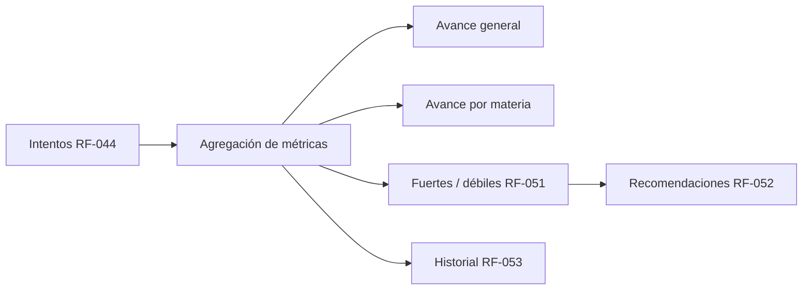
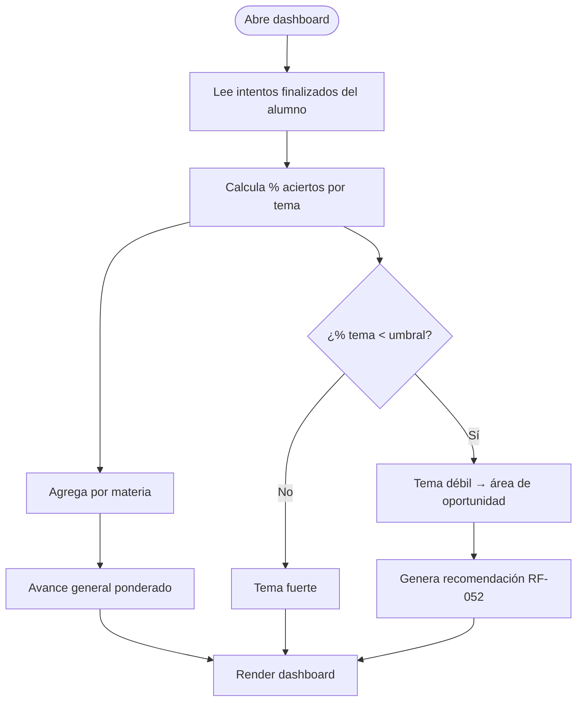
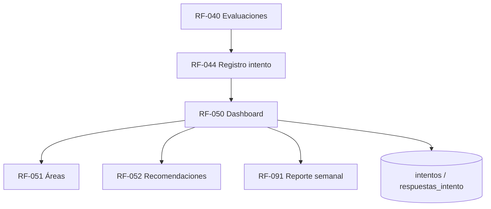

# RF-050: Dashboard de Progreso

---

## Índice del Documento
- [1. 📋 Información General](#1--información-general)
- [2. 📜 Histórico de Cambios](#2--histórico-de-cambios)
- [3. 📖 Introducción del Requerimiento](#3--introducción-del-requerimiento)
- [4. 🎯 Objetivo Principal](#4--objetivo-principal)
- [5. 📊 Diagramas del Requerimiento](#5--diagramas-del-requerimiento)
- [6. 📝 Especificación de Datos](#6--especificación-de-datos)
- [7. ✅ Validaciones](#7--validaciones)
- [8. 🔒 Reglas de Negocio](#8--reglas-de-negocio)
- [9. ⚙️ Requerimientos No Funcionales](#9--requerimientos-no-funcionales)
- [10. 🖼️ Mockups / Estados de Pantalla](#10--mockups--estados-de-pantalla)
- [11. ✨ Criterios de Aceptación](#11--criterios-de-aceptación)
- [12. 🛠️ Especificación Técnica](#12--especificación-técnica)
- [13. 🧪 Casos de Prueba](#13--casos-de-prueba)
- [14. 📎 Trazabilidad](#14--trazabilidad)

---

## 1. 📋 Información General

| Campo | Valor |
|-------|-------|
| **ID** | RF-050 |
| **Nombre** | Dashboard de Progreso |
| **Módulo** | [MOD-06 Progreso y métricas](../04-modulos/modulos-secciones.md) |
| **Versión** | v1.0.0 |
| **Fecha creación** | 2026-06-19 |
| **Estado** | En análisis |
| **Prioridad** | 🟠 Alta |
| **Complejidad** | 🟠 Alta |
| **Autor** | Equipo de análisis |
| **RF relacionados** | RF-040 (Evaluaciones) · RF-044 (Registro intento) · RF-051 (Áreas) · RF-052 (Recomendaciones) · RF-091 (Reporte semanal) |
| **Caso de uso** | CU-050 Consultar dashboard de progreso |

**Avance:** `[████████░░] análisis`

---

## 2. 📜 Histórico de Cambios

| Versión | Fecha | Autor | Descripción | Tipo |
|---------|-------|-------|-------------|------|
| v1.0.0 | 2026-06-19 | Equipo de análisis | Creación con estructura completa | Nueva |

---

## 3. 📖 Introducción del Requerimiento

### 3.1 Descripción general
Consolida el desempeño del alumno en una vista visual: **avance general**, **avance por materia**, **temas fuertes/débiles**, **áreas de oportunidad** y **recomendaciones automáticas**, con acceso al **historial** de intentos. Se calcula sobre los intentos registrados ([RF-044](00-indice-requerimientos.md)).

### 3.2 Contexto del negocio


### 3.3 Problema que resuelve
| # | Problema | Impacto | Solución |
|---|----------|---------|----------|
| 1 | El alumno no sabe dónde está parado | Estudio ineficiente | Avance visual por materia/tema |
| 2 | No identifica sus debilidades | No mejora | Clasificación fuerte/débil + áreas |
| 3 | No sabe qué estudiar después | Desorientación | Recomendaciones automáticas |

### 3.4 Beneficios esperados
- ✅ Estudio dirigido a lo que más impacta.
- ✅ Motivación por progreso visible.
- ✅ Insumo del reporte semanal por correo ([RF-091](00-indice-requerimientos.md)).

---

## 4. 🎯 Objetivo Principal

### 4.1 Objetivo general
> Mostrar de forma visual y accionable el progreso del alumno, identificando fortalezas, debilidades y recomendaciones a partir de su historial.

### 4.2 Objetivos específicos
| # | Objetivo | Métrica | Meta |
|---|----------|---------|------|
| O1 | Avance general y por materia | Exactitud del cálculo | 100% |
| O2 | Identificar temas débiles | Umbral configurable aplicado | 100% |
| O3 | Recomendaciones | Recomendación coherente con débiles | sí |
| O4 | Estado vacío claro | Mensaje sin datos | sí |

### 4.3 Alcance funcional

**✅ Incluido**
| Funcionalidad | Descripción |
|---------------|-------------|
| Avance general | Indicador agregado |
| Avance por materia | Porcentaje por materia |
| Fuertes/débiles | Clasificación por desempeño |
| Áreas de oportunidad | Temas/subtemas bajo umbral |
| Recomendaciones | Sugerencia de qué repasar |
| Historial | Lista de intentos previos |

**❌ Excluido**
| Funcionalidad | Razón | Referencia |
|---------------|-------|------------|
| Generación del intento | Otro requerimiento | RF-040 |
| Envío del reporte por correo | Otro requerimiento | RF-091 |
| Analítica predictiva | Fase posterior | Roadmap Año 3 |

---

## 5. 📊 Diagramas del Requerimiento

### 5.1 Cálculo de métricas


---

## 6. 📝 Especificación de Datos

### 6.1 Salida (dashboard)
| Campo | Tipo | Descripción |
|-------|------|-------------|
| avance_general | % | Indicador agregado |
| por_materia[] | {materia, porcentaje} | Avance por materia |
| temas_debiles[] | {tema, porcentaje} | Bajo umbral |
| temas_fuertes[] | {tema, porcentaje} | Sobre umbral |
| recomendaciones[] | string | Sugerencias |
| historial[] | {intento_id, fecha, tipo, calificacion} | Últimos intentos |

### 6.2 Vista materializada / agregación
```sql
-- Vista de desempeño por tema (puede materializarse y refrescarse)
CREATE VIEW v_desempeno_tema AS
SELECT i.usuario_id, p.tema_id,
       AVG(CASE WHEN ri.correcta THEN 1.0 ELSE 0.0 END) * 100 AS porcentaje,
       COUNT(*) AS respuestas
FROM intentos i
JOIN respuestas_intento ri ON ri.intento_id = i.id
JOIN preguntas p ON p.id = ri.pregunta_id
WHERE i.estado = 'finalizado'
GROUP BY i.usuario_id, p.tema_id;
```
Parámetro configurable: `UMBRAL_TEMA_DEBIL` (p. ej. 60%).

---

## 7. ✅ Validaciones

| ID | Descripción | Tipo |
|----|-------------|------|
| V-050-01 | Solo se consideran intentos finalizados | Lógica |
| V-050-02 | El alumno solo ve su propio progreso | Seguridad |
| V-050-03 | Tema débil si `porcentaje < UMBRAL` (configurable) | Lógica |
| V-050-04 | Avance por materia pondera sus temas con datos | Lógica |
| V-050-05 | Estado vacío si no hay intentos | UX |
| V-050-06 | Recomendaciones derivan de temas débiles reales | Lógica |

---

## 8. 🔒 Reglas de Negocio

**RN-050-01 — Métricas sobre historial.** Fuertes/débiles y áreas se calculan con el desempeño histórico del alumno ([RN-053](../06-reglas-negocio/reglas-principales.md)).

**RN-050-02 — Umbral configurable.** El corte fuerte/débil es parámetro de administración.

**RN-050-03 — Privacidad.** Un alumno solo accede a su propio dashboard ([actores](../03-actores/actores.md)).

**RN-050-04 — Recomendación accionable.** Apunta a temas débiles concretos ([RF-052](00-indice-requerimientos.md)).

**RN-050-05 — Consistencia con reporte semanal.** Usa el mismo cálculo que [RF-091](00-indice-requerimientos.md).

**RN-050-06 — Acceso requiere suscripción activa** (igual que el resto del contenido, [RN-010](../06-reglas-negocio/reglas-principales.md)).

---

## 9. ⚙️ Requerimientos No Funcionales

| RNF | Descripción |
|-----|-------------|
| RNF-050-01 | Dashboard carga en ≤ 2.5 s (web) ([RNF-015](00-catalogo-requerimientos.md)) |
| RNF-050-02 | Agregaciones cacheadas/materializadas para no recalcular en cada visita |
| RNF-050-03 | Cálculo idéntico entre dashboard (RF-050) y reporte (RF-091) |
| RNF-050-04 | Visualizaciones accesibles (no solo color para fuerte/débil) |

---

## 10. 🖼️ Mockups / Estados de Pantalla

Referencia: [EP-050 Dashboard](../11-ux-estados-pantalla/estados-pantalla-iniciales.md#ep-050--dashboard). Estado vacío: "Aún no tienes intentos. Haz tu primera evaluación."

```
Avance general: ███████░░ 72%
Por materia:  Matemáticas 85% · Química 55% (débil) · Física 60%
Áreas de oportunidad: Química (Estequiometría), Física (Cinemática)
Recomendación: Repasa "Estequiometría" y haz un examen por tema.
```

---

## 11. ✨ Criterios de Aceptación

```gherkin
Scenario: Dashboard muestra avance y debilidades
  Given un alumno con intentos en varias materias
  When abre su dashboard
  Then ve el avance general y por materia
  And ve sus temas fuertes y débiles según el umbral

Scenario: Recomendación coherente
  Given un alumno con bajo desempeño en "Estequiometría"
  When abre el dashboard
  Then recibe una recomendación de repasar ese tema

Scenario: Estado vacío
  Given un alumno sin intentos finalizados
  When abre el dashboard
  Then ve un mensaje invitándolo a hacer su primera evaluación

Scenario: Privacidad del progreso
  Given dos alumnos distintos
  When uno consulta el dashboard
  Then solo ve sus propios datos, nunca los del otro

Scenario: Consistencia con reporte semanal
  Given los datos de progreso de un alumno
  When se comparan dashboard y reporte semanal
  Then el avance general coincide
```

---

## 12. 🛠️ Especificación Técnica

### 12.1 Endpoints
```
GET /api/v1/progreso            (autenticado) -> { avance_general, por_materia[], temas_debiles[], temas_fuertes[], recomendaciones[] }
GET /api/v1/progreso/historial?page=&limit=    -> intentos paginados
```

### 12.2 Cálculo (pseudocódigo)
```typescript
async progreso(usuarioId) {
  if (!await subs.activa(usuarioId)) throw Forbidden('sin_suscripcion');   // RN-050-06
  const porTema = await db.vista.desempenoTema(usuarioId);                 // V-050-01
  if (porTema.length === 0) return emptyState();                          // V-050-05
  const umbral = await config.get('UMBRAL_TEMA_DEBIL', 60);               // RN-050-02
  const debiles = porTema.filter(t => t.porcentaje < umbral);             // V-050-03
  const fuertes = porTema.filter(t => t.porcentaje >= umbral);
  const porMateria = agruparPorMateria(porTema);                          // V-050-04
  const general = promedioPonderado(porMateria);
  const recomendaciones = recomendar(debiles);                            // RF-052 / RN-050-04
  return { avance_general: general, por_materia: porMateria, temas_debiles: debiles, temas_fuertes: fuertes, recomendaciones };
}
```

---

## 13. 🧪 Casos de Prueba

| ID | Escenario | Traza | Tipo |
|----|-----------|-------|------|
| TC-050-01 | Dashboard calcula avance general y por materia | V-050-04, RN-050-01 | Positivo |
| TC-050-02 | Tema bajo umbral se marca débil | V-050-03, RN-050-02 | Positivo |
| TC-050-03 | Recomendación apunta a tema débil | V-050-06, RN-050-04 | Positivo |
| TC-050-04 | Estado vacío sin intentos | V-050-05 | Borde |
| TC-050-05 | Alumno no ve progreso de otro | V-050-02, RN-050-03 | Negativo |
| TC-050-06 | Solo intentos finalizados cuentan | V-050-01 | Positivo |
| TC-050-07 | Avance general coincide con reporte semanal | RNF-050-03, RN-050-05 | Positivo |
| TC-050-08 | Sin suscripción activa → bloqueo | RN-050-06 | Negativo |

---

## 14. 📎 Trazabilidad

### 14.1 Documentos relacionados
| Tipo | Referencia |
|------|------------|
| Reglas | [RN-053](../06-reglas-negocio/reglas-principales.md) · [RN-010](../06-reglas-negocio/reglas-principales.md) |
| Estados de pantalla | [EP-050](../11-ux-estados-pantalla/estados-pantalla-iniciales.md) |
| Notificación | [NT-009 / CT-009 Reporte semanal](../12-notificaciones/plantillas-correo/CT-009-reporte-semanal.md) |
| Modelo de datos | [ERD: intentos, respuestas_intento, preguntas](../09-diagramas/03-modelo-datos-erd.md) |
| Requerimientos | RF-040 · RF-044 · RF-051 · RF-052 · RF-091 |

### 14.2 Matriz de trazabilidad
| Regla | Endpoint | Validación | Caso de prueba |
|-------|----------|------------|----------------|
| RN-050-01 | GET /progreso | V-050-01/04 | TC-050-01, TC-050-06 |
| RN-050-02 | GET /progreso | V-050-03 | TC-050-02 |
| RN-050-03 | GET /progreso | V-050-02 | TC-050-05 |
| RN-050-04 | GET /progreso | V-050-06 | TC-050-03 |
| RN-050-05 | GET /progreso | — | TC-050-07 |

### 14.3 Dependencias


<!-- FOOTER:ALEXANDRYA -->

---

<sub>📄 **Alexandrya** · `docs/05-requerimientos/RF-050-dashboard-progreso.md` · Versión documental **v0.3.0** · Actualizado **2026-06-19** · 🏠 [Índice](../README.md) · 💬 [Mensajes del sistema](../14-mensajes-sistema/mensajes-sistema.md)</sub>
