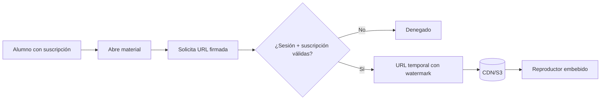
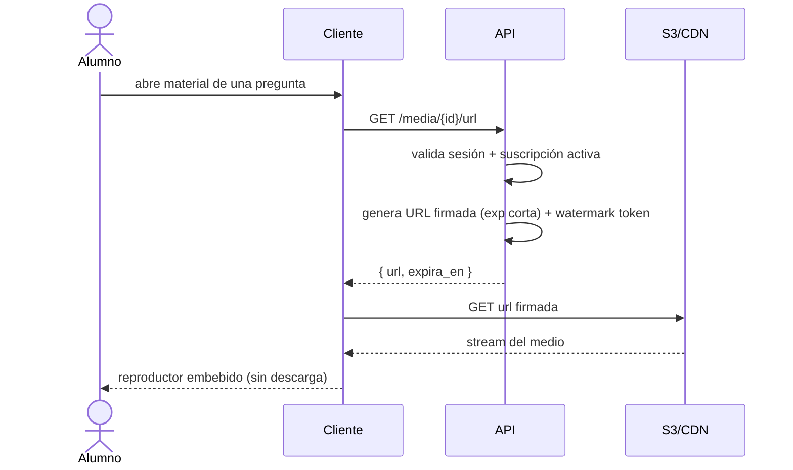
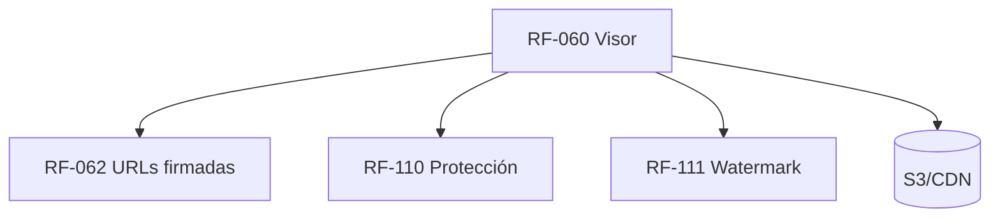

# RF-060: Visor de Material de Apoyo Protegido

---

## Índice del Documento
- [1. 📋 Información General](#1--información-general)
- [2. 📜 Histórico de Cambios](#2--histórico-de-cambios)
- [3. 📖 Introducción del Requerimiento](#3--introducción-del-requerimiento)
- [4. 🎯 Objetivo Principal](#4--objetivo-principal)
- [5. 📊 Diagramas del Requerimiento](#5--diagramas-del-requerimiento)
- [6. 📝 Especificación de Datos](#6--especificación-de-datos)
- [7. ✅ Validaciones](#7--validaciones)
- [8. 🔒 Reglas de Negocio](#8--reglas-de-negocio)
- [9. ⚙️ Requerimientos No Funcionales](#9--requerimientos-no-funcionales)
- [10. 🖼️ Mockups / Estados de Pantalla](#10--mockups--estados-de-pantalla)
- [11. ✨ Criterios de Aceptación](#11--criterios-de-aceptación)
- [12. 🛠️ Especificación Técnica](#12--especificación-técnica)
- [13. 🧪 Casos de Prueba](#13--casos-de-prueba)
- [14. 📎 Trazabilidad](#14--trazabilidad)

---

## 1. 📋 Información General

| Campo | Valor |
|-------|-------|
| **ID** | RF-060 |
| **Nombre** | Visor de Material de Apoyo Protegido |
| **Módulo** | [MOD-07 Material y medios](../04-modulos/modulos-secciones.md) |
| **Versión** | v1.0.0 |
| **Fecha creación** | 2026-06-19 |
| **Estado** | En análisis |
| **Prioridad** | 🟠 Alta |
| **Complejidad** | 🟠 Alta |
| **Autor** | Equipo de análisis |
| **RF relacionados** | RF-061 (No descarga) · RF-062 (URLs firmadas) · RF-110 (Protección) · RF-040 (Evaluaciones) |
| **Caso de uso** | CU-060 Visualizar material de apoyo |

**Avance:** `[████████░░] análisis`

---

## 2. 📜 Histórico de Cambios

| Versión | Fecha | Autor | Descripción | Tipo |
|---------|-------|-------|-------------|------|
| v1.0.0 | 2026-06-19 | Equipo de análisis | Creación con estructura completa | Nueva |

---

## 3. 📖 Introducción del Requerimiento

### 3.1 Descripción general
Permite **visualizar dentro de la plataforma** el material de apoyo (video, PDF, imagen, enlaces internos) asociado a preguntas o temas, **sin opción de descarga directa**. La entrega de medios se hace mediante **URLs firmadas/temporales** ligadas a la sesión y suscripción del alumno. La estrategia integral de protección se detalla en [RF-110](RF-110-proteccion-contenido.md).

### 3.2 Contexto del negocio


### 3.3 Problema que resuelve
| # | Problema | Impacto | Solución |
|---|----------|---------|----------|
| 1 | Material descargable se filtra | Pérdida de valor | Sin descarga + URLs temporales |
| 2 | Enlaces compartibles permanentes | Acceso indebido | URLs firmadas que expiran |
| 3 | Acceso sin pagar | Pérdida de ingresos | Validación de suscripción por recurso |

### 3.4 Beneficios esperados
- ✅ Material accesible solo para suscriptores activos.
- ✅ Dificulta (no impide del todo) la fuga de contenido ([RF-110](RF-110-proteccion-contenido.md)).
- ✅ Experiencia integrada de estudio.

---

## 4. 🎯 Objetivo Principal

### 4.1 Objetivo general
> Mostrar el material de apoyo dentro de la plataforma sin descarga directa, sirviendo los medios solo a sesiones autenticadas y suscripciones activas mediante URLs temporales.

### 4.2 Objetivos específicos
| # | Objetivo | Métrica | Meta |
|---|----------|---------|------|
| O1 | Visualización embebida | Materiales abiertos en plataforma | 100% |
| O2 | Sin descarga directa | Botones de descarga expuestos | 0 |
| O3 | URLs que expiran | Accesos con URL caducada | 0 |
| O4 | Solo suscriptores | Accesos sin suscripción activa | 0 |

### 4.3 Alcance funcional

**✅ Incluido**
| Funcionalidad | Descripción |
|---------------|-------------|
| Visor de video | Reproductor embebido (streaming) |
| Visor de PDF | Render embebido sin botón de descarga |
| Visor de imagen | Imagen protegida con watermark |
| Enlaces internos | Navegación dentro de la plataforma |
| URL firmada | Generada por recurso, corta expiración |
| Watermark dinámico | Identificador del alumno (vía RF-111) |

**❌ Excluido**
| Funcionalidad | Razón | Referencia |
|---------------|-------|------------|
| Estrategia/limitaciones de protección | Documento dedicado | RF-110 |
| FLAG_SECURE (Android) | Capa de app | RF-112 |
| Modo offline | Fuera de MVP | Roadmap Año 3 |

---

## 5. 📊 Diagramas del Requerimiento

### 5.1 Entrega de medio


---

## 6. 📝 Especificación de Datos

### 6.1 Tabla `materiales`
```sql
CREATE TABLE materiales (
  id UUID PRIMARY KEY DEFAULT gen_random_uuid(),
  pregunta_id UUID REFERENCES preguntas(id),
  tema_id UUID REFERENCES temas(id),
  tipo VARCHAR(12) NOT NULL CHECK (tipo IN ('video','pdf','imagen','enlace')),
  storage_key VARCHAR(255),     -- clave en S3 (no URL pública)
  url_interna VARCHAR(255),     -- para tipo 'enlace'
  activo BOOLEAN DEFAULT TRUE,
  creado_en TIMESTAMP DEFAULT now()
);
```

### 6.2 Respuesta de URL firmada
```json
{ "url": "https://cdn.../obj?signature=...&exp=...", "expira_en": "2026-06-19T12:34:56Z", "watermark": "alumno-uuid" }
```

---

## 7. ✅ Validaciones

| ID | Descripción | Tipo |
|----|-------------|------|
| V-060-01 | El alumno está autenticado con sesión activa | Auth |
| V-060-02 | El alumno tiene suscripción activa | Negocio |
| V-060-03 | El material existe y está activo | BD |
| V-060-04 | La URL firmada tiene expiración corta | Seguridad |
| V-060-05 | El recurso no se entrega sin URL válida (acceso directo denegado) | Seguridad |
| V-060-06 | No se expone `storage_key` ni URL permanente al cliente | Seguridad |

---

## 8. 🔒 Reglas de Negocio

**RN-060-01 — Visualización dentro de la plataforma.** Todo el material se ve embebido ([RF-060](00-catalogo-requerimientos.md)).

**RN-060-02 — Sin descarga directa.** No se ofrece botón ni endpoint de descarga ([RN-061 base](../06-reglas-negocio/reglas-principales.md) → ver RF-061).

**RN-060-03 — URLs firmadas y temporales ligadas a la sesión** ([RN-061](../06-reglas-negocio/reglas-principales.md), [RF-062](00-catalogo-requerimientos.md)).

**RN-060-04 — Acceso solo con suscripción activa** ([RN-010](../06-reglas-negocio/reglas-principales.md)); un alumno vencido no obtiene URL.

**RN-060-05 — Watermark dinámico** con identificador del alumno en medios sensibles ([RF-111](00-catalogo-requerimientos.md)).

**RN-060-06 — URL caducada se rechaza** ([RNA-050](../06-reglas-negocio/reglas-alternas.md)); acceso sin sesión también ([RNA-051](../06-reglas-negocio/reglas-alternas.md)).

**RN-060-07 — Límite realista.** Estas medidas **dificultan** pero no garantizan imposibilidad de fuga; ver [RF-110](RF-110-proteccion-contenido.md) y [RN-060..063](../06-reglas-negocio/reglas-principales.md).

---

## 9. ⚙️ Requerimientos No Funcionales

| RNF | Descripción |
|-----|-------------|
| RNF-060-01 | Medios servidos por CDN ([RNF-012](00-catalogo-requerimientos.md)) |
| RNF-060-02 | Expiración de URL configurable (orden de minutos) |
| RNF-060-03 | Streaming de video adaptativo cuando aplique |
| RNF-060-04 | El bucket S3 es privado; sin acceso público directo |

---

## 10. 🖼️ Mockups / Estados de Pantalla

Referencia: [EP-060 Visor de material](../11-ux-estados-pantalla/estados-pantalla-iniciales.md#ep-060--visor-de-material).

```
┌───────────────────────────────────────┐
│  ▶ Video — Estequiometría              │
│  [████████ reproductor ████████]       │
│  (watermark: alumno@correo)            │
│  Sin botón de descarga                 │
└───────────────────────────────────────┘
```

---

## 11. ✨ Criterios de Aceptación

```gherkin
Scenario: Visualizar material con suscripción activa
  Given un alumno con suscripción activa
  When abre el material de una pregunta
  Then obtiene una URL firmada temporal
  And el material se reproduce embebido sin opción de descarga

Scenario: Alumno vencido no obtiene material
  Given un alumno con suscripción vencida
  When intenta abrir material
  Then no se genera URL y se le invita a renovar

Scenario: URL firmada caducada
  Given una URL de medio expirada
  When se intenta abrir
  Then el acceso es rechazado

Scenario: Acceso directo al recurso sin sesión
  Given una petición directa al objeto en storage sin URL firmada
  When se realiza
  Then es denegada (bucket privado)

Scenario: Watermark presente
  Given un video premium
  When se reproduce
  Then muestra el identificador del alumno como marca de agua
```

---

## 12. 🛠️ Especificación Técnica

### 12.1 Endpoints
```
GET /api/v1/media/{materialId}/url   (autenticado)
    200: { url, expira_en, watermark }
    402/403: sin suscripción activa
    404: material inexistente/inactivo
```

### 12.2 Generación de URL (pseudocódigo)
```typescript
async urlMaterial(usuario, materialId) {
  if (!await subs.activa(usuario.id)) throw PaymentRequired('sin_suscripcion'); // RN-060-04
  const m = await db.materiales.findActivo(materialId);                          // V-060-03
  if (!m) throw NotFound();
  if (m.tipo === 'enlace') return { url: m.url_interna };
  const url = storage.signedUrl(m.storage_key, { expiresIn: cfg.mediaTtl });     // RN-060-03 / V-060-04
  const watermark = usuario.id;                                                  // RN-060-05 (RF-111)
  await audit('MEDIA_ACCESO', usuario.id, materialId);
  return { url, expira_en: addSeconds(now(), cfg.mediaTtl), watermark };
}
```

---

## 13. 🧪 Casos de Prueba

| ID | Escenario | Traza | Tipo |
|----|-----------|-------|------|
| TC-060-01 | Material visible embebido sin descarga | V-060-01..03, RN-060-01/02 | Positivo |
| TC-060-02 | URL caducada → acceso rechazado | V-060-04, RN-060-06 | Negativo |
| TC-060-03 | Acceso directo a S3 sin firma → denegado | V-060-05, RNF-060-04 | Negativo |
| TC-060-04 | Suscripción vencida no obtiene URL | V-060-02, RN-060-04 | Negativo |
| TC-060-05 | Watermark con id del alumno | RN-060-05 | Positivo |
| TC-060-06 | No se expone storage_key/URL permanente | V-060-06 | Negativo |

---

## 14. 📎 Trazabilidad

### 14.1 Documentos relacionados
| Tipo | Referencia |
|------|------------|
| Reglas | [RN-060..063](../06-reglas-negocio/reglas-principales.md) · [RNA-050, RNA-051](../06-reglas-negocio/reglas-alternas.md) |
| Estados de pantalla | [EP-060](../11-ux-estados-pantalla/estados-pantalla-iniciales.md) |
| Modelo de datos | [ERD: materiales](../09-diagramas/03-modelo-datos-erd.md) |
| Requerimientos | RF-061 · RF-062 · RF-110 · RF-111 |

### 14.2 Matriz de trazabilidad
| Regla | Endpoint | Validación | Caso de prueba |
|-------|----------|------------|----------------|
| RN-060-02 | GET /media/{id}/url | V-060-06 | TC-060-01, TC-060-06 |
| RN-060-03 | GET /media/{id}/url | V-060-04 | TC-060-02 |
| RN-060-04 | GET /media/{id}/url | V-060-02 | TC-060-04 |
| RN-060-06 | (CDN/storage) | V-060-05 | TC-060-02, TC-060-03 |

### 14.3 Dependencias


<!-- FOOTER:ALEXANDRYA -->

---

<sub>📄 **Alexandrya** · `docs/05-requerimientos/RF-060-visor-material.md` · Versión documental **v0.3.0** · Actualizado **2026-06-19** · 🏠 [Índice](../README.md) · 💬 [Mensajes del sistema](../14-mensajes-sistema/mensajes-sistema.md)</sub>
