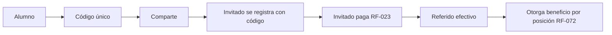
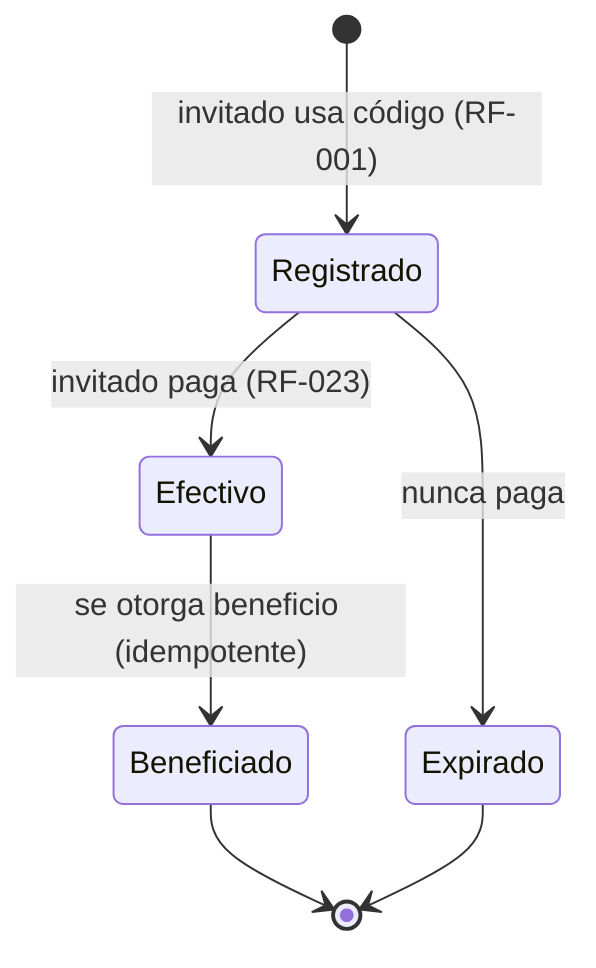
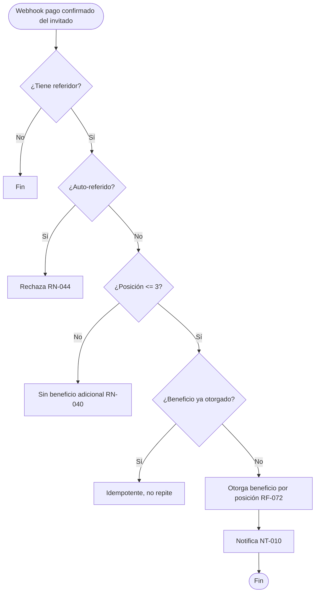
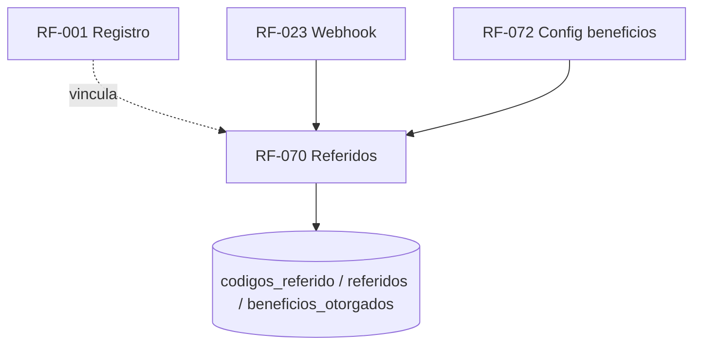

# RF-070: Sistema de Referidos

---

## Índice del Documento
- [1. 📋 Información General](#1--información-general)
- [2. 📜 Histórico de Cambios](#2--histórico-de-cambios)
- [3. 📖 Introducción del Requerimiento](#3--introducción-del-requerimiento)
- [4. 🎯 Objetivo Principal](#4--objetivo-principal)
- [5. 📊 Diagramas del Requerimiento](#5--diagramas-del-requerimiento)
- [6. 📝 Especificación de Datos](#6--especificación-de-datos)
- [7. ✅ Validaciones](#7--validaciones)
- [8. 🔒 Reglas de Negocio](#8--reglas-de-negocio)
- [9. ⚙️ Requerimientos No Funcionales](#9--requerimientos-no-funcionales)
- [10. 🖼️ Mockups / Estados de Pantalla](#10--mockups--estados-de-pantalla)
- [11. ✨ Criterios de Aceptación](#11--criterios-de-aceptación)
- [12. 🛠️ Especificación Técnica](#12--especificación-técnica)
- [13. 🧪 Casos de Prueba](#13--casos-de-prueba)
- [14. 📎 Trazabilidad](#14--trazabilidad)

---

## 1. 📋 Información General

| Campo | Valor |
|-------|-------|
| **ID** | RF-070 |
| **Nombre** | Sistema de Referidos |
| **Módulo** | [MOD-08 Referidos](../04-modulos/modulos-secciones.md) |
| **Versión** | v1.0.0 |
| **Fecha creación** | 2026-06-19 |
| **Estado** | En análisis |
| **Prioridad** | 🟡 Media |
| **Complejidad** | 🟠 Alta |
| **Autor** | Equipo de análisis |
| **RF relacionados** | RF-001 (Registro) · RF-020/023 (Pago) · RF-072 (Config beneficios) |
| **Caso de uso** | CU-070 Invitar referidos y obtener beneficio |

**Avance:** `[████████░░] análisis`

---

## 2. 📜 Histórico de Cambios

| Versión | Fecha | Autor | Descripción | Tipo |
|---------|-------|-------|-------------|------|
| v1.0.0 | 2026-06-19 | Equipo de análisis | Creación con estructura completa | Nueva |

---

## 3. 📖 Introducción del Requerimiento

### 3.1 Descripción general
Permite a cada alumno invitar **hasta 3** usuarios con un código/enlace único. Un referido se vuelve **efectivo** cuando el invitado se registra con el código **y paga** su suscripción. Al ser efectivo, el alumno que refiere recibe el **beneficio configurado** para esa posición (1°, 2°, 3°), definido en administración ([RF-072](00-indice-requerimientos.md)).

### 3.2 Contexto del negocio


### 3.3 Problema que resuelve
| # | Problema | Impacto | Solución |
|---|----------|---------|----------|
| 1 | Adquisición cara | CAC alto | Crecimiento orgánico referido |
| 2 | Beneficios poco flexibles | Difícil iterar | Beneficios configurables |
| 3 | Fraude de referidos | Costos indebidos | Efectivo solo con pago, anti auto-referido |

### 3.4 Beneficios esperados
- ✅ Crecimiento viral medible (coeficiente de referidos).
- ✅ Incentivo de retención (beneficios como extensión).
- ✅ Flexibilidad de marketing (beneficios ajustables).

---

## 4. 🎯 Objetivo Principal

### 4.1 Objetivo general
> Habilitar referidos con código único (máx. 3), otorgando beneficios configurables solo cuando el referido paga, de forma idempotente y sin fraude.

### 4.2 Objetivos específicos
| # | Objetivo | Métrica | Meta |
|---|----------|---------|------|
| O1 | Límite de 3 referidos | Beneficios sobre el límite | 0 |
| O2 | Efectivo solo con pago | Beneficios sin pago | 0 |
| O3 | Idempotencia | Beneficios duplicados | 0 |
| O4 | Anti auto-referido | Auto-referidos aceptados | 0 |

### 4.3 Alcance funcional

**✅ Incluido**
| Funcionalidad | Descripción |
|---------------|-------------|
| Código único | Por alumno, inmutable |
| Compartir | Enlace + share nativo (Android) |
| Vinculación en registro | Captura del código (RF-001) |
| Efectividad por pago | Disparada por webhook (RF-023) |
| Otorgamiento de beneficio | Según posición (RF-072) |
| Estado de referidos | Vista de 3 posiciones |

**❌ Excluido**
| Funcionalidad | Razón | Referencia |
|---------------|-------|------------|
| Configuración de beneficios | Otro requerimiento | RF-072 |
| Procesamiento de pago | Otro requerimiento | RF-020/023 |

---

## 5. 📊 Diagramas del Requerimiento

### 5.1 Ciclo de un referido


### 5.2 Otorgamiento de beneficio


---

## 6. 📝 Especificación de Datos

### 6.1 Tablas
```sql
CREATE TABLE codigos_referido (
  id UUID PRIMARY KEY DEFAULT gen_random_uuid(),
  usuario_id UUID NOT NULL UNIQUE REFERENCES usuarios(id),
  codigo VARCHAR(12) NOT NULL UNIQUE
);
CREATE TABLE referidos (
  id UUID PRIMARY KEY DEFAULT gen_random_uuid(),
  codigo_referido_id UUID NOT NULL REFERENCES codigos_referido(id),
  usuario_invitado_id UUID NOT NULL UNIQUE REFERENCES usuarios(id),
  posicion INT CHECK (posicion BETWEEN 1 AND 3),
  estado VARCHAR(12) DEFAULT 'registrado' CHECK (estado IN ('registrado','efectivo','expirado')),
  creado_en TIMESTAMP DEFAULT now()
);
CREATE TABLE beneficios_otorgados (
  id UUID PRIMARY KEY DEFAULT gen_random_uuid(),
  referido_id UUID NOT NULL UNIQUE REFERENCES referidos(id),  -- idempotencia
  tipo_beneficio VARCHAR(40) NOT NULL,
  otorgado_en TIMESTAMP DEFAULT now()
);
```

---

## 7. ✅ Validaciones

| ID | Descripción | Tipo |
|----|-------------|------|
| V-070-01 | Cada alumno tiene un código único e inmutable | BD |
| V-070-02 | Un invitado no puede usar su propio código | Lógica |
| V-070-03 | Un invitado se vincula a un solo referidor | BD |
| V-070-04 | Máximo 3 referidos efectivos por alumno | Lógica |
| V-070-05 | Efectivo solo tras pago confirmado del invitado | Negocio |
| V-070-06 | Beneficio se otorga una sola vez por referido (idempotente) | BD |
| V-070-07 | La posición (1/2/3) define el beneficio (RF-072) | Lógica |

---

## 8. 🔒 Reglas de Negocio

**RN-070-01 — Hasta 3 referidos efectivos** por alumno ([RN-040](../06-reglas-negocio/reglas-principales.md), [RNA-041](../06-reglas-negocio/reglas-alternas.md)).

**RN-070-02 — Efectivo = registrado con código + pago** ([RN-041](../06-reglas-negocio/reglas-principales.md), [RNA-043](../06-reglas-negocio/reglas-alternas.md)).

**RN-070-03 — Beneficios configurables por posición** (1°/2°/3°), administrados en [RF-072](00-indice-requerimientos.md) ([RN-042](../06-reglas-negocio/reglas-principales.md)).

**RN-070-04 — Idempotencia.** Un referido efectivo otorga su beneficio una sola vez ([RN-043](../06-reglas-negocio/reglas-principales.md), [RNA-063 base](../06-reglas-negocio/reglas-alternas.md)).

**RN-070-05 — No auto-referido** ([RN-044](../06-reglas-negocio/reglas-principales.md), [RNA-040](../06-reglas-negocio/reglas-alternas.md)).

**RN-070-06 — Código único e inmutable** por alumno ([RN-045](../06-reglas-negocio/reglas-principales.md)).

**RN-070-07 — Código inválido/expirado** permite el registro pero sin vínculo ([RNA-042](../06-reglas-negocio/reglas-alternas.md)).

**RN-070-08 — Disparo desde el pago.** La efectividad se evalúa en el webhook del invitado ([RF-023](RF-023-webhook-pago.md) RN-023-05).

---

## 9. ⚙️ Requerimientos No Funcionales

| RNF | Descripción |
|-----|-------------|
| RNF-070-01 | Otorgamiento de beneficio idempotente bajo concurrencia (índice único) |
| RNF-070-02 | Código con suficiente entropía y legible |
| RNF-070-03 | Auditoría de efectividad y beneficios ([RNF-004](00-catalogo-requerimientos.md)) |
| RNF-070-04 | Share nativo en Android para compartir el código |

---

## 10. 🖼️ Mockups / Estados de Pantalla

Referencia: [EP-070 Mis referidos](../11-ux-estados-pantalla/estados-pantalla-iniciales.md#ep-070--mis-referidos).

```
Tu código: ALEX-7Q2X   [Copiar] [Compartir]
Referidos: ●●○  (2/3 efectivos)
  1) Exámenes ilimitados ✅
  2) Material premium ✅
  3) Extensión de suscripción —
```

---

## 11. ✨ Criterios de Aceptación

```gherkin
Scenario: Referido efectivo otorga beneficio
  Given un alumno A con código y 0 referidos
  When un invitado B se registra con el código de A y paga
  Then B se cuenta como referido efectivo (posición 1) de A
  And A recibe el beneficio configurado para la posición 1

Scenario: Límite de 3 referidos
  Given un alumno A con 3 referidos efectivos
  When un 4º invitado se registra con su código y paga
  Then no se otorga beneficio adicional a A

Scenario: Auto-referido bloqueado
  Given un alumno
  When intenta usar su propio código
  Then el sistema rechaza el vínculo

Scenario: Beneficio idempotente
  Given un referido ya contabilizado y beneficiado
  When se reprocesa el webhook de su pago
  Then el beneficio no se duplica

Scenario: Registrado sin pagar no es efectivo
  Given un invitado registrado con código que no paga
  When transcurre el tiempo
  Then no es referido efectivo y no genera beneficio
```

---

## 12. 🛠️ Especificación Técnica

### 12.1 Endpoints
```
GET  /api/v1/referidos/codigo      (autenticado) -> { codigo, enlace }
GET  /api/v1/referidos             (autenticado) -> { efectivos: n, posiciones:[{posicion, estado, beneficio}] }
```
> El otorgamiento ocurre server-side desde el worker del webhook (RF-023), no por endpoint público.

### 12.2 Evaluación de beneficio (pseudocódigo)
```typescript
// Invocado por el worker tras pago confirmado del invitado (RF-023 RN-023-05)
async evaluarBeneficio(pagoId) {
  const invitado = (await db.pagos.find(pagoId)).usuario_id;
  const ref = await db.referidos.byInvitado(invitado);     // vínculo creado en registro (RF-001)
  if (!ref) return;                                        // RN-070-07 (sin referidor)
  const referidor = await db.codigos.dueño(ref.codigo_referido_id);
  if (referidor === invitado) return;                      // RN-070-05 auto-referido
  const efectivos = await db.referidos.efectivos(ref.codigo_referido_id);
  if (efectivos >= 3) { await db.referidos.marcar(ref.id, 'efectivo'); return; } // RN-070-01 (cuenta pero sin beneficio)
  await db.referidos.marcar(ref.id, 'efectivo');           // RN-070-02
  const posicion = efectivos + 1;
  const beneficio = await config.beneficioPorPosicion(posicion); // RF-072
  await db.beneficios.otorgarIdempotente(ref.id, beneficio);     // RN-070-04 (índice único por referido)
  await mq.publish('beneficio_referido', { referidor, beneficio }); // NT-010
}
```

---

## 13. 🧪 Casos de Prueba

| ID | Escenario | Traza | Tipo |
|----|-----------|-------|------|
| TC-070-01 | Referido efectivo otorga beneficio posición 1 | V-070-05/07, RN-070-02/03 | Positivo |
| TC-070-02 | Límite de 3: 4º no da beneficio | V-070-04, RN-070-01 | Borde |
| TC-070-03 | Auto-referido rechazado | V-070-02, RN-070-05 | Negativo |
| TC-070-04 | Beneficio idempotente ante reproceso | V-070-06, RN-070-04 | Borde |
| TC-070-05 | Registrado sin pagar no es efectivo | V-070-05, RN-070-02 | Negativo |
| TC-070-06 | Código inválido permite registro sin vínculo | RN-070-07 | Borde |
| TC-070-07 | Código único e inmutable | V-070-01, RN-070-06 | Positivo |

---

## 14. 📎 Trazabilidad

### 14.1 Documentos relacionados
| Tipo | Referencia |
|------|------------|
| Reglas | [RN-040..045](../06-reglas-negocio/reglas-principales.md) · [RNA-040..043](../06-reglas-negocio/reglas-alternas.md) |
| Estados de pantalla | [EP-070](../11-ux-estados-pantalla/estados-pantalla-iniciales.md) |
| Notificación | NT-010 — ver [notificaciones](../12-notificaciones/notificaciones.md) |
| Modelo de datos | [ERD: codigos_referido, referidos, beneficios_otorgados](../09-diagramas/03-modelo-datos-erd.md) |
| Requerimientos | RF-001 · RF-020 · RF-023 · RF-072 |

### 14.2 Matriz de trazabilidad
| Regla | Mecanismo | Validación | Caso de prueba |
|-------|-----------|------------|----------------|
| RN-070-01 | evaluarBeneficio | V-070-04 | TC-070-02 |
| RN-070-02 | evaluarBeneficio (post-pago) | V-070-05 | TC-070-01, TC-070-05 |
| RN-070-04 | otorgarIdempotente | V-070-06 | TC-070-04 |
| RN-070-05 | evaluarBeneficio | V-070-02 | TC-070-03 |

### 14.3 Dependencias


<!-- FOOTER:ALEXANDRYA -->

---

<sub>📄 **Alexandrya** · `docs/05-requerimientos/RF-070-referidos.md` · Versión documental **v0.3.0** · Actualizado **2026-06-19** · 🏠 [Índice](../README.md) · 💬 [Mensajes del sistema](../14-mensajes-sistema/mensajes-sistema.md)</sub>
