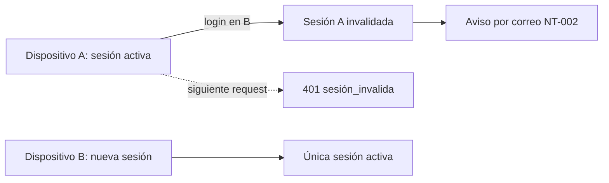
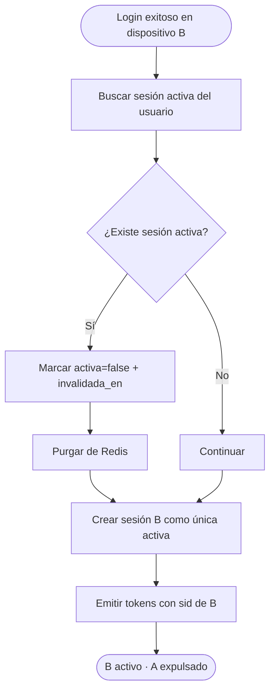
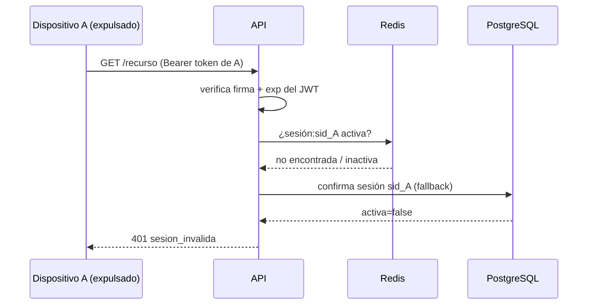
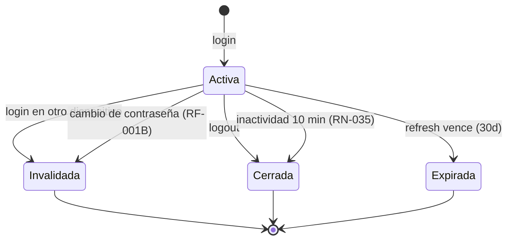
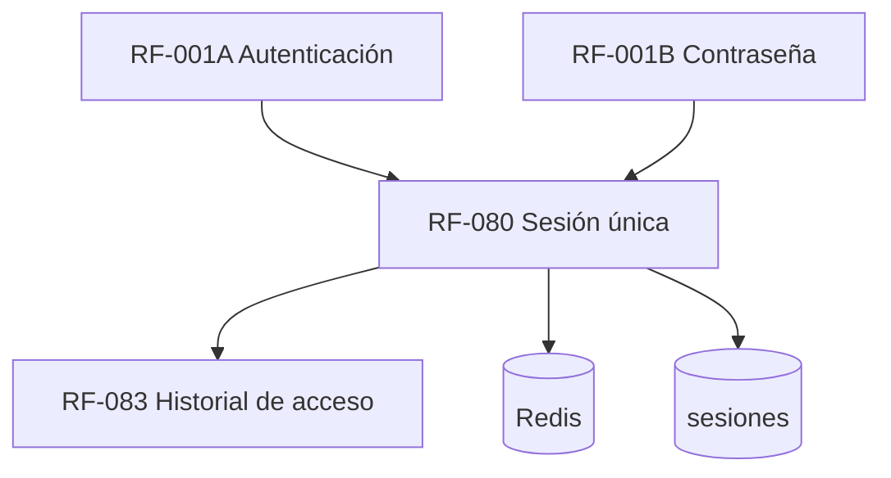

# RF-080: Control de Sesión Única

---

## Índice del Documento
- [1. 📋 Información General](#1--información-general)
- [2. 📜 Histórico de Cambios](#2--histórico-de-cambios)
- [3. 📖 Introducción del Requerimiento](#3--introducción-del-requerimiento)
- [4. 🎯 Objetivo Principal](#4--objetivo-principal)
- [5. 📊 Diagramas del Requerimiento](#5--diagramas-del-requerimiento)
- [6. 📝 Especificación de Datos](#6--especificación-de-datos)
- [7. ✅ Validaciones](#7--validaciones)
- [8. 🔒 Reglas de Negocio](#8--reglas-de-negocio)
- [9. ⚙️ Requerimientos No Funcionales](#9--requerimientos-no-funcionales)
- [10. 🖼️ Mockups / Estados de Pantalla](#10--mockups--estados-de-pantalla)
- [11. ✨ Criterios de Aceptación](#11--criterios-de-aceptación)
- [12. 🛠️ Especificación Técnica](#12--especificación-técnica)
- [13. 🧪 Casos de Prueba](#13--casos-de-prueba)
- [14. 📎 Trazabilidad](#14--trazabilidad)

---

## 1. 📋 Información General

| Campo | Valor |
|-------|-------|
| **ID** | RF-080 |
| **Nombre** | Control de Sesión Única |
| **Módulo** | [MOD-02 Identidad y acceso](../04-modulos/modulos-secciones.md) |
| **Versión** | v1.0.0 |
| **Fecha creación** | 2026-06-18 |
| **Estado** | En análisis |
| **Prioridad** | 🔴 CRÍTICA |
| **Complejidad** | 🟠 Alta |
| **Autor** | Equipo de análisis |
| **RF relacionados** | RF-001A (Autenticación) · RF-001B (Contraseña) · RF-083 (Historial de acceso) |
| **Caso de uso** | [CU-001 Iniciar sesión](../07-casos-uso/CU-001-inicio-sesion.md) |

**Avance:** `[████████░░] análisis`

---

## 2. 📜 Histórico de Cambios

| Versión | Fecha | Autor | Descripción | Tipo |
|---------|-------|-------|-------------|------|
| v1.0.0 | 2026-06-18 | Equipo de análisis | Creación con estructura completa | Nueva |

---

## 3. 📖 Introducción del Requerimiento

### 3.1 Descripción general
Garantiza que **cada cuenta tenga como máximo una sesión activa** simultánea, sin importar la plataforma (web o Android). Al autenticarse en un dispositivo nuevo, la sesión anterior se invalida de inmediato. Es la defensa central del modelo de suscripción contra el **uso compartido de cuentas**.

### 3.2 Contexto del negocio


### 3.3 Problema que resuelve
| # | Problema | Impacto | Solución |
|---|----------|---------|----------|
| 1 | Una cuenta usada por varias personas | Pérdida de ingresos | Una sola sesión activa |
| 2 | Sesiones huérfanas en dispositivos perdidos | Riesgo de acceso indebido | Expulsión al nuevo login |
| 3 | Tokens robados siguen vivos | Secuestro de cuenta | Invalidación inmediata |

### 3.4 Beneficios esperados
- ✅ Protege el ingreso por suscripción (1 cuenta = 1 usuario activo).
- ✅ Reduce superficie de secuestro de sesión.
- ✅ Da al alumno control y visibilidad de sus accesos.

---

## 4. 🎯 Objetivo Principal

### 4.1 Objetivo general
> Asegurar una única sesión activa por cuenta de forma transversal (web + app), invalidando la anterior ante un nuevo inicio de sesión.

### 4.2 Objetivos específicos
| # | Objetivo | Métrica | Meta |
|---|----------|---------|------|
| O1 | Una sola sesión activa | Sesiones simultáneas por cuenta | 1 |
| O2 | Invalidación inmediata de la previa | Latencia de expulsión | < 1 s percibido en el siguiente request |
| O3 | Transversalidad web/app | Casos de fuga entre plataformas | 0 |
| O4 | Trazabilidad | Accesos registrados | 100% |

### 4.3 Alcance funcional

**✅ Incluido**
| Funcionalidad | Descripción |
|---------------|-------------|
| Registro de sesión única | Un registro `activa` por usuario |
| Invalidación de sesión previa | Al crear una nueva |
| Rechazo de tokens de sesión expulsada | access y refresh |
| Consulta de sesión actual | El alumno ve su dispositivo activo |
| Cierre remoto implícito | Login en nuevo dispositivo expulsa al anterior |

**❌ Excluido**
| Funcionalidad | Razón | Referencia |
|---------------|-------|------------|
| Multi-sesión configurable (N dispositivos) | Contradice el modelo | — |
| Gestión visual de N sesiones | No aplica con sesión única | — |

---

## 5. 📊 Diagramas del Requerimiento

### 5.1 Flujo de expulsión


### 5.2 Secuencia de validación en cada request


### 5.3 Estados de una sesión


---

## 6. 📝 Especificación de Datos

### 6.1 Modelo de sesión (compartido con RF-001A)
| Campo | Tipo | Descripción |
|-------|------|-------------|
| id (sid) | UUID | Identificador de sesión, va en el JWT (`sid`) |
| usuario_id | UUID | Dueño |
| activa | bool | Único `true` por usuario |
| refresh_token_hash | string | Para renovación |
| ip_address / user_agent / ubicacion_aprox | — | Datos del dispositivo |
| creada_en / invalidada_en | timestamp | Ciclo de vida |

### 6.2 Garantía de unicidad (DDL)
```sql
-- Un solo registro activo por usuario (definido en RF-001A):
CREATE UNIQUE INDEX uniq_sesion_activa ON sesiones(usuario_id) WHERE activa;
```

### 6.3 Clave en Redis
```
sesion:{sid} -> { usuario_id, activa, exp }   TTL = vida del access token
usuario_sesion_activa:{usuario_id} -> {sid}    (para invalidar la previa O(1))
```

---

## 7. ✅ Validaciones

| ID | Descripción | Tipo |
|----|-------------|------|
| V-080-01 | Antes de crear sesión, se invalida cualquier `activa` del usuario | Lógica/BD |
| V-080-02 | El índice único impide dos sesiones `activa=true` por usuario | BD |
| V-080-03 | Cada request valida que `sid` del JWT siga `activa` | BD/Caché |
| V-080-04 | El refresh solo procede si la sesión sigue `activa` | BD |
| V-080-05 | La invalidación purga la entrada de Redis | Caché |

---

## 8. 🔒 Reglas de Negocio

**RN-080-01 — Máximo una sesión activa por cuenta** (transversal web + app). Ref. [RN-030](../06-reglas-negocio/reglas-principales.md).

**RN-080-02 — El nuevo login invalida la sesión anterior** y conserva solo la más reciente. Ref. [RN-031](../06-reglas-negocio/reglas-principales.md).

**RN-080-03 — Token de sesión expulsada es rechazado** aunque su firma y expiración sean válidas (validación de estado de sesión). Ref. [RNA-005](../06-reglas-negocio/reglas-alternas.md).

**RN-080-04 — Cambio de contraseña invalida sesiones** (consistente con [RF-001B](RF-001B-recuperacion-contrasena.md) RN-001B-03).

**RN-080-05 — Cada acceso se registra y notifica** (NT-002). Ref. [RN-033/034](../06-reglas-negocio/reglas-principales.md).

**RN-080-06 — La validación de sesión es server-side**; no se confía solo en el JWT stateless (decisión [ADR-002](../08-especificaciones-tecnicas/00-indice-especificaciones.md)).

**RN-080-07 — Cierre por inactividad (10 min).** Tras 10 minutos sin interacción la sesión se cierra automáticamente; al minuto 9 se muestra el aviso [MSG-029](../14-mensajes-sistema/mensajes-sistema.md#msg-02x--identidad-y-acceso-mod-02) para extenderla. Refuerza [RN-035/036](../06-reglas-negocio/reglas-principales.md#control-de-sesiones) y [RNA-007](../06-reglas-negocio/reglas-alternas.md). El cierre invalida la sesión server-side (no basta el refresh).

---

## 9. ⚙️ Requerimientos No Funcionales

| RNF | Descripción |
|-----|-------------|
| RNF-080-01 | Verificación de sesión en caché (Redis) para no penalizar latencia (< 200 ms P95) |
| RNF-080-02 | La invalidación es atómica y consistente entre Redis y PostgreSQL |
| RNF-080-03 | Funciona en despliegue multi-instancia (estado compartido en Redis) |
| RNF-080-04 | Auditoría de expulsiones de sesión ([RNF-004](00-catalogo-requerimientos.md)) |

---

## 10. 🖼️ Mockups / Estados de Pantalla

No tiene pantalla propia; se manifiesta como efecto en el dispositivo expulsado:

```
Dispositivo A (tras login en B):
┌───────────────────────────────────────┐
│  Tu sesión se cerró porque iniciaste   │
│  sesión en otro dispositivo.           │
│            [ Volver a entrar ]         │
└───────────────────────────────────────┘
```
Relacionado con [EP-011 Login](../11-ux-estados-pantalla/estados-pantalla-iniciales.md#ep-011--login) y [FA-004](../07-casos-uso/flujos-alternos.md#fa-004--expulsión-por-sesión-única).

---

## 11. ✨ Criterios de Aceptación

```gherkin
Scenario: Login en nuevo dispositivo expulsa al anterior
  Given el alumno tiene sesión activa en el dispositivo A
  When inicia sesión correctamente en el dispositivo B
  Then la sesión de A queda invalidada
  And solo existe una sesión activa para la cuenta

Scenario: Dispositivo expulsado no puede operar
  Given la sesión de A fue invalidada por un login en B
  When A realiza una petición autenticada con su token
  Then recibe 401 "sesion_invalida"

Scenario: Refresh de sesión expulsada falla
  Given la sesión de A fue invalidada
  When A intenta renovar su access token con su refresh token
  Then recibe 401 y debe reautenticarse

Scenario: Transversalidad web/app
  Given el alumno tiene sesión activa en la app Android
  When inicia sesión en la web
  Then la sesión de la app queda invalidada

Scenario: Cambio de contraseña cierra la sesión
  Given el alumno tiene una sesión activa
  When cambia su contraseña (RF-001B)
  Then su sesión queda invalidada
```

---

## 12. 🛠️ Especificación Técnica

### 12.1 Lógica de creación de sesión (pseudocódigo)
```typescript
async crearSesionUnica(usuarioId, ip, ua) {
  // Transacción: invalidar previa + crear nueva (atómico)
  return db.tx(async (t) => {
    await t.sesiones.update(
      { usuario_id: usuarioId, activa: true },
      { activa: false, invalidada_en: now() }            // RN-080-02 / V-080-01
    );
    const s = await t.sesiones.insert({
      usuario_id: usuarioId, activa: true,                // índice único garantiza unicidad (V-080-02)
      refresh_token_hash: hash(refresh), ip, user_agent: ua,
    });
    await redis.del(`usuario_sesion_activa:${usuarioId}`); // V-080-05
    await redis.set(`sesion:${s.id}`, { usuarioId, activa: true }, ttl=accessTtl);
    await redis.set(`usuario_sesion_activa:${usuarioId}`, s.id);
    await audit('SESION_NUEVA', usuarioId, ip);
    return s;
  });
}
```

### 12.2 Guard de validación de sesión
```typescript
// Reutiliza authGuard de RF-001A; el paso clave:
const activa = await redis.get(`sesion:${claims.sid}`)
            ?? await db.sesiones.isActiva(claims.sid);     // V-080-03
if (!activa) return res.status(401).json({ error: 'sesion_invalida' });  // RN-080-03
```

### 12.3 Endpoint de consulta
```
GET /api/v1/auth/session  (autenticado)
200: { "sid", "dispositivo", "ip", "ubicacion", "creada_en" }
```

---

## 13. 🧪 Casos de Prueba

| ID | Escenario | Traza | Tipo |
|----|-----------|-------|------|
| TC-080-01 | Login en B invalida sesión de A | RN-080-01/02, V-080-01 | Positivo |
| TC-080-02 | Token de A expulsado → 401 | RN-080-03, V-080-03 | Negativo |
| TC-080-03 | Refresh de sesión expulsada → 401 | V-080-04 | Negativo |
| TC-080-04 | App→Web: login en web expulsa app | RN-080-01 | Positivo |
| TC-080-05 | Cambio de contraseña invalida sesión | RN-080-04 | Positivo |
| TC-080-06 | Índice único impide 2 sesiones activas (concurrencia) | V-080-02 | Borde |
| TC-080-07 | Invalidación purga Redis | V-080-05 | Positivo |
| TC-080-08 | Logout deja 0 sesiones activas | RN-080 | Positivo |

```gherkin
Scenario: TC-080-06 - Concurrencia de logins
  Given dos intentos de login simultáneos de la misma cuenta
  When ambos intentan crear sesión activa
  Then el índice único garantiza que solo una queda activa
  And la otra se reintenta/invalida sin dejar dos activas
```

---

## 14. 📎 Trazabilidad

### 14.1 Documentos relacionados
| Tipo | Referencia |
|------|------------|
| Reglas | [RN-030..036](../06-reglas-negocio/reglas-principales.md) · [RNA-005](../06-reglas-negocio/reglas-alternas.md) · [RNA-007](../06-reglas-negocio/reglas-alternas.md) |
| Mensajes | [MSG-026..02A](../14-mensajes-sistema/mensajes-sistema.md#msg-02x--identidad-y-acceso-mod-02) (sesión expulsada / inactividad) |
| Estados de pantalla | [EP-011](../11-ux-estados-pantalla/estados-pantalla-iniciales.md#ep-011--login) · [EP-015 Aviso de inactividad](../11-ux-estados-pantalla/estados-pantalla-iniciales.md#ep-015--aviso-de-inactividad) |
| Flujo alterno | [FA-004 Expulsión por sesión única](../07-casos-uso/flujos-alternos.md#fa-004--expulsión-por-sesión-única) |
| Caso de uso | [CU-001](../07-casos-uso/CU-001-inicio-sesion.md) |
| Notificación | [NT-002 / CT-002](../12-notificaciones/notificaciones.md) |
| Modelo de datos | [ERD: sesiones](../09-diagramas/03-modelo-datos-erd.md) |
| Decisión técnica | [ADR-002](../08-especificaciones-tecnicas/00-indice-especificaciones.md) |
| Requerimientos | RF-001A · RF-001B · RF-083 |

### 14.2 Matriz de trazabilidad
| Regla | Mecanismo | Validación | Caso de prueba |
|-------|-----------|------------|----------------|
| RN-080-01 | Índice único + invalidación previa | V-080-02 | TC-080-01, TC-080-06 |
| RN-080-02 | Invalidación en login | V-080-01 | TC-080-01 |
| RN-080-03 | Guard valida estado de sesión | V-080-03 | TC-080-02 |
| RN-080-04 | Cambio contraseña → invalidar | — | TC-080-05 |

### 14.3 Dependencias


<!-- FOOTER:ALEXANDRYA -->

---

<sub>📄 **Alexandrya** · `docs/05-requerimientos/RF-080-sesion-unica.md` · Versión documental **v0.3.0** · Actualizado **2026-06-19** · 🏠 [Índice](../README.md) · 💬 [Mensajes del sistema](../14-mensajes-sistema/mensajes-sistema.md)</sub>
