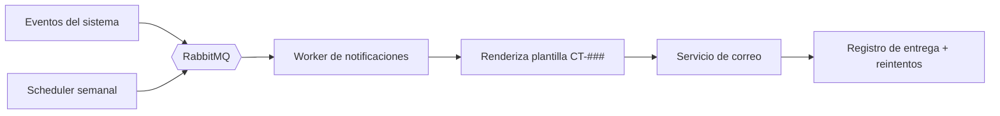
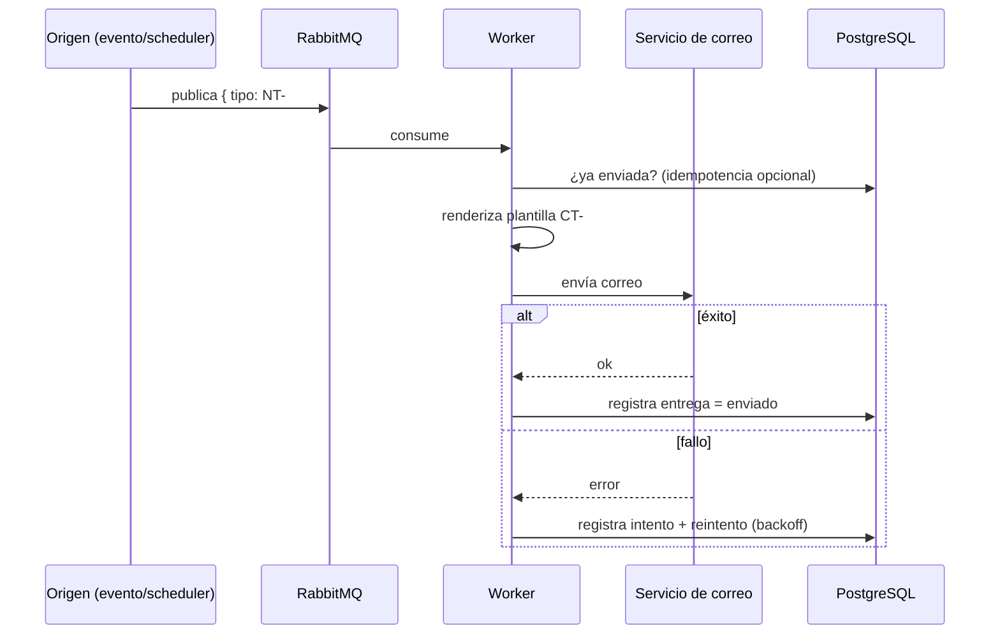
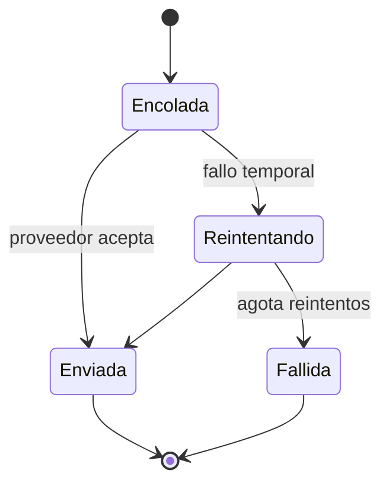
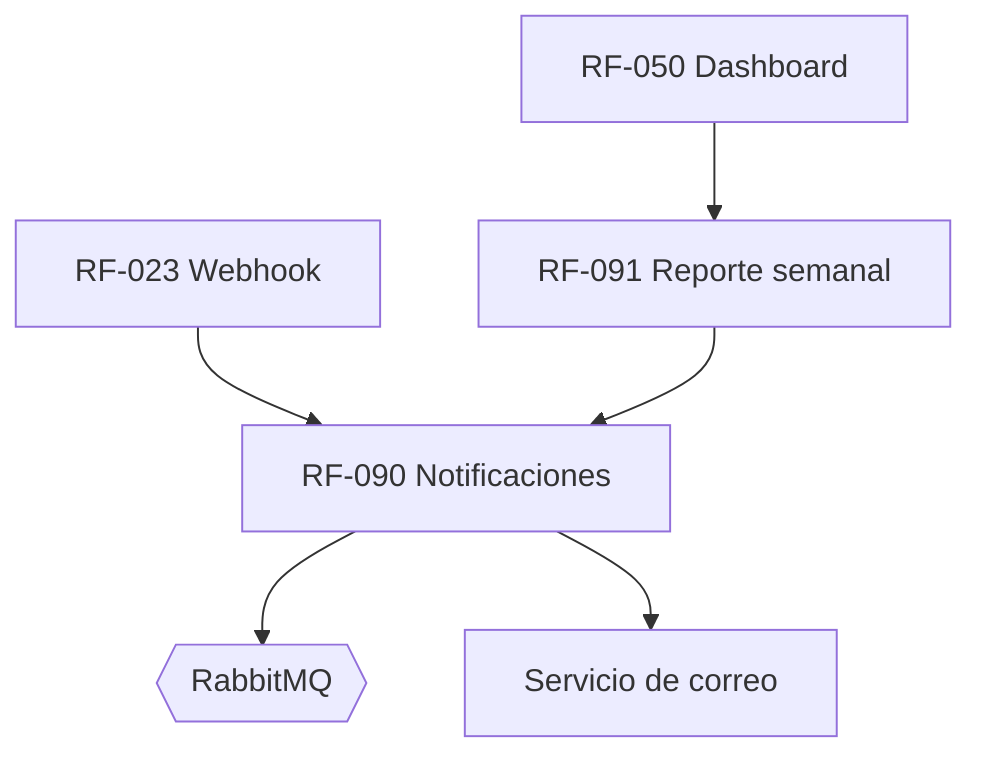

# RF-090: Notificaciones por Correo (Transaccionales y Reporte Semanal)

---

## Índice del Documento
- [1. 📋 Información General](#1--información-general)
- [2. 📜 Histórico de Cambios](#2--histórico-de-cambios)
- [3. 📖 Introducción del Requerimiento](#3--introducción-del-requerimiento)
- [4. 🎯 Objetivo Principal](#4--objetivo-principal)
- [5. 📊 Diagramas del Requerimiento](#5--diagramas-del-requerimiento)
- [6. 📝 Especificación de Datos](#6--especificación-de-datos)
- [7. ✅ Validaciones](#7--validaciones)
- [8. 🔒 Reglas de Negocio](#8--reglas-de-negocio)
- [9. ⚙️ Requerimientos No Funcionales](#9--requerimientos-no-funcionales)
- [10. 🖼️ Mockups / Estados de Pantalla](#10--mockups--estados-de-pantalla)
- [11. ✨ Criterios de Aceptación](#11--criterios-de-aceptación)
- [12. 🛠️ Especificación Técnica](#12--especificación-técnica)
- [13. 🧪 Casos de Prueba](#13--casos-de-prueba)
- [14. 📎 Trazabilidad](#14--trazabilidad)

---

## 1. 📋 Información General

| Campo | Valor |
|-------|-------|
| **ID** | RF-090 |
| **Nombre** | Notificaciones por Correo (Transaccionales y Reporte Semanal) |
| **Módulo** | [MOD-09 Notificaciones](../04-modulos/modulos-secciones.md) |
| **Versión** | v1.0.0 |
| **Fecha creación** | 2026-06-19 |
| **Estado** | En análisis |
| **Prioridad** | 🟠 Alta |
| **Complejidad** | 🟡 Media |
| **Autor** | Equipo de análisis |
| **RF relacionados** | RF-001/011 · RF-023 · RF-026 · RF-050/091 · RF-083 |
| **Caso de uso** | CU-080 Recibir notificaciones |

**Avance:** `[████████░░] análisis`

---

## 2. 📜 Histórico de Cambios

| Versión | Fecha | Autor | Descripción | Tipo |
|---------|-------|-------|-------------|------|
| v1.0.0 | 2026-06-19 | Equipo de análisis | Creación con estructura completa | Nueva |

---

## 3. 📖 Introducción del Requerimiento

### 3.1 Descripción general
Gestiona el **envío asíncrono de correos**: transaccionales (registro, acceso, cambio de contraseña, pago, vencimiento) y el **reporte semanal** de avance. Centraliza el catálogo de notificaciones ([NT-###](../12-notificaciones/notificaciones.md)) y sus plantillas ([CT-###](../12-notificaciones/plantillas-correo/)), con reintentos y registro de entregas.

### 3.2 Contexto del negocio


### 3.3 Problema que resuelve
| # | Problema | Impacto | Solución |
|---|----------|---------|----------|
| 1 | Usuario sin avisos clave | Confusión, churn | Correos transaccionales |
| 2 | Olvido de uso/renovación | Baja retención | Reporte semanal + avisos |
| 3 | Envíos que bloquean la API | Latencia | Envío asíncrono por cola |
| 4 | Correos perdidos | Falta de comunicación | Reintentos + registro |

### 3.4 Beneficios esperados
- ✅ Comunicación confiable y oportuna.
- ✅ Retención (reporte semanal, avisos de vencimiento).
- ✅ Operación desacoplada y resiliente.

---

## 4. 🎯 Objetivo Principal

### 4.1 Objetivo general
> Enviar de forma confiable y asíncrona las notificaciones transaccionales y el reporte semanal, con plantillas centralizadas, reintentos y trazabilidad.

### 4.2 Objetivos específicos
| # | Objetivo | Métrica | Meta |
|---|----------|---------|------|
| O1 | Cobertura de eventos | Eventos sin notificación | 0 |
| O2 | Entrega confiable | Tasa de entrega | > 98% |
| O3 | Asincronía | Envíos que bloquean la API | 0 |
| O4 | Reporte semanal | Alumnos activos cubiertos | 100% |

### 4.3 Alcance funcional

**✅ Incluido**
| Funcionalidad | Descripción |
|---------------|-------------|
| Correos transaccionales | Registro, acceso, contraseña, pago, vencimiento (NT-001..012) |
| Reporte semanal | Avance + estadísticas + recomendaciones ([RF-091](00-indice-requerimientos.md)) |
| Render de plantillas | Variables por plantilla (CT-###) |
| Reintentos | Backoff ante fallo del proveedor |
| Registro de entregas | Estado por notificación |

**❌ Excluido**
| Funcionalidad | Razón | Referencia |
|---------------|-------|------------|
| Push (Android) | Fase posterior | Roadmap Año 2 |
| Cálculo del avance | Otro requerimiento | RF-050 |
| Contenido de plantillas | Documentadas aparte | [plantillas-correo/](../12-notificaciones/plantillas-correo/) |

---

## 5. 📊 Diagramas del Requerimiento

### 5.1 Flujo de notificación


### 5.2 Estados de una notificación


---

## 6. 📝 Especificación de Datos

### 6.1 Tabla `notificaciones`
```sql
CREATE TABLE notificaciones (
  id UUID PRIMARY KEY DEFAULT gen_random_uuid(),
  usuario_id UUID REFERENCES usuarios(id),
  tipo VARCHAR(12) NOT NULL,        -- NT-001..012
  plantilla VARCHAR(12) NOT NULL,   -- CT-001..012
  destinatario VARCHAR(120) NOT NULL,
  estado VARCHAR(16) DEFAULT 'encolada'
    CHECK (estado IN ('encolada','enviada','reintentando','fallida')),
  intentos INT DEFAULT 0,
  payload JSONB,
  proveedor_id VARCHAR(120),
  creada_en TIMESTAMP DEFAULT now(),
  enviada_en TIMESTAMP
);
CREATE INDEX idx_notif_estado ON notificaciones(estado);
```

### 6.2 Catálogo
Ver matriz completa en [notificaciones.md](../12-notificaciones/notificaciones.md) (NT-001..012) y plantillas en [plantillas-correo/](../12-notificaciones/plantillas-correo/).

---

## 7. ✅ Validaciones

| ID | Descripción | Tipo |
|----|-------------|------|
| V-090-01 | Cada evento mapea a una notificación NT-### válida | Datos |
| V-090-02 | La plantilla existe y sus variables están completas | Datos |
| V-090-03 | No se incluyen contraseñas ni tokens completos | Seguridad |
| V-090-04 | Envío asíncrono (no bloquea la API) | Arquitectura |
| V-090-05 | Reintentos con backoff ante fallo temporal | Lógica |
| V-090-06 | El reporte semanal solo a activos con actividad | Negocio |
| V-090-07 | Registro de estado por notificación | BD |

---

## 8. 🔒 Reglas de Negocio

**RN-090-01 — Cobertura de eventos transaccionales.** Registro, login, cambio de contraseña, pago exitoso, próximo a vencer y vencida disparan su NT-### ([RF-090 base](00-catalogo-requerimientos.md)).

**RN-090-02 — Envío asíncrono.** Las notificaciones se encolan; el proceso de origen no espera el envío ([arquitectura](../09-diagramas/01-arquitectura.md)).

**RN-090-03 — Sin datos sensibles.** Nunca contraseñas ni tokens completos en el correo ([RN-071](../06-reglas-negocio/reglas-principales.md)); los enlaces de acción son de un solo uso.

**RN-090-04 — Reintentos + registro.** Fallos temporales reintentan con backoff; se registra el estado final.

**RN-090-05 — Reporte semanal.** Solo a alumnos con suscripción activa y actividad en la semana (regla 5 de [notificaciones](../12-notificaciones/notificaciones.md), [RF-091](00-indice-requerimientos.md)).

**RN-090-06 — Ventana de avisos de vencimiento configurable** (ej.: 15 y 3 días antes) ([RF-026](00-catalogo-requerimientos.md)).

**RN-090-07 — Pie y soporte.** Toda notificación incluye identidad de Alexandrya y soporte/baja según corresponda.

---

## 9. ⚙️ Requerimientos No Funcionales

| RNF | Descripción |
|-----|-------------|
| RNF-090-01 | Procesamiento por RabbitMQ + workers ([RNF arquitectura](../09-diagramas/01-arquitectura.md)) |
| RNF-090-02 | Idempotencia opcional por evento (evitar duplicados) |
| RNF-090-03 | Credenciales del proveedor de correo en secret manager |
| RNF-090-04 | Métricas de entrega/rebote observables (Prometheus/Grafana) |
| RNF-090-05 | Cumplimiento anti-spam (SPF/DKIM/DMARC del dominio) |

---

## 10. 🖼️ Mockups / Estados de Pantalla

No tiene UI propia (canal correo). Las plantillas son los "mockups": [CT-001](../12-notificaciones/plantillas-correo/CT-001-verificacion-correo.md), [CT-002](../12-notificaciones/plantillas-correo/CT-002-aviso-acceso.md), [CT-005](../12-notificaciones/plantillas-correo/CT-005-pago-exitoso.md), [CT-006](../12-notificaciones/plantillas-correo/CT-006-por-vencer.md), [CT-009](../12-notificaciones/plantillas-correo/CT-009-reporte-semanal.md).

---

## 11. ✨ Criterios de Aceptación

```gherkin
Scenario: Correo de registro
  Given un visitante que se registra
  When se crea la cuenta
  Then se encola y envía la notificación NT-001 (verificación)

Scenario: Correo de pago exitoso
  Given un webhook de pago confirmado (RF-023)
  When se procesa
  Then se envía NT-005 con monto, método y vigencia

Scenario: Reporte semanal solo a activos con actividad
  Given un alumno activo con intentos en la semana
  When llega el día programado
  Then recibe NT-009 con su avance y recomendaciones
  And un alumno sin actividad no lo recibe

Scenario: Reintento ante fallo temporal
  Given el proveedor de correo falla temporalmente
  When se intenta enviar
  Then se reintenta con backoff y se registra el resultado

Scenario: Sin datos sensibles
  Given cualquier notificación
  When se renderiza
  Then no contiene contraseñas ni tokens completos
```

---

## 12. 🛠️ Especificación Técnica

### 12.1 Eventos y cola
```
Productores: Auth (NT-001/002/003/004), Pagos (NT-005/012), Suscripción (NT-006/007/008),
             Referidos (NT-010), Contacto (NT-011), Scheduler (NT-009)
Cola: notifications.exchange -> notifications.queue
Worker: NotificationWorker (consume, renderiza, envía, registra)
```

### 12.2 Worker (pseudocódigo)
```typescript
async onMessage({ tipo, payload }) {
  const plantilla = catalogo.plantillaDe(tipo);          // V-090-01/02
  const usuario = await db.usuarios.find(payload.usuarioId);
  if (tipo === 'NT-009' && !esElegibleReporte(usuario)) return; // RN-090-05 / V-090-06
  const cuerpo = render(plantilla, sanitize(payload));   // RN-090-03 (sin secretos)
  const notif = await db.notificaciones.crear({ usuario_id: usuario?.id, tipo, plantilla, destinatario: usuario.email, estado: 'encolada', payload });
  try {
    const res = await mail.send(usuario.email, plantilla.asunto, cuerpo);  // RN-090-02
    await db.notificaciones.marcar(notif.id, 'enviada', res.id);
  } catch (e) {
    await db.notificaciones.incrementarIntento(notif.id); // RN-090-04
    if (notif.intentos < MAX) throw e;                    // re-enqueue con backoff
    await db.notificaciones.marcar(notif.id, 'fallida');
  }
}
```

---

## 13. 🧪 Casos de Prueba

| ID | Escenario | Traza | Tipo |
|----|-----------|-------|------|
| TC-090-01 | Registro dispara NT-001 | V-090-01, RN-090-01 | Positivo |
| TC-090-02 | Pago confirmado dispara NT-005 | RN-090-01 | Positivo |
| TC-090-03 | Reporte semanal solo a activos con actividad | V-090-06, RN-090-05 | Borde |
| TC-090-04 | Fallo temporal → reintento con backoff | V-090-05, RN-090-04 | Borde |
| TC-090-05 | Agota reintentos → estado fallida | RN-090-04 | Negativo |
| TC-090-06 | Correo sin contraseñas/tokens | V-090-03, RN-090-03 | Positivo |
| TC-090-07 | Envío no bloquea la API | V-090-04, RN-090-02 | Positivo |
| TC-090-08 | Aviso de vencimiento en ventana configurable | RN-090-06 | Positivo |

---

## 14. 📎 Trazabilidad

### 14.1 Documentos relacionados
| Tipo | Referencia |
|------|------------|
| Catálogo de notificaciones | [notificaciones.md](../12-notificaciones/notificaciones.md) |
| Plantillas | [plantillas-correo/](../12-notificaciones/plantillas-correo/) |
| Reglas | [RN-071](../06-reglas-negocio/reglas-principales.md) |
| Arquitectura | [Jobs y mensajería](../09-diagramas/04-flujos.md) |
| Requerimientos | RF-011 · RF-023 · RF-026 · RF-050 · RF-083 · RF-091 |

### 14.2 Matriz de trazabilidad
| Regla | Origen | Validación | Caso de prueba |
|-------|--------|------------|----------------|
| RN-090-01 | productores de eventos | V-090-01 | TC-090-01, TC-090-02 |
| RN-090-02 | cola/worker | V-090-04 | TC-090-07 |
| RN-090-04 | worker reintentos | V-090-05 | TC-090-04, TC-090-05 |
| RN-090-05 | scheduler semanal | V-090-06 | TC-090-03 |

### 14.3 Dependencias


<!-- FOOTER:ALEXANDRYA -->

---

<sub>📄 **Alexandrya** · `docs/05-requerimientos/RF-090-notificaciones.md` · Versión documental **v0.3.0** · Actualizado **2026-06-19** · 🏠 [Índice](../README.md) · 💬 [Mensajes del sistema](../14-mensajes-sistema/mensajes-sistema.md)</sub>
