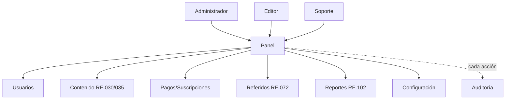
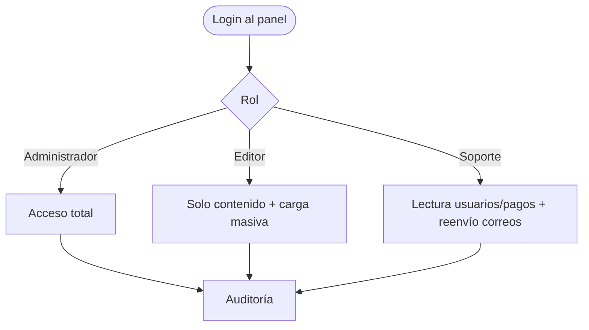
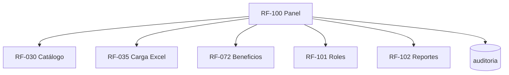

# RF-100: Panel Administrativo

---

## Índice del Documento
- [1. 📋 Información General](#1--información-general)
- [2. 📜 Histórico de Cambios](#2--histórico-de-cambios)
- [3. 📖 Introducción del Requerimiento](#3--introducción-del-requerimiento)
- [4. 🎯 Objetivo Principal](#4--objetivo-principal)
- [5. 📊 Diagramas del Requerimiento](#5--diagramas-del-requerimiento)
- [6. 📝 Especificación de Datos](#6--especificación-de-datos)
- [7. ✅ Validaciones](#7--validaciones)
- [8. 🔒 Reglas de Negocio](#8--reglas-de-negocio)
- [9. ⚙️ Requerimientos No Funcionales](#9--requerimientos-no-funcionales)
- [10. 🖼️ Mockups / Estados de Pantalla](#10--mockups--estados-de-pantalla)
- [11. ✨ Criterios de Aceptación](#11--criterios-de-aceptación)
- [12. 🛠️ Especificación Técnica](#12--especificación-técnica)
- [13. 🧪 Casos de Prueba](#13--casos-de-prueba)
- [14. 📎 Trazabilidad](#14--trazabilidad)

---

## 1. 📋 Información General

| Campo | Valor |
|-------|-------|
| **ID** | RF-100 |
| **Nombre** | Panel Administrativo |
| **Módulo** | [MOD-10 Panel administrativo](../04-modulos/modulos-secciones.md) |
| **Versión** | v1.0.0 |
| **Fecha creación** | 2026-06-19 |
| **Estado** | En análisis |
| **Prioridad** | 🔴 CRÍTICA |
| **Complejidad** | 🔴 Alta |
| **Autor** | Equipo de análisis |
| **RF relacionados** | RF-030/035 (Contenido) · RF-072 (Beneficios) · RF-101 (Roles) · RF-102 (Reportes) |
| **Caso de uso** | CU-090 Operar panel administrativo |

**Avance:** `[████████░░] análisis`

---

## 2. 📜 Histórico de Cambios

| Versión | Fecha | Autor | Descripción | Tipo |
|---------|-------|-------|-------------|------|
| v1.0.0 | 2026-06-19 | Equipo de análisis | Creación con estructura completa | Nueva |

---

## 3. 📖 Introducción del Requerimiento

### 3.1 Descripción general
Aplicación **web** que permite operar la plataforma sin tocar código: administrar usuarios, contenido (materias→preguntas), pagos, suscripciones, referidos y reportes, con **roles diferenciados** (administrador, editor, soporte). Es solo web ([decisión de alcance](../01-vision/division-web-mobile.md)).

### 3.2 Contexto del negocio


### 3.3 Problema que resuelve
| # | Problema | Impacto | Solución |
|---|----------|---------|----------|
| 1 | Operar requiere desarrollo | Lentitud/costo | Panel autónomo |
| 2 | Todos ven todo | Riesgo | Roles diferenciados |
| 3 | Cambios sin rastro | Sin control | Auditoría de acciones |

### 3.4 Beneficios esperados
- ✅ Operación autónoma del negocio.
- ✅ Seguridad por separación de responsabilidades.
- ✅ Trazabilidad de la operación.

---

## 4. 🎯 Objetivo Principal

### 4.1 Objetivo general
> Proveer un panel web seguro y por roles para administrar contenido, usuarios, pagos, suscripciones, referidos y reportes, con toda acción auditada.

### 4.2 Objetivos específicos
| # | Objetivo | Métrica | Meta |
|---|----------|---------|------|
| O1 | Gestión completa | Entidades administrables | 100% |
| O2 | Permisos por rol | Accesos fuera de rol | 0 |
| O3 | Auditoría | Acciones sensibles sin registro | 0 |
| O4 | Reportes | Reportes clave disponibles | 100% |

### 4.3 Alcance funcional

**✅ Incluido**
| Funcionalidad | Descripción |
|---------------|-------------|
| Usuarios | Buscar, ver, suspender/reactivar |
| Contenido | CRUD + carga masiva (RF-030/035) |
| Pagos/Suscripciones | Consultar, ajustar estado (con auditoría) |
| Referidos | Configurar beneficios (RF-072), ver efectividad |
| Reportes | Uso, pagos, desempeño exportables (RF-102) |
| Roles | Administrador / editor / soporte (RF-101) |
| Auditoría | Bitácora de acciones |

**❌ Excluido**
| Funcionalidad | Razón | Referencia |
|---------------|-------|------------|
| Versión móvil del panel | Solo web | [división](../01-vision/division-web-mobile.md) |
| Procesamiento de pagos | Pasarela externa | RF-020/023 |

---

## 5. 📊 Diagramas del Requerimiento

### 5.1 Acceso por rol


---

## 6. 📝 Especificación de Datos

### 6.1 Roles (ver [actores](../03-actores/actores.md))
```sql
CREATE TABLE roles (
  id UUID PRIMARY KEY DEFAULT gen_random_uuid(),
  nombre VARCHAR(20) NOT NULL UNIQUE CHECK (nombre IN ('admin','editor','soporte','alumno'))
);
CREATE TABLE auditoria (
  id UUID PRIMARY KEY DEFAULT gen_random_uuid(),
  actor_usuario_id UUID REFERENCES usuarios(id),
  accion VARCHAR(60) NOT NULL,
  entidad VARCHAR(40), entidad_id UUID,
  origen_ip INET,
  fecha_hora TIMESTAMP DEFAULT now()
);
CREATE INDEX idx_auditoria_actor ON auditoria(actor_usuario_id, fecha_hora);
```

---

## 7. ✅ Validaciones

| ID | Descripción | Tipo |
|----|-------------|------|
| V-100-01 | Acceso al panel solo con rol admin/editor/soporte | Auth |
| V-100-02 | Cada acción valida el permiso del rol | Auth |
| V-100-03 | Las acciones sensibles quedan auditadas | BD |
| V-100-04 | Editor no accede a usuarios/pagos | Auth |
| V-100-05 | Soporte solo lee usuarios/pagos y reenvía correos | Auth |
| V-100-06 | Cambios de suscripción/usuario registran actor y motivo | BD |

---

## 8. 🔒 Reglas de Negocio

**RN-100-01 — Solo web.** El panel no tiene versión móvil ([división](../01-vision/division-web-mobile.md)).

**RN-100-02 — Roles diferenciados.** Administrador (total), editor (contenido), soporte (lectura + reenvío) ([RF-101](00-indice-requerimientos.md), [actores](../03-actores/actores.md)).

**RN-100-03 — Auditoría obligatoria.** Toda acción sensible (alta/edición/baja, cambios de pago/suscripción, config) se audita de forma inmutable ([RNF-004](00-catalogo-requerimientos.md), [RN-072](../06-reglas-negocio/reglas-principales.md)).

**RN-100-04 — Mínimo privilegio.** Cada rol solo accede a lo necesario; el editor no toca pagos/usuarios; soporte no edita contenido ni config.

**RN-100-05 — Borrado lógico.** Las bajas de contenido respetan [RN-006](../06-reglas-negocio/reglas-principales.md).

**RN-100-06 — Sesión única aplica también al panel** ([RF-080](RF-080-sesion-unica.md)).

---

## 9. ⚙️ Requerimientos No Funcionales

| RNF | Descripción |
|-----|-------------|
| RNF-100-01 | Acceso sobre TLS; protección OWASP ([RNF-002](00-catalogo-requerimientos.md)) |
| RNF-100-02 | RBAC server-side (no confiar en el front) |
| RNF-100-03 | Auditoría inmutable y consultable |
| RNF-100-04 | Acciones masivas (carga Excel) no bloquean la UI |

---

## 10. 🖼️ Mockups / Estados de Pantalla

Referencia: [EP-090 Dashboard admin](../11-ux-estados-pantalla/estados-pantalla-iniciales.md#mod-10--panel-administrativo).

```
┌───────────────────────────────────────┐
│ Admin · Alexandrya                     │
│ [Usuarios] [Contenido] [Pagos]         │
│ [Referidos] [Reportes] [Config]        │
│ ── Resumen ──                          │
│ Activos: 1,240 · Por vencer: 88        │
│ Ingresos mes: $___  · Intentos: 5,300  │
└───────────────────────────────────────┘
```

---

## 11. ✨ Criterios de Aceptación

```gherkin
Scenario: Administrador gestiona todo
  Given un usuario con rol administrador
  When entra al panel
  Then puede operar usuarios, contenido, pagos, referidos, reportes y config

Scenario: Editor limitado a contenido
  Given un usuario con rol editor
  When intenta abrir la sección de pagos
  Then se le deniega el acceso

Scenario: Soporte solo lectura
  Given un usuario con rol soporte
  When intenta editar contenido
  Then se le deniega; solo puede consultar y reenviar correos

Scenario: Acción sensible auditada
  Given un administrador que modifica una suscripción
  When confirma el cambio
  Then se registra en auditoría actor, acción, entidad, fecha y origen

Scenario: Carga masiva desde el panel
  Given un editor en la sección de contenido
  When importa un Excel de preguntas (RF-035)
  Then se procesa y se muestra el reporte de resultados
```

---

## 12. 🛠️ Especificación Técnica

### 12.1 Endpoints (prefijo `/admin`, protegido por rol)
```
GET  /api/v1/admin/usuarios?q=          (admin, soporte:lectura)
PUT  /api/v1/admin/usuarios/{id}/estado (admin)  -> suspender/reactivar
GET  /api/v1/admin/pagos                (admin, soporte:lectura)
PUT  /api/v1/admin/suscripciones/{id}   (admin) { estado, motivo }
POST /api/v1/admin/materias|...         (admin, editor)   -> RF-030
POST /api/v1/admin/import/preguntas     (admin, editor)   -> RF-035
PUT  /api/v1/admin/referidos/beneficios (admin)           -> RF-072
GET  /api/v1/admin/reportes/{tipo}      (admin)           -> RF-102
GET  /api/v1/admin/auditoria            (admin, soporte:lectura)
```

### 12.2 Guard de rol (pseudocódigo)
```typescript
function requireRole(...roles) {
  return (req, res, next) => {
    if (!roles.includes(req.usuario.rol))            // V-100-02 / RN-100-04
      return res.status(403).json({ error: 'forbidden' });
    next();
  };
}
// Ejemplo:
router.put('/admin/suscripciones/:id', requireRole('admin'), async (req, res) => {
  await subs.update(req.params.id, req.body);
  await audit('SUSCRIPCION_EDITADA', req.usuario.id, req.params.id, req.body.motivo); // RN-100-03
  res.json({ ok: true });
});
```

---

## 13. 🧪 Casos de Prueba

| ID | Escenario | Traza | Tipo |
|----|-----------|-------|------|
| TC-100-01 | Admin opera todas las secciones | V-100-01, RN-100-02 | Positivo |
| TC-100-02 | Editor no accede a pagos → 403 | V-100-04, RN-100-04 | Negativo |
| TC-100-03 | Soporte no edita contenido → 403 | V-100-05, RN-100-04 | Negativo |
| TC-100-04 | Cambio de suscripción se audita | V-100-03/06, RN-100-03 | Positivo |
| TC-100-05 | Carga masiva desde panel funciona | RF-035 | Positivo |
| TC-100-06 | Usuario sin rol admin/editor/soporte no entra | V-100-01 | Negativo |
| TC-100-07 | Sesión única aplica al panel | RN-100-06 | Positivo |

---

## 14. 📎 Trazabilidad

### 14.1 Documentos relacionados
| Tipo | Referencia |
|------|------------|
| Actores/roles | [actores.md](../03-actores/actores.md) |
| Reglas | [RN-006, RN-072](../06-reglas-negocio/reglas-principales.md) |
| Estados de pantalla | [EP-090](../11-ux-estados-pantalla/estados-pantalla-iniciales.md) |
| Modelo de datos | [ERD: roles, auditoria](../09-diagramas/03-modelo-datos-erd.md) |
| Requerimientos | RF-030 · RF-035 · RF-072 · RF-101 · RF-102 · RF-080 |

### 14.2 Matriz de trazabilidad
| Regla | Endpoint | Validación | Caso de prueba |
|-------|----------|------------|----------------|
| RN-100-02 | /admin/* (requireRole) | V-100-02 | TC-100-01 |
| RN-100-04 | /admin/pagos, /admin/materias | V-100-04/05 | TC-100-02, TC-100-03 |
| RN-100-03 | PUT /admin/suscripciones | V-100-03 | TC-100-04 |
| RN-100-06 | login panel | — | TC-100-07 |

### 14.3 Dependencias


<!-- FOOTER:ALEXANDRYA -->

---

<sub>📄 **Alexandrya** · `docs/05-requerimientos/RF-100-panel-administrativo.md` · Versión documental **v0.3.0** · Actualizado **2026-06-19** · 🏠 [Índice](../README.md) · 💬 [Mensajes del sistema](../14-mensajes-sistema/mensajes-sistema.md)</sub>
