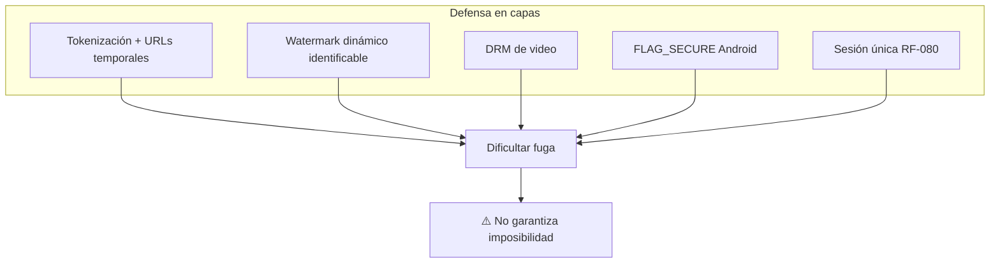
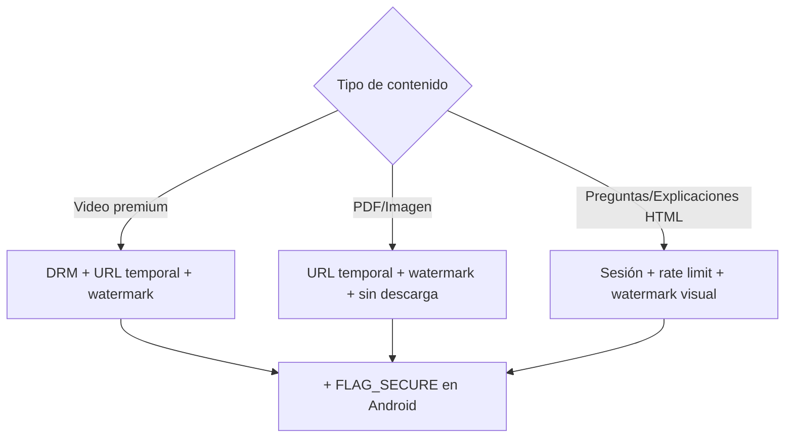
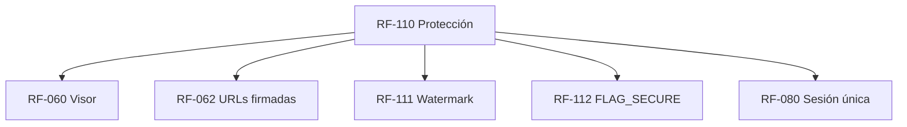

# RF-110: Protección de Contenido (Anti-piratería)

> ⚠️ **Nota de honestidad técnica:** este requerimiento documenta una estrategia de **defensa en capas y disuasión**. Ninguna medida garantiza al 100% la imposibilidad de copia. La sección 8 distingue explícitamente lo que **sí es posible** de lo que **no puede garantizarse técnicamente**.

---

## Índice del Documento
- [1. 📋 Información General](#1--información-general)
- [2. 📜 Histórico de Cambios](#2--histórico-de-cambios)
- [3. 📖 Introducción del Requerimiento](#3--introducción-del-requerimiento)
- [4. 🎯 Objetivo Principal](#4--objetivo-principal)
- [5. 📊 Diagramas del Requerimiento](#5--diagramas-del-requerimiento)
- [6. 📝 Especificación de Datos](#6--especificación-de-datos)
- [7. ✅ Validaciones](#7--validaciones)
- [8. 🔒 Reglas de Negocio (qué sí / qué no)](#8--reglas-de-negocio-qué-sí--qué-no)
- [9. ⚙️ Requerimientos No Funcionales](#9--requerimientos-no-funcionales)
- [10. 🖼️ Mockups / Estados de Pantalla](#10--mockups--estados-de-pantalla)
- [11. ✨ Criterios de Aceptación](#11--criterios-de-aceptación)
- [12. 🛠️ Especificación Técnica](#12--especificación-técnica)
- [13. 🧪 Casos de Prueba](#13--casos-de-prueba)
- [14. 📎 Trazabilidad](#14--trazabilidad)

---

## 1. 📋 Información General

| Campo | Valor |
|-------|-------|
| **ID** | RF-110 |
| **Nombre** | Protección de Contenido (Anti-piratería) |
| **Módulo** | [MOD-07 Material y medios](../04-modulos/modulos-secciones.md) |
| **Versión** | v1.0.0 |
| **Fecha creación** | 2026-06-19 |
| **Estado** | En análisis |
| **Prioridad** | 🟠 Alta |
| **Complejidad** | 🔴 Alta |
| **Autor** | Equipo de análisis |
| **RF relacionados** | RF-060 (Visor) · RF-062 (URLs firmadas) · RF-111 (Watermark) · RF-112 (FLAG_SECURE) · RF-080 (Sesión única) |
| **Caso de uso** | Transversal a CU-060 |

**Avance:** `[████████░░] análisis`

---

## 2. 📜 Histórico de Cambios

| Versión | Fecha | Autor | Descripción | Tipo |
|---------|-------|-------|-------------|------|
| v1.0.0 | 2026-06-19 | Equipo de análisis | Creación con estructura completa | Nueva |

---

## 3. 📖 Introducción del Requerimiento

### 3.1 Descripción general
Define la **estrategia integral** para dificultar la descarga, copia y compartición indebida del contenido (preguntas, explicaciones y material). Combina tokenización, URLs temporales, watermark dinámico, DRM de video y `FLAG_SECURE` en Android. **Comunica explícitamente sus límites** para fijar expectativas realistas con el negocio.

### 3.2 Contexto del negocio


### 3.3 Problema que resuelve
| # | Problema | Impacto | Mitigación (no solución absoluta) |
|---|----------|---------|-----------------------------------|
| 1 | Descarga del material | Reventa/filtración | Sin descarga + URLs temporales + DRM |
| 2 | Compartir enlaces | Acceso gratis | URLs firmadas que expiran + sesión única |
| 3 | Capturas de pantalla | Difusión | FLAG_SECURE (app) + watermark (disuasión) |
| 4 | Identificar a quien filtra | Sin responsable | Watermark con id del alumno |

### 3.4 Beneficios esperados
- ✅ Eleva el costo/esfuerzo de piratear (disuasión efectiva).
- ✅ Atribuye responsabilidad mediante watermark.
- ✅ Expectativas claras: el negocio sabe qué se logra y qué no.

---

## 4. 🎯 Objetivo Principal

### 4.1 Objetivo general
> Dificultar significativamente la fuga de contenido mediante defensa en capas y disuasión, documentando con transparencia los límites técnicos.

### 4.2 Objetivos específicos
| # | Objetivo | Métrica | Meta |
|---|----------|---------|------|
| O1 | Medios solo vía URL temporal | Accesos sin token | 0 |
| O2 | Watermark presente | Medios sensibles sin watermark | 0 |
| O3 | Captura in-app bloqueada (Android) | Vistas sin FLAG_SECURE | 0 |
| O4 | Expectativas comunicadas | Límites documentados y aceptados | sí |

### 4.3 Alcance funcional

**✅ Incluido**
| Funcionalidad | Descripción |
|---------------|-------------|
| Tokenización de medios | Acceso por token de sesión |
| URLs temporales/firmadas | Expiración corta (RF-062) |
| Watermark dinámico | Id del alumno (RF-111) |
| DRM de video | Cifrado y control de reproducción (evaluar Widevine) |
| FLAG_SECURE Android | Bloqueo de captura in-app (RF-112) |
| Rate limiting / detección de scraping | Abuso de acceso a contenido |

**❌ Excluido / No prometido**
| Aspecto | Razón |
|---------|-------|
| Impedir foto con otro dispositivo | Físicamente inevitable |
| Impedir inspección del HTML en navegador | El navegador recibe el contenido para renderizar |
| DRM infalible | Todo DRM tiene vectores conocidos |

---

## 5. 📊 Diagramas del Requerimiento

### 5.1 Decisión de medida por tipo de contenido


---

## 6. 📝 Especificación de Datos

### 6.1 Token de acceso a medio
```json
{
  "media_id": "uuid",
  "usuario_id": "uuid",
  "session_id": "uuid",
  "exp": 1750000300,
  "watermark": "alumno-uuid"
}
```

### 6.2 Registro de accesos a contenido (detección de abuso)
```sql
CREATE TABLE accesos_contenido (
  id UUID PRIMARY KEY DEFAULT gen_random_uuid(),
  usuario_id UUID NOT NULL REFERENCES usuarios(id),
  media_id UUID,
  ip INET,
  fecha_hora TIMESTAMP DEFAULT now()
);
CREATE INDEX idx_acc_cont_usuario_tiempo ON accesos_contenido(usuario_id, fecha_hora);
```

---

## 7. ✅ Validaciones

| ID | Descripción | Tipo |
|----|-------------|------|
| V-110-01 | El medio se entrega solo con token válido ligado a la sesión | Seguridad |
| V-110-02 | El token expira en ventana corta | Seguridad |
| V-110-03 | El watermark incluye identificador del alumno | Seguridad |
| V-110-04 | El video premium se sirve con DRM | Seguridad |
| V-110-05 | Vistas de contenido en Android aplican FLAG_SECURE | App |
| V-110-06 | Patrón de acceso anómalo dispara rate limit/alerta | Seguridad |

---

## 8. 🔒 Reglas de Negocio (qué sí / qué no)

> Esta sección es la pieza central del requerimiento: separa lo viable de lo no garantizable, conforme a [RN-060..063](../06-reglas-negocio/reglas-principales.md).

### 8.1 ✅ Lo que SÍ es técnicamente posible (RN-110-01..05)
**RN-110-01 — URLs firmadas/temporales.** Los medios se sirven con enlaces que expiran y están ligados a la sesión ([RN-061](../06-reglas-negocio/reglas-principales.md), [RF-062](00-catalogo-requerimientos.md)).

**RN-110-02 — Tokenización por sesión.** Cada acceso a medio requiere un token de corta duración asociado al alumno y a su sesión activa ([RF-080](RF-080-sesion-unica.md)).

**RN-110-03 — Watermark dinámico.** El contenido muestra el identificador del alumno; **responsabiliza** a quien filtra ([RF-111](00-catalogo-requerimientos.md)).

**RN-110-04 — DRM de video.** El video premium se cifra y su reproducción se controla (evaluar Widevine); eleva el costo de copia.

**RN-110-05 — FLAG_SECURE en Android.** Bloquea capturas y grabación de pantalla **dentro de la app** ([RF-112](00-catalogo-requerimientos.md)).

### 8.2 ❌ Lo que NO puede garantizarse (RN-110-06..08)
**RN-110-06 — Foto con otro dispositivo.** **No existe** forma 100% efectiva de impedir que alguien fotografíe la pantalla con otra cámara. Mitigación: watermark disuasivo ([RN-062](../06-reglas-negocio/reglas-principales.md)).

**RN-110-07 — Inspección del HTML en navegador.** **No existe** forma de impedir que el usuario vea el HTML/recursos que su navegador recibe para renderizar. La ofuscación solo estorba, no impide ([RN-062](../06-reglas-negocio/reglas-principales.md)).

**RN-110-08 — Grabación externa / DRM infalible.** No se puede impedir por completo la grabación a nivel hardware ni existe DRM sin vectores conocidos.

### 8.3 Estrategia recomendada (RN-110-09)
**RN-110-09 — Defensa en capas + disuasión.** Combinar tokenización + URLs temporales + watermark identificable + DRM en video + FLAG_SECURE en app, **asumiendo que la web es el entorno menos controlable**. El objetivo es **elevar el costo** de piratear y **atribuir** responsabilidad, no la imposibilidad absoluta ([RN-063](../06-reglas-negocio/reglas-principales.md)).

**RN-110-10 — Disuasores client-side en navegador (parcial, no garantizable).** En las vistas de contenido protegido el cliente web aplica medidas de **disuasión**: deshabilitar el menú contextual (clic derecho), interceptar atajos de DevTools (F12, Ctrl+Shift+I/J/C, Ctrl+U), `user-select: none`, bloquear arrastrar/guardar imagen y deshabilitar impresión. Cada gesto interceptado muestra [MSG-071/072/073](../14-mensajes-sistema/mensajes-sistema.md#msg-07x--material-y-protección-de-contenido-mod-07). **Limitación explícita:** estas medidas **estorban pero no impiden**; el navegador necesita recibir el contenido para renderizarlo y un usuario decidido puede inspeccionarlo o fotografiar la pantalla ([RN-110-06/07](#82--lo-que-no-puede-garantizarse-rn-110-0608)). El valor real lo aporta el watermark, que **identifica** la fuente de la filtración.

---

## 9. ⚙️ Requerimientos No Funcionales

| RNF | Descripción |
|-----|-------------|
| RNF-110-01 | Las medidas no degradan la experiencia por debajo de los objetivos de rendimiento |
| RNF-110-02 | Secretos de firma/DRM en secret manager ([RNF-006](00-catalogo-requerimientos.md)) |
| RNF-110-03 | Las limitaciones se comunican formalmente al negocio (acta/decisión) |
| RNF-110-04 | Watermark legible pero no intrusivo |

---

## 10. 🖼️ Mockups / Estados de Pantalla

Se manifiesta en [EP-060 Visor](../11-ux-estados-pantalla/estados-pantalla-iniciales.md#ep-060--visor-de-material): reproductor con watermark, sin descarga; en Android la captura sale en negro (FLAG_SECURE).

---

## 11. ✨ Criterios de Aceptación

```gherkin
Scenario: Medio requiere token de sesión
  Given un alumno con sesión y suscripción activas
  When solicita un video premium
  Then recibe una URL tokenizada temporal con watermark
  And el acceso directo sin token es denegado

Scenario: Captura in-app bloqueada en Android
  Given la app Android en una vista de contenido
  When el usuario intenta una captura de pantalla
  Then la captura se bloquea o sale en negro (FLAG_SECURE)

Scenario: Límite reconocido — foto externa
  Given un usuario que fotografía la pantalla con otro teléfono
  When lo hace
  Then el sistema NO puede impedirlo (documentado), pero el watermark identifica la fuente

Scenario: Límite reconocido — inspección HTML
  Given un usuario que abre las herramientas de desarrollo del navegador
  When inspecciona el contenido renderizado
  Then el sistema NO puede impedirlo (documentado)

Scenario: Detección de scraping
  Given un volumen anómalo de accesos a contenido
  When se detecta
  Then se aplica rate limit y se genera alerta
```

---

## 12. 🛠️ Especificación Técnica

### 12.1 Componentes
```
- Firma de URLs: servicio que emite enlaces con exp corta por (media_id, session_id).
- Watermark: capa en cliente (overlay con id) + marca embebida cuando aplique.
- DRM: integración de licencias para video premium (Widevine a evaluar).
- FLAG_SECURE: bandera por Activity/pantalla de contenido en la app (RF-112).
- Detección de abuso: conteo en Redis por usuario/ventana + alertas.
```

### 12.2 Emisión de token de medio (pseudocódigo)
```typescript
async tokenMedio(usuario, mediaId) {
  assert(sesionActiva(usuario) && subs.activa(usuario.id));  // RN-110-02
  if (await abuso.excede(usuario.id)) throw TooManyRequests(); // RN-110-... / V-110-06
  const token = sign({ media_id: mediaId, usuario_id: usuario.id, session_id: usuario.sid,
                       exp: now()+cfg.mediaTtl, watermark: usuario.id }); // RN-110-01/03
  await db.accesos_contenido.registrar(usuario.id, mediaId, usuario.ip);
  return storage.signedUrl(mediaId, token);
}
```

---

## 13. 🧪 Casos de Prueba

| ID | Escenario | Traza | Tipo |
|----|-----------|-------|------|
| TC-110-01 | Medio requiere token ligado a sesión | V-110-01, RN-110-02 | Positivo |
| TC-110-02 | Token expirado → acceso denegado | V-110-02, RN-110-01 | Negativo |
| TC-110-03 | Watermark con id del alumno presente | V-110-03, RN-110-03 | Positivo |
| TC-110-04 | Video premium servido con DRM | V-110-04, RN-110-04 | Positivo |
| TC-110-05 | FLAG_SECURE bloquea captura in-app | V-110-05, RN-110-05 | Positivo |
| TC-110-06 | Límite: foto externa no se impide (documentado) | RN-110-06 | Borde |
| TC-110-07 | Límite: inspección HTML no se impide (documentado) | RN-110-07 | Borde |
| TC-110-08 | Scraping dispara rate limit/alerta | V-110-06 | Negativo |

---

## 14. 📎 Trazabilidad

### 14.1 Documentos relacionados
| Tipo | Referencia |
|------|------------|
| Reglas | [RN-060..063](../06-reglas-negocio/reglas-principales.md) · [RNA-050..054](../06-reglas-negocio/reglas-alternas.md) |
| Mensajes | [MSG-070..074](../14-mensajes-sistema/mensajes-sistema.md#msg-07x--material-y-protección-de-contenido-mod-07) (contenido protegido / disuasores) |
| Estados de pantalla | [EP-060](../11-ux-estados-pantalla/estados-pantalla-iniciales.md) |
| Modelo de datos | [ERD: materiales](../09-diagramas/03-modelo-datos-erd.md) |
| Requerimientos | RF-060 · RF-062 · RF-111 · RF-112 · RF-080 |
| Visión | [Anti-piratería realista](../01-vision/vision-producto.md) |

### 14.2 Matriz de trazabilidad
| Regla | Mecanismo | Validación | Caso de prueba |
|-------|-----------|------------|----------------|
| RN-110-01 | URLs firmadas | V-110-02 | TC-110-02 |
| RN-110-02 | Tokenización por sesión | V-110-01 | TC-110-01 |
| RN-110-03 | Watermark | V-110-03 | TC-110-03 |
| RN-110-05 | FLAG_SECURE | V-110-05 | TC-110-05 |
| RN-110-06/07 | (límites documentados) | — | TC-110-06, TC-110-07 |

### 14.3 Dependencias


<!-- FOOTER:ALEXANDRYA -->

---

<sub>📄 **Alexandrya** · `docs/05-requerimientos/RF-110-proteccion-contenido.md` · Versión documental **v0.3.0** · Actualizado **2026-06-19** · 🏠 [Índice](../README.md) · 💬 [Mensajes del sistema](../14-mensajes-sistema/mensajes-sistema.md)</sub>
