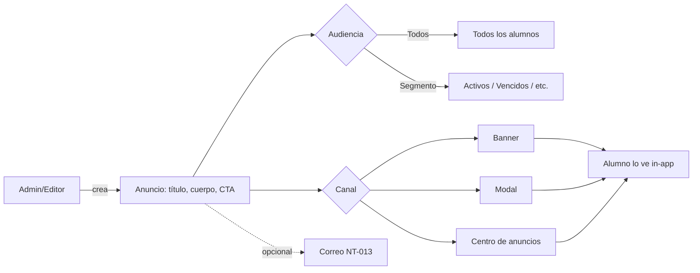
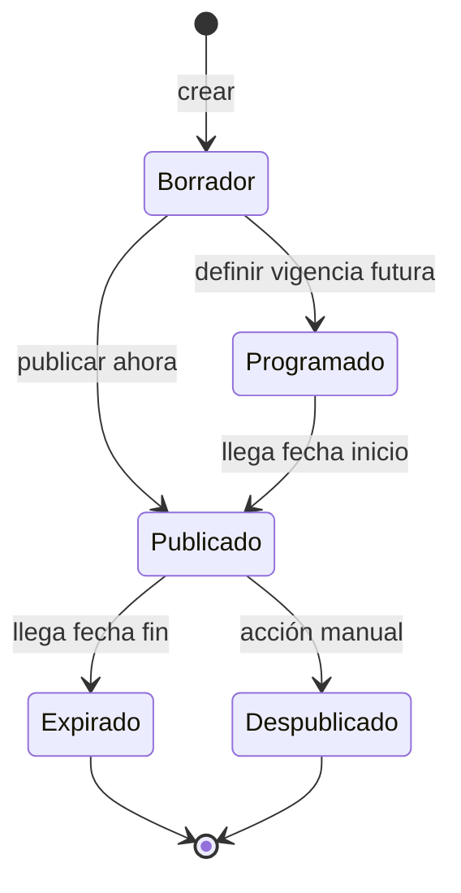
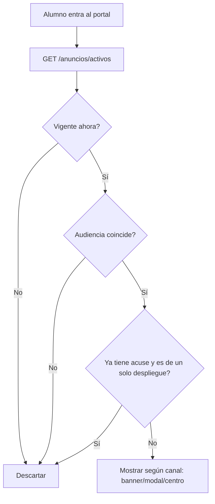
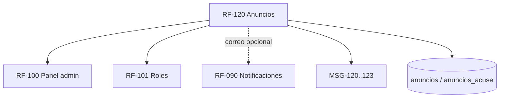

# RF-120: Anuncios y Comunicados

---

## Índice del Documento
- [1. 📋 Información General](#1--información-general)
- [2. 📜 Histórico de Cambios](#2--histórico-de-cambios)
- [3. 📖 Introducción del Requerimiento](#3--introducción-del-requerimiento)
- [4. 🎯 Objetivo Principal](#4--objetivo-principal)
- [5. 📊 Diagramas del Requerimiento](#5--diagramas-del-requerimiento)
- [6. 📝 Especificación de Datos](#6--especificación-de-datos)
- [7. ✅ Validaciones](#7--validaciones)
- [8. 🔒 Reglas de Negocio](#8--reglas-de-negocio)
- [9. ⚙️ Requerimientos No Funcionales](#9--requerimientos-no-funcionales)
- [10. 🖼️ Mockups / Estados de Pantalla](#10--mockups--estados-de-pantalla)
- [11. ✨ Criterios de Aceptación](#11--criterios-de-aceptación)
- [12. 🛠️ Especificación Técnica](#12--especificación-técnica)
- [13. 🧪 Casos de Prueba](#13--casos-de-prueba)
- [14. 📎 Trazabilidad](#14--trazabilidad)

---

## 1. 📋 Información General

| Campo | Valor |
|-------|-------|
| **ID** | RF-120 |
| **Nombre** | Anuncios y Comunicados |
| **Módulo** | [MOD-12 Anuncios](../04-modulos/modulos-secciones.md) |
| **Versión** | v1.0.0 |
| **Fecha creación** | 2026-06-19 |
| **Estado** | En análisis |
| **Prioridad** | 🟡 Media |
| **Complejidad** | 🟡 Media |
| **Autor** | Equipo de análisis |
| **RF relacionados** | RF-090 (Notificaciones) · RF-100 (Panel administrativo) · RF-101 (Roles) |
| **Caso de uso** | CU-100 Publicar anuncio |

**Avance:** `[████████░░] análisis`

---

## 2. 📜 Histórico de Cambios

| Versión | Fecha | Autor | Descripción | Tipo |
|---------|-------|-------|-------------|------|
| v1.0.0 | 2026-06-19 | Equipo de análisis | Creación con estructura completa | Nueva |

---

## 3. 📖 Introducción del Requerimiento

### 3.1 Descripción general
Permite al equipo de Alexandrya **publicar comunicados** dirigidos a los alumnos (novedades, mantenimientos, cambios de producto, promociones) y mostrarlos **dentro de la plataforma** mediante banner, modal o un **centro de anuncios**. A diferencia de las [notificaciones transaccionales](RF-090-notificaciones.md) (disparadas por un evento del sistema, normalmente por correo), un anuncio es **editorial**: lo crea una persona desde el panel, tiene **vigencia**, **audiencia** y **canal de despliegue** configurables.

### 3.2 Contexto del negocio


### 3.3 Problema que resuelve
| # | Problema | Impacto | Solución |
|---|----------|---------|----------|
| 1 | No hay canal para comunicar novedades in-app | Avisos por canales informales | Centro de anuncios gestionado |
| 2 | Avisos de mantenimiento sin difusión | Confusión del alumno | Banner programable con vigencia |
| 3 | Mensajes a todos sin segmentar | Ruido / irrelevancia | Audiencia configurable |
| 4 | Mezclar comunicados con transaccionales | Inconsistencia | Módulo dedicado, separado de NT |

### 3.4 Beneficios esperados
- ✅ Canal oficial de comunicación con el alumno, gestionado sin desplegar código.
- ✅ Segmentación por estado de suscripción.
- ✅ Trazabilidad de qué se comunicó, a quién y cuándo.

---

## 4. 🎯 Objetivo Principal

### 4.1 Objetivo general
> Dotar al equipo de un canal editorial para publicar comunicados in-app segmentados y con vigencia, sin intervención técnica.

### 4.2 Objetivos específicos
| # | Objetivo | Métrica | Meta |
|---|----------|---------|------|
| O1 | Publicación autónoma | Anuncios sin soporte técnico | 100% |
| O2 | Segmentación efectiva | Anuncios entregados a la audiencia correcta | 100% |
| O3 | Respeto de vigencia | Anuncios visibles fuera de ventana | 0 |
| O4 | Acuse en anuncios críticos | Críticos sin registro de lectura | 0 |

### 4.3 Alcance funcional

**✅ Incluido**
| Funcionalidad | Descripción |
|---------------|-------------|
| CRUD de anuncios | Crear, editar, programar, despublicar |
| Tipos | Informativo, mantenimiento, promoción, crítico |
| Canales | Banner, modal, centro de anuncios |
| Audiencia | Todos / suscripción activa / vencida / segmento |
| Vigencia | Fecha-hora inicio y fin |
| Acuse de lectura | "Entendido" en anuncios críticos (modal) |
| Correo opcional | Disparar NT-013 al publicar (reutiliza RF-090) |

**❌ Excluido**
| Funcionalidad | Razón | Referencia |
|---------------|-------|------------|
| Push móvil | Fase posterior (canales del MVP: correo + in-app) | [Notificaciones](../12-notificaciones/notificaciones.md) |
| Segmentación por desempeño/comportamiento | Fase posterior | Roadmap |
| Mensajería bidireccional (chat) | Fuera de alcance | — |

---

## 5. 📊 Diagramas del Requerimiento

### 5.1 Ciclo de vida del anuncio


### 5.2 Resolución de anuncios visibles para un alumno


---

## 6. 📝 Especificación de Datos

### 6.1 Campos de entrada (admin)
| Campo | Tipo | Obligatorio | Validación |
|-------|------|:-----------:|-----------|
| titulo | string | Sí | ≤ 80 caracteres |
| cuerpo | string (markdown/HTML saneado) | Sí | ≤ 1000 caracteres |
| tipo | enum | Sí | informativo · mantenimiento · promocion · critico |
| canal | enum | Sí | banner · modal · centro |
| audiencia | enum | Sí | todos · activos · vencidos · segmento |
| cta_texto / cta_url | string | No | URL válida si se define |
| inicio / fin | timestamp | Sí | fin > inicio |
| requiere_acuse | bool | No | true forzado si tipo = critico |
| enviar_correo | bool | No | dispara NT-013 |

### 6.2 Tabla `anuncios`
```sql
CREATE TABLE anuncios (
  id UUID PRIMARY KEY DEFAULT gen_random_uuid(),
  titulo VARCHAR(80) NOT NULL,
  cuerpo TEXT NOT NULL,
  tipo VARCHAR(20) NOT NULL,        -- informativo|mantenimiento|promocion|critico
  canal VARCHAR(10) NOT NULL,       -- banner|modal|centro
  audiencia VARCHAR(20) NOT NULL,   -- todos|activos|vencidos|segmento
  cta_texto VARCHAR(40),
  cta_url TEXT,
  inicio TIMESTAMP NOT NULL,
  fin TIMESTAMP NOT NULL,
  requiere_acuse BOOLEAN DEFAULT false,
  estado VARCHAR(15) NOT NULL DEFAULT 'borrador', -- borrador|programado|publicado|expirado|despublicado
  creado_por UUID NOT NULL REFERENCES usuarios(id),
  creado_en TIMESTAMP DEFAULT now()
);
CREATE INDEX idx_anuncios_vigencia ON anuncios(estado, inicio, fin);

-- Acuse de lectura (anuncios críticos / de un solo despliegue)
CREATE TABLE anuncios_acuse (
  anuncio_id UUID NOT NULL REFERENCES anuncios(id) ON DELETE CASCADE,
  usuario_id UUID NOT NULL REFERENCES usuarios(id) ON DELETE CASCADE,
  visto_en TIMESTAMP DEFAULT now(),
  PRIMARY KEY (anuncio_id, usuario_id)
);
```

---

## 7. ✅ Validaciones

| ID | Descripción | Tipo |
|----|-------------|------|
| V-120-01 | `fin` debe ser posterior a `inicio` | Lógica |
| V-120-02 | Un anuncio solo se muestra dentro de su ventana de vigencia | Tiempo |
| V-120-03 | La audiencia se evalúa contra el estado actual del alumno | Lógica |
| V-120-04 | Tipo `critico` fuerza `requiere_acuse = true` y canal `modal` | Lógica |
| V-120-05 | Solo roles autorizados (admin/editor) crean o publican | Seguridad |
| V-120-06 | El cuerpo se sanea (HTML) antes de renderizar | Seguridad |
| V-120-07 | Un anuncio de un solo despliegue no se repite tras el acuse | Lógica |

---

## 8. 🔒 Reglas de Negocio

**RN-120-01 — Publicación gestionada.** Un anuncio lo crea y publica un rol autorizado desde el panel ([RF-101](RF-100-panel-administrativo.md)); no requiere despliegue de código (refuerza [RN-120-01](../06-reglas-negocio/reglas-principales.md#anuncios)).

**RN-120-02 — Vigencia estricta.** El anuncio solo es visible entre `inicio` y `fin`; fuera de esa ventana pasa a `expirado` automáticamente.

**RN-120-03 — Anuncio crítico con acuse.** Los anuncios `critico` se muestran como **modal** y exigen acuse ("Entendido"); el acuse se registra por alumno y no se vuelven a mostrar.

**RN-120-04 — Segmentación por estado.** La audiencia (`todos/activos/vencidos/segmento`) se evalúa contra el estado de suscripción vigente del alumno ([RN-010..015](../06-reglas-negocio/reglas-principales.md#suscripción-y-acceso)).

**RN-120-05 — Separación de transaccionales.** Un anuncio **no** sustituye a una notificación transaccional ([RF-090](RF-090-notificaciones.md)); el correo opcional (NT-013) es complemento, no reemplazo.

**RN-120-06 — Textos en el catálogo.** Los mensajes de marco (vacío, confirmación, modal) viven en el [catálogo de mensajes](../14-mensajes-sistema/mensajes-sistema.md#msg-12x--anuncios-mod-12) (MSG-120..123); el contenido editorial es dinámico.

---

## 9. ⚙️ Requerimientos No Funcionales

| RNF | Descripción |
|-----|-------------|
| RNF-120-01 | La consulta de anuncios activos se sirve desde caché (Redis) para no penalizar la carga del portal ([RNF-013](00-catalogo-requerimientos.md)) |
| RNF-120-02 | El cuerpo HTML se sanea contra XSS ([RNF-002](00-catalogo-requerimientos.md)) |
| RNF-120-03 | Toda publicación/despublicación queda auditada ([RNF-004](00-catalogo-requerimientos.md)) |
| RNF-120-04 | El banner es responsivo y accesible (WCAG AA) ([RNF-033](00-catalogo-requerimientos.md)) |

---

## 10. 🖼️ Mockups / Estados de Pantalla

Referencia: [EP-100 Anuncios](../11-ux-estados-pantalla/estados-pantalla-iniciales.md#ep-100--anuncios).

```
Banner (canal=banner):                  Modal crítico (canal=modal):
┌────────────────────────────────────┐  ┌─────────────────────────────┐
│ ℹ️ {{titulo}} — {{cuerpo corto}} [x]│  │  {{titulo}}                 │
│                         [{{cta}}]  │  │  {{cuerpo}}                 │
└────────────────────────────────────┘  │        [ Entendido ]        │
                                         └─────────────────────────────┘
Centro de anuncios (canal=centro):
┌────────────────────────────────────┐
│  Anuncios                           │
│  • {{titulo}}      {{fecha}}        │
│  • {{titulo}}      {{fecha}}        │
│  (vacío) "No tienes anuncios."      │  ← MSG-121
└────────────────────────────────────┘
```

---

## 11. ✨ Criterios de Aceptación

```gherkin
Scenario: Publicar anuncio para todos
  Given un editor en el panel
  When crea un anuncio informativo con vigencia y audiencia "todos"
  Then el anuncio queda publicado
  And los alumnos lo ven en el canal configurado dentro de la vigencia

Scenario: Respeto de vigencia
  Given un anuncio cuya fecha fin ya pasó
  When un alumno entra al portal
  Then el anuncio no se muestra (estado expirado)

Scenario: Segmentación por suscripción
  Given un anuncio con audiencia "vencidos"
  When un alumno con suscripción activa entra
  Then no ve el anuncio
  And un alumno con suscripción vencida sí lo ve

Scenario: Anuncio crítico con acuse
  Given un anuncio tipo "critico"
  When el alumno lo ve como modal y pulsa "Entendido"
  Then se registra su acuse
  And no vuelve a mostrársele

Scenario: Permisos
  Given un usuario sin rol admin/editor
  When intenta crear un anuncio
  Then recibe 403 "sin_permiso" (MSG-100)
```

---

## 12. 🛠️ Especificación Técnica

### 12.1 Endpoints
**`GET /api/v1/anuncios/activos`** (autenticado)
```
200: [ { "id", "titulo", "cuerpo", "tipo", "canal", "cta_texto", "cta_url", "requiere_acuse" } ]
```

**`POST /api/v1/admin/anuncios`** (rol admin/editor)
```
Request: { titulo, cuerpo, tipo, canal, audiencia, inicio, fin, cta_texto?, cta_url?, enviar_correo? }
201: { "id", "estado": "publicado" | "programado" }
403: { "error": "sin_permiso" }          // MSG-100
422: { "error": "vigencia_invalida" }    // V-120-01
```

**`POST /api/v1/anuncios/{id}/acuse`** (autenticado)
```
200: { "ok": true }   // registra anuncios_acuse (RN-120-03)
```

### 12.2 Resolución de anuncios (pseudocódigo)
```typescript
async activosPara(usuario) {
  const candidatos = await cache.get('anuncios:publicados')
                  ?? await db.anuncios.publicadosVigentes(now());   // V-120-02
  return candidatos.filter(a =>
    audienciaCoincide(a.audiencia, usuario.estadoSuscripcion) &&    // V-120-03
    !(a.requiere_acuse && yaAcuso(usuario.id, a.id))                // V-120-07
  );
}
```

---

## 13. 🧪 Casos de Prueba

| ID | Escenario | Traza | Tipo |
|----|-----------|-------|------|
| TC-120-01 | Publicar anuncio para todos → visible en vigencia | V-120-02, RN-120-01 | Positivo |
| TC-120-02 | Anuncio expirado no se muestra | V-120-02, RN-120-02 | Borde |
| TC-120-03 | Audiencia "vencidos" no se muestra a activos | V-120-03, RN-120-04 | Negativo |
| TC-120-04 | Anuncio crítico exige acuse y no se repite | V-120-04/07, RN-120-03 | Positivo |
| TC-120-05 | Usuario sin rol no puede crear → 403 | V-120-05 | Negativo |
| TC-120-06 | fin < inicio → 422 | V-120-01 | Negativo |
| TC-120-07 | Cuerpo con script se sanea (XSS) | V-120-06 | Seguridad |
| TC-120-08 | Centro vacío muestra MSG-121 | RN-120-06 | Borde |

---

## 14. 📎 Trazabilidad

### 14.1 Documentos relacionados
| Tipo | Referencia |
|------|------------|
| Módulo | [MOD-12 Anuncios](../04-modulos/modulos-secciones.md) |
| Reglas | [RN-120-01..03 (Anuncios)](../06-reglas-negocio/reglas-principales.md#anuncios) · [RNA-060/061](../06-reglas-negocio/reglas-alternas.md) |
| Mensajes | [MSG-120..123](../14-mensajes-sistema/mensajes-sistema.md#msg-12x--anuncios-mod-12) |
| Estados de pantalla | [EP-100](../11-ux-estados-pantalla/estados-pantalla-iniciales.md#ep-100--anuncios) |
| Notificaciones | NT-013 / CT-013 — ver [notificaciones](../12-notificaciones/notificaciones.md) |
| Requerimientos | RF-090 (Notificaciones) · RF-100/101 (Panel y roles) |

### 14.2 Matriz de trazabilidad
| Regla | Endpoint | Validación | Caso de prueba |
|-------|----------|------------|----------------|
| RN-120-02 | GET /anuncios/activos | V-120-02 | TC-120-02 |
| RN-120-03 | POST /anuncios/{id}/acuse | V-120-04/07 | TC-120-04 |
| RN-120-04 | GET /anuncios/activos | V-120-03 | TC-120-03 |
| RN-120-01 | POST /admin/anuncios | V-120-05 | TC-120-05 |

### 14.3 Dependencias


<!-- FOOTER:ALEXANDRYA -->

---

<sub>📄 **Alexandrya** · `docs/05-requerimientos/RF-120-anuncios.md` · Versión documental **v0.3.0** · Actualizado **2026-06-19** · 🏠 [Índice](../README.md) · 💬 [Mensajes del sistema](../14-mensajes-sistema/mensajes-sistema.md)</sub>
