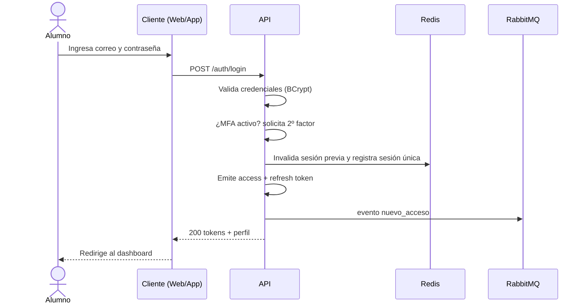

# CU-001 — Iniciar Sesión

## 1. Identificación

| Campo | Valor |
|-------|-------|
| **ID** | CU-001 |
| **Nombre** | Iniciar sesión |
| **Actor principal** | Alumno |
| **Actores secundarios** | Servicio de correo (aviso de acceso), Pasarela (n/a) |
| **Módulo** | [MOD-02 Identidad y acceso](../04-modulos/modulos-secciones.md) |
| **Requerimiento** | [RF-001A](../05-requerimientos/RF-001A-autenticacion.md) |
| **Frecuencia** | Muy alta |

## 2. Precondiciones
- El alumno tiene una cuenta **verificada** y en estado Activa/Vencida.
- Dispone de credenciales válidas.
- Hay conectividad con el backend.

## 3. Postcondiciones (éxito)
- Se crea una sesión activa única para la cuenta.
- Se emiten `access_token` y `refresh_token`.
- Se registra el acceso (fecha, hora, IP, dispositivo, ubicación aprox.).
- Se invalida cualquier sesión previa en otro dispositivo.
- Se envía correo de aviso de nuevo acceso.

## 4. Flujo principal

| # | Actor | Acción | Sistema |
|---|-------|--------|---------|
| 1 | Alumno | Abre la pantalla de login | Muestra formulario ([EP-011](../11-ux-estados-pantalla/estados-pantalla-iniciales.md)) |
| 2 | Alumno | Ingresa correo + contraseña y envía | Valida formato |
| 3 | — | — | Verifica que la cuenta exista y esté verificada |
| 4 | — | — | Compara la contraseña con el hash (BCrypt) |
| 5 | Alumno | (si MFA) ingresa segundo factor | Valida el factor |
| 6 | — | — | Invalida sesión previa, registra la nueva como única |
| 7 | — | — | Emite access + refresh token y registra el acceso |
| 8 | — | — | Encola correo de aviso de acceso |
| 9 | — | — | Devuelve tokens + perfil; cliente redirige al dashboard |

## 5. Flujos alternos
- [FA-001](flujos-alternos.md#fa-001--credenciales-inválidas) — Credenciales inválidas.
- [FA-002](flujos-alternos.md#fa-002--correo-no-verificado) — Correo no verificado.
- [FA-003](flujos-alternos.md#fa-003--bloqueo-por-rate-limiting) — Bloqueo por rate limiting.
- [FA-004](flujos-alternos.md#fa-004--expulsión-por-sesión-única) — Expulsión por sesión única.

## 6. Reglas aplicables
- Principales: RN-030, RN-031, RN-032, RN-033, RN-034 ([reglas-principales](../06-reglas-negocio/reglas-principales.md)).
- Alternas: RNA-002, RNA-003, RNA-005, RNA-006 ([reglas-alternas](../06-reglas-negocio/reglas-alternas.md)).

## 7. Trazabilidad

| Requerimiento | Estado de pantalla | Casos de prueba | Notificación |
|---------------|--------------------|-----------------|--------------|
| [RF-001A](../05-requerimientos/RF-001A-autenticacion.md) | EP-011..014 | CP-010, CP-011, CP-012 | [NT-002](../12-notificaciones/notificaciones.md) (aviso de acceso) |

<!-- FOOTER:ALEXANDRYA -->

---

📄 **Alexandrya** · `docs/07-casos-uso/CU-001-inicio-sesion.md` · Versión documental **v0.3.0** · Actualizado **2026-06-19** · 🏠 [Índice](../README.md) · 💬 [Mensajes del sistema](../14-mensajes-sistema/mensajes-sistema.md)
