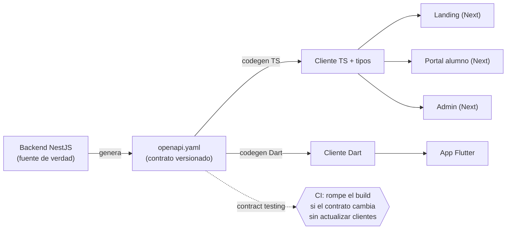
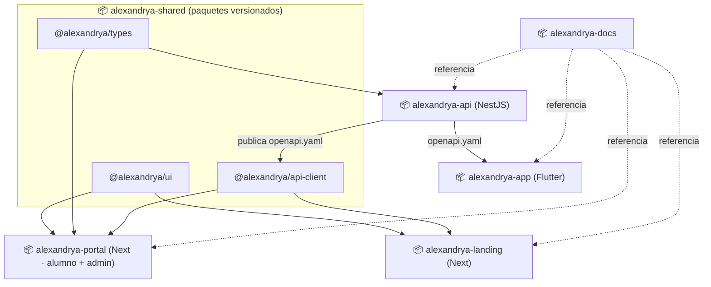

# 08.1 — Estrategia de Repositorios (Monorepo vs Polyrepo)

Análisis y comparación de **dos propuestas** para organizar el código de Alexandrya en repositorios, manteniendo **integridad** (un cambio no rompe a los demás), **aislamiento** (un repo/equipo no bloquea a otro) e **interconexión** (todo comparte un contrato común). Cierra con una recomendación y la decisión a validar (registrada como [ADR-007](#7--decisión-adr-007)).

> **Punto de partida del usuario:** repos separados para (1) documentación, (2) app, (3) landing, (4) portal de alumnos + administrativo. Este documento respeta esa intención y la contrasta con la mejor práctica para el stack real, señalando una pieza que faltaba en el planteamiento: **el backend (API)**.

---

## 1. Contexto que condiciona la decisión

| Componente | Tecnología | Lenguaje | Comparte código con… |
|------------|-----------|----------|----------------------|
| Landing pública | Next.js / React | TypeScript | Portal, Admin (UI, tipos, cliente API) |
| Portal del alumno | Next.js / React | TypeScript | Landing, Admin |
| Panel administrativo | Next.js / React | TypeScript | Landing, Portal |
| **Backend / API** | NestJS | TypeScript | Web (tipos), genera el **contrato OpenAPI** |
| App móvil | Flutter | Dart | **Nada de código** — solo el contrato OpenAPI |
| Documentación | Markdown | — | Nada |

**Tres hechos que mandan sobre la arquitectura:**
1. **El web es un solo ecosistema TypeScript** (landing + portal + admin + backend). Separarlos en repos *aislados* obliga a versionar y publicar paquetes para compartir lo que hoy es un simple `import`.
2. **La app Flutter está en otra galaxia técnica** (Dart). Conviene que sea **siempre** un repo aparte, en cualquier escenario.
3. **El contrato es el verdadero punto de unión**, no el código: el [OpenAPI](00-indice-especificaciones.md#2-convenciones-de-api) generado por el backend es la fuente de verdad que consumen todos los clientes ([ver división web/móvil §6](../01-vision/division-web-mobile.md)).

---

## 2. El contrato como columna vertebral (común a ambas propuestas)

Independientemente de cómo agrupemos los repos, la integridad **no** se logra "teniendo todo junto" sino con un **contrato versionado** entre productor (API) y consumidores (web y app):



> **Regla de oro:** ningún cliente "adivina" la forma de la API. Se genera el cliente desde `openapi.yaml`. Si el backend cambia el contrato, el **contract testing** en CI detecta a quién rompe **antes** de desplegar. Esto da integridad en *cualquiera* de las dos propuestas.

---

## 3. Propuesta A — Monorepo de producto + repos satélite  ⭐ *(recomendada)*

Un único repo para todo el **ecosistema TypeScript** (web + backend + librerías compartidas), gestionado con **Turborepo** o **Nx**. La app Flutter y la documentación quedan como repos independientes.

### 3.1 Mapa de repos
```mermaid
flowchart TB
    subgraph R1["📦 repo: alexandrya-docs"]
        DOCS["Documentación (este repo)"]
    end
    subgraph R2["📦 repo: alexandrya-platform (MONOREPO)"]
        direction TB
        subgraph apps["apps/"]
            A_LAND["landing (Next)"]
            A_PORT["portal (Next)"]
            A_ADMIN["admin (Next)"]
            A_API["api (NestJS)"]
        end
        subgraph pkgs["packages/ (compartidos)"]
            P_UI["ui · design system"]
            P_TYPES["types · modelos de dominio"]
            P_CLIENT["api-client · generado de OpenAPI"]
            P_CFG["config · eslint/tsconfig/tailwind"]
        end
        A_LAND --> P_UI & P_CLIENT & P_CFG
        A_PORT --> P_UI & P_TYPES & P_CLIENT & P_CFG
        A_ADMIN --> P_UI & P_TYPES & P_CLIENT & P_CFG
        A_API --> P_TYPES & P_CFG
        A_API -.genera.-> P_CLIENT
    end
    subgraph R3["📦 repo: alexandrya-app (Flutter)"]
        APP["App Android (Dart)"]
    end
    R2 -.publica openapi.yaml.-> R3
    DOCS -. referencia .-> R2
```

### 3.2 Cómo se logra "integridad sin que se afecten entre sí"
- **Atomicidad:** un cambio que toca el contrato y sus consumidores se hace en **un solo PR**; nunca hay versiones desincronizadas dentro del web.
- **Aislamiento real con grafo de afectados:** Turborepo/Nx solo construye, testea y despliega lo que **cambió** (`--affected`). Tocar la landing **no** redeploya el admin. El aislamiento es por *pipeline*, no por repo.
- **Fronteras de propiedad:** `CODEOWNERS` por carpeta + reglas de import (Nx module boundaries) impiden que `admin` importe internals de `portal`. Se obtiene separación lógica sin separación física.
- **Caché remoto:** builds incrementales compartidos en CI → pipelines rápidos pese al tamaño.

### 3.3 Ventajas / desventajas
| ✅ Ventajas | ⚠️ Desventajas |
|------------|----------------|
| Cambios cross-cutting atómicos (contrato + UI + API en un PR) | Un repo grande; requiere disciplina de tooling (Turbo/Nx) |
| Refactors globales seguros (un solo `tsconfig`, un solo lint) | Permisos finos solo a nivel carpeta (no por repo) |
| Sin "version skew" entre paquetes web | Si crecen muchos equipos externos, la coordinación pesa |
| Onboarding simple: `clone` + `install` y corre todo | CI mal configurado puede construir de más (se mitiga con `--affected`) |
| Versionado y release coordinados | Historia de git más voluminosa |

---

## 4. Propuesta B — Polyrepo (multi-repo) + repo de contratos compartido

Cada pieza en su propio repositorio (respeta al 100% el planteamiento original) más un repo `shared` que publica las librerías comunes como **paquetes versionados** (GitHub Packages / npm privado). Aquí aparece explícito el **backend** como 5.º repo y el **shared** como 6.º.

### 4.1 Mapa de repos


### 4.2 Cómo se logra "integridad sin que se afecten entre sí"
- **Aislamiento físico fuerte:** cada repo tiene su CI, sus permisos, su cadencia de release. Un repo roto no impide trabajar en otro.
- **Interconexión por versiones:** los consumidores fijan `@alexandrya/ui@^1.4.0`. Para evolucionar, se publica una nueva versión y cada repo la adopta cuando puede (semver + changelogs).
- **Contrato igual que en A:** el OpenAPI sigue siendo el pegamento; aquí viaja entre repos como artefacto publicado.

### 4.3 Ventajas / desventajas
| ✅ Ventajas | ⚠️ Desventajas |
|------------|----------------|
| Autonomía total por equipo/proveedor (ideal si la landing la hace una agencia) | **Version skew**: un cambio compartido obliga a N PRs en N repos |
| Permisos y auditoría por repo (útil para cumplimiento) | Cambios cross-cutting son lentos y propensos a olvidos |
| Releases y rollbacks independientes por pieza | Sobrecarga operativa: 6 pipelines, 6 sets de secrets, 6 dependabots |
| Repos pequeños, historia acotada | Onboarding más complejo (clonar y enlazar varios repos) |
| Escala bien con muchos equipos independientes | Publicar/versionar `shared` es fricción diaria para un equipo chico |

---

## 5. Comparación lado a lado

| Criterio | A · Monorepo ⭐ | B · Polyrepo + shared |
|----------|:---------------:|:---------------------:|
| Integridad en cambios cross-cutting | 🟢 Atómica (1 PR) | 🟡 Coordinada (N PRs + versiones) |
| Aislamiento entre piezas | 🟡 Lógico (CODEOWNERS, boundaries) | 🟢 Físico (repos separados) |
| Deploys independientes | 🟢 Sí, por *affected* | 🟢 Sí, nativo |
| Velocidad de evolución (equipo chico) | 🟢 Alta | 🔴 Baja (fricción de versionado) |
| Autonomía de muchos equipos | 🟡 Media | 🟢 Alta |
| Complejidad de CI/CD | 🟡 Media (necesita Turbo/Nx) | 🔴 Alta (N pipelines) |
| Riesgo de version skew | 🟢 Nulo en web | 🔴 Real |
| Control de acceso granular | 🟡 Por carpeta | 🟢 Por repo |
| Onboarding | 🟢 1 clone | 🟡 Varios repos |
| Costo operativo | 🟢 Bajo | 🔴 Alto |
| Encaje con proveedor externo (agencia) | 🟡 Posible (con cuidado) | 🟢 Natural |

**Constante en ambas:** docs y app Flutter **siempre** son repos aparte; el **contrato OpenAPI** es la fuente de integridad.

---

## 6. Mejores prácticas (aplican a la opción que se elija)

1. **Contract-first:** OpenAPI generado del backend; clientes generados por codegen; **contract testing** en CI ([RNF-031](../05-requerimientos/00-catalogo-requerimientos.md)).
2. **Trunk-based + PRs cortos** con revisión obligatoria y `CODEOWNERS`.
3. **Conventional Commits + SemVer** (imprescindible en B para los paquetes `shared`; útil en A para el changelog).
4. **CI por afectados:** en A, `turbo run build --affected`; en B, CI propio por repo.
5. **Pipelines y secretos por entorno** (dev/stage/prod) con GitHub Actions + OIDC a AWS (sin llaves largas).
6. **Versionado de la API por path** (`/api/v1`) ya definido; deprecación con ventana.
7. **Design system como paquete** (`ui`) consumido por landing/portal/admin para consistencia visual.
8. **La documentación (este repo) es la fuente declarativa**; el código la referencia, no la duplica.

---

## 7. Recomendación y decisión (ADR-007)

> **Recomendación: Propuesta A (Monorepo de producto + repos satélite).**
> Para un **equipo pequeño**, **un solo producto**, en **MVP**, con **stack TS unificado** (Next + Nest) y **un backend**, el monorepo maximiza la velocidad y elimina el *version skew*, mientras que el grafo de afectados + `CODEOWNERS` dan el aislamiento que se busca ("que no se afecten entre sí"). La app Flutter y la documentación quedan aisladas en sus propios repos.
>
> **Elegir Propuesta B si** se prevé pronto: equipos/proveedores autónomos por pieza (p. ej. una agencia para la landing), fronteras de cumplimiento que exijan permisos por repo, o cadencias de release muy distintas e independientes.

### Decisiones abiertas a validar
| # | Decisión | Recomendación |
|---|----------|---------------|
| D1 | ¿El **backend** vive con el web (A) o en su propio repo (B)? | Con el web en A; repo aparte en B. **El backend debe existir como repo/área explícita** (faltaba en el planteamiento). |
| D2 | ¿**Admin** y **portal del alumno** son apps separadas o una sola? | Apps **separadas** que comparten `packages/ui` y `api-client` (en A, dos apps en el monorepo; en B, dos repos o un repo `portal` con dos apps). |
| D3 | ¿Creamos repo/paquete **`shared`** (design system + tipos + cliente)? | En A es `packages/`; en B es un repo dedicado **obligatorio**. |

| ADR | Decisión | Estado |
|-----|----------|--------|
| ADR-007 | Estrategia de repositorios para Alexandrya | 🟡 **Propuesta — a validar** (A recomendada) |

---

## 8. Trazabilidad
| Tipo | Referencia |
|------|------------|
| Stack y contratos | [00-indice-especificaciones.md](00-indice-especificaciones.md) |
| División de clientes | [01-vision/division-web-mobile.md](../01-vision/division-web-mobile.md) |
| Componentes backend | [09-diagramas/02-componentes.md](../09-diagramas/02-componentes.md) |
| Arquitectura | [09-diagramas/01-arquitectura.md](../09-diagramas/01-arquitectura.md) |
| RNF de mantenibilidad/CI | RNF-031, RNF-032 — [catálogo](../05-requerimientos/00-catalogo-requerimientos.md) |

<!-- FOOTER:ALEXANDRYA -->

---

<sub>📄 **Alexandrya** · `docs/08-especificaciones-tecnicas/01-estrategia-repositorios.md` · Versión documental **v0.3.0** · Actualizado **2026-06-19** · 🏠 [Índice](../README.md) · 💬 [Mensajes del sistema](../14-mensajes-sistema/mensajes-sistema.md)</sub>
