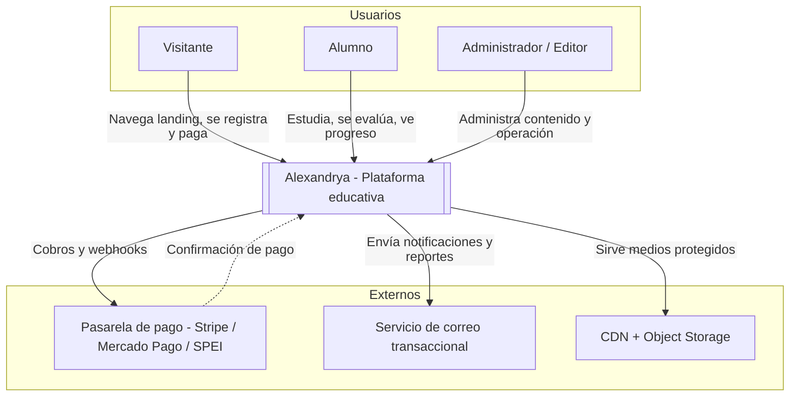
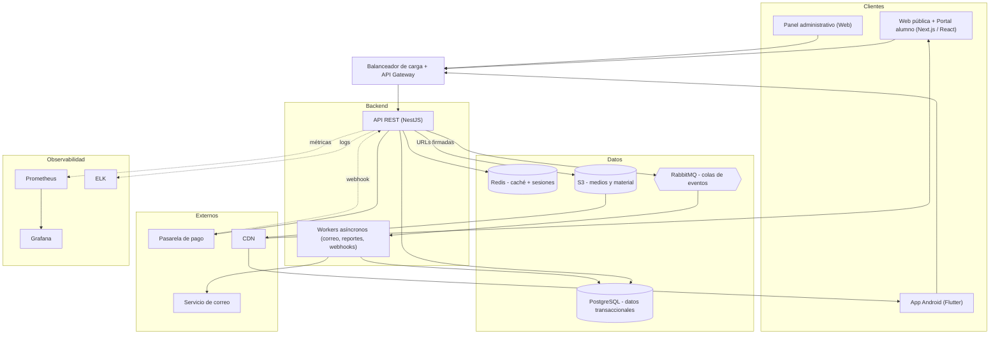

# Diagrama — Arquitectura general

Modelo C4 simplificado: contexto (actores y sistemas externos) y contenedores (despliegue lógico).

## 1. Diagrama de contexto

## 2. Diagrama de contenedores

## 3. Notas de arquitectura

- **API cliente-agnóstica:** un solo backend sirve a web, panel y app (ver [división web/mobile](../01-vision/division-web-mobile.md)).
- **Asíncrono vía RabbitMQ:** correos, reporte semanal y procesamiento de webhooks corren en workers para no bloquear la API ([RF-090](../05-requerimientos/00-catalogo-requerimientos.md), [RF-091](../05-requerimientos/00-catalogo-requerimientos.md)).
- **Caché en Redis:** catálogo de contenido y lista de sesión activa por cuenta (soporta [RN-030](../06-reglas-negocio/reglas-principales.md) sesión única y [RNF-013](../05-requerimientos/00-catalogo-requerimientos.md)).
- **Medios por CDN con URLs firmadas:** soporta [RF-062](../05-requerimientos/00-catalogo-requerimientos.md) y [RF-110](../05-requerimientos/00-catalogo-requerimientos.md).
- **Escalamiento horizontal** de API y workers detrás del balanceador ([RNF-011](../05-requerimientos/00-catalogo-requerimientos.md)).

<!-- FOOTER:ALEXANDRYA -->

---

📄 **Alexandrya** · `docs/09-diagramas/01-arquitectura.md` · Versión documental **v0.3.0** · Actualizado **2026-06-19** · 🏠 [Índice](../README.md) · 💬 [Mensajes del sistema](../14-mensajes-sistema/mensajes-sistema.md)
