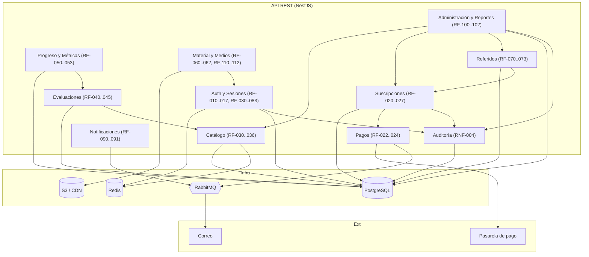

# Diagrama — Componentes del backend

Módulos lógicos de la API y sus dependencias. Cada módulo agrupa los requerimientos relacionados.

## Responsabilidades por módulo

| Módulo | Responsabilidad principal | Reglas clave |
|--------|---------------------------|--------------|
| Auth & Sesiones | Registro, login, JWT/refresh, MFA, sesión única, historial de acceso | [RN-030..034](../06-reglas-negocio/reglas-principales.md) |
| Suscripciones | Estado y vigencia, suspensión y renovación | [RN-010..016](../06-reglas-negocio/reglas-principales.md) |
| Pagos | Checkout, webhooks idempotentes, validación automática | [RN-020..023](../06-reglas-negocio/reglas-principales.md) |
| Catálogo | Materias→módulos→temas→subtemas→preguntas, carga masiva Excel | [RN-001..006](../06-reglas-negocio/reglas-principales.md) |
| Evaluaciones | Armado y ejecución de exámenes/simuladores, calificación | [RN-050..054](../06-reglas-negocio/reglas-principales.md) |
| Progreso & Métricas | Historial, avance, áreas de oportunidad, recomendaciones | [RN-053](../06-reglas-negocio/reglas-principales.md) |
| Material & Medios | Entrega protegida (URLs firmadas, watermark, tokenización) | [RN-060..063](../06-reglas-negocio/reglas-principales.md) |
| Referidos | Código único, límite 3, beneficios configurables | [RN-040..045](../06-reglas-negocio/reglas-principales.md) |
| Notificaciones | Correos transaccionales y reporte semanal (async) | RF-090, RF-091 |
| Administración | Gestión y reportes, roles diferenciados | RF-100..102 |
| Auditoría | Registro inmutable de eventos sensibles | RNF-004, RN-072 |

<!-- FOOTER:ALEXANDRYA -->

---

📄 **Alexandrya** · `docs/09-diagramas/02-componentes.md` · Versión documental **v0.3.0** · Actualizado **2026-06-19** · 🏠 [Índice](../README.md) · 💬 [Mensajes del sistema](../14-mensajes-sistema/mensajes-sistema.md)
