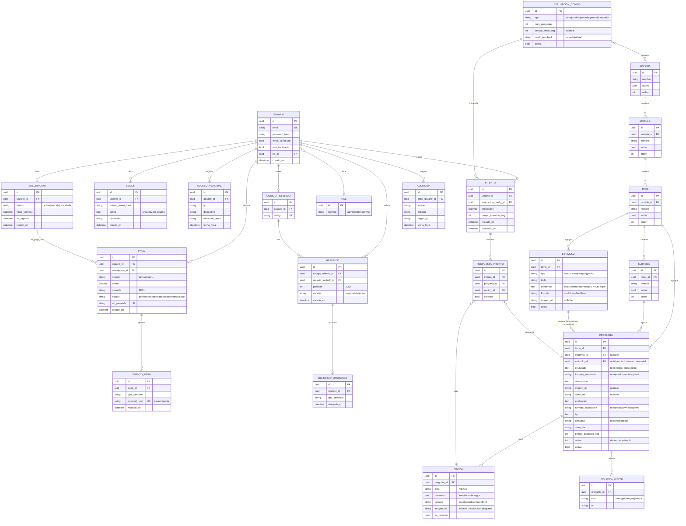

# Diagrama — Modelo de datos (ERD)

Modelo entidad-relación conceptual. La especificación física (tipos, índices, constraints) se detalla en la fase de arquitectura; aquí se fija la estructura y las relaciones.

## Notas del modelo

- **Borrado lógico** vía `activa` en catálogo (materia/módulo/tema/subtema/pregunta) para preservar historial ([RN-006](../06-reglas-negocio/reglas-principales.md)).
- **Idempotencia de pagos**: `EVENTO_PAGO.payload_hash` único evita doble procesamiento de webhooks ([RN-021](../06-reglas-negocio/reglas-principales.md)).
- **Sesión única**: regla de "una `SESION.activa` por usuario" se refuerza en backend + Redis ([RN-030](../06-reglas-negocio/reglas-principales.md)).
- **Pregunta**: exactamente 4 `OPCION` y una con `es_correcta = true` ([RN-003](../06-reglas-negocio/reglas-principales.md), [RN-004](../06-reglas-negocio/reglas-principales.md)).
- **Contenido enriquecido**: `enunciado`, `OPCION.contenido`, `explicacion` y `ESTIMULO.contenido` admiten `formato` (`texto|markdown|latex|html`) para renderizar **fórmulas matemáticas/químicas (LaTeX/MathML)** e imágenes por opción. Son `text`, no `varchar`, para soportar contenido largo ([RF-033](../05-requerimientos/RF-033-contenido-reactivo.md)).
- **Estímulo compartido**: un `ESTIMULO` (lectura, caso, imagen o gráfico) agrupa varias `PREGUNTA` mediante `estimulo_id`; modela comprensión lectora y casos con un texto base único reutilizado por N reactivos. `PREGUNTA.orden` ordena los reactivos dentro del estímulo.
- **Materias data-driven**: agregar una fila en `MATERIA` basta; sin cambios de código ([RN-001](../06-reglas-negocio/reglas-principales.md)).
- **Catálogo inicial de MATERIA**: Química, Matemáticas, Competencias escritas, Biología, Competencia lectora, Historia, Física, Español / Literatura, Filosofía, Geografía, Historia Universal.

## Índices recomendados (preliminar)

| Tabla | Índice | Motivo |
|-------|--------|--------|
| USUARIO | `email` (único) | Login y verificación de duplicados. |
| SUSCRIPCION | `(usuario_id, estado)`, `fin_vigencia` | Consulta de acceso y job de vencimiento. |
| PAGO | `ref_pasarela` (único) | Conciliación con la pasarela. |
| EVENTO_PAGO | `payload_hash` (único) | Idempotencia de webhooks. |
| SESION | `(usuario_id, activa)` | Resolver sesión única. |
| INTENTO | `(usuario_id, evaluacion_config_id)`, `finalizado_en` | Historial y métricas. |
| RESPUESTA_INTENTO | `(intento_id)`, `(pregunta_id)` | Cálculo de fortalezas/debilidades. |
| PREGUNTA | `(tema_id, activa)`, `(subtema_id, activa)`, `(estimulo_id, orden)` | Armado de evaluaciones y reactivos de una lectura. |
| ESTIMULO | `(tema_id, activo)` | Selección de lecturas/casos por tema. |
| REFERIDO | `(codigo_referido_id, estado)` | Conteo de referidos efectivos. |

<!-- FOOTER:ALEXANDRYA -->

---

📄 **Alexandrya** · `docs/09-diagramas/03-modelo-datos-erd.md` · Versión documental **v0.3.0** · Actualizado **2026-06-19** · 🏠 [Índice](../README.md) · 💬 [Mensajes del sistema](../14-mensajes-sistema/mensajes-sistema.md)
