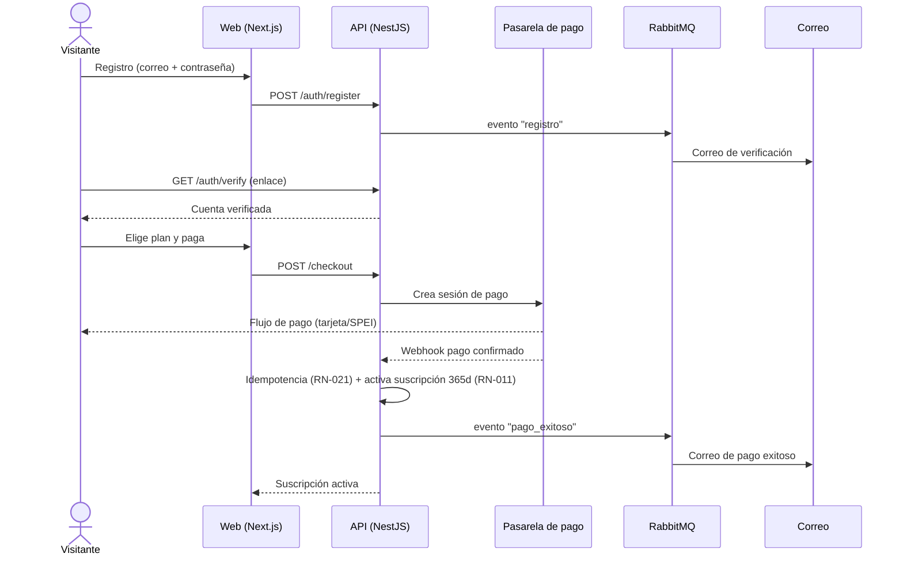
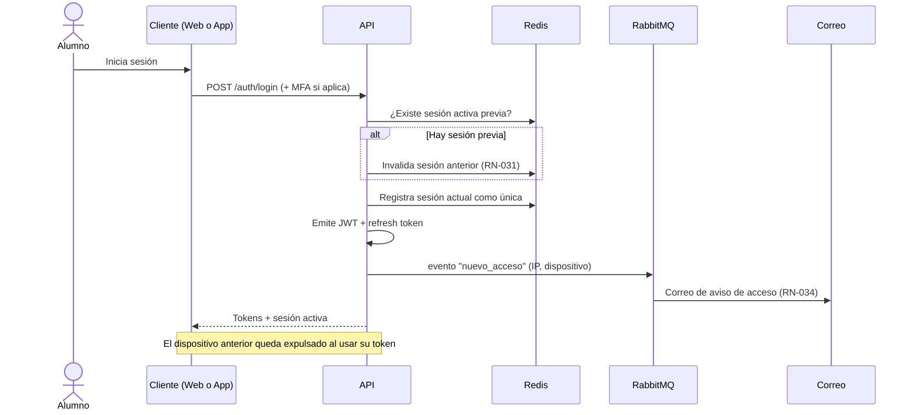
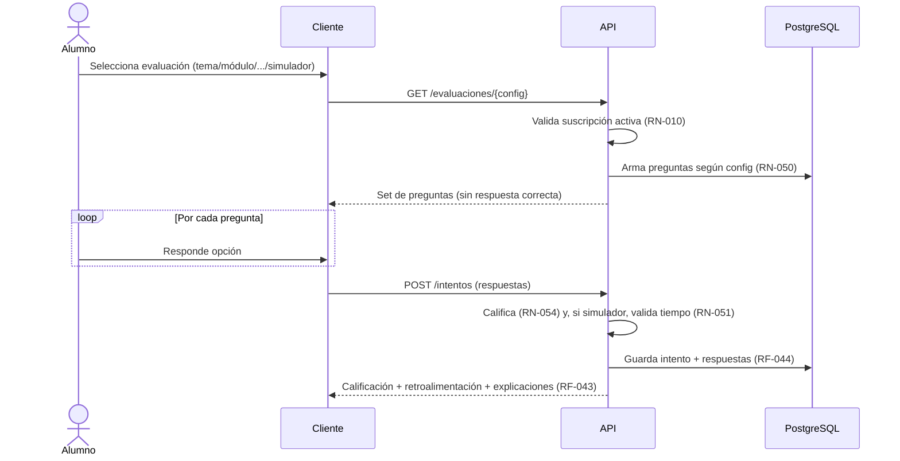
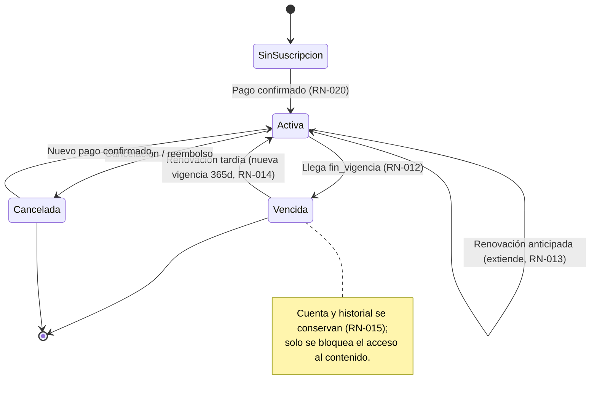
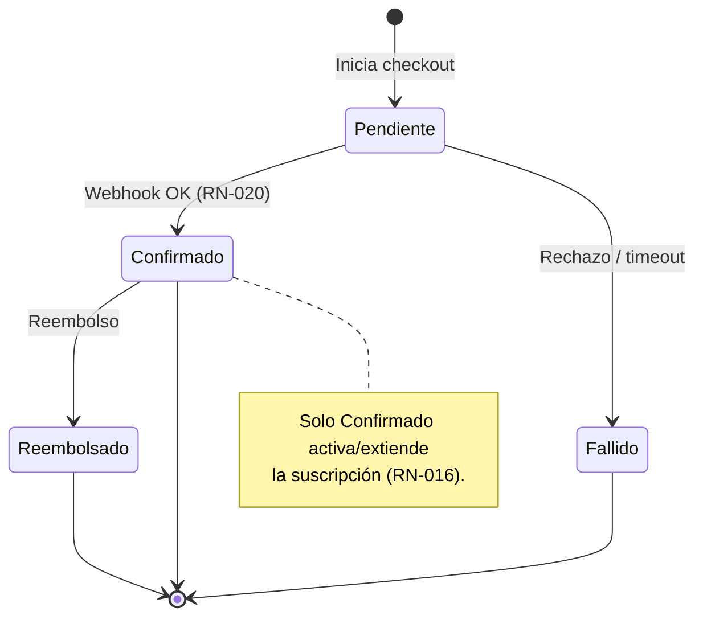
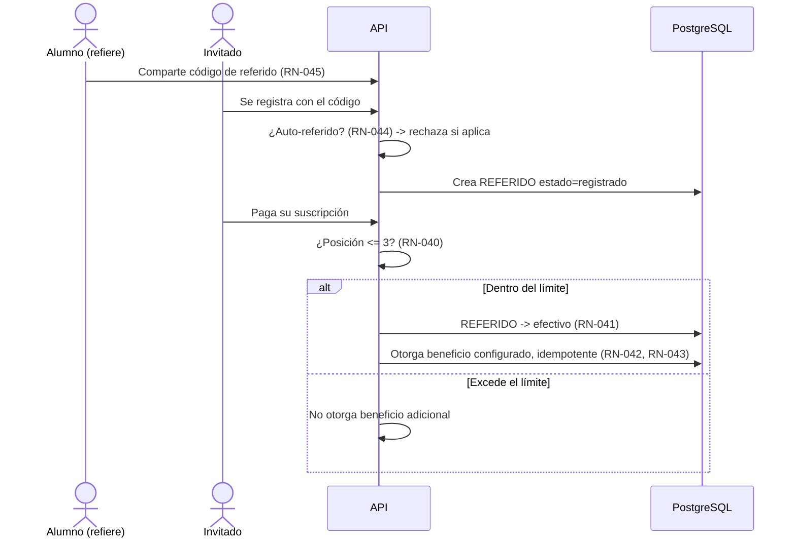
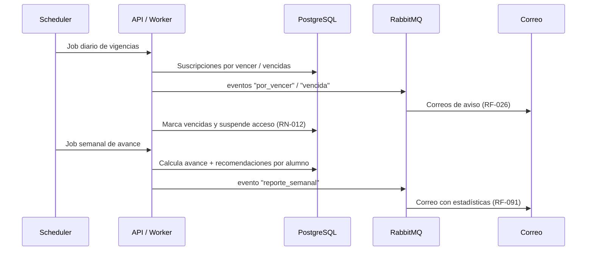

# Diagrama — Flujos de negocio

Secuencias y máquinas de estado de los procesos críticos.

## 1. Registro + pago + activación de suscripción

## 2. Login con control de sesión única

## 3. Realizar una evaluación

## 4. Estados de la suscripción

## 5. Estados de un pago

## 6. Referido efectivo y otorgamiento de beneficio

## 7. Vencimiento y reporte semanal (jobs programados)

<!-- FOOTER:ALEXANDRYA -->

---

📄 **Alexandrya** · `docs/09-diagramas/04-flujos.md` · Versión documental **v0.3.0** · Actualizado **2026-06-19** · 🏠 [Índice](../README.md) · 💬 [Mensajes del sistema](../14-mensajes-sistema/mensajes-sistema.md)
