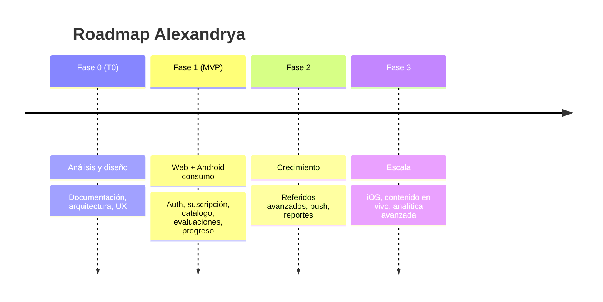

# 13 — Roadmap

Plan de evolución de Alexandrya: MVP, fases posteriores y visión a 3 años. Las fechas son relativas al arranque del desarrollo (T0).

---

## 1. Resumen de fases

---

## 2. MVP (Fase 1) — Alcance mínimo viable

**Objetivo:** lanzar una plataforma de pago funcional con las 11 materias, evaluaciones y progreso.

| Incluido en MVP | Módulo | Plataforma |
|-----------------|--------|------------|
| Landing pública + planes + legal | MOD-01 | Web |
| Registro, verificación, login, recuperación | MOD-02 | Web + App |
| Sesión única + historial de acceso | MOD-02 | Web + App |
| Suscripción anual + pago (tarjeta y SPEI) + webhooks | MOD-03 | Web |
| Catálogo configurable + carga masiva Excel | MOD-04 | Admin |
| Evaluaciones (tema/módulo/materia/general/simulador) | MOD-05 | Web + App |
| Retroalimentación + registro de intentos | MOD-05 | Web + App |
| Dashboard de progreso + recomendaciones | MOD-06 | Web + App |
| Material de apoyo protegido (URLs firmadas, watermark, FLAG_SECURE) | MOD-07 | Web + App |
| Referidos (hasta 3, beneficios configurables) | MOD-08 | Web + App |
| Notificaciones por correo + reporte semanal | MOD-09 | Backend |
| Panel administrativo + roles + reportes básicos | MOD-10 | Web |
| Seguridad base (JWT, OWASP, rate limiting, auditoría) | MOD-11 | Backend |

**Fuera del MVP:** pago dentro de la app Android, push, iOS, modo offline, DRM avanzado, contenido en vivo.

---

## 3. Plan a 3 años

### Año 1 — Lanzamiento y estabilización
- **T0–T1 (meses 0–3):** Fase 0 (esta documentación) + arquitectura + setup CI/CD e infraestructura.
- **T1–T2 (meses 3–6):** Desarrollo MVP web + backend (auth, suscripción, catálogo, evaluaciones).
- **T2–T3 (meses 6–8):** App Android de consumo + dashboard + material protegido.
- **T3–T4 (meses 8–10):** Referidos, notificaciones, panel admin, reportes.
- **T4 (meses 10–12):** Hardening de seguridad, pruebas, beta cerrada, lanzamiento MVP.

### Año 2 — Crecimiento
- Pagos in-app y push en Android.
- Reportes y analítica avanzada para alumnos y admin.
- Gamificación (rachas, logros) y rutas de estudio sugeridas.
- Optimización de conversión y retención; A/B testing en landing.
- Más materias y bancos de preguntas; control de calidad de contenido.

### Año 3 — Escala
- App iOS (Flutter ya lo facilita).
- DRM de video premium y contenido en vivo / clases sincrónicas (evaluar).
- Modo offline con sincronización.
- Internacionalización y multi-moneda (más allá de México).
- Recomendaciones con modelos predictivos (riesgo de abandono, plan personalizado).

---

## 4. Hitos y métricas por fase

| Fase | Hito | KPI objetivo |
|------|------|--------------|
| MVP | Primer pago real en producción | Tasa de conversión landing→pago medible |
| Año 1 | 11 materias con banco completo | ≥ N preguntas por tema |
| Año 2 | Push activo + pagos in-app | +X% retención semanal |
| Año 3 | iOS en tiendas | Cobertura iOS + Android |

---

## 5. Dependencias y riesgos del plan
- La selección de pasarela (comparativa pendiente) condiciona el inicio de MOD-03.
- La calidad y volumen del banco de preguntas es prerrequisito del valor del MVP.
- La estrategia de protección de contenido tiene límites técnicos reconocidos ([RN-060..063](../06-reglas-negocio/reglas-principales.md)); el roadmap no promete imposibles.

> Backlog priorizado, estimaciones y plan de pruebas/despliegue detallados se derivan de este roadmap en documentos propios de la fase de planeación.

<!-- FOOTER:ALEXANDRYA -->

---

📄 **Alexandrya** · `docs/13-roadmap/roadmap.md` · Versión documental **v0.3.0** · Actualizado **2026-06-19** · 🏠 [Índice](../README.md) · 💬 [Mensajes del sistema](../14-mensajes-sistema/mensajes-sistema.md)
