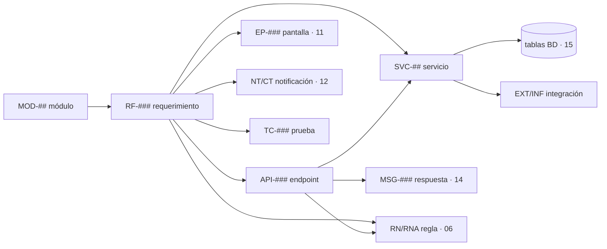

# 16 — APIs y Servicios

Vincula la **capa de servicios** (qué hace el sistema por dentro) con la **API REST** (cómo se consume desde fuera) y la cruza con todo lo demás: módulos, requerimientos, reglas, mensajes, tablas e infraestructura.

> Esta sección **operacionaliza** las [convenciones de API del §08](../08-especificaciones-tecnicas/00-indice-especificaciones.md#2-convenciones-de-api): allí se fija el estilo (REST, `/api/v1`, JWT, errores uniformes); aquí se cataloga **endpoint por endpoint** y **servicio por servicio**.

---

## Contenido

| Documento | Qué contiene | IDs |
|-----------|--------------|-----|
| [catalogo-endpoints.md](catalogo-endpoints.md) | Todos los endpoints REST cruzados con RF, tablas, reglas y mensajes | `API-###` |
| [servicios.md](servicios.md) | Servicios de dominio, integraciones externas e infraestructura + mapa de dependencias | `SVC-##`, `EXT-##`, `INF-##` |

---

## Cómo se relaciona todo (cadena de trazabilidad)

> Lectura: un **módulo** agrupa **requerimientos**; cada requerimiento se expone con uno o más **endpoints** servidos por un **servicio**, que aplica **reglas**, persiste en **tablas**, responde con **mensajes** y, cuando aplica, dispara **notificaciones** e integra **servicios externos**. El inventario completo está en [17-inventario](../17-inventario/inventario-general.md).

---

## Resumen

| Concepto | Cantidad | Detalle |
|----------|---------:|---------|
| Endpoints REST | 57 | `API-010` … `API-122` ([catálogo](catalogo-endpoints.md)) |
| Servicios de dominio | 12 | `SVC-01` … `SVC-12` (1:1 con MOD-##) |
| Integraciones externas | 3 | pasarela, correo, S3/CDN |
| Componentes de infraestructura | 6 | PostgreSQL, Redis, RabbitMQ, S3/CDN, Prometheus/Grafana, ELK |

---

## Trazabilidad
| Tipo | Referencia |
|------|------------|
| Convenciones de API | [08 §2](../08-especificaciones-tecnicas/00-indice-especificaciones.md#2-convenciones-de-api) |
| Componentes backend | [09-diagramas/02-componentes.md](../09-diagramas/02-componentes.md) |
| Requerimientos (sección 12 de cada RF) | [05-requerimientos](../05-requerimientos/00-indice-requerimientos.md) |
| Tablas | [15-base-datos](../15-base-datos/00-indice-base-datos.md) |
| Mensajes | [14-mensajes-sistema](../14-mensajes-sistema/mensajes-sistema.md) |
| Inventario global | [17-inventario](../17-inventario/inventario-general.md) |

<!-- FOOTER:ALEXANDRYA -->

---

📄 **Alexandrya** · `docs/16-apis-servicios/00-indice-apis-servicios.md` · Versión documental **v0.3.0** · Actualizado **2026-06-19** · 🏠 [Índice](../README.md) · 💬 [Mensajes del sistema](../14-mensajes-sistema/mensajes-sistema.md)
