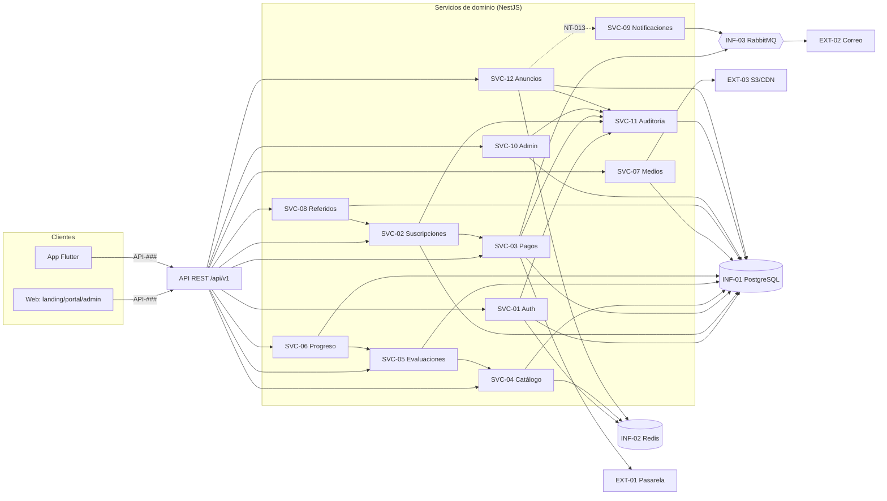

# 16 — Catálogo de Servicios (`SVC` · `EXT` · `INF`)

Servicios de dominio (módulos del backend NestJS), integraciones externas e infraestructura, y **cómo se relacionan** con módulos, endpoints, tablas e infraestructura. Complementa el [diagrama de componentes](../09-diagramas/02-componentes.md).

> Cada servicio interno mapea 1:1 con un módulo `MOD-##` ([ADR-001](../08-especificaciones-tecnicas/00-indice-especificaciones.md)) y expone los endpoints `API-###` del [catálogo](catalogo-endpoints.md).

---

## 1. Servicios de dominio (internos)

| ID | Servicio | Módulo | Endpoints | Tablas principales | Depende de |
|----|----------|--------|-----------|--------------------|-----------|
| SVC-01 | Auth y Sesiones | [MOD-02](../04-modulos/modulos-secciones.md) | [API-02x](catalogo-endpoints.md#api-02x--identidad-y-acceso-mod-02) | `usuarios`,`sesiones`,`tokens_*`,`mfa_*`,`audit_accesos` | INF-02 (Redis), SVC-09, SVC-11 |
| SVC-02 | Suscripciones | [MOD-03](../04-modulos/modulos-secciones.md) | [API-032..034](catalogo-endpoints.md#api-03x--suscripción-y-pagos-mod-03) | `suscripciones`,`planes` | SVC-03, SVC-09 |
| SVC-03 | Pagos | [MOD-03](../04-modulos/modulos-secciones.md) | [API-030/031](catalogo-endpoints.md#api-03x--suscripción-y-pagos-mod-03) | `pagos`,`eventos_pago` | EXT-01, INF-03 (RabbitMQ), SVC-11 |
| SVC-04 | Catálogo de contenido | [MOD-04](../04-modulos/modulos-secciones.md) | [API-04x](catalogo-endpoints.md#api-04x--catálogo-de-contenido-mod-04) | `materias`,`modulos`,`temas`,`subtemas`,`estimulos`,`preguntas`,`opciones`,`importaciones` | INF-02 (caché) |
| SVC-05 | Evaluaciones | [MOD-05](../04-modulos/modulos-secciones.md) | [API-05x](catalogo-endpoints.md#api-05x--evaluaciones-mod-05) | `evaluacion_config`,`intentos`,`respuestas_intento` | SVC-04 |
| SVC-06 | Progreso y métricas | [MOD-06](../04-modulos/modulos-secciones.md) | [API-06x](catalogo-endpoints.md#api-06x--progreso-y-métricas-mod-06) | `v_desempeno_tema`,`intentos` | SVC-05 |
| SVC-07 | Material y medios | [MOD-07](../04-modulos/modulos-secciones.md) | [API-070](catalogo-endpoints.md#api-07x--material-y-medios-mod-07) | `materiales`,`accesos_contenido` | EXT-03 (S3/CDN), SVC-01 |
| SVC-08 | Referidos | [MOD-08](../04-modulos/modulos-secciones.md) | [API-08x](catalogo-endpoints.md#api-08x--referidos-mod-08) | `codigos_referido`,`referidos`,`beneficios_otorgados` | SVC-02 |
| SVC-09 | Notificaciones | [MOD-09](../04-modulos/modulos-secciones.md) | (asíncrono) | `notificaciones` | INF-03 (RabbitMQ), EXT-02 (correo) |
| SVC-10 | Administración y reportes | [MOD-10](../04-modulos/modulos-secciones.md) | [API-10x](catalogo-endpoints.md#api-10x--panel-administrativo-mod-10) | `roles`, todas (lectura) | SVC-11 |
| SVC-11 | Auditoría | [MOD-11](../04-modulos/modulos-secciones.md) | (transversal) | `auditoria`,`audit_accesos` | INF-01 |
| SVC-12 | Anuncios | [MOD-12](../04-modulos/modulos-secciones.md) | [API-12x](catalogo-endpoints.md#api-12x--anuncios-mod-12) | `anuncios`,`anuncios_acuse` | INF-02 (caché), SVC-09 (NT-013 opcional) |

---

## 2. Integraciones externas

| ID | Integración | Usada por | Propósito | Notas |
|----|-------------|-----------|-----------|-------|
| EXT-01 | Pasarela de pago | SVC-03 | Cobro tarjeta/SPEI + webhooks | Idempotente por `payload_hash` (ADR-006, [RF-023](../05-requerimientos/RF-023-webhook-pago.md)) |
| EXT-02 | Servicio de correo | SVC-09 | Envío de NT-001..013 | Async vía RabbitMQ; plantillas [CT-###](../12-notificaciones/plantillas-correo/) |
| EXT-03 | S3 / CloudFront | SVC-07 | Storage y entrega de medios | URLs firmadas/temporales ([RF-110](../05-requerimientos/RF-110-proteccion-contenido.md)) |

---

## 3. Infraestructura

| ID | Componente | Usado por | Rol |
|----|-----------|-----------|-----|
| INF-01 | PostgreSQL | todos | Persistencia ([15 BD](../15-base-datos/00-indice-base-datos.md)) |
| INF-02 | Redis | SVC-01/04/12 | Sesión única, rate limiting, caché ([ADR-002](../08-especificaciones-tecnicas/00-indice-especificaciones.md)) |
| INF-03 | RabbitMQ | SVC-03/09 | Colas: correos, webhooks, reporte semanal |
| INF-04 | S3 + CDN | SVC-07 | (ver EXT-03) |
| INF-05 | Prometheus + Grafana | plataforma | Métricas (RNF-020) |
| INF-06 | ELK | plataforma | Logs centralizados (RNF-021) |

---

## 4. Mapa de relaciones servicios ↔ integraciones ↔ infraestructura

---

## 5. Trazabilidad
| Tipo | Referencia |
|------|------------|
| Endpoints | [catalogo-endpoints.md](catalogo-endpoints.md) |
| Componentes (diagrama) | [09-diagramas/02-componentes.md](../09-diagramas/02-componentes.md) |
| Stack y ADR | [08 especificaciones](../08-especificaciones-tecnicas/00-indice-especificaciones.md) |
| Módulos | [04-modulos](../04-modulos/modulos-secciones.md) |
| Tablas | [15-base-datos](../15-base-datos/00-indice-base-datos.md) |
| Inventario global | [17-inventario](../17-inventario/inventario-general.md) |

<!-- FOOTER:ALEXANDRYA -->

---

📄 **Alexandrya** · `docs/16-apis-servicios/servicios.md` · Versión documental **v0.3.0** · Actualizado **2026-06-19** · 🏠 [Índice](../README.md) · 💬 [Mensajes del sistema](../14-mensajes-sistema/mensajes-sistema.md)
