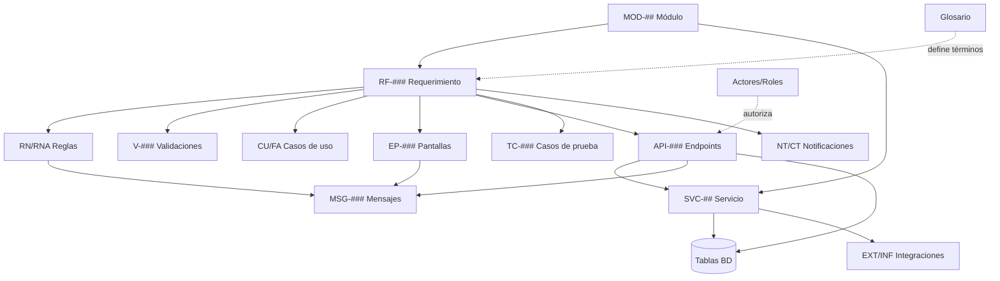

# 17 — Inventario General (mapa maestro)

Inventario **único** de todos los artefactos de Alexandrya y de **cómo se relacionan entre sí**. Es el punto de entrada para navegar la documentación de forma cruzada: de un módulo a sus requerimientos, endpoints, reglas, tablas, mensajes, pantallas, notificaciones y pruebas.

> Cifras al **2026-06-19 · v0.3.0**. Generado a partir del conteo real de los documentos.

---

## 1. Inventario por tipo de artefacto

| Prefijo | Artefacto | Cantidad | Rango / ejemplos | Definido en |
|---------|-----------|---------:|------------------|-------------|
| `MOD-##` | Módulos | 12 | MOD-01 … MOD-12 | [04-modulos](../04-modulos/modulos-secciones.md) |
| `RF-###` | Requerimientos funcionales (doc detallado) | 22 | RF-001 … RF-120 | [05-requerimientos](../05-requerimientos/00-indice-requerimientos.md) |
| `RNF-###` | Requerimientos no funcionales | 30+ | RNF-001 … RNF-040 | [catálogo](../05-requerimientos/00-catalogo-requerimientos.md) |
| `RN-###` | Reglas de negocio principales | 47 | RN-001 … RN-120-03 | [reglas-principales](../06-reglas-negocio/reglas-principales.md) |
| `RNA-###` | Reglas alternas / excepción | 32 | RNA-001 … RNA-061 | [reglas-alternas](../06-reglas-negocio/reglas-alternas.md) |
| `CU-###` / `FA-###` | Casos de uso / flujos alternos | — | CU-001 … · FA-001 … | [07-casos-uso](../07-casos-uso/00-indice-casos-uso.md) |
| `ADR-###` | Decisiones técnicas | 7 | ADR-001 … ADR-007 | [08-especificaciones](../08-especificaciones-tecnicas/00-indice-especificaciones.md) |
| `API-###` | Endpoints REST | 57 | API-010 … API-122 | [16 catálogo-endpoints](../16-apis-servicios/catalogo-endpoints.md) |
| `SVC-##` | Servicios de dominio | 12 | SVC-01 … SVC-12 | [16 servicios](../16-apis-servicios/servicios.md) |
| `EXT-##` / `INF-##` | Integraciones externas / infraestructura | 3 / 6 | EXT-01..03 · INF-01..06 | [16 servicios](../16-apis-servicios/servicios.md) |
| (tablas) | Tablas de base de datos (+1 vista) | 35 (+1) | `usuarios` … `anuncios_acuse` | [15-base-datos](../15-base-datos/00-indice-base-datos.md) |
| `EP-###` | Estados de pantalla | — | EP-001 … EP-100 | [11-ux-estados](../11-ux-estados-pantalla/estados-pantalla-iniciales.md) |
| `MSG-###` | Mensajes del sistema | 55 | MSG-010 … MSG-123 | [14-mensajes](../14-mensajes-sistema/mensajes-sistema.md) |
| `NT-###` / `CT-###` | Notificaciones / plantillas de correo | 13 / 13 | NT-001..013 · CT-001..013 | [12-notificaciones](../12-notificaciones/notificaciones.md) |
| `V-###` / `TC-###` | Validaciones / casos de prueba | por RF | V-001A-01 … · TC-001B-01 … | sección 7 y 13 de cada [RF](../05-requerimientos/00-indice-requerimientos.md) |

---

## 2. Mapa de secciones de la documentación

| # | Sección | Rol en el grafo |
|---|---------|-----------------|
| 01 | [Visión](../01-vision/vision-producto.md) | Por qué / alcance web-móvil |
| 02 | [Glosario](../02-glosario/glosario.md) | Vocabulario único |
| 03 | [Actores](../03-actores/actores.md) | Quién (roles) |
| 04 | [Módulos](../04-modulos/modulos-secciones.md) | **Columna vertebral** (MOD-##) |
| 05 | [Requerimientos](../05-requerimientos/00-indice-requerimientos.md) | Qué (RF/RNF) |
| 06 | [Reglas de negocio](../06-reglas-negocio/reglas-principales.md) | Comportamiento (RN/RNA) |
| 07 | [Casos de uso](../07-casos-uso/00-indice-casos-uso.md) | Flujos (CU/FA) |
| 08 | [Especificaciones técnicas](../08-especificaciones-tecnicas/00-indice-especificaciones.md) | Stack + ADR + API |
| 09 | [Diagramas](../09-diagramas/) | Arquitectura / ERD / componentes |
| 10 | [Casos de prueba](../10-casos-prueba/00-catalogo-casos-prueba.md) | Verificación (TC) |
| 11 | [Estados de pantalla](../11-ux-estados-pantalla/estados-pantalla-iniciales.md) | UX (EP) |
| 12 | [Notificaciones](../12-notificaciones/notificaciones.md) | Correos (NT/CT) |
| 13 | [Roadmap](../13-roadmap/roadmap.md) | Cuándo |
| 14 | [Mensajes del sistema](../14-mensajes-sistema/mensajes-sistema.md) | Microcopy (MSG) |
| 15 | [Base de datos](../15-base-datos/00-indice-base-datos.md) | Persistencia (DDL) |
| 16 | [APIs y servicios](../16-apis-servicios/00-indice-apis-servicios.md) | Interfaz + servicios (API/SVC) |
| 17 | **Inventario (este documento)** | Mapa maestro de relaciones |
| 18 | [Pasarelas de Pago](../18-pagos/propuesta-arquitectura-pagos.md) | Estudio y arquitectura multipasarela |

---

## 3. Matriz de trazabilidad por módulo

Cada fila conecta un módulo con todos sus artefactos. Es el **índice cruzado** principal.

| Módulo | RF | API | Tablas BD | EP | MSG | NT/CT | Reglas |
|--------|----|----|-----------|----|----|-------|--------|
| [MOD-01 Landing](../04-modulos/modulos-secciones.md) | RF-001..005 | [API-01x](../16-apis-servicios/catalogo-endpoints.md#api-01x--landing-y-legal-mod-01) | planes, documentos_legales, consentimientos | EP-001..003 | [MSG-01x](../14-mensajes-sistema/mensajes-sistema.md#msg-01x--landing-y-contacto-mod-01) | NT-011 | RN-070 |
| [MOD-02 Identidad](../04-modulos/modulos-secciones.md) | RF-001/001A/001B/016/080 | [API-02x](../16-apis-servicios/catalogo-endpoints.md#api-02x--identidad-y-acceso-mod-02) | usuarios, sesiones, tokens_*, mfa_*, audit_accesos | EP-010..015 | [MSG-02x](../14-mensajes-sistema/mensajes-sistema.md#msg-02x--identidad-y-acceso-mod-02) | NT-001..004 | RN-030..036, RNA-001..007 |
| [MOD-03 Suscripción/pagos](../04-modulos/modulos-secciones.md) | RF-002/020/023/024 | [API-03x](../16-apis-servicios/catalogo-endpoints.md#api-03x--suscripción-y-pagos-mod-03) | planes, suscripciones, pagos, eventos_pago | EP-020..022 | [MSG-03x](../14-mensajes-sistema/mensajes-sistema.md#msg-03x--suscripción-y-pagos-mod-03) | NT-005..008,012 | RN-010..023 |
| [MOD-04 Catálogo](../04-modulos/modulos-secciones.md) | RF-030/033/035 | [API-04x](../16-apis-servicios/catalogo-endpoints.md#api-04x--catálogo-de-contenido-mod-04) | materias→opciones, estimulos, importaciones | EP-030/041 | [MSG-04x](../14-mensajes-sistema/mensajes-sistema.md#msg-04x--catálogo-y-carga-masiva-mod-04-admin) | — | RN-001..008 |
| [MOD-05 Evaluaciones](../04-modulos/modulos-secciones.md) | RF-040/042 | [API-05x](../16-apis-servicios/catalogo-endpoints.md#api-05x--evaluaciones-mod-05) | evaluacion_config, intentos, respuestas_intento | EP-040..043 | [MSG-05x](../14-mensajes-sistema/mensajes-sistema.md#msg-05x--evaluaciones-mod-05) | — | RN-050..054 |
| [MOD-06 Progreso](../04-modulos/modulos-secciones.md) | RF-050 | [API-06x](../16-apis-servicios/catalogo-endpoints.md#api-06x--progreso-y-métricas-mod-06) | v_desempeno_tema, intentos | EP-050 | [MSG-060](../14-mensajes-sistema/mensajes-sistema.md#msg-06x--progreso-y-métricas-mod-06) | NT-009 | RN-053 |
| [MOD-07 Material](../04-modulos/modulos-secciones.md) | RF-060/110 | [API-070](../16-apis-servicios/catalogo-endpoints.md#api-07x--material-y-medios-mod-07) | materiales, accesos_contenido | EP-060 | [MSG-07x](../14-mensajes-sistema/mensajes-sistema.md#msg-07x--material-y-protección-de-contenido-mod-07) | — | RN-060..063, RN-110-* |
| [MOD-08 Referidos](../04-modulos/modulos-secciones.md) | RF-070 | [API-08x](../16-apis-servicios/catalogo-endpoints.md#api-08x--referidos-mod-08) | codigos_referido, referidos, beneficios_otorgados | EP-070 | [MSG-08x](../14-mensajes-sistema/mensajes-sistema.md#msg-08x--referidos-mod-08) | NT-010 | RN-040..045 |
| [MOD-09 Notificaciones](../04-modulos/modulos-secciones.md) | RF-090/091 | (async, SVC-09) | notificaciones | — | — | NT-001..013 / CT-001..013 | — |
| [MOD-10 Admin](../04-modulos/modulos-secciones.md) | RF-100..102 | [API-10x](../16-apis-servicios/catalogo-endpoints.md#api-10x--panel-administrativo-mod-10) | roles, auditoria, (todas lectura) | EP-090 | [MSG-100/101](../14-mensajes-sistema/mensajes-sistema.md#msg-10x--panel-administrativo-mod-10) | — | RNF-004 |
| [MOD-11 Seguridad](../04-modulos/modulos-secciones.md) | RF-014..017 | (transversal) | audit_accesos, auditoria | — | [MSG-11x](../14-mensajes-sistema/mensajes-sistema.md#msg-11x--globales-y-seguridad-mod-11) | — | RNF-002..004, RN-071/072 |
| [MOD-12 Anuncios](../04-modulos/modulos-secciones.md) | RF-120 | [API-12x](../16-apis-servicios/catalogo-endpoints.md#api-12x--anuncios-mod-12) | anuncios, anuncios_acuse | EP-100 | [MSG-12x](../14-mensajes-sistema/mensajes-sistema.md#msg-12x--anuncios-mod-12) | NT-013 / CT-013 | RN-120-01..03, RNA-060/061 |

---

## 4. Grafo de relaciones entre artefactos

---

## 5. Salud de la trazabilidad y pendientes

| Estado | Punto | Dónde |
|:------:|-------|-------|
| 🟡 | **ADR-007** (monorepo A vs polyrepo B) en *Propuesta* — a validar | [08.1](../08-especificaciones-tecnicas/01-estrategia-repositorios.md) |
| 🟡 | `evaluacion_config.alcance_id` (referencia polimórfica) — confirmar diseño | [15 §4](../15-base-datos/00-indice-base-datos.md) · [RF-040](../05-requerimientos/RF-040-motor-evaluaciones.md) |
| 🟢 | DDL de `preguntas`/`opciones`/`evaluacion_config` ya documentado en su RF | [15 §4](../15-base-datos/00-indice-base-datos.md) |
| 🟡 | `API-015 POST /contacto` marcado *propuesto* (RF-004/005 sin §12 detallada) | [16 endpoints](../16-apis-servicios/catalogo-endpoints.md#api-01x--landing-y-legal-mod-01) |
| 🟡 | CT-003/004/007/008/010/011/012/013 pendientes de redacción | [plantillas-correo](../12-notificaciones/plantillas-correo/README.md) |

> Todos los documentos `.md` cierran con el pie de página estándar (marcador `FOOTER:ALEXANDRYA`, versión de trabajo y enlaces de navegación). Ver [README §Pie de página](../README.md).

---

## 6. Trazabilidad
| Tipo | Referencia |
|------|------------|
| Índice maestro | [README](../README.md) |
| Módulos | [04-modulos](../04-modulos/modulos-secciones.md) |
| APIs y servicios | [16-apis-servicios](../16-apis-servicios/00-indice-apis-servicios.md) |
| Base de datos | [15-base-datos](../15-base-datos/00-indice-base-datos.md) |
| Mensajes | [14-mensajes-sistema](../14-mensajes-sistema/mensajes-sistema.md) |

<!-- FOOTER:ALEXANDRYA -->

---

📄 **Alexandrya** · `docs/17-inventario/inventario-general.md` · Versión documental **v0.3.0** · Actualizado **2026-06-19** · 🏠 [Índice](../README.md) · 💬 [Mensajes del sistema](../14-mensajes-sistema/mensajes-sistema.md)
