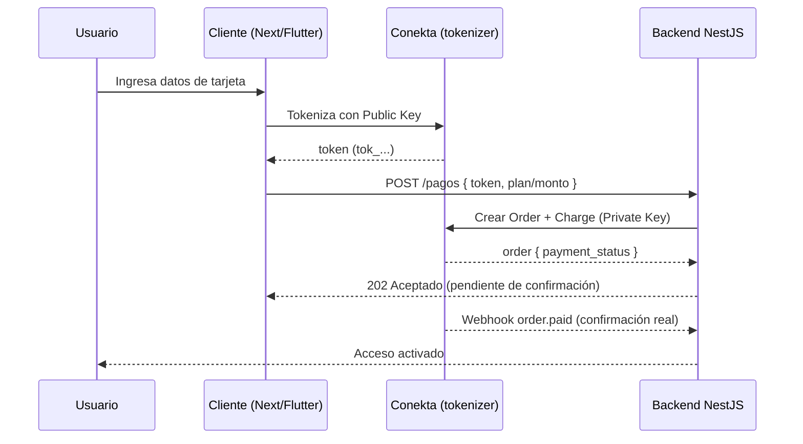

# Guía de Integración de Conekta

> Guía técnica para integrar **Conekta** como pasarela de pago en Alexandrya.
> Referencia oficial: <https://developers.conekta.com/docs/welcome> · API Reference: <https://developers.conekta.com/reference>
>
> Contexto del proyecto: backend **NestJS** (TypeScript), clientes **Next.js/React** y **Flutter**. Los ejemplos de servidor usan NestJS; el cobro nunca se hace desde el cliente.

---

## 1. Conceptos clave

Conekta modela los pagos con un conjunto pequeño de recursos que conviene entender antes de escribir código:

| Recurso | Qué representa |
|---------|----------------|
| **Customer** | El cliente/comprador. Guarda métodos de pago reutilizables y es la base de suscripciones. |
| **Payment Method** | Un método de pago asociado a un customer (tarjeta tokenizada, etc.). |
| **Token** | Representación de un solo uso de los datos de tarjeta, generada **en el cliente** con la llave pública. Nunca viajan datos de tarjeta por tu servidor (PCI-DSS). |
| **Order** | La intención de cobro: montos, línea de artículos, cliente e información de envío. |
| **Charge** | El cobro concreto dentro de una order (tarjeta, OXXO efectivo o SPEI transferencia). |
| **Plan / Subscription** | Cobros recurrentes automáticos (para la suscripción semestral de Alexandrya). |
| **Webhook** | Notificación asíncrona de eventos (`order.paid`, `charge.paid`, etc.). Fuente de verdad del estado del pago. |

**Flujo mental:** creas (o reutilizas) un `Customer` → generas un `Token` en el cliente → creas una `Order` con un `Charge` que usa ese token o un método guardado → confirmas el resultado por **webhook**.

---

## 2. Credenciales y entornos

Conekta ofrece dos pares de llaves (una privada y una pública) por entorno, disponibles en el panel: **Configuración → API Keys**.

| Llave | Dónde se usa | Nunca exponer |
|-------|--------------|---------------|
| **Private Key** (`key_...`) | Solo en el **backend** (NestJS). Autentica todas las llamadas a la API. | ✅ Secreta |
| **Public Key** (`key_...`) | En el **cliente** (Next.js / Flutter) para tokenizar tarjetas. | Es pública por diseño |

- **Entorno de pruebas (Test):** todo lo que hagas aquí no mueve dinero real. Úsalo para desarrollo y CI.
- **Entorno de producción (Live):** requiere cuenta activada y **RFC mexicano válido** (Persona Física con Actividad Empresarial o Persona Moral).

> **Regla:** las llaves privadas van en variables de entorno / gestor de secretos, **nunca** en el repositorio ni en el bundle del frontend.

```dotenv
# .env (backend NestJS) — NO commitear
CONEKTA_PRIVATE_KEY=key_xxxxxxxxxxxxxxxxxxxx
CONEKTA_API_VERSION=2.1.0

# Frontend (Next.js) — sí puede ir en cliente
NEXT_PUBLIC_CONEKTA_PUBLIC_KEY=key_yyyyyyyyyyyyyyyyyyyy
```

---

## 3. Detalles de la API

| Aspecto | Valor |
|---------|-------|
| **Base URL** | `https://api.conekta.io` |
| **Autenticación** | HTTP Basic. Usuario = Private Key, contraseña = vacía → `Authorization: Basic base64("key_xxx:")` |
| **Versión de API** | Header `Accept: application/vnd.conekta-v2.1.0+json` |
| **Content-Type** | `application/json` |
| **SDK Node.js** | Paquete `conekta` (npm) — cliente oficial generado desde OpenAPI |

Ejemplo de petición cruda (para entender qué hace el SDK por debajo):

```bash
curl https://api.conekta.io/orders \
  -u "key_xxxxxxxx:" \
  -H "Accept: application/vnd.conekta-v2.1.0+json" \
  -H "Content-Type: application/json" \
  -d '{ "currency": "MXN", "customer_info": { "name": "Ana López", "email": "ana@correo.com", "phone": "+525555555555" }, "line_items": [{ "name": "Suscripción semestral", "unit_price": 250000, "quantity": 1 }] }'
```

> **⚠️ Montos en centavos:** Conekta maneja los importes como **enteros en centavos**. `$2,500.00 MXN` se envía como `250000`. Siempre trabaja en centavos internamente para evitar errores de redondeo.

---

## 4. Instalación del SDK (backend NestJS)

```bash
npm install conekta
```

### Módulo de configuración

```typescript
// src/payments/conekta.provider.ts
import { Configuration, CustomersApi, OrdersApi, ChargesApi } from 'conekta';

const config = new Configuration({
  accessToken: process.env.CONEKTA_PRIVATE_KEY,
});

// Instancias reutilizables de cada recurso
export const conektaCustomers = new CustomersApi(config);
export const conektaOrders = new OrdersApi(config);
export const conektaCharges = new ChargesApi(config);

// La cabecera de versión se pasa por request; usa una constante:
export const CONEKTA_ACCEPT = 'application/vnd.conekta-v2.1.0+json';
```

En NestJS conviene envolver esto en un **provider** inyectable para poder mockearlo en tests:

```typescript
// src/payments/conekta.module.ts
import { Module } from '@nestjs/common';
import { PaymentsService } from './payments.service';

@Module({
  providers: [PaymentsService],
  exports: [PaymentsService],
})
export class PaymentsModule {}
```

---

## 5. Flujo de pago con tarjeta (recomendado)

El flujo seguro nunca envía datos de tarjeta a tu servidor. La tokenización ocurre en el cliente.



### 5.1 Cliente — tokenización

**Next.js:** se recomienda el **Checkout Component** de Conekta (low-code, soporta tarjeta, OXXO, SPEI, Apple/Google Pay sin mantenimiento). Alternativamente el tokenizer JS clásico:

```html
<script src="https://cdn.conekta.io/js/latest/conekta.js"></script>
```

```typescript
// Ejemplo del tokenizer clásico (frontend)
Conekta.setPublicKey(process.env.NEXT_PUBLIC_CONEKTA_PUBLIC_KEY!);

Conekta.Token.create(
  {
    card: {
      number: '4242424242424242',
      name: 'Ana López',
      exp_year: '28',
      exp_month: '12',
      cvc: '123',
    },
  },
  (token) => enviarAlBackend(token.id),   // tok_...
  (err) => mostrarError(err),
);
```

**Flutter:** usar el SDK móvil oficial de Conekta para tokenizar en la app y enviar solo el `token.id` al backend.

### 5.2 Backend — crear la order con el charge

```typescript
// src/payments/payments.service.ts
import { Injectable, BadRequestException } from '@nestjs/common';
import { conektaOrders, CONEKTA_ACCEPT } from './conekta.provider';

@Injectable()
export class PaymentsService {
  async cobrarConTarjeta(input: {
    tokenId: string;
    email: string;
    nombre: string;
    telefono: string;
  }) {
    try {
      const { data: order } = await conektaOrders.createOrder(
        {
          currency: 'MXN',
          customer_info: {
            name: input.nombre,
            email: input.email,
            phone: input.telefono,
          },
          line_items: [
            {
              name: 'Suscripción semestral Alexandrya',
              unit_price: 250000, // $2,500.00 en centavos
              quantity: 1,
            },
          ],
          charges: [
            {
              payment_method: {
                type: 'card',
                token_id: input.tokenId,
              },
            },
          ],
        },
        CONEKTA_ACCEPT,
      );

      return {
        orderId: order.id,
        status: order.payment_status, // 'paid' | 'pending_payment' | 'declined'
      };
    } catch (err: any) {
      // Conekta devuelve detalles en err.response?.data?.details
      throw new BadRequestException(
        err?.response?.data?.details ?? 'Error al procesar el pago',
      );
    }
  }
}
```

> **No confíes solo en la respuesta síncrona.** Aunque `payment_status` sea `paid`, la confirmación definitiva (y la activación del servicio) debe dispararse desde el **webhook** para ser resistente a fallos de red.

---

## 6. Pagos en efectivo (OXXO) y transferencia (SPEI)

La gran ventaja local de Conekta. Se crea la order **sin token**, indicando el método; Conekta devuelve una referencia que el usuario paga después.

```typescript
// OXXO — referencia de pago en efectivo
const { data: order } = await conektaOrders.createOrder(
  {
    currency: 'MXN',
    customer_info: { name, email, phone },
    line_items: [{ name: 'Suscripción semestral', unit_price: 250000, quantity: 1 }],
    charges: [
      {
        payment_method: {
          type: 'cash',
          expires_at: Math.floor(Date.now() / 1000) + 3 * 24 * 60 * 60, // 3 días
        },
      },
    ],
  },
  CONEKTA_ACCEPT,
);

// La referencia OXXO está en:
const referencia = order.charges.data[0].payment_method; // reference, barcode_url...
```

Para **SPEI** usa `type: 'spei'`; Conekta devuelve una CLABE interbancaria de un solo uso. En ambos casos el estado inicial es `pending_payment` y solo pasa a `paid` cuando el usuario paga → lo sabrás por **webhook**.

---

## 7. Cobros recurrentes (suscripción semestral)

Para el modelo de suscripción de Alexandrya hay dos caminos:

1. **Plans + Subscriptions (nativo):** creas un `Plan` (periodicidad, monto) y suscribes al `Customer`. Conekta cobra automáticamente cada periodo y emite eventos `subscription.paid`. Requiere que el customer tenga un método de pago guardado (tarjeta).
2. **Cobro manual programado:** guardas el `payment_method` del customer y disparas tú la order cada semestre con un job. Da más control (útil si combinas con OXXO/SPEI, que no aplican a subscriptions automáticas).

```typescript
// Crear un plan semestral (una sola vez, al configurar el producto)
// interval: 'month', frequency: 6  → cada 6 meses
const plan = {
  name: 'Suscripción Semestral Alexandrya',
  amount: 250000,        // $2,500.00 en centavos
  currency: 'MXN',
  interval: 'month',
  frequency: 6,
  expiry_count: null,    // sin fecha de término
};
```

> **Regla de negocio:** define en el código el manejo de reintentos ante tarjeta rechazada y el periodo de gracia antes de suspender el acceso. Conekta reintenta, pero la política de acceso la decide Alexandrya.

---

## 8. Webhooks (imprescindible)

Los webhooks son la **fuente de verdad** del estado de pago. Sin ellos no puedes confirmar de forma fiable pagos en efectivo/SPEI ni renovaciones.

### 8.1 Configuración

En el panel: **Configuración → Webhooks** → registra la URL pública de tu endpoint (p. ej. `https://api.alexandrya.mx/webhooks/conekta`). Conekta permite un webhook de test y uno de producción.

### 8.2 Eventos relevantes

| Evento | Cuándo se dispara | Acción sugerida |
|--------|-------------------|-----------------|
| `order.paid` | La order fue pagada por completo | Activar acceso / renovar suscripción |
| `order.pending_payment` | Order creada esperando pago (OXXO/SPEI) | Registrar como pendiente |
| `charge.paid` | Un cobro individual se liquidó | Conciliar |
| `order.expired` | Referencia OXXO/SPEI venció sin pago | Cancelar intento |
| `charge.declined` | Cobro rechazado | Notificar y reintentar |
| `subscription.paid` | Renovación automática exitosa | Extender vigencia |
| `subscription.payment_failed` | Falló la renovación | Periodo de gracia / avisar al usuario |

### 8.3 Endpoint en NestJS

```typescript
// src/payments/webhooks.controller.ts
import { Controller, Post, Body, Req, HttpCode } from '@nestjs/common';
import { conektaOrders, CONEKTA_ACCEPT } from './conekta.provider';

@Controller('webhooks/conekta')
export class ConektaWebhooksController {
  @Post()
  @HttpCode(200) // responde rápido; Conekta reintenta ante no-2xx
  async handle(@Body() event: any, @Req() req: any) {
    // 1) Verificar autenticidad (ver 8.4)
    // 2) Procesar de forma idempotente
    switch (event.type) {
      case 'order.paid': {
        const orderId = event.data.object.id;
        // Re-consulta a la API como confirmación definitiva (no confíes solo en el body)
        const { data: order } = await conektaOrders.getOrderById(orderId, CONEKTA_ACCEPT);
        if (order.payment_status === 'paid') {
          // activar/renovar acceso — IDEMPOTENTE (revisa si ya se procesó)
        }
        break;
      }
      case 'subscription.paid':
        // extender vigencia
        break;
      // ...otros eventos
    }
    return { received: true };
  }
}
```

### 8.4 Seguridad del webhook

Un endpoint público debe protegerse. Estrategias combinables:

1. **Re-consultar el recurso** (recomendada y más robusta): al recibir el evento, vuelve a pedir la order a la API con tu llave privada y actúa según el estado real. Esto neutraliza payloads falsificados.
2. **Whitelist de IPs:** acepta solo las IPs de origen de Conekta (consultar la lista vigente en su documentación).
3. **Verificación de firma:** valida la cabecera de firma/`Digest` que envía Conekta si tu integración la usa.

**Idempotencia obligatoria:** Conekta puede reenviar el mismo evento. Guarda los IDs de evento/order ya procesados y no dupliques activaciones ni renovaciones.

---

## 9. Pruebas (sandbox)

Usa las llaves de **Test** y las tarjetas de prueba oficiales:

| Escenario | Tarjeta |
|-----------|---------|
| Pago aprobado | `4242 4242 4242 4242` |
| Pago rechazado | `4000 0000 0000 0002` |
| Fondos insuficientes | `4000 0000 0000 9995` |

- Cualquier fecha futura de expiración y cualquier CVC de 3 dígitos son válidos en test.
- Para OXXO/SPEI en test, Conekta genera referencias simuladas; puedes disparar la "confirmación" desde el panel o esperar el webhook simulado.
- Prueba explícitamente: pago exitoso, rechazo, expiración de OXXO, reenvío de webhook (idempotencia) y renovación de suscripción.

---

## 10. Checklist de puesta en producción

- [ ] Llaves privadas fuera del repo, en gestor de secretos.
- [ ] Public key correcta en cada cliente (Next.js y Flutter).
- [ ] Todos los montos manejados en **centavos**.
- [ ] Endpoint de webhook público, con HTTPS, idempotente y con verificación de autenticidad.
- [ ] Confirmación de acceso disparada por webhook, no por la respuesta síncrona.
- [ ] Manejo de errores de la API (`err.response.data.details`) mapeado a los [mensajes de sistema](../14-mensajes-sistema/) del proyecto.
- [ ] Política de reintentos y periodo de gracia para suscripciones rechazadas.
- [ ] RFC mexicano válido y cuenta de producción activada.
- [ ] Registro/conciliación de cada order y charge para efectos fiscales (ver [estudio de pasarelas](estudio_pasarelas_pago_mexico.md)).

---

## 11. Referencias

- Bienvenida / conceptos: <https://developers.conekta.com/docs/welcome>
- API Reference: <https://developers.conekta.com/reference>
- Índice de páginas (LLM-friendly): <https://developers.conekta.com/llms.txt>
- Análisis de costos y fiscal del proyecto: [estudio_pasarelas_pago_mexico.md](estudio_pasarelas_pago_mexico.md)
