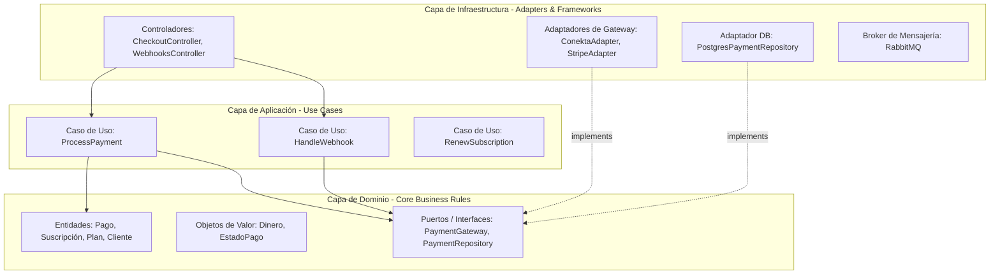
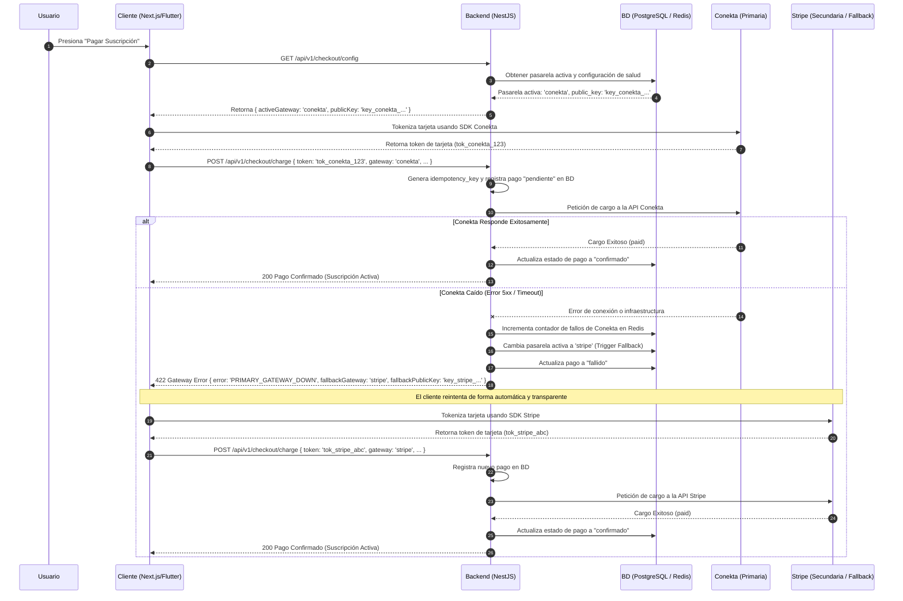
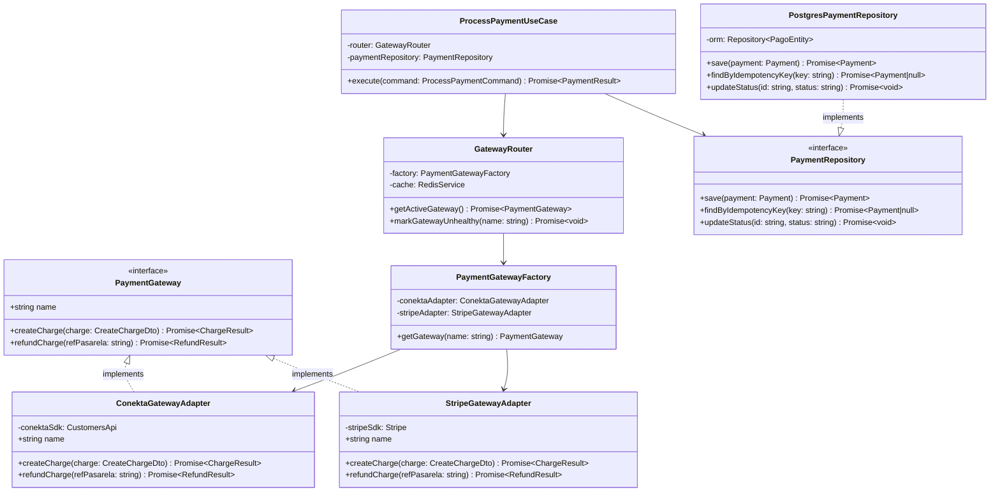

# Propuesta de Arquitectura: Módulo de Pagos Multipasarela Resiliente

> **Módulo:** MOD-03 (Suscripción y Pagos)  
> **Objetivo:** Definir el diseño de software para un sistema de pagos robusto, desacoplado, escalable y tolerante a fallos, utilizando **Clean Architecture**, **SOLID** y **Patrones de Diseño**.  
> **Estado:** Propuesta de Diseño · **Versión documental:** v0.3.0 · **Actualizado:** 2026-07-05

---

## 1. Introducción y Justificación

En un sistema transaccional como **Alexandrya**, los pagos son una funcionalidad crítica del negocio. Si la pasarela de pagos primaria (e.g. Conekta) sufre una caída o interrupción de servicio, la plataforma no puede procesar nuevas suscripciones ni renovaciones, resultando en pérdidas de ingresos y fricción en la experiencia de usuario.

Esta propuesta detalla un diseño de arquitectura backend que implementa un **Módulo de Pagos Multipasarela**. Utilizando principios de **Clean Architecture** y patrones de diseño orientados a objetos, logramos:
1. **Abstraer los proveedores de pago** (Conekta, Stripe, etc.) para que la lógica de negocio no dependa de sus SDKs o particularidades.
2. **Implementar una estrategia de contingencia (fallback automático)** para enrutar transacciones a una pasarela secundaria si la principal falla.
3. **Garantizar la idempotencia y seguridad** (ADR-006) en cargos y procesamiento de webhooks para evitar cobros dobles o activaciones fraudulentas.

---

## 2. Estructura de Capas (Clean Architecture)

El backend en NestJS se estructurará siguiendo la separación de responsabilidades de Clean Architecture, protegiendo las reglas de negocio del dominio de las tecnologías e integraciones externas.



### 2.1. Capa de Dominio (Domain)
Contiene las reglas de negocio puras. Es código TypeScript puro, sin dependencias de NestJS, base de datos o librerías de terceros (como el SDK de Conekta).
* **Entidades:** `Pago`, `Suscripcion`, `Plan`, `Usuario`.
* **Value Objects:** `Money` (encapsula monto en centavos y código de moneda ISO, e.g., MXN), `PaymentStatus` (Enum: `PENDIENTE`, `CONFIRMADO`, `FALLIDO`, `REEMBOLSADO`).
* **Ports (Interfaces):**
  * `PaymentGateway`: Interfaz que define las operaciones que cualquier pasarela debe cumplir.
  * `PaymentRepository`: Interfaz para guardar y consultar transacciones.

### 2.2. Capa de Aplicación (Application)
Orquesta el flujo de datos desde y hacia el dominio.
* **Casos de Uso (Use Cases):** `ProcessPaymentUseCase` (valida la intención de pago, genera la transacción en estado pendiente, invoca al gateway seleccionado y retorna la instrucción), `HandleWebhookUseCase` (procesa eventos asíncronos recibidos de las pasarelas de forma idempotente).
* **Servicios de Aplicación:** `GatewayRouter` (determina qué pasarela está activa y debe procesar la solicitud).

### 2.3. Capa de Infraestructura (Infrastructure)
Implementa los detalles técnicos e integraciones externas.
* **Gateway Adapters:** `ConektaGatewayAdapter` y `StripeGatewayAdapter`. Consumen las librerías oficiales de Conekta y Stripe respectivamente y mapean sus modelos a las entidades del dominio.
* **Persistence Adapters:** Implementación del repositorio de base de datos usando un ORM (TypeORM/Prisma) apuntando a PostgreSQL.
* **Controllers:** Endpoints REST (`/api/v1/checkout/config`, `/api/v1/checkout/charge`, `/api/v1/webhooks/conekta`, etc.).

---

## 3. Patrones de Diseño Aplicados

Para dotar al sistema de escalabilidad e incorporar la tolerancia a fallos, se aplican los siguientes patrones de diseño basados en los principios **SOLID**:

### 3.1. Patrón Strategy (Principio Abierto/Cerrado - OCP)
La interfaz `PaymentGateway` actúa como una estrategia común. Si mañana decidimos integrar Mercado Pago o PayPal, solo necesitamos escribir un nuevo adaptador que implemente la interfaz `PaymentGateway` sin modificar los casos de uso existentes.

```typescript
// src/payments/domain/ports/payment-gateway.interface.ts
export interface PaymentGateway {
  name: string;
  createCharge(charge: CreateChargeDto): Promise<ChargeResult>;
  refundCharge(refPasarela: string): Promise<RefundResult>;
}

export interface CreateChargeDto {
  amountInCents: number;
  currency: string;
  tokenId: string; // Token seguro generado en cliente
  customerInfo: {
    name: string;
    email: string;
    phone: string;
  };
  idempotencyKey: string;
}

export interface ChargeResult {
  refPasarela: string;
  status: 'paid' | 'pending_payment' | 'declined';
  rawResponse: string;
}
```

### 3.2. Patrón Factory (Principio de Inversión de Dependencias - DIP)
El `PaymentGatewayFactory` encapsula la lógica de instanciación y selección de la pasarela activa. Evita que los casos de uso conozcan las clases de infraestructura de forma directa.

```typescript
// src/payments/infrastructure/gateways/payment-gateway.factory.ts
import { Injectable, BadRequestException } from '@nestjs/common';
import { PaymentGateway } from '../../domain/ports/payment-gateway.interface';
import { ConektaGatewayAdapter } from './conekta-gateway.adapter';
import { StripeGatewayAdapter } from './stripe-gateway.adapter';

@Injectable()
export class PaymentGatewayFactory {
  constructor(
    private readonly conektaAdapter: ConektaGatewayAdapter,
    private readonly stripeAdapter: StripeGatewayAdapter
  ) {}

  getGateway(name: string): PaymentGateway {
    switch (name.toLowerCase()) {
      case 'conekta':
        return this.conektaAdapter;
      case 'stripe':
        return this.stripeAdapter;
      default:
        throw new BadRequestException(`Pasarela '${name}' no está soportada.`);
    }
  }
}
```

### 3.3. Patrón Circuit Breaker (Tolerancia a Fallos y Fallback)
El servicio `GatewayRouter` envuelve las llamadas a las pasarelas. Utiliza un Circuit Breaker básico para monitorear el estado de salud de cada proveedor. Si el proveedor activo (e.g. Conekta) reporta fallos consecutivos de infraestructura (timeouts o errores 5xx de su API), el router:
1. Cambia el estado del proveedor en caché/Redis a `INACTIVO`.
2. Actualiza la pasarela activa en la configuración general a `Stripe` de forma automatizada o alerta al equipo técnico.
3. Las nuevas intenciones de cobro recibirán la configuración de Stripe de manera dinámica.

---

## 4. Flujo de Alta Disponibilidad y Fallback Dinámico

Debido a que la tokenización de tarjetas (que previene que datos sensibles viajen por nuestro servidor, cumpliendo PCI-DSS) se realiza **directamente en el frontend** con la llave pública de la pasarela correspondiente, el flujo de fallback dinámico requiere coordinación entre cliente y servidor.

### 4.1. Diagrama de Secuencia: Checkout Inicial e Intento de Pago



---

## 5. Persistencia, Idempotencia y Webhooks

El diseño se alinea estrictamente con los esquemas de base de datos definidos en el proyecto (MOD-03) y con el **ADR-006 (Webhooks de pago idempotentes)**.

### 5.1. Flujo de Control de Idempotencia en Cargos
Para prevenir cargos dobles causados por reintentos de red del cliente o doble click en el botón de pago, el endpoint de cobro (`POST /api/v1/checkout/charge`) requiere una cabecera `X-Idempotency-Key` generada en el cliente.
1. El backend busca en la tabla `pagos` un registro con la misma `idempotency_key`.
2. Si existe:
   - Si el pago ya está `confirmado`, retorna inmediatamente la respuesta exitosa.
   - Si el pago está `pendiente`, consulta directamente el estado en la pasarela usando la `ref_pasarela` para verificar si el estado ya cambió, evitando lanzar una petición de cobro repetida.
3. Si no existe, crea el registro en la tabla `pagos` y continúa con la petición de cobro a la pasarela activa.

### 5.2. Recepción de Webhooks Segura e Idempotente (RF-023 / ADR-006)
Los webhooks de pagos se ejecutan de manera asíncrona. Dado que las pasarelas pueden enviar eventos duplicados o desordenados, y que los endpoints de webhooks son públicos, se implementan tres niveles de seguridad:

1. **Idempotencia por Hash de Payload (`payload_hash`):**
   Antes de procesar cualquier evento en el webhook, el backend calcula el hash SHA-256 de todo el cuerpo de la petición y lo busca en la tabla `eventos_pago`.
   * Si el hash ya existe, se responde inmediatamente con `HTTP 200 OK` (evento previamente procesado) y no se realiza ninguna acción.
   * Si no existe, se inserta el registro en la tabla `eventos_pago` con la FK al pago correspondiente.

2. **Verificación de Autenticidad (Re-consulta directa):**
   Para evitar ataques de payloads falsificados al endpoint público de webhooks:
   * Al recibir el evento (e.g., `order.paid` de Conekta), el backend lee únicamente el identificador del recurso (`order.id`).
   * A continuación, realiza una petición **server-to-server** con la llave privada de Conekta para obtener el recurso directo desde la API oficial (`GET /orders/{id}`).
   * Se actúa basándose en la respuesta oficial del API, descartando la información del payload recibido en el webhook para mitigar spoofing.

3. **Manejo Asíncrono de Eventos (RabbitMQ):**
   El controlador del webhook solo valida e introduce el evento en una cola de RabbitMQ (`pagos.eventos.procesar`) y responde inmediatamente `HTTP 200 OK` a la pasarela (evitando bloqueos por procesamiento pesado). El consumidor de RabbitMQ se encarga de:
   * Actualizar el estado del pago en la tabla `pagos` a `confirmado`.
   * Activar o renovar la vigencia en la tabla `suscripciones`.
   * Enviar la notificación de confirmación al usuario (vía correo transaccional).

---

## 6. Diagrama de Clases

La interacción de los componentes backend bajo este esquema y los principios SOLID se estructura de la siguiente manera:



---

## 7. Plan de Verificación Técnica

Para validar la solidez del módulo de pagos y su resiliencia se definen los siguientes niveles de prueba:

### 7.1. Pruebas Unitarias (Mocking de Pasarelas)
* Validar que `PaymentGatewayFactory` resuelva correctamente los adaptadores.
* Probar los casos de uso (`ProcessPaymentUseCase`) mockeando la interfaz `PaymentGateway` y `PaymentRepository`.
* Comprobar que los errores de la API externa sean capturados por el adaptador y mapeados correctamente a excepciones del dominio (e.g. `PaymentDeclinedException`).

### 7.2. Pruebas de Integración (Sandbox de Pasarelas)
* Realizar llamadas reales contra los entornos Sandbox/Test de Conekta y Stripe usando tokens y tarjetas de prueba de aprobación/rechazo.
* Simular eventos webhook locales enviando firmas/ Digests válidos y verificando que el flujo de re-consulta y RabbitMQ procese la activación de la suscripción correctamente.

### 7.3. Pruebas de Fallback (Simulación de Caídas)
* Configurar un test de integración donde se simule que la petición a Conekta retorna un error HTTP 503 (Servicio no disponible) de forma reiterada.
* Verificar que el `GatewayRouter` intercepta los fallos, marca a Conekta como inactivo, actualiza la pasarela activa en caché a Stripe y retorna las instrucciones para que el cliente reintente con la clave pública de Stripe de forma transparente.

---

<!-- FOOTER:ALEXANDRYA -->

---

<sub>📄 **Alexandrya** · `docs/18-pagos/propuesta-arquitectura-pagos.md` · Versión documental **v0.3.0** · Actualizado **2026-07-05** · 🏠 [Índice](../README.md) · 💬 [Mensajes del sistema](../14-mensajes-sistema/mensajes-sistema.md)</sub>
